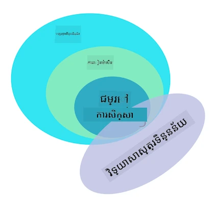

# ការណែនាំអំពីការរៀនម៉ាស៊ីន

## [សំណួរតេស្តមុនថ្នាក់](https://ff-quizzes.netlify.app/en/ml/)

---

> 🎥 ចុចលើរូបភាពខាងលើសម្រាប់វីដេអូខ្លីបង្ហាញពីមេរៀននេះ។

សូមស្វាគមន៍មកកាន់វគ្គសិក្សានេះអំពីការរៀនម៉ាស៊ីនបែបសាមញ្ញសម្រាប់អ្នកចាប់ផ្ដើម! មិនថាអ្នកជាអ្នកថ្មីតែម្តងនឹងប្រធានបទនេះ ឬជាអ្នកអនុវត្ត ML ដែលមានបទពិសោធន៍ជាមួយកន្លែងមួយណាមួយដែលចង់បង្កើតវិជ្ជាជីវៈឡើងវិញ យើងមានសេចក្ដីសប្បាយរីករាយដែលអ្នកបានចូលរួមជាមួយយើង! យើងចង់បង្កើតទីតាំងមួយដែលរាប់មិត្តភាព សម្រាប់ការសិក្សា ML របស់អ្នក ហើយយើងនឹងមានមោទនភាពក្នុងការវាយតម្លៃ ឆ្លើយតប និងរួមបញ្ចូលមតិយោបល់របស់អ្នក [feedback](https://github.com/microsoft/ML-For-Beginners/discussions)។

> 🎥 ចុចលើរូបភាពខាងលើសម្រាប់វីដេអូ៖ John Guttag របស់ MIT ដឹកនាំបង្ហាញអំពីការរៀនម៉ាស៊ីន

---
## ផ្ដើមសិក្សាអំពីការរៀនម៉ាស៊ីន

មុននឹងចាប់ផ្ដើមវគ្គសិក្សានេះ អ្នកត្រូវតែមានកុំព្យូទ័ររបស់អ្នកត្រៀមរួចរាល់សម្រាប់បើកចូលប្រើមូលដ្ឋានសៀវភៅកំណត់ត្រាផ្ទាល់ខ្លួន។

- **កំណត់រចនាសម្ព័ន្ធម៉ាស៊ីនរបស់អ្នកជាមួយវីដេអូទាំងនេះ**។ ប្រើតំណភ្ជាប់ខាងក្រោមសម្រាប់រៀនពីរបៀប [ដំឡើង Python](https://youtu.be/CXZYvNRIAKM) នៅលើប្រព័ន្ធរបស់អ្នក និង [កំណត់ការ text editor](https://youtu.be/EU8eayHWoZg) សម្រាប់ការអភិវឌ្ឍន៍។
- **រៀន Python**។ បើកមានការផ្តល់អនុសាសន៍ឲ្យមានការយល់ដឹងមូលដ្ឋានអំពី [Python](https://docs.microsoft.com/learn/paths/python-language/?WT.mc_id=academic-77952-leestott) ដែលជាភាសាកូដដែលមានប្រយោជន៍សម្រាប់អ្នកវិទ្យាសាស្ត្រទិន្នន័យដែលយើងប្រើក្នុងវគ្គសិក្សានេះ។
- **រៀន Node.js និង JavaScript**។ យើងក៏ប្រើ JavaScript ពេលខ្លះនៅក្នុងវគ្គនេះពេលកសាងកម្មវិធីបណ្តាញ ដូច្នេះអ្នកត្រូវតែមាន [node](https://nodejs.org) និង [npm](https://www.npmjs.com/) តម្លើងក្នុងប្រព័ន្ធរបស់អ្នក បូកជាមួយការចូលប្រើ [Visual Studio Code](https://code.visualstudio.com/) សម្រាប់ការអភិវឌ្ឍ Python និង JavaScript ។
- **បង្កើតគណនី GitHub**។ ពីព្រោះអ្នកបានរកឃើញយើងនៅទីនេះលើ [GitHub](https://github.com) សូមអាចមានគណនីរួចហើយ តែបើមិនមានសូមបង្កើត និង Fork វគ្គសិក្សានេះដើម្បីប្រើប្រាស់ដោយផ្ទាល់ខ្លួន។ (សូមឥតគិតថ្លៃផ្តល់ផ្កាយមួយជាការគាំទ្រ 😊)
- **ស្វែងយល់អំពី Scikit-learn**។ សូមស្គាល់គាត់ [Scikit-learn](https://scikit-learn.org/stable/user_guide.html) ដែលជាសំណុំនៃបណ្ណាល័យ ML ដែលយើងយោងទៅលើក្នុងមេរៀនទាំងនេះ។

---
## តើការរៀនម៉ាស៊ីនគឺជាអ្វី?

ពាក្យ 'machine learning' គឺជាក្ដីពេញនិយម និងប្រើប្រាស់ញឹកញាប់បំផុតសម្រាប់សព្វថ្ងៃ។ មានភាពអាចម៍កើតឡើងថាអ្នកបានឮពាក្យនេះយ៉ាងហោចណាស់មួយដង ប្រសិនបើអ្នកមានស្គាល់ខ្លះៗអំពីបច្ចេកវិទ្យា មិនថាអ្នកធ្វើការនៅក្នុងវិស័យណា។ បច្ចេកទេសនៃការរៀនម៉ាស៊ីន យ៉ាងណាមិញ ក៏នៅតែជារឿងលេងល្បងសម្រាប់មនុស្សភាគច្រើន។ សម្រាប់អ្នកចាប់ផ្ដើមការរៀនម៉ាស៊ីន ប្រធានបទនេះអាចមានអារម្មណ៍ថាស្មួតស្មើ។ ដូច្នេះ វាសំខាន់ណាស់ក្នុងការយល់ពីអ្វីទៅជា machine learning ពិតប្រាកដ ហើយរៀនវាជាគ្រប់ជំហាន តាមរយៈឧទាហរណ៍អនុវត្តន៍។

---
## របងប្រភេទតំណពន្លឺ

> Google Trends បង្ហាញរបងប្រភេទ 'hype curve' នៃពាក្យ 'machine learning' នៅពេលថ្មីៗនេះ

---
## ពិភពគម្រប

យើងរស់នៅក្នុងពិភពមួយដែលពេញលេញដោយសម្ងាត់គួរឱ្យចាប់អារម្មណ៍។ អ្នកវិទ្យាសាស្ត្រល្បីៗដូចជា Stephen Hawking, Albert Einstein និងមនុស្សជាច្រើនទៀត បានសំលាប់ពេលវេលាផ្នែកធ្វើស្រាវជ្រាវដើម្បីស្វែងរកព័ត៌មានមានន័យ ដែលបំភ្លឺសម្ងាត់នៃពិភពជុំវិញយើង។ នេះគឺជាសភាពមនុស្សក្នុងការរៀន៖ កុមារមនុស្សរៀនអ្វីថ្មីៗ និងរកឃើញរចនាសម្ព័ន្ធនៃពិភពរបស់ពួកគេឆ្នាំក្រោមឆ្នាំនៅពេលពួកគេចាស់ដល់វ័យពេញវ័យ។

---
## សម្ថភាពខួរក្បាលកុមារ

ខួរក្បាល និងអារម្មណ៍របស់កុមារយល់ឃើញពីការពិតជុំវិញពួកគេ ហើយរៀនយ៉ាងតិចតួចពីរចនាសម្ព័ន្ធលាក់សំខាន់នៃជីវិត ដែលជួយឲ្យកុមារបង្កើតច្បាប់មានទិដ្ឋភាពយុត្តិធម៌ ដើម្បីសំគាល់លំនាំដែលបានរៀន។ ដំណើរការរៀននៃខួរក្បាលមនុស្សធ្វើឱ្យមនុស្សមានជីវិតកាន់តែស្មុគស្មាញបំផុតលើពិភពលោកនេះ។ ការរៀនទៅជានិរន្តរភាពដោយបង្កើតរកលំនាំលាក់ ហើយបន្ទាប់មកបង្កើតថ្មីលើលំនាំទាំងនោះ អនុញ្ញាតឱ្យយើងធ្វើឱ្យខ្លួនឯងកាន់តែប្រសើរឡើងក្នុងអាយុកាលកំណត់របស់យើង។ សមត្ថភាពរៀន និងសមត្ថភាពអភិវឌ្ឍឆាប់រហ័សនេះ មានទំនាក់ទំនងជាមួយយោគយល់មួយហៅថា [brain plasticity](https://www.simplypsychology.org/brain-plasticity.html)។ ជាមិនធម្មតាទេ យើងអាចគូររូបភាពស្រដៀងគ្នាជាមួយរបស់ការរៀននៃខួរក្បាលមនុស្ស និងយោគយល់នៃការរៀនម៉ាស៊ីន។

---
## ខួរក្បាលមនុស្ស

[ខួរក្បាលមនុស្ស](https://www.livescience.com/29365-human-brain.html) យល់ឃើញអំពីរឿងនៅពិតក្នុងពិភពលោក ធ្វើដំណើរការព័ត៌មានដែលបានយល់ឃើញ ធ្វើសេចក្តីសម្រេចយុត្តិធម៌ និងអនុវត្តសកម្មភាពមួយចំនួនដោយផ្អែកលើអត្តសញ្ញាណនៃស្ថានភាព។ នេះគឺជារឿងដែលយើងហៅថា ការប្រព្រឹត្តសមត្ថភាពយុត្តិាសាស្រ្ត។ នៅពេលដែលយើងកូដការប្រព្រឹត្តបែបនេះទៅឲ្យម៉ាស៊ីនវាយហៅថា បញ្ញាសិប្បនិម្មិត (AI)។

---
## ពាក្យបច្ចេកទេសខ្លះៗ

ទោះពាក្យទាំងនោះអាចបង្កភាពច្របូកច្របល់ តែការរៀនម៉ាស៊ីន (ML) គឺជាផ្នែកសំខាន់មួយរបស់បញ្ញាសិប្បនិម្មិត។ **ML គឺផ្តោតលើការប្រើប្រាស់អាល់ហ្គោរីធម៍ឯកទេស ដើម្បីរកព័ត៌មានមានន័យ និងរកលំនាំលាក់ពីទិន្នន័យដែលបានយល់ឃើញ ដើម្បីពន្លឿនដំណើរការសម្រេចចិត្តយុត្តិធម៌**។

---
## AI, ML, ការរៀនជ្រៅ

> ក្រាហ្វិកបង្ហាញទំនាក់ទំនងរវាង AI, ML, ការរៀនជ្រៅ និងវិទ្យាសាស្រ្តទិន្នន័យ។ ប្លង់បាប់ដោយ [Jen Looper](https://twitter.com/jenlooper) នាំមកពី [រូបនេះ](https://softwareengineering.stackexchange.com/questions/366996/distinction-between-ai-ml-neural-networks-deep-learning-and-data-mining)

---
## គន្លឹះដែលត្រូវរៀន

នៅក្នុងវគ្គនេះ យើងនឹងគ្របដណ្តប់ត្រឹមតែគន្លឹះស្នូលនៃការរៀនម៉ាស៊ីនដែលអ្នកចាប់ផ្ដើមត្រូវបានគេរៀន។ យើងលើកឡើងអ្វីដែលហៅថា 'classical machine learning' ជាចម្បងប្រើ Scikit-learn ដែលជាបណ្ណាល័យល្អសម្រាប់សិស្សជាច្រើនក្នុងការរៀនមូលដ្ឋាន។ ដើម្បីយល់ពីគំនិតធំទូលាយនៃបញ្ញាសិប្បនិម្មិត ឬការរៀនជ្រៅ បានត្រូវកំលាំងចំណេះដឹងមូលដ្ឋានរឹងមាំមួយនៃការរៀនម៉ាស៊ីន ហើយយើងចង់ផ្តល់វា នៅទីនេះ។

---
## ក្នុងវគ្គនេះ អ្នកនឹងរៀនពី៖

- គន្លឹះស្នូលនៃការរៀនម៉ាស៊ីន
- ប្រវត្តិការរៀនម៉ាស៊ីន
- ការរៀនម៉ាស៊ីន និងភាពយុត្តិធម៌
- ជំនាញ ML សម្រាប់បញ្ហាអនុគមន៍វិនិយោគ (regression)
- ជំនាញ ML សម្រាប់ចាត់ថ្នាក់ (classification)
- ជំនាញ ML សម្រាប់ក្រុមគ្នា (clustering)
- ជំនាញ ML សម្រាប់ដំណើរការភាសាត្រឹមត្រូវ (natural language processing)
- ជំនាញ ML សម្រាប់ការព្យាករណ៍ស៊េរីពេលវេលា (time series forecasting)
- ការរៀនតាមមូលដ្ឋានការបង្រៀន (reinforcement learning)
- ករណីប្រើប្រាស់ដែលមាននៅក្នុងពិភពជាក់ស្តែងសម្រាប់ ML

---
## អ្វីដែលយើងមិនគ្របដណ្តប់

- ការរៀនជ្រៅ (deep learning)
- បណ្តាញប្រព័ន្ធប្រតិបត្តិកម្មប្រសព្វ (neural networks)
- បញ្ញាសិប្បនិម្មិត (AI)

ដើម្បីធ្វើឱ្យមានបទពិសោធន៍សិក្សាជាងនេះ យើងនឹងបម្លែងការលំបាករបស់បណ្តាញប្រព័ន្ធប្រតិបត្តិកម្ម ប្រភេទ 'deep learning' ដែលជាការសាងសង់គំរូជាច្រើនជាន់ ដោយប្រើបណ្តាញប្រព័ន្ធប្រតិបត្តិកម្ម និង AI ដែលយើងនឹងពិភាក្សាវា នៅក្នុងវគ្គផ្សេងទៀត។ យើងនឹងផ្តល់ថ្នាក់សិក្សាវិទ្យាសាស្ត្រទិន្នន័យមួយមកក្រោយដើម្បីផ្តោតលើផ្នែកនោះ។

---
## ហេតុអ្វីបានជាអាចរៀនការរៀនម៉ាស៊ីន?

ការរៀនម៉ាស៊ីន តាមទស្សនវិជ្ជាស៊ីស្តុំ កំណត់ថាជាការបង្កើតប្រព័ន្ធស្វ័យប្រវត្តិ ដែលអាចរៀនពីលំនាំលាក់ក្នុងទិន្នន័យ ដើម្បីជួយក្នុងការបង្កើតសេចក្តីសម្រេចយុត្តិធម៌យ៉ាងមានមហិច្ឆតា។

ជំនោគនេះគឺបានទទួលការប្រៀបធៀបយ៉ាងមិនតឹងរឹងទេពីរបៀបដែលខួរក្បាលមនុស្សរៀនអ្វីមួយវាលើទិន្នន័យដែលខួរក្បាលទទួលបានពីបរិយាកាសខាងក្រៅ។

✅ សូមគិតរយៈពេលជាមួយអ្នកមួយនាទីថា ហេតុអ្វីបានជាអាជីវកម្មចង់ប្រើវិធីសាស្រ្តការរៀនម៉ាស៊ីន ផ្ទុយពីការបង្កើតម៉ោងកូដលក្ខខណ្ឌរឹងមាំ។

---
## ការប្រើប្រាស់ការរៀនម៉ាស៊ីន

កម្មវិធីនៃការរៀនម៉ាស៊ីនឥឡូវនេះមានគ្រប់ទីកន្លែង ហើយពេញលេញដូចទិន្នន័យដែលហូរៀងជុំវិញសង្គមយើង ដែលបង្កើតដោយទូរស័ព្ទដៃឆ្លាតរបស់យើង ឧបករណ៍ភ្ជាប់ និងប្រព័ន្ធផ្សេងទៀត។ ក្នុងការប្រកួតប្រជែងនៃអាល់ហ្គោរីធម៍ការរៀនម៉ាស៊ីនដ៏ទំនើប បណ្ឌិតស្រាវជ្រាវបានស្វែងយល់ពីសមត្ថភាពរបស់ពួកគេនៅក្នុងដោះស្រាយបញ្ហាជាច្រើនdimensional និង multidisciplinary នៃជីវិតពិតជាមួយលទ្ធផលវិជ្ជមានជាច្រើន។

---
## ឧទាហរណ៍នៃ ML ដែលបានអនុវត្ត

**អ្នកអាចប្រើប្រាស់ការរៀនម៉ាស៊ីននៅក្នុងវិធីជាច្រើន**៖

- ដើម្បីព្យាករណ៍អត្រាឆាប់ជម្ងឺពីប្រវត្តិវេជ្ជសាស្ត្រឬរបាយការណ៍របស់អ្នកជំងឺម្នាក់។
- ដើម្បីប្រើទិន្នន័យអាកាសធាតុក្នុងការព្យាករណ៍លទ្ធផលអាកាសធាតុ។
- ដើម្បីយល់ពីអារម្មណ៍នៃអត្ថបទមួយ។
- ដើម្បីរកឃើញព័ត៌មានមិនពិត ដើម្បីបិទបាំងការផ្សាយពាណិជ្ជកម្មមិនពិត។

វិស័យហិរញ្ញវត្ថុ សេដ្ឋកិច្ច វិទ្យាសាស្ត្រផែនដី ការស្វែងរកអាកាស ការវិទ្យាសាស្ត្រពេទ្យ វិទ្យាសាស្ត្រស្មារតី និងសតិវិទ្យា និងជំនាញមួយចំនួននៅវិស័យមនុស្សវិទ្យា ក៏បានអភិវឌ្ឍការរៀនម៉ាស៊ីនដើម្បីដោះស្រាយបញ្ហាដ៏ញឹកញាប់ នៃការប្រមូលទិន្នន័យធុញទ្រាន់នូវដែនជួញដូរ។

---
## សេចក្តីសន្និដ្ឋាន

ការរៀនម៉ាស៊ីនបន្ទាន់សកម្មភាពស្វែងរកលំនាំដោយរកដំណោះស្រាយមានន័យពីទិន្នន័យពិតប្រាកដ ឬទិន្នន័យដែលបង្កើតឡើង។ វាបានបញ្ជាក់ថាមានតម្លៃខ្ពស់បំផុតក្នុងវិស័យអាជីវកម្ម សុខភាព និងហិរញ្ញវត្ថុ ជាដើម។

នៅពេលអនាគតជិតមក ការយល់ដឹងពីមូលដ្ឋាននៃការរៀនម៉ាស៊ីន នឹងក្លាយជាការដែលមនុស្សគ្រប់វិស័យតម្រូវការចង់យល់ ខ្លួនដោយសារតែកំណាត់ទោលបណ្ដាញរបស់វាត្រូវបានទទួលយកយ៉ាងទូលំទូលាយ។

---
# 🚀 ប défi

គូររូបរាង លើក្រដាស ឬប្រើកម្មវិធីផ្សេងទៀតដូចជា [Excalidraw](https://excalidraw.com/), ពិចារណាអំពីភាពខុសគ្នារវាង AI, ML, ការរៀនជ្រៅ និងវិទ្យាសាស្ត្រទិន្នន័យ។ បន្ថែមគំនិតអំពីបញ្ហាណាមួយដែលបច្ចេកទេសទាំងនេះល្អក្នុងការដោះស្រាយ។

# [សំណួរតេស្តបន្ទាប់ថ្នាក់](https://ff-quizzes.netlify.app/en/ml/)

---
# ការពិនិត្យឡើងវិញ និងសិក្សាឯករាជ្យ

ដើម្បីរៀនបន្ថែមអំពីរបៀបដែលអ្នកអាចធ្វើការជាមួយអាល់ហ្គោរីធម៍ ML នៅក្នុងពពក សូមអនុវត្តតាម [Learning Path](https://docs.microsoft.com/learn/paths/create-no-code-predictive-models-azure-machine-learning/?WT.mc_id=academic-77952-leestott) នេះ។

ចូលរួម [Learning Path](https://docs.microsoft.com/learn/modules/introduction-to-machine-learning/?WT.mc_id=academic-77952-leestott) អំពីមូលដ្ឋាននៃ ML។

---
# ផ្ដល់ការងារ

[ចាប់ផ្ដើមដំណើរការ](assignment.md)

---

<!-- CO-OP TRANSLATOR DISCLAIMER START -->
**ការបញ្ជាក់**៖  
ឯកសារនេះត្រូវបានបកប្រែដោយប្រើសេវាកម្មបកប្រែ AI [Co-op Translator](https://github.com/Azure/co-op-translator)។ ទោះ​យើង​ព្យាយាម​ធ្វើ​ឲ្យ​មានភាពត្រឹមត្រូវ នោះទេ សូមយល់ដឹងថាការបកប្រែដោយស្វ័យប្រវត្តិអាចមានកំហុស ឬភាពមិនត្រឹមត្រូវខ្លះ។ ឯកសារដើមជាភាសាជាតិនៃឯកសារនោះគួរត្រូវបានទទួលស្គាល់ថាជាភស្តុតាង​ផ្លូវការជាចម្បង។ សម្រាប់ព័ត៌មានសំខាន់ៗ អនុញ្ញាតឲ្យមានការបកប្រែដោយអ្នកជំនាញមនុស្សជំនាញ។ យើងមិនទទួលខុសត្រូវចំពោះការយល់ច្រឡំ ឬការបកប្រែច្រឡំណាមួយដែលកើតឡើងពីការប្រើប្រាស់ការបកប្រែនេះទេ។
<!-- CO-OP TRANSLATOR DISCLAIMER END -->