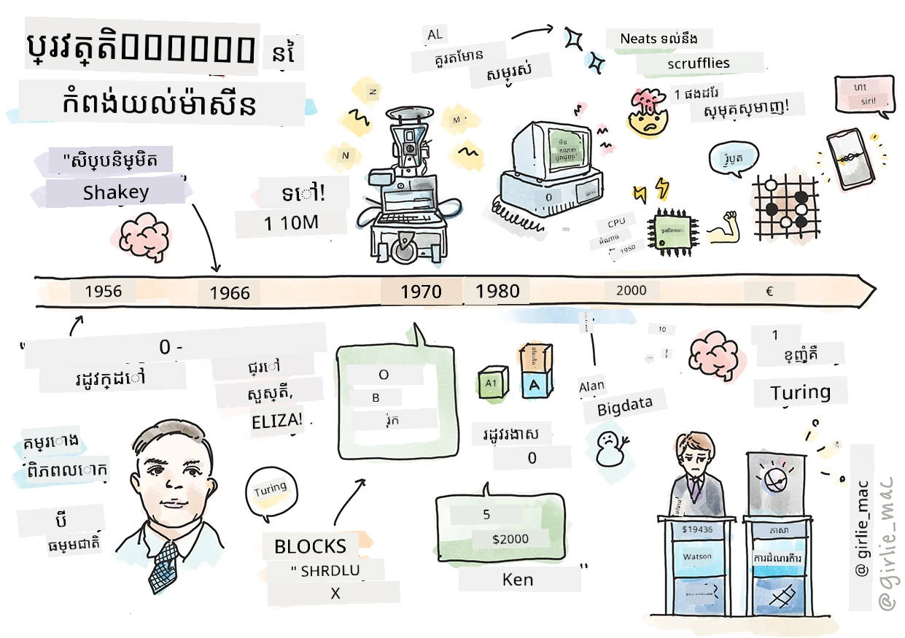
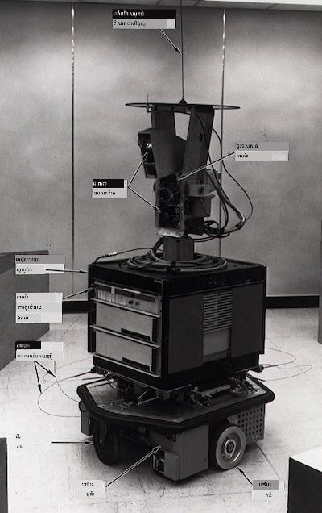
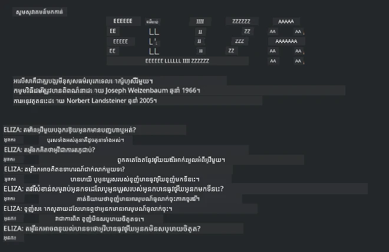

# ប្រវត្តិសាស្ត្រ​នៃការរៀន​មេកានិច

> សំណុំស្នាជ្រាបដោយ [Tomomi Imura](https://www.twitter.com/girlie_mac)

## [ប្រឡងមុខមាត់មុនពេលរៀន](https://ff-quizzes.netlify.app/en/ml/)

---

> 🎥 ចុចលើរូបភាពខាងលើសម្រាប់វីដេអូខ្លីដែលពិពណ៌នាអំពីមេរៀននេះ។

នៅក្នុងមេរៀននេះ យើងនឹងដើរឆ្ពោះទៅតាមកំណត់ហេតុសំខាន់ៗក្នុងប្រវត្តិការរៀនម៉ាស៊ីន និងបញ្ញាសិប្បនិម្មិត។

ប្រវត្តិបញ្ញាសិប្បនិម្មិត (AI) ជាវិស័យមួយមានការតភ្ជាប់យ៉ាងជិតស្និទ្ធជាមួយប្រវត្តិការរៀនម៉ាស៊ីន ដោយសារបាល់ហ្គារីតម និងការរីកចម្រើនគណិតវិទ្យា ដែលជាគន្លងមួយដល់ការអភិវឌ្ឍន៍ AI។ វាមានប្រយោជន៍ក្នុងការចងគម្លាតថា ខណៈពេលដែលវិស័យទាំងពីរនេះជាវិស័យដាច់ខាតបានចាប់ផ្តើមបង្ករឡើងនៅទសវត្សរ៍ 1950 ការរកឃើញ [បាល់ហ្គារីត, ស្ថិតិ, គណិតវិទ្យា, ការគណនា និងបច្ចេកទេស](https://wikipedia.org/wiki/Timeline_of_machine_learning) សំខាន់ៗបានមកមុន និងមានភាពជាប់ពាក់ផ្តាច់គ្នានៅខណៈពេលនោះ។ ជាការពិត មនុស្សបានគិតអំពីសំណួរទាំងនេះរយៈពេលពាន់ឆ្នាំមកហើយ ([https://wikipedia.org/wiki/History_of_artificial_intelligence](https://wikipedia.org/wiki/History_of_artificial_intelligence))៖ អត្ថបទនេះពិភាក្សាអំពីមូលដ្ឋានបែបគំនិតបុរាណនៃគំនិតម៉ាស៊ីនដែលអាច "គិតបាន"។

---
## ការរកឃើញសំខាន់ៗ

- 1763, 1812 [ទ្រឹស្តីBayes](https://wikipedia.org/wiki/Bayes%27_theorem) និងមុខងាររបស់វា។ ទ្រឹស្តីនេះ និងការប្រើប្រាស់របស់វាជាផ្នែកមូលដ្ឋាននៃការទាយទ្រង់, ពិពណ៌នាពីប្រភេទភាពនៃព្រឹត្តិការណ៍មួយនៅលើការយល់ដឹងពីមុន។
- 1805 [ទ្រឹស្តីបួនកន្លែងតិចបំផុត](https://wikipedia.org/wiki/Least_squares) ដោយគណិតវិទ្យាករជប៉ុន Adrien-Marie Legendre។ ទ្រឹស្តីនេះ ដែលអ្នកនឹងរៀននៅក្នុងមេរៀន Regression របស់យើង ជួយសម្រួលក្នុងការសម្រួលទិន្នន័យ។
- 1913 [ខ្សែ Markov](https://wikipedia.org/wiki/Markov_chain) ដែលបានដាក់ឈ្មោះដោយគណិតវិទ្យាកររុស្ស៊ី Andrey Markov ជួយពិពណ៌នារបៀបលំដាប់នៃព្រឹត្តិការណ៍ដែលអាចកើតមានដោយផ្អែកលើស្ថានភាពមុន។
- 1957 [Perceptron](https://wikipedia.org/wiki/Perceptron) គឺជាប្រភេទអ្នកចាត់ថ្នាក់បែបស្របបន្ទាត់ ដែលបានបង្កើតដោយបុគ្គលិកចិត្តវិទ្យាអាមេរិក Frank Rosenblatt ដែលជាគន្លងនៃការរីកចម្រើនក្នុង deep learning។

---

- 1967 [អ្នកជិតស្និទ្ធបំផុត](https://wikipedia.org/wiki/Nearest_neighbor) គឺបាល់ហ្គារីតដែលបានរចនាដំបូងសម្រាប់គូសផ្លូវ។ ក្នុងបរិបទ ML វាអាចប្រើសម្រាប់រកឃើញទ្រង់ទ្រាយ។
- 1970 [Backpropagation](https://wikipedia.org/wiki/Backpropagation) ត្រូវបានប្រើសម្រាប់ហ្វឹកហាត់ [ធំណាលសរសៃប្រសាទមុខមាត់.feedforward](https://wikipedia.org/wiki/Feedforward_neural_network)។
- 1982 [Recurrent Neural Networks](https://wikipedia.org/wiki/Recurrent_neural_network) គឺជាធំណាលសរសៃប្រសាទមួយដែលដើមមកពី feedforward neural networks ដែលបង្កើតក្រាបបន្ថែមពេលវេលា។

✅ សូមស្រាវជ្រាវបន្តិចបន្តួច។ តើកាលបរិច្ឆេទផ្សេងទៀតណាដែលនៅសោះជាកត្តាសំខាន់ក្នុងប្រវត្តិអំពី ML និង AI?

---
## 1950៖ ម៉ាស៊ីនដែលគិតបាន

Alan Turing ដែលជាមនុស្សដ៏អស្ចារ្យម្នាក់ ដែលត្រូវបានជ្រើសរើស [ដោយសាធារណជនឆ្នាំ 2019](https://wikipedia.org/wiki/Icons:_The_Greatest_Person_of_the_20th_Century) អោយជាសាស្ត្រាចារ្យដ៏អស្ចារ្យបំផុតក្នុងទសវត្សរ៍ 20, គេធ្លាប់បានជួយដាក់មូលដ្ឋានសម្រាប់គំនិតម៉ាស៊ីនដែលអាច "គិតបាន"។ គាត់បានប្រឈមមុខនឹងអ្នកពិជ័យនានា និងតម្រុយខ្លួនឯងក្នុងការរកភស្តុតាងសម្រាប់គំនិតនេះ ដោយការបង្កើត [តេស្ត Turing](https://www.bbc.com/news/technology-18475646) ដែលអ្នកនឹងស្វែងយល់ក្នុងមេរៀន NLP របស់យើង។

---
## 1956៖ គម្រោងស្រាវជ្រាវរដូវក្តៅ Dartmouth

"គម្រោងស្រាវជ្រាវរដូវក្តៅ Dartmouth លើបញ្ញាសិប្បនិម្មិត គឺជាព្រឹត្តិការណ៍ដ៏សំខាន់សម្រាប់សាលាបញ្ញាសិប្បនិម្មិត" ហើយក៏នៅទីនេះផងដែរនេះគេបានប្រើពាក្យ 'artificial intelligence' ជាលើកដំបូង ([ប្រភព](https://250.dartmouth.edu/highlights/artificial-intelligence-ai-coined-dartmouth))។

> គ្រប់ផ្នែកនៃការរៀន ឬលក្ខណៈណាមួយនៃបញ្ញា អាចពិពណ៌នាបានយ៉ាងម៉ត់ចត់ ដូច្នេះម៉ាស៊ីនអាចបង្កើតឡើងដើម្បីធ្វើហ្គោលម៉ូដែលនោះ។

---

អ្នកស្រាវជ្រាវដឹកនាំគឺ គ្រូបន្លិចគណិតវិទ្យា John McCarthy ដែលមានក្តីសង្ឃឹម "ដើម្បីបន្តទៅលើមូលដ្ឋាននៃការប៉ាន់ប្រមាណថា គ្រប់ផ្នែកនៃការរៀន ឬលក្ខណៈណាមួយនៃរបស់ពិតបញ្ញា អាចពិពណ៌នាបានយ៉ាងម៉ត់ចត់ ដូច្នេះម៉ាស៊ីនអាចធ្វើតួមួយដើម្បីធ្វើម៉ូដែលបាន។" អ្នកចូលរួមរួមមានអ្នកវិចិកគណិត Minsky Marvin ម្នាក់ផ្សេងទៀត។

កម្មវិធីសិក្សានេះគឺត្រូវបានគេចាត់ទុកថាបានចាប់ផ្តើមនិងលូតលាស់ការពិភាក្សាជាច្រើន រួមរួមទាំង "ការរីកចម្រើនវិធីសាស្ត្រសញ្ញា, ប្រព័ន្ធផ្តោតលើដែនកំណត់ (ប្រព័ន្ធឯកទេសដំបូង), និងប្រព័ន្ធអនុវត្តតាមការបញ្ចេញមតិប្រៀបធៀបនឹងប្រព័ន្ធប្រមូលវិទ្យា" ([ប្រភព](https://wikipedia.org/wiki/Dartmouth_workshop))។

---
## 1956 - 1974៖ "ឆ្នាំមាស"

ចាប់ពីទសវត្សរ៍ 1950 មកដល់កណ្ដាលទសវត្សរ៍ '70, ការពេញចិត្តថាទំនុកចិត្តថា AI អាចដោះស្រាយបញ្ហាជាច្រើនបាន។ ក្នុងឆ្នាំ 1967 Marvin Minsky បានបញ្ជាក់ដោយមានទំនុកចិត្តថា "ក្នុងរយៈពេលមួយជំនាន់ ... បញ្ហានៃការបង្កើត 'artificial intelligence' នឹងត្រូវបានដោះស្រាយយ៉ាងសំខាន់។" (Minsky, Marvin (1967), Computation: Finite and Infinite Machines, Englewood Cliffs, N.J.: Prentice-Hall)

ការស្រាវជ្រាវសំដៅទៅលើដំណើរការ​ភាសា​ធម្មជាតិបានរីកចម្រើន ការស្វែងរកបានកែលម្អ និងក្លាយទៅជាខ្លាំងជាងមុន និង​មានគំនិត ‘micro-worlds’ ដែលបំពេញភារកិច្ចដោយប្រើការណែនាំភាសារសាមញ្ញ។

---

ការស្រាវជ្រាវត្រូវបានផ្តល់ថវិការយ៉ាងល្អពីអង្គការរដ្ឋបាល ការរីកចម្រើនក្នុងទស្សនវិជ្ជា និងបាល់ហ្គារីត និងបានបង្កើតម៉ាស៊ីនឆ្លាតវៃមួយចំនួន។ មួយចំនួនក្នុងម៉ាស៊ីនទាំងនេះរួមមាន៖

* [Shakey the robot](https://wikipedia.org/wiki/Shakey_the_robot) ដែលអាចផ្លាស់ទី និងសម្រេចការប្រតិបត្ដិការដោយមានវិជ្ជាជីវៈ។

    
    > Shakey ក្នុងឆ្នាំ 1972

---

* Eliza ដែលជាប្រភេទ 'chatterbot' ដំបូង អាចសម្ភាសជាមួយមនុស្ស និងដើរតួជាអ្នកព្យាបាលមួយ 'therapist' ប្រល័យ។ អ្នកនឹងរៀនបន្ថែមពី Eliza នៅក្នុងមេរៀន NLP។

    
    > គំរូមួយនៃ Eliza, chatbot

---

* "Blocks world" ជាគំរូ micro-world មួយដែលប្លុកអាចត្រូវបានដាក់ស្នូរនិងតម្រៀបនៅ តេស្តល្បងក្នុងការបង្រៀនម៉ាស៊ីនឲ្យធ្វើការសម្រេចចិត្តក៏ត្រូវបានអនុវត្ត។ ការរីកចម្រើនដែលបានបង្កើតឡើងជាមួយបណ្ណាល័យដូចជា [SHRDLU](https://wikipedia.org/wiki/SHRDLU) បានជំនួយឲ្យមានការរីកចម្រើនក្នុងការប្រាស្រ័យភាសា។

    

    > 🎥 ចុចរូបថតខាងលើសម្រាប់វីដេអូ៖ Blocks world ជាមួយ SHRDLU

---
## 1974 - 1980៖ "រដូវរងារ AI"

ចាប់ពីកណ្ដាលទសវត្សរ៍ 1970 វាបានក្លាយជាការប៉ាន់ប្រមាណថាការធ្វើម៉ាស៊ីនឆ្លាតវៃមានភាពស្មុគស្មាញជាងការប៉ាន់ទុក ហើយការសន្យារបស់វាក្រោមសំណុំបញ្ញត្តិថាមពលគណនា មានការប៉ុនប៉ងលើសលប់។ ថវិកាត្រូវបានកាត់បន្ថយ ហើយទំនុកចិត្តក្នុងវិស័យបានត្រង់ការ។ បញ្ហាដែលមានឥទ្ធិពលដល់ទំនុកចិត្តរួមមាន៖
---
- **កំណត់លក្ខណៈ** លទ្ធភាពគណនាគឺមានកំណត់ខ្លាំង។
- **ការរីកចម្រើនប្រមូលផ្តុំ** ចំនួនប៉ារ៉ាម៉ែត្រដែលត្រូវហ្វឹកហាត់មានការកើនឡើងយ៉ាងច្រើននៅពេលបានសុំសំណុំបន្ថែមពីកុំព្យូទ័រ ដោយគ្មានការរីកចម្រើននៅលើថាមពលនិងសមត្ថភាពគណនា។
- **ទិន្នន័យខ្វះខាត** មានទិន្នន័យមិនគ្រប់គ្រាន់ដែលជារារាំងដល់ដំណើរការប្រលង, អភិវឌ្ឍ និងកែលម្អបាល់ហ្គារីត។
- **តើយើងកំពុងសួរសំណួរត្រឹមត្រូវឬទេ?** សំណួរដែលបានសួរបានចាប់ផ្តើមមានការសង្ស័យ។ អ្នកស្រាវជ្រាវបានទទួលកំណត់ត្រានូវការរិះគន់ចំពោះវិធីសាស្ត្ររបស់ពួកគេ៖
  - តេស្ត Turing ត្រូវបានពិចារណា តាមរយៈគំនិតផ្សេងៗ ដូចជា 'ទ្រឹស្តីបន្ទប់ចិន' ដែលបានបង្ហាញថា "កម្មវិធីកុំព្យូទ័រឌីជីថលអាចបង្ហាញថាវា​យល់ភាសា ប៉ុន្តែមិនអាចបង្កើតការយល់ដឹងពិតប្រាកដ។" ([ប្រភព](https://plato.stanford.edu/entries/chinese-room/))
  - សីលធម៌នៃការបង្កើតវត្ថុបញ្ញាសិប្បនិម្មិត ដូចជា "អ្នកព្យាបាល" ELIZA ត្រូវបានគេបដិសេធ។

---

នៅក្នុងពេលតែមួយ ក្រុមគំនិត AI ផ្សេងៗបានចាប់ផ្តើមបង្កើតឡើង។ មានការផ្គុំចេញជាគំនិតផ្ទុកពីវិធីដំណើរការ ["scruffy" និង "neat AI"](https://wikipedia.org/wiki/Neats_and_scruffies)។ សេឡាប៊ល _scruffy_ បានកែប្រែកម្មវិធីរយៈពេលជាច្រើនម៉ោងរហូតដល់ទទួលបានលទ្ធផលយ៉ាងចង់បាន។ សេឡាប៊ល _neat_ "ផ្តោតលើហេតុផលនិងការដោះស្រាយបញ្ហាផ្លូវការ"។ ELIZA និង SHRDLU គឺជា​ប្រព័ន្ធ _scruffy_ មានឈ្មោះល្បី។ នៅទសវត្សរ៍ 1980 ខណៈមានតម្រូវការបង្កើតប្រព័ន្ធ ML អាចធ្វើឡើងម្ដងទៀត, វិធីសាស្ត្រ _neat_ បានទទួលការគាំទ្រជាច្រើន ព្រោះលទ្ធផលបង្ហាញបានច្បាស់លាស់ជាង។

---
## ប្រព័ន្ធឯកទេសទសវត្សរ៍ 1980

ខណៈវិស័យកំពុងរីកចម្រើន ប្រយោជន៍របស់វាកាន់តែច្បាស់លាស់សម្រាប់អាជីវកម្ម ហើយនៅទសវត្សរ៍ 1980 ក៏មានការរាលដាលនៃ 'ប្រព័ន្ធឯកទេស'។ "ប្រព័ន្ធឯកទេសគឺជាប្រភេទកម្មវិធី AI (artificial intelligence) ដែលជោគជ័យដំបូងមួយ" ([ប្រភព](https://wikipedia.org/wiki/Expert_system))។

ប្រព័ន្ធនេះជារូបមន្ត _ផ្សំជាមួយគ្នា_ ដែលមានផ្នែកមួយជាគ្រឿងចស្ត្រ​និយមដែលកំណត់តម្រូវការអាជីវកម្ម និងផ្នែកមួយជាគ្រឿងចស្ត្រអនុវត្តប្រើប្រាស់បាល់ហ្គារីតដើម្បីសិក្សាផ្នែកអត្ថន័យថ្មី។

ទសវត្សនេះក៏ទទួលបានការចាប់អារម្មណ៍កាន់តែច្រើនលើបណ្ដាញសរសៃប្រសាទ។

---
## 1987 - 1993៖ AI 'នៅស្ងាត់'

ការរីកចម្រើននៃម៉ាស៊ីនឯកទេសដែលមានពិសេសធ្វើឲ្យវាក្លាយជាពិសេសពេក។ ការលេចធ្លោរបស់កុំព្យូទ័រផ្ទាល់ខ្លួនក៏ប្រកួតប្រជែងជាមួយប្រព័ន្ធធំៗដែលមានតែមួយនេះ។ ការចំណាយនៅលើកុំព្យូទ័របានជោគជ័យ ហើយវាបានបើកផ្លូវទៅរកការប្រសើរឡើងនៃទិន្នន័យធំ។

---
## 1993 - 2011

រយៈពេលនេះបានឃើញជំនាន់ថ្មីសម្រាប់ ML និង AI ដើម្បីដោះស្រាយបញ្ហាកន្លងមកដែលផ្ទុះពីកំណត់ទិន្នន័យនិងថាមពលគណនា។ ចំនួនទិន្នន័យបានកើនឡើងយ៉ាងឆាប់រហ័ស និងអាចប្រើបានយ៉ាងទូលំទូលាយ ពិសេសជាមួយកំណើតនៃស្មាតហ្វូននៅឆ្នាំ 2007។ ថាមពលគណនាក៏កើនឡើងយ៉ាងឆាប់រហ័ស និងបាល់ហ្គារីតបានរីកចម្រើនជាប់គ្នា។ វិស័យបានចាប់ផ្តើមឈានដល់ភាពចាស់ទុំ ពីព្រោះថ្ងៃខ្លះនៃការរំសាយឥតការត្រួតពិនិត្យបានក្លាយទៅជាវិស័យពិតប្រាកដ។

---
## ឥឡូវនេះ

ថ្ងៃនេះ ការរៀនម៉ាស៊ីន និង AI ប៉ះពាល់ទៅលើគ្រប់ផ្នែកនៃជីវិតយើង។ រយៈពេលនេះត្រូវការជំនាញយល់ដឹងយ៉ាងម៉ត់ចត់អំពីហានិភ័យ និងផលប៉ះពាល់ធ្វើអោយមានពីរបាល់ហ្គារីតទាំងនេះលើជីវិតមនុស្ស។ ដូចដែល Brad Smith របស់ Microsoft បាននិយាយថា "បច្ចេកវិទ្យាព័ត៌មាន បង្កឡើងនូវបញ្ហាដែលទៅដល់ស្នូលនៃការការពារសិទ្ធិមនុស្សមេធាវីដូចជារក្សាសម្ងាត់ និងសិទ្ធិថ្លែងការណ៍។ បញ្ហានេះកើនឡើងការទទួលខុសត្រូវចំពោះក្រុមហ៊ុនបច្ចេកវិទ្យាដែលបង្កើតផលិតផលទាំងនេះ។ ក្នុងទស្សនវិជ្ជារបស់យើង វាក៏ហៅឲ្យមានច្បាប់រដ្ឋាភិបាលយ៉ាងម៉ត់ចត់ និងបង្កើតនីតិវិធីជុំវិញការប្រើប្រាស់លើសស្រឡាយទទួលបទបង្រៀន។" ([ប្រភព](https://www.technologyreview.com/2019/12/18/102365/the-future-of-ais-impact-on-society/))។

---

វានៅតែមិនទាន់បានដឹងថា អនាគតនឹងគ្រប់គ្រងអ្វីទេ ប៉ុន្តែវាសំខាន់ក្នុងការយល់ដឹងអំពីប្រព័ន្ធកុំព្យូទ័រ និងកម្មវិធី និងបាល់ហ្គារីតដែលវារត់។ យើងសង្ឃឹមថាផែនការសិក្សានេះនឹងជួយអ្នកយល់ដឹងកាន់តែច្បាស់ ដើម្បីអោយអ្នកអាចសម្រេចចិត្តដោយខ្លួនឯង។

> 🎥 ចុចលើរូបភាពខាងលើសម្រាប់វីដេអូ៖ Yann LeCun ពិភាក្សាអំពីប្រវត្តិ deep learning ក្នុងមេរៀននេះ

---
## 🚀ការប្រកួតប្រជែង

ស្វែងរកមួយក្នុងចំណោមព្រឹត្តិការណ៍ប្រវត្តិសាស្ត្រទាំងនេះ ហើយស្វែងយល់បន្ថែមអំពីមនុស្សនៅពីក្រោយពួកវា។ មានតួអង្គគួរឲ្យចាប់អារម្មណ៍ ហើយគ្មានការរកឃើញវិទ្យាសាស្ត្រណាមួយដែលបានបង្កើតឡើងនៅក្នុងអវកាសវប្បធម៌ទទេ។ តើអ្នកបានរកឃើញអ្វី?

## [ប្រឡងបន្ទាប់ពីរៀន](https://ff-quizzes.netlify.app/en/ml/)

---
## ការត្រួតពិនិត្យ និងសិក្សាឯករាជ្យ

នេះជារបស់មួយដែលត្រូវមើលនិងស្តាប់៖

[ប៉ុស្តិ៍បាស្កែតនេះដែល Amy Boyd ពិភាក្សាអំពីការវិវត្តន៍នៃ AI](http://runasradio.com/Shows/Show/739)

---

## អនុវត្តការ

[បង្កើតកាលវេលា](assignment.md)

---

<!-- CO-OP TRANSLATOR DISCLAIMER START -->
**ការបញ្ជាក់**៖
ឯកសារនេះត្រូវបានបកប្រែដោយប្រើសេវាកម្មបកប្រែ AI [Co-op Translator](https://github.com/Azure/co-op-translator)។ ខណៈដែលយើងខិតខំសំរាប់ភាពច្បាស់លាស់ សូមយល់ដឹងថាការបកប្រែដោយស្វ័យប្រវត្តិក៏អាចមានកំហុសឬការបញ្ចូលព័ត៌មានមិនត្រឹមត្រូវជាប់គ្នា។ ឯកសារដើមក្នុងភាសាមួយដើមគួរត្រូវបានគេស្គាល់ថាជា​រៀងត្រង់ជាមួយដើម។ សម្រាប់ព័ត៌មានដែលមានសារៈសំខាន់ ការបកប្រែដោយមនុស្សជំនាញត្រូវបានណែនាំ។ យើងមិនទទួលខុសត្រូវចំពោះការយល់ច្រឡំ ឬការបកប្រែខុសៗណាមួយដែលកើតមានពីការប្រើប្រាស់ការបកប្រែនេះទេ។
<!-- CO-OP TRANSLATOR DISCLAIMER END -->