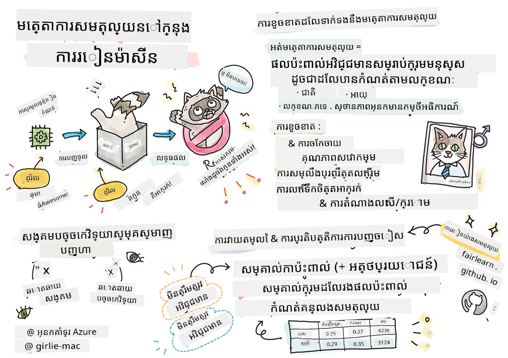

# ការបង្កើតដំណោះស្រាយម៉ាស៊ីនរៀនជាមួយ AI ដែលមានការទទួលខុសត្រូវ

> សកេតណូតដោយ [Tomomi Imura](https://www.twitter.com/girlie_mac)

## [គន្លឹះសំណួរមុនពេលសិក្សា](https://ff-quizzes.netlify.app/en/ml/)

## ជំហានបើក

ក្នុងមេរៀននេះ អ្នកនឹងចាប់ផ្តើមស្វែងរកពីរបៀបដែលម៉ាស៊ីនរៀនអាចវាយបង្វិលនិងមានឥទ្ធិពលលើជីវិតប្រចាំថ្ងៃរបស់យើង។ ទាំងឥឡូវនេះ ប្រព័ន្ធនិងម៉ូដែលជាប់ពាក់ព័ន្ធក្នុងភារកិច្ចសម្រេចចិត្តប្រចាំថ្ងៃដូចជា ការបញ្ជាក់ជំងឺសុខាភិបាល ការអនុម័តឥណទាន ឬការរកឃើញការជ្រុលបំពាន។ ដូច្នេះ វាពិតជាសំខាន់ណាស់ដែលម៉ូដែលទាំងនេះធ្វើការល្អដើម្បីផ្តល់លទ្ធផលដែលអាចទុកចិត្តបាន។ ដូចជាកម្មវិធីទូទៅណាមួយប្រព័ន្ធ AI អាចខកចិត្តនឹងការរំពឹងទុក ឬមានលទ្ធផលដែលមិនចង់បាន។ នេះហើយហ្នឹងជាហេតុផលដែលយើងត្រូវតែបង្រៀនខ្លួនឯងអំពីរបៀបយល់ និងពន្យល់អំពីអាកប្បករណ៍នៃម៉ូដែល AI។

សន្ដិភាពនូវអ្វីដែលអាចកើតមានឡើងពេលដែលទិន្នន័យដែលអ្នកកំពុងប្រើសម្រាប់បង្កើតម៉ូដែលទាំងនេះខ្វះក្រុមហ៊ុនជនជាតិខុសៗគ្នា ដូចជា ជាតិកុលលក្ខណៈ ភេទ ទស្សនវិស័យនយោកយោបាយ សាសនា ឬតំណាងនយោបាយដែលមានការលើសលប់។ តើវាយយកម៉ូដែលបានបង្ហាញលទ្ធផលផ្សេងទេវាសម្រាប់ខ្លឹមសារគណៈជនជាតិកំណត់មួយ? តើផលប៉ះពាល់សម្រាប់កម្មវិធីនេះមានអ្វីខ្លះ? លើសពីនេះ តើពេលម៉ូដែលមានលទ្ធផលអាក្រក់ និងបង្កមិត្តវិបត្តិក្នុងមនុស្ស តើនរណាជាទីតាំងទទួលខុសត្រូវចំពោះអាកប្បករិតនៃប្រព័ន្ធ AI? នេះជាសំណួរមួយចំនួនដែលយើងនឹងស្វែងរកក្នុងមេរៀននេះ។

ក្នុងមេរៀននេះ អ្នកនឹង៖

- បង្កើតការយល់ដឹងអំពីសារៈសំខាន់នៃភាពយុត្តិធម៌ក្នុងម៉ាស៊ីនរៀន និងគ្រោះថ្នាក់ដែលពាក់ព័ន្ធនឹងភាពយុត្តិធម៌។
- មកស្គាល់នឹងការអនុវត្តន៍នៃការស្វែងរកចំពោះភាពខុសគ្នានិងលក្ខណៈពិសេសដើម្បីធានានូវភាពទុកចិត្ត និងសុវត្ថិភាព។
- មានការយល់ដឹងពីតម្រូវការដើម្បីអោយគ្រប់គ្នាមានសិទ្ធិ និងរចនាប្រព័ន្ធរួមមួយ។
- ស្វែងរកពីសារៈសំខាន់នៃការការពារឯកជនភាព និងសុវត្ថិភាពទិន្នន័យ និងមនុស្ស។
- ឃើញសារៈសំខាន់នៃការយកវិធីជាកញ្ចក់ដើម្បីពន្យល់អាកប្បករិតនៃម៉ូដែល AI។
- មានការត្រួតពិនិត្យចំពោះតួនាទីនៃការទទួលខុសត្រូវដើម្បីកសាងក្តីទុកចិត្តនៅក្នុងប្រព័ន្ធ AI។

## លក្ខខណ្ឌមុនពេលចូលរួម

ជាលក្ខខណ្ឌមុនសូមចូលរួមវគ្គ "គោលនយោបាយ AI ដែលមានការទទួលខុសត្រូវ" និងមើលវីដេអូខាងក្រោម៖

ស្វែងរកព័ត៌មានបន្ថែមអំពី AI ដែលមានការទទួលខុសត្រូវតាមរយៈការតាមដាន [Learning Path](https://docs.microsoft.com/learn/modules/responsible-ai-principles/?WT.mc_id=academic-77952-leestott)

> 🎥 ចុចរូបភាពខាងលើសម្រាប់វីដេអូ៖ របៀប Microsoft ក្នុងការទទួលខុសត្រូវ AI

## ភាពយុត្តិធម៌

ប្រព័ន្ធ AI គួរតែប្រើប្រាស់យ៉ាងយុត្តិធម៌ និងជៀសវាងការប៉ះពាល់ដល់ក្រុមមនុស្សដូចគ្នានៅលើបែបផែនផ្សេងៗ។ ឧទាហរណ៍ នៅពេលប្រព័ន្ធ AI ផ្តល់យោបល់កំពុងការព្យាបាលផ្នែកសុខាភិបាល ការដាក់ពាក្យខ្ចីប្រាក់ ឬការជ្រើសរើសការងារ គួរតែផ្តល់ការផ្តល់យោបល់ដូចគ្នារបស់មនុស្សដែលមានរោគសញ្ញាស្រដៀងគ្នា ស្ថានភាពហិរញ្ញវត្ថុស្របគ្នា ឬគុណវប្បកម្មបុគ្គលរបស់ពួកគេ។ មនុស្សម្នាក់ទាំងអស់កាន់តាមដានលទ្ធផលនៃការប្រគល់វេនដែលមានឥទ្ធិពលលើសេចក្តីសម្រេចចិត្តនិងសកម្មភាពរបស់យើង។ ភាពលំអៀងនេះអាចមើលឃើញបានក្នុងទិន្នន័យដែលយើងប្រើសម្រាប់បណ្តុះបណ្តាលប្រព័ន្ធ AI។ ការតំលើងបែបនេះជាដំណើរទាក់ទងដែលអាចកើតឡើងដោយមិនចង់បាន។ វាពិបាកក្នុងការយល់ច្បាស់នៅពេលអ្នកជំពាក់ភាពលំអៀងក្នុងទិន្នន័យ។

**“ភាពមិនយុត្តិធម៌”** មានន័យថាប្រសិនបើមានផលប៉ះពាល់អវិជ្ជមាន ឬ “គ្រោះថ្នាក់” សម្រាប់ក្រុមអ្នកមួយ ដូចជាការកំណត់ជាតិកុលភេទ អាយុ ឬស្ថានភាពអ្នកពិការភាព។ គ្រោះថ្នាក់ទាក់ទងនឹងភាពយុត្តិធម៌អាចចែងបានជា៖

- **ការចែកចាយ** ជាដើមប្រភេទភេទ ឬជាតិកុលណាមួយត្រូវបានចូលចិត្តលើសពីមួយផ្សេងទៀត។
- **គុណភាពសេវាកម្ម** ប្រសិនបើអ្នកបណ្តុះទិន្នន័យសម្រាប់ស្ថានการณ์មួយដែលមិនស្មុគស្មាញពេញលេញ នេះនាំឲ្យមានសេវាកម្មដែលឆ្លុះបញ្ចាំងមិនល្អ។ ឧទាហរណ៍ ម៉ាស៊ីនចាក់សាប៊ូដៃមួយមិនអាចដឹងបានពីមនុស្សដែលមានស្បែកស្រអាប់។ [យោង](https://gizmodo.com/why-cant-this-soap-dispenser-identify-dark-skin-1797931773)
- **ការរិះគន់មិនយុត្តិធម៌** ការរិះគន់មិនយុត្តិធម៌ និងបង្វែរ ឧទាហរណ៍ បច្ចេកវិទ្យាការតំឡើងស្លាករូបភាពមួយបានចាក់ស្លាករូបភាពមនុស្សស្បែក​ស្រអាប់​ជា​ក្រិកកណ្តោល។
- **ការចំណេញឬការខ្វះតំណាង** គំនិតថាក្រុមណាមួយមិនបានមើលឃើញក្នុងវិជ្ជាជីវៈជាក់លាក់ណាមួយ ហើយសេវា ឬមុខងារណាមួយណាដែលបន្តផ្សព្វផ្សាយការខ្វះតំណាងនោះក៏បន្ថែមគ្រោះថ្នាក់។
- **ស្ទេរ឵អាប់** ភ្ជាប់ក្រុមណាមួយជាមួយលក្ខណៈដែលបានកំណត់មិនជារួសរាយ។ ឧទាហរណ៍ ប្រព័ន្ធបកប្រែភាសារវាងភាសាអង់គ្លេសនិងទួរគីជាច្រើនបង្ហាញភាពមិនត្រឹមត្រូវដោយពាក្យដែលភ្ជាប់ទៅនិងភេទជាមួយនឹងស្ទេរព្រីប។

> បកប្រែទៅភាសាទួរគី

> បកប្រែត្រឡប់ទៅភាសាអង់គ្លេស

ពេលរចនានិងសាកល្បងប្រព័ន្ធ AI យើងត្រូវធានាថា AI មានភាពយុត្តិធម៌ និងមិនត្រូវបានកំណត់ដើម្បីធ្វើការសម្រេចចិត្តមានការប្រហាក់ប្រហែល ឬការរើសអើងដែលមនុស្សក៏ត្រូវចាត់ទុកថាមិនត្រឹមត្រូវដែរ។ ការធានាអោយមានភាពយុត្តិធម៌ក្នុង AI និងម៉ាស៊ីនរៀននៅតែជាបញ្ហាសង្គមបច្ចេកទេសដ៏ស្មុគស្មាញ។

### ភាពទុកចិត្តនិងសុវត្ថិភាព

ដើម្បីបង្កើតការទុកចិត្ត ប្រព័ន្ធ AI ត្រូវតែទុកចិត្តបាន, មានសុវត្ថិភាព និងមានស្ថិរភាពក្រោមលក្ខខណ្ឌធម្មតានិងមិនរំពឹងទុក។ វាពិតជាសំខាន់ក្នុងការយល់ពីរបៀបប្រព័ន្ធ AI នឹងមានអាកប្បករណ៍នៅក្នុងស្ថានភាពនានា ជាពិសេសនៅពេលវាជា outliers។ នៅពេលបង្កើតដំណោះស្រាយ AI ត្រូវផ្តោតខ្លាំងលើរបៀបដោះស្រាយស្ថានភាពផ្សេងៗដែលអាចមកជួបទៅនឹងដំណោះស្រាយ AI។ ឧទាហរណ៍ ឡានបើកប្រាណថ្មីគួរតែនាំខ្ពស់ការគ្រប់គ្រងសុវត្ថិភាពមនុស្ស។ ដូច្នេះ AI ដែលបើកឡានត្រូវតែពិចារណាស្ថានភាពជា​ច្រើន​អាច​កើត​មាន​ដូច​ជា ពេលกลางคืน ភ្លៀង បាញ់ស្រអប់ ក្មេងចូលរថយន្ត សត្វចិញ្ចឹម​ ការសាងសង់ផ្លូវ។ ប្រព័ន្ធ AI អាចគ្រប់គ្រងស្ថានភាពទាំងអស់យ៉ាងត្រឹមត្រូវនិងមានសុវត្ថិភាព បង្ហាញពីកម្រិតការព្យាបាលរបស់អ្នកវិទ្យាសាស្រ្តទិន្នន័យ ឬអ្នកអភិវឌ្ឍ AI មុនពេលរចនានិងសាកល្បងប្រព័ន្ធ។

> [🎥 ចុចទីនេះសម្រាប់វីដេអូ: ](https://www.microsoft.com/videoplayer/embed/RE4vvIl)

### ការរួមបញ្ចូល

ប្រព័ន្ធ AI គួរតែរចនាឡើងដើម្បីពាក់ព័ន្ធ និងផ្តល់អំណាចដល់ទាំងអស់។ នៅពេលរចនា និងអនុវត្តប្រព័ន្ធ AI អ្នកវិទ្យាសាស្រ្តទិន្នន័យ និងអ្នកអភិវឌ្ឍ AI ត្រូវកំណត់និងដោះស្រាយអំពើការកំណត់គោលដៅដែលអាចច្រេីនមនុស្សដោយមិនចង់បាន។ ឧទាហរណ៍ មានមនុស្ស 1 ពាន់លាននាក់ដែលមានជំងឺពិការភាពនៅជុំវិញពិភពលោក។ ជាមួយនឹងការវិវឌ្ឍ AI ពួកគេអាចចូលដំណើរការព័ត៌មាន និងឱកាសជាច្រើនបានងាយស្រួលក្នុងជីវិតប្រចាំថ្ងៃរបស់ពួកគេ។ ដោយដោះស្រាយឧបសគ្គ ទំនិញសម្រាប់ច្នៃប្រឌិតនិងអភិវឌ្ឍផលិតផល AI ដែលមានបទពិសោធន៍ល្អប្រសើរដែលអាចផ្ដល់អត្ថប្រយោជន៍ដល់គ្រប់គ្នា។

> [🎥 ចុចទីនេះសម្រាប់វីដេអូ: ការរួមបញ្ចូលក្នុង AI](https://www.microsoft.com/videoplayer/embed/RE4vl9v)

### សុវត្ថិភាព និងឯកជនភាព

ប្រព័ន្ធ AI គួរតែមានសុវត្ថិភាព និងគោរពឯកជនភាពរបស់មនុស្ស។ មនុស្សមានកម្រិតការទុកចិត្តតិចទៅលើប្រព័ន្ធដែលបង្កការជ្រុលនូវឯកជនភាព ព័ត៌មាន ឬជីវិតរបស់ពួកគេ។ នៅពេលបណ្តុះម៉ូដែលម៉ាស៊ីនរៀន យើងពឹងផ្អែកលើទិន្នន័យដើម្បីផលិតលទ្ធផលល្អបំផុត។ ក្នុងការធ្វើដូចនេះ ប្រភពទិន្នន័យ និងភាពរឹងប៉ឹងគួរត្រូវបានគិតគូរ។ ឧទាហរណ៍ ទិន្នន័យមានប្រភពពីអ្នកប្រើប្រាស់ ឬទិន្នន័យសាធារណៈ? បន្ទាប់មក នៅពេលធ្វើការជាមួយទិន្នន័យ វានិងមានសារៈសំខាន់ក្នុងការអភិវឌ្ឍប្រព័ន្ធ AI ដែលអាចការពារព័ត៌មានសម្ងាត់ និងទប់ស្កាត់ការប្រហារ។ បើយោងតាមការរីកចម្រើនAI ការគោរពឯកជនភាព និងការការពារព័ត៌មានបុគ្គល និងអាជីវកម្មកាន់តែលំបាកនិងសំខាន់។ បញ្ហាអំពីឯកជនភាពនិងសុវត្ថិភាពទិន្នន័យត្រូវការយកចិត្តទុកដាក់យ៉ាងជិតស្និទ្ធសម្រាប់ AI ព្រោះការចូលដំណើរការទិន្នន័យមានសារៈសំខាន់សម្រាប់ប្រព័ន្ធ AI ក្នុងការធ្វើការទំាងអំពីព្យាករណ៍និងសម្រេចចិត្តបានត្រឹមត្រូវ។

> [🎥 ចុចទីនេះសម្រាប់វីដេអូ: សុវត្ថិភាពក្នុង AI](https://www.microsoft.com/videoplayer/embed/RE4voJF)

- ក្នុងឧស្សាហកម្មយើងបានធ្វើការវិវឌ្ឍយ៉ាងច្រើននៅផ្នែកឯកជនភាព និងសុវត្ថិភាព ដោយពាក់ព័ន្ទយ៉ាងខ្លាំងជាមួយនឹងបទបញ្ជាដូចជា GDPR ។
- ប៉ុន្តែសម្រាប់ប្រព័ន្ធ AI យើងត្រូវតែទទួលស្គាល់ការពាក់ព័ន្ធរវាងតម្រូវការ ទិន្នន័យផ្ទាល់ខ្លួនបន្ថែម ដើម្បីធ្វើឲ្យប្រព័ន្ធផ្នែកផ្ទាល់ខ្លួន និងប្រសើរឡើង — និងការគោរពឯកជនភាព។
- ដូចជាការបង្កើតកុំព្យូទ័រចងក្រងនឹងអ៊ីនធឺណិត យើងក៏បានឃើញការកើនឡើងយ៉ាងខ្លាំងនៃបញ្ហាសុវត្ថិភាពដែលពាក់ព័ន្ធនឹង AI៕
- ខណៈពេលដដែល ក៏ឃើញពីការប្រើប្រាស់ AI ដើម្បីធ្វើឱ្យសុវត្ថិភាពប្រសើរឡើង។ ឧទាហរណ៍ សាច់ញាតិការពារពីវីរុសភាគច្រើនដែលមាននៅសព្វថ្ងៃគឺដំណើរការដោយ AI heuristics ។
- យើងត្រូវធានាថា បើកម្រិតវិទ្យាសាស្រ្តទិន្នន័យរបស់យើងបញ្ចូលការអនុវត្តៗថ្មីៗទាំងអស់ទាក់ទងនឹងឯកជនភាព និងសុវត្ថិភាព។

### ភាពច្បាស់លាស់

ប្រព័ន្ធ AI គួរតែដឹងច្បាស់។ ផ្នែកសំខាន់ពីភាពច្បាស់លាស់គឺការពន្យល់អាកប្បករណ៍នៃប្រព័ន្ធ AI និងធាតុផ្សំនៃវា។ ការកែលម្អការយល់ដឹងអំពីប្រព័ន្ធ AI ជំរុញឱ្យអ្នកពាក់ព័ន្ធយល់ថាតើវាដំណើរការយ៉ាងដូចម្តេចនិងហេតុផលដែលវាដំណើរការដូច្នោះ ដើម្បីជួយកំណត់បញ្ហាផ្នែកសមត្ថភាព ភាពសុវត្ថិភាព ផ្លូវការផ្សេងៗ ភាពលំអៀង ភាពមិនសុចរិត ឬលទ្ធផលមិនចង់បាន។ យើងក៏ជឿថា អ្នកប្រើប្រាស់ប្រព័ន្ធ AI គួរតែត្រួតពិនិត្យនិងរាយការណ៍ពេលណានិងហេតុផលដែលពួកគេប្រើប្រាស់វា និងកម្រិតកំណត់នៃប្រព័ន្ធដែលពួកគេចេញការប្រើប្រាស់។ ឧទាហរណ៍ ប្រសិនបើធនាគារប្រើប្រព័ន្ធ AI ជួយសម្រេចចិត្តឥណទាន វាពិតជាសំខាន់ក្នុងការត្រួតពិនិត្យលទ្ធផល និងយល់ថាតើទិន្នន័យណាដែលមានឥទ្ធិពលលើការផ្តល់ដំណឹងរបស់ប្រព័ន្ធ។ រដ្ឋាភិបាលកំពុងចាប់ផ្តើមគ្រប់គ្រង AI នៅក្នុងវិស័យផ្សេងៗ ដូច្នេះអ្នកវិទ្យាសាស្រ្តទិន្នន័យ និងអង្គការត្រូវតែពន្យល់ថាប្រព័ន្ធ AI នេះត្រូវគោរពតាមបទបញ្ជា ឬទេ ជាពិសេសនៅពេលមានលទ្ធផលមិនចង់បាន។

> [🎥 ចុចទីនេះសម្រាប់វីដេអូ: ភាពច្បាស់លាស់ក្នុង AI](https://www.microsoft.com/videoplayer/embed/RE4voJF)

- ពីព្រោះប្រព័ន្ធ AI មានភាពស្មុគស្មាញខ្លាំង បង្កឡើងការលំបាកក្នុងការយល់ពីរបៀបវាដំណើរការ និងបកស្រាយលទ្ធផល។
- ការខ្វះការយល់ដឹងនេះប៉ះពាល់ដល់វិធីដែលប្រព័ន្ធទាំងនេះត្រូវបានគ្រប់គ្រង ប្រតិបត្តិ និងប្រភេទឯកសារ។
- ការខ្វះការយល់ដឹងនេះប៉ះពាល់យ៉ាងចាំបាច់ទៅលើការសម្រេចចិត្ត ដែលធ្វើឡើងដោយប្រើលទ្ធផលដែលប្រព័ន្ធទាំងនេះផលិត។

### ការទទួលខុសត្រូវ

មនុស្សដែលរចនានិងចេញផ្សាយប្រព័ន្ធ AI ត្រូវទទួលខុសត្រូវចំពោះរបៀបដែលប្រព័ន្ធរបស់ពួកគេចាក់សោ។ តម្រូវការនេះមានសារៈសំខាន់បំផុត ជាពិសេសជាមួយបច្ចេកវិទ្យាទាក់ទងនឹងការបញ្ចាក់មុខមាត់។ នៅពេលថ្មីៗនេះ មានការទាមទារកើនឡើងសម្រាប់បច្ចេកវិទ្យាបញ្ចាក់មុខមាត់ ជាពិសេសពីអង្គការជំនួយច្បាប់ ដែលឃើញភាពមានសក្តានុពលនៃបច្ចេកវិទ្យានៅក្នុងការស្វែងរកកុមារកំពុងបាត់បង់។ ទោះជាយ៉ាងណា បច្ចេកវិទ្យាអាចត្រូវបានប្រើដោយរដ្ឋាភិបាលដើម្បីឲ្យមានការតាមដានជាប់លាប់លើមនុស្សជាក់លាក់។ ដូច្នេះ អ្នកវិទ្យាសាស្រ្តទិន្នន័យ និងអង្គការត្រូវតែទទួលខុសត្រូវចំពោះវិបត្តិនៃប្រព័ន្ធ AI កំពុងប៉ះពាល់មនុស្ស ឬសង្គម។

> 🎥 ចុចរូបភាពខាងលើសម្រាប់វីដេអូ: ការព្រមានអំពីការតាមដានទូទៅតាមបច្ចេកវិទ្យាបញ្ចាក់មុខមាត់

ចុងក្រោយមួយក្នុងចំណោមសំណួរធំបំផុតសម្រាប់ជំនាន់យើង ជា​ជំនាន់ដំបូងដែលនាំ AI សម្រាប់សង្គម គឺរបៀបធានាឲ្យកុំព្យូទ័រនឹងនៅតែទទួលខុសត្រូវទៅមនុស្ស និងរបៀបធានាឲ្យអ្នកដែលរចនាកុំព្យូទ័រនេះនៅតែទទួលខុសត្រូវចំពោះគ្រប់លោកអ្នកផ្សេងទៀត។

## ការវាយតម្លៃផលប៉ះពាល់

មុនពេលបណ្តុះម៉ូដែលម៉ាស៊ីនរៀន វាជាចាំបាច់ក្នុងការធ្វើការវាយតម្លៃផលប៉ះពាល់ ដើម្បីយល់ពីគោលបំណងនៃប្រព័ន្ធ AI; តើការប្រើប្រាស់នឹងយកទៅប្រើធ្វើអ្វី; កន្លែងនឹងធ្វើការចេញផ្សាយ; និងនរណានឹងធ្វើការប៉ះពាល់ប្រព័ន្ធ។ ព័ត៌មាននេះជួយឲ្យអ្នកវាយតម្លៃ ឬអ្នកសាកល្បងធ្វើការវាយតម្លៃប្រព័ន្ធដឹងថាត្រូវគិតចំពោះមូលហេតុណាខ្លះនៅពេលកំណត់ហានិភ័យ និងលទ្ធផលដែលរំពឹងទុក។

ដូចតទៅជាតំបន់ដែលត្រូវផ្តោតខ្លាំងពេលធ្វើការវាយតម្លៃផលប៉ះពាល់៖

* **ផលប៉ះពាល់អវិជ្ជមានលើបុគ្គល**។ យល់ដឹងអំពីកំណត់ ឬតម្រូវការ ការប្រើប្រាស់មិនគាំទ្រ ឬកំណត់ខ្វះខាតណាមួយដែលអាចប៉ះពាល់ដល់សមត្ថភាពនៃប្រព័ន្ធមានសារៈសំខាន់ដើម្បីថែរក្សាឲ្យប្រព័ន្ធមិនត្រូវបានប្រើប្រាស់ដោយដូចជាការបង្កគ្រោះថ្នាក់លើបុគ្គល។
* **តម្រូវការទិន្នន័យ**។ យល់ពីរបៀបនិងកន្លែងប្រព័ន្ធនឹងប្រើទិន្នន័យ អនុញ្ញាតឲ្យអ្នកវាយតម្លៃចែកចាយទិន្នន័យចំពោះតម្រូវការណាមួយដែលអ្នកត្រូវបានទុកចិត្ត (ឧ. បទបញ្ជា GDPR ឬ HIPPA)។ លើសពីនេះ ពិនិត្យមើលប្រភព ឬបរិមាណទិន្នន័យគ្រប់គ្រាន់សម្រាប់ការបណ្តុះបណ្តាល។
* **សង្ខេបផលប៉ះពាល់**។ ប្រមូលបញ្ជីនៃគ្រោះថ្នាក់ដែលអាចកើតមានពីការប្រើប្រាស់ប្រព័ន្ធ។ តាមដានពេញលេញរយៈម៉ាស៊ីនរៀនប្រើប្រាស់ ដើម្បីពិនិត្យថាបញ្ហាដែលកំណត់បានត្រូវបានកាត់បន្ថយ ឬដោះស្រាយ។
* **គោលបំណងដែលអាចប្រើប្រាស់បាន** សម្រាប់គោលការណ៍មូលដ្ឋានទាំងប្រាំមួយ។ វាយតម្លៃថាគោលបំណងនីមួយៗត្រូវបានបំពេញ និងមានចន្លោះខ្វះខាតទេ។

## ការសំរាមជាមួយ AI ដែលមានការទទួលខុសត្រូវ

ដូចជាការសំរាមកម្មវិធីទូទៅ ការសំរាមប្រព័ន្ធ AI គឺជាដំណើរការត្រូវតែធ្វើការកំណត់និងដោះស្រាយបញ្ហា។ មានកត្តាច្រើនដែលប៉ះពាល់ដល់ម៉ូដែលដែលមិនផ្ដល់លទ្ធផលដូចបានរំពឹង ឬជាមួយភាពទទួលខុសត្រូវ។ តុល្យភាពសមត្ថភាពម៉ូដែលបែបបុរីជាច្រើនគឺជាការបូកសរុបគុណភាពចំនួននៃសមត្ថភាពម៉ូដែល មិនគ្រប់គ្រាន់សម្រាប់វិភាគថាតើម៉ូដែលផ្ទុះខុសបំណងគោលការណ៍ AI ទេ។ លើសពីនេះ ម៉ូដែលម៉ាស៊ីនរៀនគឺជាប្រអប់ខ្មៅដែលពិបាកយល់ពីមូលហេតុនៃលទ្ធផលរបស់វា ឬផ្តល់ការពន្យល់នៅពេលវាធ្វើកំហុស។ នៅបន្ទាប់នៃវគ្គនេះ យើងនឹងរៀនការប្រើប្រព័ន្ធ Dashboard AI ដែលមានភាពទទួលខុសត្រូវ ដើម្បីជួយសំរុងសំរួលប្រព័ន្ធ AI ។ Dashboard នេះផ្តល់ឧបករណ៍ទូលំទូលាយសម្រាប់អ្នកវិទ្យាសាស្រ្តទិន្នន័យ និងអ្នកអភិវឌ្ឍ AI ដើម្បីធ្វើ៖

* **វិភាគកំហុស**។ ដើម្បីកំណត់ចំនួនចែកថ្នាក់កំហុសរបស់ម៉ូដែលដែលអាចប៉ះពាល់ដល់ភាពយុត្តិធម៌ឬភាពទុកចិត្ត។
* **ទិដ្ឋភាពម៉ូដែល**។ ដើម្បីរកឃើញកន្លែងមានភាពមិនស្មើគ្នានៃគុណភាពម៉ូដែលលើដុំទិន្នន័យផ្សេងៗ។
* **វិភាគទិន្នន័យ**។ ដើម្បីយល់ពីចំណែកបែកផ្គរទិន្នន័យ និងកំណត់ភាពលំអៀងណាមួយក្នុងទិន្នន័យដែលអាចនាំឲ្យមានបញ្ហាផ្នែកភាពយុត្តិធម៌ ការរួមបញ្ចូល និងភាពទុកចិត្ត។
* **ការសម្រួលម៉ូដែល**។ ដើម្បីយល់ថាគ្រឿងផ្សំណាដែលមានឥទ្ធិពលលើការព្យាករណ៍របស់ម៉ូដែល។ នេះជួយឲ្យពន្យល់អាកប្បករណ៍របស់ម៉ូដែល ដែលមានសារៈសំខាន់សម្រាប់ភាពច្បាស់លាស់ និងការទទួលខុសត្រូវ។

## 🚀 챌린지

ដើម្បីជៀសវាងការបង្កគ្រោះថ្នាក់ចូលឆាប់នៅដំបូង យើងគួរតែ៖

- មានភាពចម្រុះនៃផ្ទៃខាងក្រោយ និងទស្សនៈរបស់មនុស្សដែលកំពុងធ្វើការលើប្រព័ន្ធ
- វិនិយោគក្នុងសំណុំទិន្នន័យដែលបញ្ចាំងពីភាពចម្រុះក្នុងសង្គមយើង
- អភិវឌ្ឍវិធីសាស្រ្តប្រសើរជាមធ្យោបាយខ្លះក្នុងរយៈពេលវែកំណត់ម៉ាស៊ីនរៀន សម្រាប់រកឃើញ និងកែប្រែ AI ដែលទទួលខុសត្រូវនៅពេលវាកើតឡើង

គិតអំពីស្ថានភាពជាក់ស្តែងដោយមានភាពអត់ទុកចិត្តក្នុងការបង្កើតម៉ូដែល និងការប្រើប្រាស់។ តើមានអ្វីផ្សេងទៀតត្រូវគិតខ្លះ?

## [គន្លឹះសំណួរបន្ទាប់សិក្សា](https://ff-quizzes.netlify.app/en/ml/)

## ការត្រួតពិនិត្យ និងការសិក្សាឯករាជ្យ
នៅមេរៀននេះ អ្នកបានរៀនអំពីមូលដ្ឋានខ្លះៗនៃគំនិតភាពយុត្តិធម៌ និងការអត់យុត្តិធម៌នៅក្នុងការរៀនម៉ាស៊ីន។  
 
មើលវគ្គបណ្ដុះបណ្ដាលនេះដើម្បីជ្រាបជ្រាលជ្រៅជាងនេះអំពីប្រធានបទ៖ 

- ក្នុងការតាមដាន AI មានទំនួលខុសត្រូវ៖ នាំយកគោលការណ៍ទៅអនុវត្តដោយ Besmira Nushi, Mehrnoosh Sameki និង Amit Sharma

> 🎥 ចុចរូបភាពខាងលើសម្រាប់វីដេអូ៖ RAI Toolbox: ស៊ុមបើកម៉ូដែលសម្រាប់សាងសង់ AI មានទំនួលខុសត្រូវ ដោយ Besmira Nushi, Mehrnoosh Sameki, និង Amit Sharma

ផងដែរ សូមអាន៖ 

- មជ្ឈមណ្ឌលធនធាន RAI របស់ Microsoft៖ [Responsible AI Resources – Microsoft AI](https://www.microsoft.com/ai/responsible-ai-resources?activetab=pivot1%3aprimaryr4) 

- ក្រុមស្រាវជ្រាវ FATE របស់ Microsoft៖ [FATE: Fairness, Accountability, Transparency, and Ethics in AI - Microsoft Research](https://www.microsoft.com/research/theme/fate/) 

ស៊ុម RAI Toolbox៖ 

- [ឃ្លាំង GitHub របស់ Responsible AI Toolbox](https://github.com/microsoft/responsible-ai-toolbox)

អានអំពីឧបករណ៍ Azure Machine Learning ដើម្បីធានាការយុត្តិធម៌៖

- [Azure Machine Learning](https://docs.microsoft.com/azure/machine-learning/concept-fairness-ml?WT.mc_id=academic-77952-leestott) 

## បេសកកម្ម

[ស្វែងយល់អំពី RAI Toolbox](assignment.md)

---

<!-- CO-OP TRANSLATOR DISCLAIMER START -->
**ការបដិសេធ**៖  
ឯកសារនេះត្រូវបានបកប្រែដោយប្រើសេវាបកប្រែ AI [Co-op Translator](https://github.com/Azure/co-op-translator) ។ ខណៈពេលដែលយើងខិតខំប្រឹងប្រែងឱ្យបានត្រឹមត្រូវ សូមដឹងថាការបកប្រែដោយស្វ័យប្រវត្តិអាចមានកំហុស ឬភាពមិនត្រឹមត្រូវខ្លះ។ ឯកសារដើមជាភាសា​ដើមគួរត្រូវបានគេចាត់ទុកជាថ្នាក់ដឹកនាំសម្រាប់ព័ត៌មាន។ សម្រាប់ព័ត៌មានសំខាន់ៗ សូមណែនាំឱ្យប្រើការបកប្រែដោយមនុស្សជាជំនាញ។ យើងមិនទទួលខុសត្រូវចំពោះការយល់ច្រឡំ ឬការជំពាក់ចំពោះការបកប្រែនេះឡើយ។
<!-- CO-OP TRANSLATOR DISCLAIMER END -->