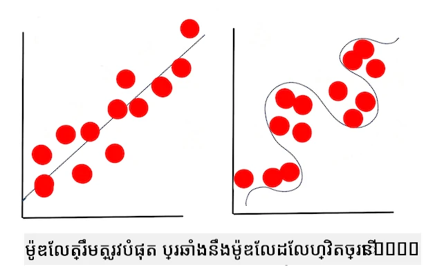

# បច្ចេកទេសនៃការរៀនម៉ាស៊ីន

ដំណើរការនៃការបង្កើត ប្រើប្រាស់ និងថែទាំម៉ូដែលការរៀនម៉ាស៊ីន និងទិន្នន័យដែលពួកវា ប្រើប្រាស់ គឺជាប្រភេទដំណើរការផ្សេងពីច្រើនដំណើរការអភិវឌ្ឍន៍ផ្សេងទៀត។ ក្នុងមេរៀននេះ យើងនឹងបំបែកអាថ៍កំបាំងនៃដំណើរការនេះ ហើយលើកសញ្ញាផ្នែកបច្ចេកទេសសំខាន់ៗដែលអ្នកត្រូវដឹង។ អ្នកនឹង៖

- យល់ដឹងអំពីដំណើរការដែលគាំទ្រ ក្រោមកម្រិតខ្ពស់នៃការរៀនម៉ាស៊ីន។
- សិក្សាពីគំនិតមូលដ្ឋានដូចជា 'ម៉ូដែល' 'ការព្យាករណ៍' និង 'ទិន្នន័យបណ្តុះបណ្តាល'។

## [សំនួរត្រួតពិនិត្យមុនមេរៀន](https://ff-quizzes.netlify.app/en/ml/)

> 🎥 ចុចរូបភាពខាងលើសម្រាប់វីដេអូខ្លីមួយនៃការប្រតិបត្តិមេរៀននេះ។

## ការណែនាំ

នៅកម្រិតខ្ពស់ សិប្បកម្មនៃការបង្កើតដំណើរការរៀនម៉ាស៊ីន (ML) ត្រូវបានបង្កប់ដោយជំហានច្រើន៖

1. **សម្រេចចិត្តលើសំណួរ**។ ដំណើរការរៀនម៉ាស៊ីនភាគច្រើនចាប់ផ្តើមដើមដោយការសួរសំណួរដែលមិនអាចឆ្លើយតបដោយកម្មវិធីមានលក្ខខណ្ឌឬប្រព័ន្ធច្បាប់មួយ។ សំណួរទាំងនេះភាគច្រើនមានទំនាក់ទំនងនឹងការព្យាករណ៍ដែលផ្អែកលើយោគន័យទិន្នន័យមួយ។
2. **រក្សាទិន្នន័យ និងរៀបចំទិន្នន័យ**។ ដើម្បីឆ្លើយសំណួររបស់អ្នក អ្នកត្រូវការទិន្នន័យ។ គុណភាព និងពេលខ្លះ បរិមាណទិន្នន័យរបស់អ្នកនឹងកំណត់ថាតើអ្នកអាចឆ្លើយសំណួរដើមបានល្អប៉ុណ្ណា។ ការមើលឃើញទិន្នន័យជារូបភាពគឺជាផ្នែកសំខាន់នៃជំហាននេះ។ ជំហាននេះរួមមានការបែងចែកទិន្នន័យទៅក្រុមបណ្តុះបណ្តាល និងតេស្ត ដើម្បីបង្កើតម៉ូដែល។
3. **ជ្រើសរើសវិធីសាស្ត្របណ្តុះបណ្តាល**។ អាស្រ័យលើសំណួររបស់អ្នក និងធម្មជាតិទិន្នន័យ អ្នកត្រូវជ្រើសរើសរបៀបដែលអ្នកចង់បណ្តុះបណ្តាលម៉ូដែល ដើម្បីប្រតិបត្តិរូបភាពទិន្នន័យរបស់អ្នកឱ្យបានល្អបំផុត និងធ្វើការព្យាករណ៍បានត្រឹមត្រូវ។ នេះជាផ្នែកនៃដំណើរការរៀនម៉ាស៊ីនដែលទាមទារជំនាញជាក់លាក់ និងជាផ្នែកច្រើននៃការសាកល្បងយ៉ាងច្រើន។
4. **បណ្តុះបណ្តាលម៉ូដែល**។ ប្រើប្រាស់ទិន្នន័យបណ្តុះបណ្តាលរបស់អ្នក អ្នកនឹងប្រើលេខាធិការកម្មវិធីនានាដើម្បីបណ្តុះបណ្តាលម៉ូដែល ដើម្បីស្គាល់លំនាំក្នុងទិន្នន័យ។ ម៉ូដែលអាចប្រើប្រាស់ទំងន់ផ្ទៃក្នុងដែលអាចប្តូរបាន ដើម្បីផ្តល់តម្លៃល្អជាងសម្រាប់ផ្នែកជាក់លាក់នៃទិន្នន័យ ដោយមានគោលបំណងបង្កើតម៉ូដែលល្អប្រសើរជាងមុន។
5. **វាយតម្លៃម៉ូដែល**។ អ្នកប្រើទិន្នន័យដែលមិនដែលបានមើលមុន (ទិន្នន័យតេស្ត) ពីប្រភពទិន្នន័យដែលបានប្រមូល ដើម្បីមើលម៉ូដែលបញ្ចេញសមិទ្ធផលយ៉ាងដូចម្តេច។
6. **កែតម្រូវប៉ារ៉ាម៉ែត្រ**។ យោងទៅលើសមត្ថភាពរបស់ម៉ូដែល អ្នកអាចធ្វើពន្លឿនដំណើរការឡើងវិញដោយប្រើប៉ារ៉ាម៉ែត្រ ឬអថេរដែលគ្រប់គ្រងអវកាសនៃលេខាធិការ ដែលបានប្រើបណ្តុះបណ្តាលម៉ូដែល។
7. **ព្យាករណ៍**។ ប្រើបញ្ចូលថ្មីដើម្បីសាកល្បងភាពត្រឹមត្រូវរបស់ម៉ូដែលអ្នក។

## តើត្រូវសួរសំណួរអ្វី

កុំព្យូទ័រមានជំនាញពិសេសក្នុងការរកឃើញលំនាំលាក់ក្នុងទិន្នន័យ។ អត្ថប្រយោជន៍នេះមានប្រយោជន៍សម្រាប់អ្នកស្រាវជ្រាវដែលមានសំណួរអំពីដែនដីមួយដែលមិនអាចឆ្លើយបានងាយដោយបង្កើតប្រព័ន្ធកំណត់លក្ខខ័ណ្ឌបែបច្បាប់។ ឧទាហរណ៍ ក្នុងភារកិច្ចអាគុយស្ត្រី ព័ត៌មានវិទ្យាទិន្នន័យថែមតម្រូវអាចបង្កើតច្បាប់ដូចគេច្នៃប្រឌិតអំពីភាពស្លាប់របស់អ្នកបារីប្រៀបធៀបនឹងអ្នកមិនបារី។

យ៉ាងไรก็ตามពេលបញ្ចូលអថេរច្រើនផ្សេងទៀតចូលក្នុងសមីការ ម៉ូដែល ML អាចមានប្រសិទ្ធភាពជាងក្នុងការព្យាករណ៍អត្រាស្លាប់អនាគតដោយផ្អែកលើប្រវត្តិសុខភាពចាស់ៗ។ ឧទាហរណ៍មួយដែលរីករាយជាងគេអាចជាការធ្វើការព្យាករណ៍អាកាសធាតុសម្រាប់ខែមេសា ក្នុងទីតាំងណាមួយដោយផ្អែកលើទិន្នន័យដែលរួមមានទិសដៅអាកាសធាតុ អំពីជាន់ទីតាំង, ផ្លាស់ប្តូរអាកាសធាតុ, ភាពជិតសមុទ្រ, លំនាំឯកសារចរណ៍ខ្យល់ និងច្រើនទៀត។

✅ ស្លាយឯកសារនេះ [slide deck](https://www2.cisl.ucar.edu/sites/default/files/2021-10/0900%20June%2024%20Haupt_0.pdf) ពីម៉ូដែលអាកាសធាតុផ្ដល់ចំណុចមើលប្រវត្តិវិទ្យាសម្រាប់ការប្រើ ML ក្នុងការវិភាគអាកាសធាតុ។

## ភារកិច្ចមុនការបង្កើត

មុននឹងចាប់ផ្តើមបង្កើតម៉ូដែលរបស់អ្នក មានភារកិច្ចជាច្រើនដែលអ្នកត្រូវបញ្ចប់។ ដើម្បីសាកល្បងសំណួររបស់អ្នក និងបង្កើតសំនឹមយោងតាមការព្យាករណ៍របស់ម៉ូដែល អ្នកត្រូវកំណត់ និងកំណត់រចនាសម្ព័ន្ធធាតុជាច្រើន។

### ទិន្នន័យ

ដើម្បីឆ្លើយសំណួររបស់អ្នកដោយប្រាកដ អ្នកត្រូវការទិន្នន័យច្រើនមានប្រភេទត្រឹមត្រូវ។ មានពីររឿងដែលអ្នកត្រូវធ្វើនៅឆ្នាំនេះ៖

- **ប្រមូលទិន្នន័យ**។ ការចងចាំមេរៀនមុនអំពីកិច្ចភាពយុត្តិធម៌ក្នុងការវិភាគទិន្នន័យ ចូរប្រមូលទិន្នន័យដោយប្រុងប្រយត្ន៍។ ត្រូវយល់ដឹងពីប្រភពទិន្នន័យនេះ ការបង្វិលបម្រែបម្រួលរបស់វា និងចុះបញ្ជីប្រភពដើម។
- **រៀបចំទិន្នន័យ**។ មានជំហានជាច្រើនក្នុងដំណើរការរៀបចំទិន្នន័យ។ អ្នកអាចត្រូវដាក់ទិន្នន័យជាបន្ទាត់ និង normalize វាបើវាមកពីប្រភពផ្សេងៗ។ អ្នកអាចបង្កើនគុណភាព និងបរិមាណទិន្នន័យតាមវិធីផ្សេងៗ ដូចជាការបម្លែងខ្សែអក្សរទៅជាចំនួន (ដូចដែលយើងធ្វើក្នុង [Clustering](../../5-Clustering/1-Visualize/README.md))។ អ្នកអាចបង្កើតទិន្នន័យថ្មីពីមួលដើមបាន (ដូចដែលយើងធ្វើក្នុង [Classification](../../4-Classification/1-Introduction/README.md))។ អ្នកអាចសំអាតនិងកែប្រែទិន្នន័យ (ដូចដែលយើងនឹងធ្វើមុនមេរៀន [Web App](../../3-Web-App/README.md))។ បន្ថែមពីនេះ អ្នកអាចត្រូវ randomized និង shuffle វា តាមវិធីសាស្រ្តបណ្តុះបណ្តាលរបស់អ្នក។

✅ បន្ទាប់ពីប្រមូល និងដំណើរការទិន្នន័យរបស់អ្នក សូមចំណាយពេលមើលថាទម្រង់របស់វា អាចឱ្យអ្នកដោះស្រាយសំណួរត្រូវបានមែនទេ។ អាចជាករណីដែលទិន្នន័យមិនអាចធ្វើបានល្អក្នុងភារកិច្ចរបស់អ្នក ដូចដែលយើងបានរកឃើញក្នុងមេរៀន [Clustering](../../5-Clustering/1-Visualize/README.md)។

### លក្ខណៈពិសេស និងគោលដៅ

[លក្ខណៈពិសេស](https://www.datasciencecentral.com/profiles/blogs/an-introduction-to-variable-and-feature-selection) គឺជាសម្បត្តិនៃទិន្នន័យដែលអាចវាស់បាន។ នៅក្នុងតារាងទិន្នន័យជាច្រើនវាត្រូវបានបង្ហាញជាថ្មើរឈ្មោះជួរដេកដូចជា 'កាលបរិច្ឆេទ' 'ទំហំ' ឬ 'ពណ៌'។ អថេរលក្ខណៈពិសេសរបស់អ្នក ដែលភាគច្រើនតំណាងដោយ `X` នៅក្នុងកូដ តំណាងឱ្យអថេរបញ្ចូលដែលនឹងត្រូវប្រើសម្រាប់បណ្តុះបណ្តាលម៉ូដែល។

គោលដៅគឺជារឿងដែលអ្នកកំពុងព្យាករណ៍។ គោលដៅត្រូវបានតំណាងជាធម្មតា `y` នៅក្នុងកូដ ដើម្បីបង្ហាញចំលើយចំពោះសំណួរដែលអ្នកកំពុងសួរអំពីទិន្នន័យ៖ នៅខែធ្នូ ការពណ៌អំពៅណាដែលមានតម្លៃទាបបំផុត? នៅទីក្រុង San Francisco តំបន់ណាដែលមានតម្លៃអចលនទ្រព្យល្អបំផុត? ពេលខ្លះគោលដៅត្រូវបានហៅថា 'label attribute' ផងដែរ។

### ជ្រើសរើសអថេរលក្ខណៈពិសេសរបស់អ្នក

🎓 **ការជ្រើសរើសលក្ខណៈពិសេស និងការបញ្ចេញលក្ខណៈពិសេស** តើធ្លាប់ដឹងរបៀបជ្រើសអថេរណាមួយក្នុងការបង្កើតម៉ូដែលរបស់អ្នក? ប្រហែលជាអ្នកនឹងត្រូវប្រើវិធីសាស្ត្រជ្រើសរើសលក្ខណៈពិសេស ឬបញ្ចេញលក្ខណៈពិសេស ដើម្បីជ្រើសអថេរដែលត្រឹមត្រូវសម្រាប់ម៉ូដែលមានសមត្ថភាពខ្ពស់បំផុត។ ទាំងពីរបានខុសគ្នា៖ "ការបញ្ចេញលក្ខណៈពិសេសបង្កើតលក្ខណៈថ្មីពីមុខងារ​របស់លក្ខណៈដើម ខណៈពេលការជ្រើសរើសលក្ខណៈពិសេសបង្វិលបញ្ចេញជាសំណុំពីលក្ខណៈសញ្ញា" ([ប្រភព](https://wikipedia.org/wiki/Feature_selection))

### មើលឃើញទិន្នន័យរបស់អ្នក

ផ្នែកសំខាន់មួយនៃឧបករណ៍អ្នកវិទ្យាសាស្ត្រទិន្នន័យគឺមានសមត្ថភាពក្នុងការមើលឃើញទិន្នន័យ ដោយប្រើបណ្ណាល័យល្អៗជាច្រើនដូចជា Seaborn ឬ MatPlotLib។ ការតំណាងទិន្នន័យជារូបភាព អាចអនុញ្ញាតឱ្យអ្នករកឃើញទំនាក់ទំនងលាក់ៗដែលអាចប្រើប្រាស់បាន។ ការមើលឃើញរបស់អ្នកអាចជួយរកឃើញការបង្វិលបម្រែបម្រួល ឬទិន្នន័យមិនត្រូវតម្រូវ (ដូចដែលយើងរកឃើញក្នុង [Classification](../../4-Classification/2-Classifiers-1/README.md))។

### បែងចែកឈុតទិន្នន័យរបស់អ្នក

មុនបណ្តុះបណ្តាល អ្នកត្រូវបែងចែកឈុតទិន្នន័យទៅជាផ្នែកពីរឬច្រើនដែលមានទំហំមិនស្មើគ្នា តែក៏តំណាងឱ្យទិន្នន័យបានល្អ។

- **បណ្តុះបណ្តាល**។ ផ្នែកនេះនៃឈុតទិន្នន័យត្រូវបានប្រើសម្រាប់បណ្តុះបណ្តាលម៉ូដែល។ ជាឈុតធំជាងគេនៃឈុតទិន្នន័យដើម។
- **តេស្ត**។ ឈុតទិន្នន័យតេស្តគឺជាក្រុមទិន្នន័យឯករាជ្យ ដែលភាគច្រើនបានប្រមូលពីទិន្នន័យដើម ត្រូវបានប្រើប្រាស់សម្រាប់ផ្ទៀងផ្ទាត់សមត្ថភាពម៉ូដែលដែលបានបង្កើត។
- **ផ្ទៀងផ្ទាត់**។ ឈុតផ្ទៀងផ្ទាត់គឺជាក្រុមតូចជាង នៃគំរូឯករាជ្យ ដែលអ្នកប្រើដើម្បីកែតម្រូវអាជ្ញាប័ណ្ណ hyperparameters ឬរចនាសម្ព័ន្ធម៉ូដែល ដើម្បីធ្វើឱ្យម៉ូដែលកាន់តែប្រសើរ។ អាស្រ័យទៅលើទំហំទិន្នន័យ និងសំណួររបស់អ្នក អ្នកអាចមិនត្រូវការបង្កើតឈុតទីបីនេះទេ (ដូចដែលយើងកត់សម្គាល់ក្នុង [ការព្យាករណ៍លំដាប់ពេលវេលា](../../7-TimeSeries/1-Introduction/README.md))។

## ការបង្កើតម៉ូដែល

ប្រើអថេរគំរប់បណ្តុះបណ្តាលរបស់អ្នក គោលបំណងរបស់អ្នកគឺបង្កើតម៉ូដែល ឬតំណាងស្ថិតិរបស់ទិន្នន័យ ដោយប្រើលេខាធិការកម្មវិធីនានាដើម្បី **បណ្តុះបណ្តាល** វា។ ការបណ្តុះបណ្តាលម៉ូដែលអនុញ្ញាតឱ្យវាត្រូវបានបង្ហាញទៅកាន់ទិន្នន័យ និងធ្វើការទាយពីលំនាំដែលវារកឃើញ បញ្ជាក់ និងទទួលយកឬបដិសេធ។

### សម្រេចចិត្តលើវិធីសាស្ត្របណ្តុះបណ្តាល

អាស្រ័យលើសំណួរ និងធម្មជាតិនៃទិន្នន័យ អ្នកនឹងជ្រើសរើសវិធីសាស្ត្រមួយសម្រាប់បណ្តុះបណ្តាលវា។ ដំណើរឆ្លងកាត់ [ឯកសាររបស់ Scikit-learn](https://scikit-learn.org/stable/user_guide.html) - ដែលយើងប្រើនៅក្នុងវគ្គសិក្សានេះ - អ្នកអាចស្វែងយល់ពីវិធីជាច្រើនក្នុងការបណ្តុះបណ្តាលម៉ូដែល។ អាស្រ័យលើបទពិសោធន៍របស់អ្នក អ្នកអាចត្រូវមានការសាកល្បងវិធីផ្សេងៗជាច្រើន ដោយករណីជាក់លាក់ក្រុមអ្នកវិទ្យាសាស្ត្រទិន្នន័យវាយតម្លៃសមត្ថភាពម៉ូដែល ដោយផ្តល់ទិន្នន័យមិនដែលបានមើល មើលភាពត្រឹមត្រូវ ការបង្វិលបម្រែបម្រួល និងបញ្ហាគុណភាពផ្សេងទៀត ហើយជ្រើសរើសវិធីសាស្ត្របណ្តុះបណ្តាលសមរម្យបំផុតសម្រាប់ភារកិច្ច។

### បណ្តុះបណ្តាលម៉ូដែល

ជាប់ជាមួយទិន្នន័យបណ្តុះបណ្តាលរបស់អ្នក អ្នកបានរួចរាល់សម្រាប់ 'fit' វា ដើម្បីបង្កើតម៉ូដែល។ អ្នកនឹងសង្កេតឃើញថាក្នុងបណ្ណាល័យ ML ជាច្រើន អ្នកនឹងឃើញកូដ 'model.fit' - នៅពេលនេះ អ្នកផ្ញើរអថេរលក្ខណៈពិសេសជាអារេនៃតម្លៃ (ភាគច្រើនគឺ 'X') និងអថេរគោលដៅ (ភាគច្រើន 'y')។

### វាយតម្លៃម៉ូដែល

ពេលដំណើរការបណ្តុះបណ្តាលបានបញ្ចប់ (វាអាចយកពេលជាច្រើន iteration ឬ 'epoch' ដើម្បីបណ្តុះម៉ូដែលធំមួយ) អ្នកអាចវាយតម្លៃគុណភាពម៉ូដែលដោយប្រើទិន្នន័យតេស្ត ដើម្បីវាស់សមត្ថភាពវា។ ទិន្នន័យនេះគឺជាផ្នែកតូចមួយនៃទិន្នន័យដើម ដែលម៉ូដែលមិនដែលវិភាគមុន។ អ្នកអាចបោះពុម្ពតារាងស្ថិតិអំពីគុណភាពម៉ូដែលរបស់អ្នក។

🎓 **ការផ្គុំម៉ូដែល** 

នៅបរិបទនៃការរៀនម៉ាស៊ីន ការផ្គុំម៉ូដែលមានន័យថា ភាពត្រឹមត្រូវនៃមុខងាររបស់ម៉ូដែល ពេលវា​ព្យាយាមវិភាជន៍ទិន្នន័យដែលវាមិនស្គាល់។

🎓 **Underfitting** និង **overfitting** ជាបញ្ហាទូទៅដែលធ្វើឲ្យគុណភាពម៉ូដែលធ្លាក់ចុះ នោះហើយម៉ូដែលត្រូវបានផ្គុំបានមិនល្អគ្រប់គ្រាន់ ឬល្អពេក។ វានាំឲ្យម៉ូដែលប៉ាន់ប្រមាណពីទិន្នន័យបណ្តុះបណ្តាលបានយ៉ាងតិតទៅ ឬលំបាកពេកក្នុងការភ្ជាប់ជាមួយទិន្នន័យ។ ម៉ូដែល overfit នឹងព្យាករណ៍ទិន្នន័យបណ្តុះបណ្តាលបានល្អពេក ពីព្រោះវាបានរៀនលម្អិតនិងសំឡេងរំខានក្នុងទិន្នន័យយ៉ាងល្អ។ ម៉ូដែល underfit គឺមិនត្រឹមត្រូវ ពីព្រោះវាមិនអាចវិភាគទិន្នន័យបណ្តុះបណ្តាលឬទិន្នន័យមិនដែលបានមើលបានយ៉ាងត្រឹមត្រូវទេ។

> រូបតំណាងដោយ [Jen Looper](https://twitter.com/jenlooper)

## ការកែសម្រួលប៉ារ៉ាម៉ែត្រ

នៅពេលដែលការបណ្តុះបណ្តាលដំបូងបានបញ្ចប់ ការសង្កេតគុណភាពម៉ូដែល និងពិចារណាកែលម្អវា ដោយកែសម្រួល 'hyperparameters' របស់វា។ អានបន្ថែមអំពីដំណើរការនេះ [ក្នុងឯកសារ](https://docs.microsoft.com/en-us/azure/machine-learning/how-to-tune-hyperparameters?WT.mc_id=academic-77952-leestott)។

## ការព្យាករណ៍

នេះគឺជាពេលវេលាដែលអ្នកអាចប្រើទិន្នន័យថ្មីទាំងស្រុង ដើម្បីសាកល្បងភាពត្រឹមត្រូវនៃម៉ូដែល។ ក្នុងបរិបទ ML 'បច្ចេកប្រតិបត្តិន៍' ដែលអ្នកកំពុងបង្កើតទ្រព្យសម្បត្តិនៅលើបណ្ដាញ ដើម្បីប្រើម៉ូដែលក្នុងផលិតកម្ម វាអាចមានលទ្ធភាពបង្រួមទិន្នន័យអ្នកប្រើ (ការចុចប៊ូតុង ឧទាហរណ៍) ដើម្បីកំណត់អថេរមួយ ហើយផ្ញើវាទៅម៉ូដែលសម្រាប់ការបកស្រាយ ឬវាយតម្លៃ។

នៅក្នុងមេរៀនទាំងនេះ អ្នកនឹងស្វែងយល់ពីរបៀបប្រើជំហានទាំងនេះ ដើម្បីរៀបចំ បង្កើត សាកល្បង វាយតម្លៃ និងព្យាករណ៍ — ជាការប្រតិបត្តិរបស់អ្នកវិទ្យាសាស្ត្រទិន្នន័យ និងពាណិជ្ជកម្មបន្ថែម ជាពេលដែលអ្នកបន្តផ្លូវទៅរកជំនាញ ML ‘full stack’។

---

## 🚀ការប្រកួតប្រជែង

គូរជាតារាងបង្ហាញនៃជំហានរបស់អ្នកអនុវត្ត ML។ តើអ្នកឃើញខ្លួននៅកន្លែងណាក្នុងដំណើរការ? តើអ្នកគិតថាអ្នកនឹងមានការលំបាកនៅពេលណា? តើអ្វីដែលមើលទៅងាយស្រួលសម្រាប់អ្នក?

## [សំនួរត្រួតពិនិត្យបន្ទាប់មេរៀន](https://ff-quizzes.netlify.app/en/ml/)

## ទិដ្ឋភាពវិលត្រឡប់ & ការសិក្សាឯករាជ្យ

ស្វែងរកនៅលើអ៊ីនធឺណិតសម្រាប់សម្ភាសន៍ជាមួយអ្នកវិទ្យាសាស្ត្រទិន្នន័យដែលពិភាក្សាអំពីការងារប្រចាំថ្ងៃរបស់ពួកគេ។ នេះគឺជា [មួយឯកសារ](https://www.youtube.com/watch?v=Z3IjgbbCEfs)។

## កិច្ចការផ្ទះ

[សម្ភាសអ្នកវិទ្យាសាស្ត្រទិន្នន័យ](assignment.md)

---

<!-- CO-OP TRANSLATOR DISCLAIMER START -->
**ការព្រមាន**៖  
ឯកសារនេះត្រូវបានបំលែងភាសា ដោយប្រើសេវាកម្មបំលែងភាសា AI [Co-op Translator](https://github.com/Azure/co-op-translator)។ ខណៈពេលយើងខិតខំរកភាពត្រឹមត្រូវ សូមយល់ព្រមថាការបំលែងភាសាទ្វេដងដោយស្វ័យប្រវត្តិអាចមានកំហុស ឬការមិនត្រឹមត្រូវ។ ឯកសារដើម៖ ជាភាសារបស់ខ្លួន គួរត្រូវបានចាត់ទុកជាធនធានដើមដែលមានសុពលភាព។ សម្រាប់ព័ត៌មានសំខាន់ៗ ការបំលែងភាសាដោយមនុស្សជំនាញត្រូវបានណែនាំ។ យើងមិនទទួលខុសត្រូវចំពោះការយល់ច្រឡំ ឬការបកស្រាយខុសៗ ដែលកើតឡើងពីការប្រើប្រាស់បំលែងភាសានេះឡើយ។
<!-- CO-OP TRANSLATOR DISCLAIMER END -->