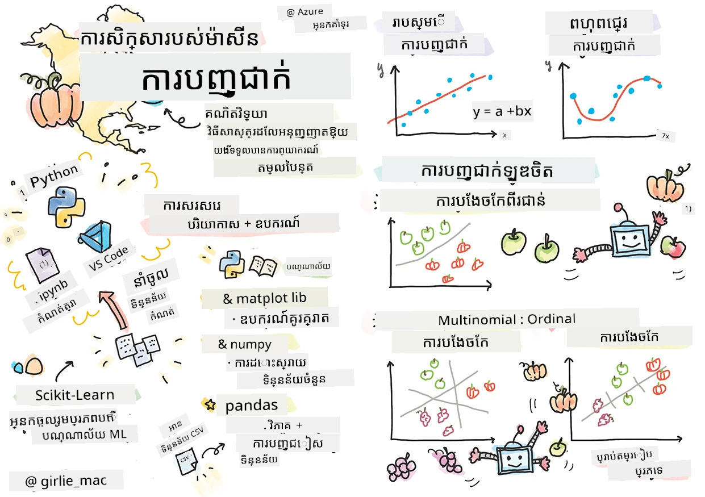
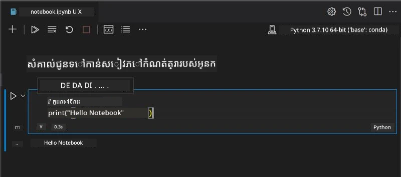
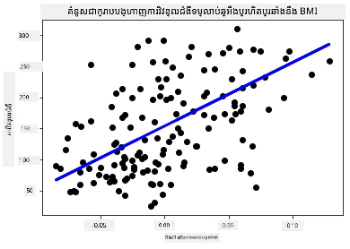

# ចាប់ផ្ដើមជាមួយ Python និង Scikit-learn សម្រាប់គំរូប្រូក្រេសស្យុង



> ស្គេតណូតដោយ [Tomomi Imura](https://www.twitter.com/girlie_mac)

## [សំណួរប្រលងមុនមេរៀន](https://ff-quizzes.netlify.app/en/ml/)

> ### [មេរៀននេះអាចប្រើបានក្នុង R!](../../../../2-Regression/1-Tools/solution/R/lesson_1.html)

## ការណែនាំ

នៅក្នុងមេរៀនបួននេះ អ្នកនឹងស្វែងរកវិធីសម្រាប់បង្កើតគំរូប្រូក្រេសស្យុង។ យើងនឹងពិភាក្សាថាវាជាកម្មវិធីសម្រាប់អ្វីក្នុងពេលឆាប់ៗនេះ។ ប៉ុន្តែក្រោយពេលអ្នកមិនបានធ្វើអ្វីនោះទេ សូមប្រាកដថាអ្នកមានឧបករណ៍ត្រឹមត្រូវដើម្បីចាប់ផ្ដើមដំណើរការនេះ!

នៅក្នុងមេរៀននេះ អ្នកនឹងរៀនពី៖

- ការកំណត់កុំព្យូទ័ររបស់អ្នកសម្រាប់បេសកកម្មម៉ាស៊ីនរៀនក្នុងផ្ទាំងក្នុង។
- ការធ្វើការ​ជាមួយសៀវភៅកំណត់សរសេរ Jupyter។
- ការប្រើប្រាស់ Scikit-learn រួមទាំងការដំឡើង។
- ស្វែងរកប្រូក្រេសស្យុងខ្សែបន្ទាត់ជាមួយហាត់ប្រាណអនុវត្តន៍ដោយដៃ។

## ការដំឡើង និង ការកំណត់រចនា

[](https://youtu.be/-DfeD2k2Kj0 "ម៉ាស៊ីនរៀនសម្រាប់អ្នកចាប់ផ្ដើម - រៀបចំឧបករណ៍របស់អ្នករួចរាល់សម្រាប់បង្កើតគំរូម៉ាស៊ីនរៀន")

> 🎥 ចុចរូបភាពខាងលើសម្រាប់វីដេអូខ្លីដែលបង្កើតការកំណត់កុំព្យូទ័ររបស់អ្នកសម្រាប់ ML។

1. **ដំឡើង Python**។ ប្រាកដថា [Python](https://www.python.org/downloads/) ត្រូវបានដំឡើងលើកុំព្យូទ័ររបស់អ្នក។ អ្នកនឹងប្រើ Python សម្រាប់កិច្ចការវិទ្យាសាស្ត្រទិន្នន័យ និងម៉ាស៊ីនរៀនច្រើន។ ប្រព័ន្ធកុំព្យូទ័រច្រើនរួមបញ្ចូលការដំឡើង Python រួចហើយ។ មាន [Python Coding Packs](https://code.visualstudio.com/learn/educators/installers?WT.mc_id=academic-77952-leestott) ដែលមានប្រយោជន៍សម្រាប់កែលម្អការតំឡើងសម្រាប់អ្នកប្រើប្រាស់មួយចំនួន។

   ករណីខ្លះនៃការប្រើប្រាស់ Python ត្រូវការតែមួយកំណែរបស់កម្មវិធី ខណៈពេលដែលមួយចំនួនផ្សេងទៀតត្រូវការកំណែផ្សេងទៀត។ ដូច្នេះ វាមានប្រយោជន៍ក្នុងការដំណើរការនៅក្នុង [បរិយាកាស virtual](https://docs.python.org/3/library/venv.html)។

2. **ដំឡើង Visual Studio Code**។ សូមប្រាកដថាអ្នកមាន Visual Studio Code បានដំឡើងលើកុំព្យូទ័ររបស់អ្នក។ តាមដានការណែនាំនេះដើម្បី [ដំឡើង Visual Studio Code](https://code.visualstudio.com/) សម្រាប់ការដំឡើងមូលដ្ឋាន។ អ្នកនឹងប្រើ Python ក្នុង Visual Studio Code ក្នុងមុខវិជ្ជានេះ ដូច្នេះ អ្នកអាចចង់រៀនបន្ថែមពីរបៀប [កំណត់ Visual Studio Code](https://docs.microsoft.com/learn/modules/python-install-vscode?WT.mc_id=academic-77952-leestott) សម្រាប់ការអភិវឌ្ឍ Python។

   > ទទួលបានភាពស្រាលចិត្តជាមួយ Python ដោយធ្វើតាមបណ្ដុំ [Learn modules](https://docs.microsoft.com/users/jenlooper-2911/collections/mp1pagggd5qrq7?WT.mc_id=academic-77952-leestott)
   >
   > [](https://youtu.be/yyQM70vi7V8 "រៀបចំ Python ជាមួយ Visual Studio Code")
   >
   > 🎥 ចុចរូបភាពខាងលើសម្រាប់វីដេអូ៖ ការប្រើ Python នៅក្នុង VS Code។

3. **ដំឡើង Scikit-learn** ដោយអនុវត្តតាម [ការណែនាំនេះ](https://scikit-learn.org/stable/install.html)។ ពីព្រោះអ្នកចាំបាច់ត្រូវប្រើ Python 3 អ្នកត្រូវបានផ្តល់អនុស្សាវរីយ៍ឲ្យប្រើបរិយាកាស virtual។ សូមចំណាំ ប្រសិនបើអ្នកកំពុងដំឡើងបណ្ណាល័យនេះលើម៉ាស៊ីន M1 Mac មានការណែនាំពិសេសនៅលើទំព័រដែលភ្ជាប់ខាងលើ។

1. **ដំឡើង Jupyter Notebook**។ អ្នកត្រូវការដំឡើង [កញ្ចប់ Jupyter](https://pypi.org/project/jupyter/)។

## បរិយាកាសការសរសេរ ML របស់អ្នក

អ្នកនឹងប្រើ **សៀវភៅកំណត់** ដើម្បីអភិវឌ្ឍកូដ Python របស់អ្នក និងបង្កើតគំរូម៉ាស៊ីនរៀន។ ប្រភេទឯកសារនេះគឺជាឧបករណ៍ធម្មតាសម្រាប់អ្នកវិទ្យាសាស្ត្រទិន្នន័យ ហើយវាត្រូវបានកំណត់ដោយបញ្ចំលើ ឬផ្នែកបន្ថែម `.ipynb` ។

សៀវភៅកំណត់គឺជាបរិយាកាសអន្តរកម្មដែលអនុញ្ញាតឲ្យអ្នកអភិវឌ្ឍទាំងការសរសេរកូដ និងបន្ថែមកំណត់ចំណាំនិងសរសេរឯកសារជារង្វង់ខាងកូដ ដែលអាចមានប្រយោជន៍ចំពោះគម្រោងអត្រា​ឬស្រាវជ្រាវ។

[](https://youtu.be/7E-jC8FLA2E "ម៉ាស៊ីនរៀនសម្រាប់អ្នកចាប់ផ្ដើម - រៀបចំ Jupyter Notebooks ដើម្បីចាប់ផ្ដើមបង្កើតគំរូប្រូក្រេសស្យុង")

> 🎥 ចុចរូបភាពខាងលើសម្រាប់វីដេអូខ្លីដែលបង្កើតហាត់ប្រាណនេះ។

### ហាត់ប្រាណ - ធ្វើការជាមួយសៀវភៅកំណត់មួយ

នៅក្នុងថតនេះ អ្នកនឹងរកឃើញឯកសារ _notebook.ipynb_។

1. បើក _notebook.ipynb_ នៅក្នុង Visual Studio Code។

   ម៉ាស៊ីនបម្រើ Jupyter នឹងចាប់ផ្តើមជាមួយ Python 3+ បានចាប់ផ្តើម។ អ្នកនឹងរកឃើញតំបន់ឯកសារដែលអាច `run` បាន ដែលជាផ្នែកកូដ។ អ្នកអាចរត់កូដនេះដោយជ្រើសរើសរូបតំណាងបង្ហាញដូចប៊ូតុងចាក់ផ្ដើម។

1. ជ្រើសរើសរូបតំណាង `md` ហើយបន្ថែម markdown តិចមួយ និងអត្ថបទខាងក្រោម **# Welcome to your notebook**។

   បន្ទាប់មក បន្ថែមកូដ Python មួយចំនួន។

1. វាយ **print('hello notebook')** នៅក្នុងខ្លែងកូដ។
1. ជ្រើសរើសអរម្មណ៍ដើម្បីរត់កូដ។

   អ្នកគួរតែឃើញប្រលោមបោះពុម្ព៖

    ```output
    hello notebook
    ```



អ្នកអាចបញ្ចូលកូដរបស់អ្នកជាមួយមតិយោបល់ ដើម្បីចុះផ្សាយឯកសារសៀវភៅកំណត់។

✅ គិតមួយភ្លែតពីបរិយាកាសការងាររបស់អ្នកអភិវឌ្ឍគេហទំព័រនិងអ្នកវិទ្យាសាស្ត្រទិន្នន័យមានភាពខុសគ្នា ឬដូចគ្នានៅខាងណា។

## ចាប់ផ្ដើម និង រត់ជាមួយ Scikit-learn

ឥឡូវនេះ Python ត្រូវបានកំណត់នៅក្នុងបរិយាកាសក្នុងផ្ទាល់របស់អ្នកហើយ អ្នកក៏ស្រួលជាមួយ Jupyter notebooks សូមយើងស្រួលបង្រៀនអ្នកពី Scikit-learn ដដែល (សូមអានប្រាក់សំដៅការនិយាយ `sci` ដូចជា `science`)។ Scikit-learn ផ្តល់នូវ [API ឆ្លាតវៃ](https://scikit-learn.org/stable/modules/classes.html#api-ref) ដើម្បីជួយអ្នកធ្វើកិច្ចការ ML។

យោងទៅតាម [បណ្តាញរបស់ពួកគេ](https://scikit-learn.org/stable/getting_started.html) "Scikit-learn គឺជាបណ្ណាល័យម៉ាស៊ីនរៀនប្រភពបើកដែលគាំទ្រការរៀនតាមមគ្គុទេសក៍ និងមិនមានមគ្គុទេសក៍។ វាក៏ផ្តល់ឧបករណ៍ជាច្រើនសម្រាប់ការចងក្រងគំរូ ការរៀបចំទិន្នន័យ ជ្រើសរើសគំរូ និងការវាយតម្លៃ និងបណ្ណាល័យជំនួយផ្សេងទៀត។"

នៅក្នុងមុខវិជ្ជានេះ អ្នកនឹងប្រើ Scikit-learn និងឧបករណ៍ផ្សេងទៀតដើម្បីបង្កើតគំរូម៉ាស៊ីនរៀន​ក្នុងការអនុវត្តកិច្ចការម៉ាស៊ីនរៀនបែបប្រពៃណី។ យើងបានជៀសវាងបណ្តាញសរសៃប្រសាទ និងការរៀនជ្រៅដោយសារវាទទួលបានជម្រៅនៅក្នុងមេរៀនដ៏ខាងមុខនៅកម្មវិធីសិក្សា 'AI សម្រាប់អ្នកចាប់ផ្ដើម'។

Scikit-learn ធ្វើឲ្យការបង្កើតគំរូ និងវាយតម្លៃសម្រាប់ការប្រើប្រាស់កាន់តែរងាយស្រួល។ វាត្រូវបានផ្តោតសំខាន់លើការប្រើប្រាស់ទិន្នន័យលេខ និងមានសំណុំទិន្នន័យរួចជាស្រេចជាច្រើនសម្រាប់ការរៀន។ វាក៏មានគំរូស្រេចសម្រាប់សិស្សសាកល្បងផងដែរ។ យើងស្វែងរកដំណើរការចម្លងទិន្នន័យរួចហើយនិងប្រើប្រាស់កំណត់តម្លៃដែលស្ថិតក្នុងវាលដំបូងរបស់ក្រុមហ៊ុន Scikit-learn ជាគំរូ ML ដំបូងសម្រាប់ទិន្នន័យមូលដ្ឋាន។

## ហាត់ប្រាណ - សៀវភៅកំណត់ Scikit-learn ដំបូងរបស់អ្នក

> មេរៀននេះមានប្រភពពី [ឧទាហរណ៍ប្រូក្រេសស្យុងខ្សែបន្ទាត់](https://scikit-learn.org/stable/auto_examples/linear_model/plot_ols.html#sphx-glr-auto-examples-linear-model-plot-ols-py) នៅលើគេហទំព័រ Scikit-learn។

[](https://youtu.be/2xkXL5EUpS0 "ម៉ាស៊ីនរៀនសម្រាប់អ្នកចាប់ផ្ដើម - គំរោងប្រូក្រេសស្យុងខ្សែបន្ទាត់ដំបូងរបស់អ្នកនៅក្នុង Python")

> 🎥 ចុចរូបភាពខាងលើសម្រាប់វីដេអូខ្លីដែលបង្កើតហាត់ប្រាណនេះ។

នៅក្នុងឯកសារ _notebook.ipynb_ ដែលភ្ជាប់ជាមួយមេរៀននេះ សូមសម្អាតគ្រប់កោសិកាដោយចុចរូបតំណាង 'ប្រអប់សម្អាត'។

នៅក្នុងផ្នែកនេះ អ្នកនឹងធ្វើការ​ជាមួយសំណុំទិន្នន័យតូចមួយអំពីជំងឺទឹកនោមផ្អាស់ ដែលបានបង្កើតចូលក្នុង Scikit-learn សម្រាប់គោលបំណងរៀន។ សូមចូរព្រមានថាអ្នកចង់សាកល្បងការព្យាបាលសម្រាប់អ្នកជំងឺទឹកនោមផ្អាស់។ គំរូម៉ាស៊ីនរៀនអាចជួយអ្នកកំណត់ថា តើអ្នកជំងឺណាម្នាក់អាចឆ្លើយតបកាន់តែល្អទៅនឹងការព្យាបាល ដែលមានមូលដ្ឋានលើការរួមបញ្ចូលអថេរជាច្រើន។ គំរូប្រូក្រេសស្យុងមូលដ្ឋានមួយ ទោះបីជាបរិយាកាសប្រើបានវិស្វកម្ម ក៏វានឹងបង្ហាញព័ត៌មានអំពីអថេរដែលអាចជួយអ្នករៀបចំការសាកល្បងគ្លីនិកទ្រឹស្តី។

✅ មានវិធីសាស្ត្រប្រូក្រេសស្យុងជាច្រើនប្រភេទ ហើយវាលែងឲ្យអ្នកជ្រើសរើសផ្អែកលើចម្លើយដែលអ្នកកំពុងស្វែងរក។ ប្រសិនបើអ្នកចង់ព្យាករណ៍កម្ពស់អាចមានសម្រាប់មនុស្សម្នាក់នៅវ័យណាមួយ អ្នកនឹងប្រើប្រូក្រេសស្យុងខ្សែបន្ទាត់ ដោយសារអ្នកកំពុងស្វែងរកតម្លៃ **លេខ**។ ប្រសិនបើអ្នកចង់រកឃើញថាប្រភេទម្ហូបមួយគួរត្រូវបានចាត់ទុកថាជារូបមន្តសត្វឬទេ អ្នកកំពុងស្វែងរក **ការចាត់ថ្នាក់** ដូច្នេះអ្នកនឹងប្រើប្រូក្រេសស្យុងលូស្តិច។ អ្នកនឹងរៀនបន្ថែមអំពីប្រូក្រេសស្យុងលូស្តិចនៅពេលក្រោយ។ សូមគិតបន្តិចអំពីសំណួរខ្លះៗដែលអ្នកអាចសួរចំពោះទិន្នន័យ ហើយវិធីសាស្ត្រណាមួយដែលសមសម្រាប់សំណួរទាំងនោះ។

ចាប់ផ្ដើមធ្វើការនៅលើបេសកកម្មនេះ។

### នាំចូលបណ្ណាល័យ

សម្រាប់បេសកកម្មនេះ យើងនឹងនាំចូលបណ្ណាល័យខ្លះៗ៖

- **matplotlib** ។ វាជា [ឧបករណ៍គូរប្លង់](https://matplotlib.org/) មានប្រយោជន៍ ហើយយើងនឹងប្រើវាដើម្បីបង្កើតប្លង់បន្ទាត់មួយ។
- **numpy** ។ [numpy](https://numpy.org/doc/stable/user/whatisnumpy.html) គឺជាបណ្ណាល័យមានប្រយោជន៍សម្រាប់ដំណើរការទិន្នន័យលេខក្នុង Python។
- **sklearn** ។ នេះគឺជាបណ្ណាល័យ [Scikit-learn](https://scikit-learn.org/stable/user_guide.html)។

នាំចូលបណ្ណាល័យខ្លះៗ ដើម្បីជួយសម្រាប់បេសកកម្មរបស់អ្នក។

1. បន្ថែមការនាំចូល ដោយវាយកូដដូចខាងក្រោម៖

   ```python
   import matplotlib.pyplot as plt
   import numpy as np
   from sklearn import datasets, linear_model, model_selection
   ```

   ខាងលើ អ្នកកំពុងនាំចូល `matplotlib`, `numpy` ហើយអ្នកកំពុងនាំចូល `datasets`, `linear_model` និង `model_selection` ពី `sklearn`។ `model_selection` ត្រូវបានប្រើសម្រាប់បំបែកទិន្នន័យជា សំណុំសាកល្បង និងសំណុំបណ្តុះបណ្តាល។

### សំណុំទិន្នន័យជំងឺទឹកនោមផ្អាស់

សំណុំទិន្នន័យ built-in [ជំងឺទឹកនោមផ្អាស់](https://scikit-learn.org/stable/datasets/toy_dataset.html#diabetes-dataset) មាននូវគំរូទិន្នន័យ 442 ដែលជុំវិញជំងឺទឹកនោមផ្អាស់ មានអថេរមុខងារ 10 ប្រភេទខ្លះៗរួមមាន៖

- អាយុកាល៖ អាយុជាឆ្នាំ
- bmi៖ ម៉ាស៊ីនម៉ាស្សារបស់ខ្លួន
- bp៖ សំពាធឈាមមធ្យម
- s1 tc៖ T-Cells (ប្រភេទស៊ែលសព្វពណ៌ស)

✅ សំណុំទិន្នន័យនេះមាន មុំនឹកនឹង "ភេទ" ជាអថេរមុខងារដែលមានសារៈសំខាន់សម្រាប់ការស្រាវជ្រាវជុំវិញជំងឺទឹកនោមផ្អាស់។ សំណុំទិន្នន័យវេជ្ជសាស្ត្រច្រើនមានការវាយតម្លៃកំណត់ប្រភេទពីរបែបនេះ។ សូមគិតបន្តិចអំពីតើការចាត់ថ្នាក់បែបនេះអាចដកចេញអ្នកជំនួសនៃមនុស្សជាតិពីការព្យាបាល។

ឥឡូវនេះ សូមបញ្ចូលទិន្នន័យ X និង y។

> 🎓 ចងចាំថា នេះគឺជាការរៀនដោយអនុក្រឹត្យ ហើយយើងត្រូវការទោកដាក់ឈ្មោះ 'y' ជាគោលដៅ។

នៅក្នុងកោសិកាកូដថ្មី សូមបញ្ចូលសំណុំទិន្នន័យជំងឺទឹកនោមផ្អាស់ ដោយហៅ `load_diabetes()`។ បារាជ័យ `return_X_y=True` សំដៅថា `X` នឹងជាតារាងទិន្នន័យ ហើយ `y` នឹងជាគោលដៅប្រូក្រេសស្យុង។

1. បន្ថែមពាក្យបោះពុម្ព ដើម្បីបង្ហាញទម្រង់ទិន្នន័យ និងធាតុដំបូង៖

    ```python
    X, y = datasets.load_diabetes(return_X_y=True)
    print(X.shape)
    print(X[0])
    ```

    អ្វីដែលអ្នកទទួលបានជាចម្លើយ គឺជា tuple។ អ្វីដែលអ្នកបានធ្វើគឺផ្ដល់តម្លៃពីរដំបូងនៅក្នុង tuple ទៅ `X` និង `y` តាមលំដាប់។ ហ្វឹកហាត់បន្ថែមអំពី [tuples](https://wikipedia.org/wiki/Tuple)។

    អ្នកអាចមើលឃើញទិន្នន័យនេះមានធាតុ 442 ដែលរៀបជារាង arrays 10 ធាតុ៖

    ```text
    (442, 10)
    [ 0.03807591  0.05068012  0.06169621  0.02187235 -0.0442235  -0.03482076
    -0.04340085 -0.00259226  0.01990842 -0.01764613]
    ```

    ✅ សូមគិតបន្តិចអំពីទំនាក់ទំនងរវាងទិន្នន័យ និងគោលដៅប្រូក្រេសស្យុង។ ប្រូក្រេសស្យុងខ្សែបន្ទាត់នាំមុខទស្សនៈទំនាក់ទំនងរវាងមុខងារ X និងអថេរកោល y។ តើអ្នកអាចរកឃើញ [គោលដៅ](https://scikit-learn.org/stable/datasets/toy_dataset.html#diabetes-dataset) សម្រាប់សំណុំទិន្នន័យជំងឺទឹកនោមផ្អាស់នៅក្នុងឯកសារណែនាំ? តើសំណុំទិន្នន័យនេះបង្ហាញអ្វី ជាមួយគោលដៅនោះ?

2. បន្ទាប់មក ជ្រើសរើសផ្នែកមួយនៃសំណុំទិន្នន័យនេះសម្រាប់គូរប្លង់ ដោយជ្រើសជួរឈរ 3 នៃសំណុំទិន្នន័យ។ អ្នកអាចធ្វើបានដោយប្រើ `:` ដើម្បីជ្រើសរាល់ជួរ ហើយបន្ទាប់មកជ្រើសជួរឈរ 3 ដោយប្រើ index (2)។ អ្នកអាចប្តូរទម្រង់ទិន្នន័យឱ្យថ្លៃជារាង 2D ដូចដែលត្រូវការសម្រាប់គូរប្លង់ ដោយប្រើ `reshape(n_rows, n_columns)`។ ប្រសិនបើ parameters មួយគឺ -1 ភាគតំណាងនោះនឹងត្រូវគណនា secara automatique។

   ```python
   X = X[:, 2]
   X = X.reshape((-1,1))
   ```

   ✅ នៅពេលណាមួយ សូមបោះពុម្ពទិន្នន័យ ដើម្បីពិនិត្យទម្រង់វា។

3. ឥឡូវនេះដែលអ្នកមានទិន្នន័យសម្រាប់គូរប្លង់ អ្នកអាចមើលថាតើម៉ាស៊ីនអាចជួយកំណត់ចំណែកល្អលើចំនួននៅក្នុងសំណុំទិន្នន័យនេះបានទេ។ ដើម្បីធ្វើបានចាំបាច់ត្រូវបំបែកទាំងទិន្នន័យ (X) និងគោលដៅ (y) ទៅជាសំណុំសាកល្បង និងសំណុំបណ្តុះបណ្តាល។ Scikit-learn មានវិធីងាយស្រួលសម្រាប់ធ្វើនោះ អ្នកអាចបំបែកទិន្នន័យសាកល្បងនៅចំណុចណាមួយ។

   ```python
   X_train, X_test, y_train, y_test = model_selection.train_test_split(X, y, test_size=0.33)
   ```

4. ឥឡូវនេះ អ្នកត្រៀមខ្លួនបណ្តុះគំរូរបស់អ្នក! បញ្ចូលម៉ូឌែលប្រូក្រេសស្យុងខ្សែបន្ទាត់ ហើយបណ្តុះវាជាមួយសំណុំបណ្តុះបណ្តាល X និង y ដោយប្រើ `model.fit()`:

    ```python
    model = linear_model.LinearRegression()
    model.fit(X_train, y_train)
    ```

    ✅ `model.fit()` គឺជា function ដែលអ្នកនឹងឃើញនៅក្នុងបណ្ណាល័យ ML ជាច្រើនដូចជា TensorFlow។

5. បន្ទាប់មក បង្កើតការព្យាករណ៍ដោយប្រើទិន្នន័យសាកល្បង ដោយប្រើ function `predict()`។ នេះនឹងត្រូវប្រើសម្រាប់គូរបន្ទាត់ចល័តនៅចន្លោះក្រុមទិន្នន័យ។

    ```python
    y_pred = model.predict(X_test)
    ```

6. ឥឡូវនេះពេលដើម្បីបង្ហាញទិន្នន័យជាប្លង់។ Matplotlib គឺជាឧបករណ៍មានប្រយោជន៍ខ្លាំងសម្រាប់បេសកកម្មនេះ។ បង្កើត scatterplot សម្រាប់ទិន្នន័យ X និង y សំណុំសាកល្បងទាំងអស់ ហើយប្រើការព្យាករណ៍ក្នុងការគូរបន្ទាត់ជាកន្លែងសមរម្យបំផុត រវាងក្រុមទិន្នន័យរបស់ម៉ូឌែល។

    ```python
    plt.scatter(X_test, y_test,  color='black')
    plt.plot(X_test, y_pred, color='blue', linewidth=3)
    plt.xlabel('Scaled BMIs')
    plt.ylabel('Disease Progression')
    plt.title('A Graph Plot Showing Diabetes Progression Against BMI')
    plt.show()
    ```

   
   ✅ សូមគិតកន្លែងអ្វីកំពុងកើតឡើងនៅទីនេះ។ ខ្សែ​ត្រង់មួយកំពុងរត់កាត់តាមចំណុចតូចៗជាច្រើននៃទិន្នន័យ ប៉ុន្តែវាកំពុងធ្វើអ្វីពិតប្រាកដមែនទេ? តើអ្នកអាចឃើញយ៉ាងដូចម្តេចថា តើអ្នកគួរតែប្រើខ្សែនេះដើម្បីទាយថាតើចំណុចទិន្នន័យថ្មីមួយដែលមិនធ្លាប់ឃើញអាចផ្គូផ្គងនៅឯណាទៅទាក់ទងនឹងអ័ក្ស y នៃផ្លូតបានយ៉ាងដូចម្តេច? សូមព្យាយាមដាក់ជាពាក្យអំពីការប្រើប្រាស់ជាក់ស្តែងនៃម៉ូដែលនេះ។

អបអរសាទរ អ្នកបានបង្កើតម៉ូដែលការស្ងាត់​ត្រង់លីនុយ (linear regression) ជាលើកដំបូងរបស់អ្នក សរសេរផ្នែកទាយទុកជាមួយវា ហើយបង្ហាញវានៅក្នុងផ្លូតមួយហើយ!

---
## 🚀បញ្ហា

បង្ហាញអថេរផ្សេងទៀតពីឃุ่มទិន្នន័យនេះ។ គំនិតបញ្ជាក់៖ កែសម្រួលបន្ទាត់នេះ `X = X[:,2]`។ ប្រសិនបើឃุ่มទិន្នន័យនេះមានគោលដៅ អ្នកអាចរកឃើញអ្វីខ្លះអំពីការរីកចំរូងនៃជំងឺទាំងនេះដូចជាជំងឺទឹកនោមផ្អែម?
## [ស៊ែវសំណួរ បន្ទាប់ពីមេរៀន](https://ff-quizzes.netlify.app/en/ml/)

## ការពិនិត្យឡើងវិញ និងសិក្សាផ្ទាល់ខ្លួន

នៅក្នុងមេរៀននេះ អ្នកបានចាប់ផ្តើមជាមួយការស្ងាត់​ត្រង់លីនុយ​ធម្មតា មិនមែនការស្ងាត់​ត្រង់លីនុយមួយអថេរ ឬច្រើនអថេរទេ។ សូមអានអំពីភាពខុសគ្នារវាងវិធីសាស្រ្តទាំងនេះ ឬមើលវីដេអូនេះ [វីដេអូ](https://www.coursera.org/lecture/quantifying-relationships-regression-models/linear-vs-nonlinear-categorical-variables-ai2Ef)។

អានបន្ថែមអំពីគំនិតស្ងាត់ត្រង់ ហើយសូមគិតពីប្រភេទសំណួរណាអាចត្រូវបានឆ្លើយតបដោយបច្ចេកទេសនេះ។ អ្នកអាចយកមេរៀននេះ [មេរៀន](https://docs.microsoft.com/learn/modules/train-evaluate-regression-models?WT.mc_id=academic-77952-leestott) ដើម្បីជ្រាបច្បាស់ជាងនេះ។

## ការតែងការងារ

[ឃุ่มទិន្នន័យផ្សេងទៀត](assignment.md)

---

<!-- CO-OP TRANSLATOR DISCLAIMER START -->
**ការបដិសេធ**៖
ឯកសារនេះត្រូវបានបកប្រែដោយប្រើសេវាកម្មបកប្រែ AI [Co-op Translator](https://github.com/Azure/co-op-translator)។ ខណៈពេលដែលយើងខិតខំសម្លឹងរកភាពត្រឹមត្រូវ សូមចំណាំថាការបកប្រែដោយស្វ័យប្រវត្តិក៏អាចមានកំហុសឬភាពមិនត្រឹមត្រូវបាន។ ឯកសារដើមជាភាសាដើមគួរត្រូវបាន​គិត​ថា​ជា​មូលដ្ឋានគោល។ សម្រាប់ព័ត៌មានសំខាន់ៗ ការបកប្រែដោយមនុស្សអ្នកជំនាញត្រូវបានផ្តល់អាណាព្យាបាល។ យើងមិនទទួលខុសត្រូវចំពោះការយល់ច្រឡំ ឬការបកស្រាយខុសៗណាមួយដែលកើតមានពីការប្រើប្រាស់ការបកប្រែនេះឡើយ។
<!-- CO-OP TRANSLATOR DISCLAIMER END -->