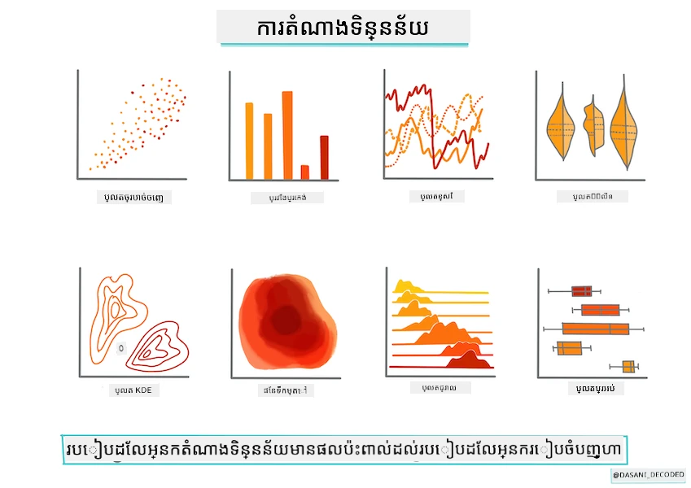
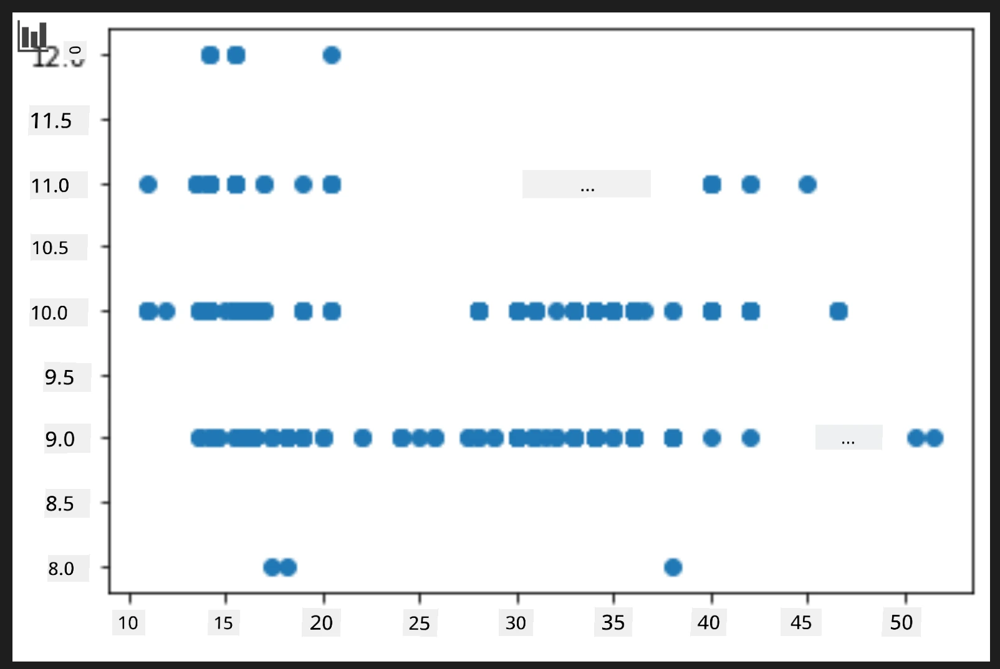

# បង្កើតម៉ូដែលរេហ្គ្រេសស្យុងដោយប្រើ Scikit-learn៖ រៀបចំ និងវិចិត្រស័ក្តិទិន្នន័យ



តារាងវិចិត្រស័ក្តិដោយ [Dasani Madipalli](https://twitter.com/dasani_decoded)

## [តេស្តមុនម៉េរៀន](https://ff-quizzes.netlify.app/en/ml/)

> ### [មេរៀននេះមានក្នុងភាសា R ផងដែរ!](../../../../2-Regression/2-Data/solution/R/lesson_2.html)

## ទីផ្សារណ៍

ឥឡូវនេះអ្នកបានរៀបចំឧបករណ៍ដែលត្រូវការសម្រាប់ការចាប់ផ្តើមបង្កើតម៉ូដែលម៉ាស៊ីនរៀនជាមួយ Scikit-learn ហើយ អ្នករួចរាល់ក្នុងការចាប់ផ្តើមសួរចម្លើយពីទិន្នន័យរបស់អ្នក។ ពេលអ្នកធ្វើការជាមួយទិន្នន័យ និងអនុវត្តន៍ដោះស្រាយ ML វាសំខាន់ណាស់ក្នុងការយល់ដឹងពីរបៀបសួរចម្លើយត្រឹមត្រូវ ដើម្បីអាចបើកសមត្ថភាពនៃទិន្នន័យរបស់អ្នកបានត្រឹមត្រូវ។

ក្នុងមេរៀននេះ អ្នកនឹងរៀនពី៖

- របៀបរៀបចំព័ត៌មានរបស់អ្នកសម្រាប់ការបង្កើតម៉ូដែល។
- របៀបប្រើ Matplotlib សម្រាប់វិចិត្រស័ក្តិនិន្នន័យ។

## សួរចម្លើយត្រឹមត្រូវពីទិន្នន័យរបស់អ្នក

ចម្លើយដែលអ្នកត្រូវការបាននឹងកំណត់ប្រភេទអាល់ហ្គូរីធម៍ ML ដែលអ្នកនឹងប្រើ។ ហើយគុណភាពនៃចម្លើយដែលបានត្រឡប់មកវិញ គឺពឹងផ្អែកយ៉ាងខ្លាំងលើធម្មជាតិនៃទិន្នន័យរបស់អ្នក។

ចូរមើល [ទិន្នន័យ](https://github.com/microsoft/ML-For-Beginners/blob/main/2-Regression/data/US-pumpkins.csv) ដែលបានផ្តល់សម្រាប់មេរៀននេះ។ អ្នកអាចបើកឯកសារ .csv នេះនៅក្នុង VS Code។ ការមើលលឿនភ្លាមៗបង្ហាញថាមានចន្លោះទទេ និងការលាយបញ្ចូលរវាងខ្សែអក្សរ និងទិន្នន័យចំនួន។ ក៏មានជួរឈរមួយហៅថា 'Package' ដែលទិន្នន័យក្នុងនោះលាយគ្នារវាង 'sacks', 'bins' និងតម្លៃផ្សេងទៀត។ ទិន្នន័យនេះ ពិតជា មិនស្អាតត្រឹមត្រូវទេ។

[](https://youtu.be/5qGjczWTrDQ "ML សម្រាប់អ្នកថ្មី - របៀបវិភាគ និងសម្អាតទិន្នន័យ")

> 🎥 ចុចរូបភាពខាងលើសម្រាប់វីដេអូខ្លីបង្ហាញពីការរៀបចំទិន្នន័យសម្រាប់មេរៀននេះ។

ពិតប្រាកដថា មិនប្រាកដល្អទេដែលទទួលបាន dataset ដែលរួចរាល់សម្រាប់ប្រើបង្កើតម៉ូដែល ML បានភ្លាមៗ។ ក្នុងមេរៀននេះ អ្នកនឹងរៀនរបៀបរៀបចំនូវ dataset ដើមដោយប្រើបណ្ណាល័យ Python ស្តង់ដា។ ក៏ដូចជារៀនបច្ចេកទេសខុសៗគ្នាសម្រាប់វិចិត្រស័ក្តិនៃទិន្នន័យផងដែរ។

## ករណីសិក្សា៖ 'ទីផ្សារមុខបឺ'

ក្នុងថតនេះ អ្នកនឹងរកឃើញឯកសារ .csv មួយនៅក្នុងថតឫស `data` ហៅថា [US-pumpkins.csv](https://github.com/microsoft/ML-For-Beginners/blob/main/2-Regression/data/US-pumpkins.csv) ដែលមានជួរដេក ១៧៥៧ នៃទិន្នន័យអំពីទីផ្សារវាយផ្លែគោល ដែលត្រូវបានចែកជាក្រុមតាមក្រុង។ ទិន្នន័យដើមនេះបញ្ចេញពី [Specialty Crops Terminal Markets Standard Reports](https://www.marketnews.usda.gov/mnp/fv-report-config-step1?type=termPrice) ដែលចែកចាយដោយក្រសួងកសិកម្មសហរដ្ឋអាមេរិក។

### រៀបចំទិន្នន័យ

ទិន្នន័យនេះមានលើសាធារណៈ។ អ្នកអាចទាញយកវាចេញជា ឯកសារច្រើនឯកសារផ្ទាល់ខ្លួនរៀងរាល់ក្រុង ពីគេហទំព័រ USDA។ ដើម្បីជៀសវាងឯកសារច្រើនពេក យើងបានបញ្ចូលទិន្នន័យក្រុងទាំងអស់ចូលក្នុងសៀវភៅ បច្ចុប្បន្ន យើងបាន _រៀបចំ_ ទិន្នន័យរួចមួយចំនួន។ បន្ទាប់មក មកមើលលម្អិតទិន្នន័យ។

### ទិន្នន័យវាយផ្លែគោល - សេចក្ដីសន្និដ្ឋានដំបូង

តើអ្នកមើលឃើញអ្វីពីទិន្នន័យនេះ? អ្នកបានឃើញថាមានការលាយបញ្ចូលរវាងខ្សែអក្សរ លេខ ចន្លោះទទេ និងតម្លៃចម្លែក ដែលអ្នកត្រូវយល់។

តើអ្នកអាចសួរចម្លើយអំពីទិន្នន័យនេះជាមួយបច្ចេកទេស Regression យ៉ាងដូចម្ដេច? តើអ្វីមួយដូចជា "ទស្សនាថ្លៃបាយផ្លែគោលលក់នៅខែណាមួយ"? មើលទិន្នន័យម្ដងទៀត មានកែប្រែខ្លះដែលត្រូវធ្វើដើម្បីបង្កើតរចនាសម្ព័ន្ធទិន្នន័យដែលត្រូវការសម្រាប់ភារកិច្ចនេះ។

## លំហាត់ - វិភាគទិន្នន័យវាយផ្លែគោល

ចាប់ផ្តើមប្រើ [Pandas](https://pandas.pydata.org/) (ឈ្មោះមានន័យថា `Python Data Analysis`) ដែលជាឧបករណ៍មានប្រយោជន៍សម្រាប់រៀបចំទិន្នន័យ ដើម្បីវិភាគ និងរៀបចំទិន្នន័យវាយផ្លែគោលនេះ។

### ជំហានទីមួយ - ត្រួតពិនិត្យថ្ងៃខែខ្វះ

អ្នកត្រូវខំធ្វើជំហានដើម្បីត្រួតពិនិត្យមើល ថ្ងៃខែខ្វះ៖

1. បំលែងថ្ងៃខែទៅទ្រង់ទ្រាយខែ (វាជាថ្ងៃខែឆ្នាំរបស់ ស.រ.អ., ដូច្នេះទ្រង់ទ្រាយគឺ `MM/DD/YYYY`)។
2. ដកខែចេញជាជួរឈរថ្មី។

បើកឯកសារ _notebook.ipynb_ ក្នុង Visual Studio Code ហើយនាំចូលសៀវភៅផ្ទាំងទៅក្នុង dataframe ថ្មីរបស់ Pandas។

1. ប្រើមុខងារ `head()` ដើម្បីមើលជួរដេកប្រាំដំបូង។

    ```python
    import pandas as pd
    pumpkins = pd.read_csv('../data/US-pumpkins.csv')
    pumpkins.head()
    ```
  
    ✅ តើមុខងារមួយដែលអ្នកនឹងប្រើសម្រាប់មើលជួរដេកចុងបំផុតប្រាំចុងក្រោយ?

1. ត្រួតពិនិត្យមើលថាតើមានទិន្នន័យខ្វះក្នុង dataframe បច្ចុប្បន្នទេ៖

    ```python
    pumpkins.isnull().sum()
    ```
  
    មានទិន្នន័យខ្វះ ប៉ុន្តែប្រហែលជាមិនមានផលប៉ះពាល់ចំពោះភារកិច្ចនេះទេ។

1. ដើម្បីឲ្យ dataframe របស់អ្នកងាយស្រួលក្នុងការងារ ជ្រើសយកតែជួរឈរដែលអ្នកត្រូវការ ជាមួយមុខងារ `loc` ដែលដកចេញពី dataframe ដើមជាក្រុមជួរដេក (ផ្ដល់ជាម៉ាស៊ីនជុំឡើង) និងជួរឈរ (ផ្ដល់ជាម៉ាស៊ីនទីពីរ)។ ប្រើ `:` ក្នុងករណីខាងក្រោមមានន័យថា "ទាំងអស់ជួរដេក"។

    ```python
    columns_to_select = ['Package', 'Low Price', 'High Price', 'Date']
    pumpkins = pumpkins.loc[:, columns_to_select]
    ```
  
### ជំហានទីពីរ - កំណត់ថ្លៃមធ្យមនៃបាយផ្លែគោល

គិតពីរបៀបកំណត់ថ្លៃមធ្យមនៃបាយផ្លែគោលក្នុងខែណាមួយ។ តើជួរឈរណាដែលអ្នកនឹងជ្រើសសម្រាប់ភារកិច្ចនេះ? គំនិត៖ អ្នកត្រូវការជួរឈរបី។

ដំណោះស្រាយ៖ គណនាមធ្យមនៃជួរឈរ `Low Price` និង `High Price` ដើម្បីបង្កើតជួរឈរថ្លៃថ្មី ហើយបំលែងជួរឈរ Date ឲ្យបង្ហាញតែខែប៉ុណ្ណោះ។សំណាងល្អ គិតតាមការត្រួតពិនិត្យខាងលើ គ្មានទិន្នន័យខ្វះសម្រាប់ថ្ងៃខែឬថ្លៃទេ។

1. ដើម្បីគណនាមធ្យម បន្ថែមកូដដូចខាងក្រោម៖

    ```python
    price = (pumpkins['Low Price'] + pumpkins['High Price']) / 2

    month = pd.DatetimeIndex(pumpkins['Date']).month

    ```
  
   ✅ អ្នកអាចបោះពុម្ព `print(month)` ដើម្បីត្រួតពិនិត្យទិន្នន័យណាមួយបាន។

2. ឥឡូវនេះ ចម្លងទិន្នន័យដែលបានបំលែងទៅក្នុង dataframe ថ្មីរបស់ Pandas៖

    ```python
    new_pumpkins = pd.DataFrame({'Month': month, 'Package': pumpkins['Package'], 'Low Price': pumpkins['Low Price'],'High Price': pumpkins['High Price'], 'Price': price})
    ```
  
    ការបោះពុម្ព dataframe នឹងបង្ហាញ dataset ស្អាតនិងមានរបៀប ដែលអ្នកអាចប្រើបង្កើតម៉ូដែល regression ថ្មីរបស់អ្នក។

### តែរង់ចាំ! មានអ្វីមួយចម្លែកនៅទីនេះ

បើអ្នកមើលជួរឈរ `Package` សូមមើលថា វាយផ្លែគោលត្រូវបានលក់ក្នុងការរៀបចំផ្សេងៗគ្នាច្រើន។ មានករណីលក់ជា '1 1/9 bushel', '1/2 bushel', លក់ជា ខ្នាយ ផ្ទាល់, លក់ជា ផោន និងលក់ក្នុងប្រអប់ធំៗដែលមានទទឹងខុសៗគ្នា។

> បាយផ្លែគោលហាក់ដូចជាពិបាកវាស់ទំងន់ដោយសរុបផ្នែកមួយទេ។

ស្វែងរកជាងទិន្នន័យដើម គួរឱ្យចាប់អារម្មណ៍ថា ទាំងអស់មាន `Unit of Sale` ស្មើជា 'EACH' ឬ 'PER BIN' ត្រូវបានប្រើ `Package` ប្រភេទ តាមអាំងឆ្វេង មិនដូចគ្នា ឬ 'each'។ បាយផ្លែគោលហាក់ដូចជាពិបាកវាស់ទំងន់ច្បាស់លាស់ ដូចនេះយើងត្រូវតែចម្រោះសម្រាប់បាយផ្លែគោលដែលមានខ្សែអក្សរ 'bushel' ក្នុងជួរឈរ `Package` របស់ពួកវា។

1. បន្ថែមហ្វីលទ័រមួយនៅផ្នែកលើឯកសារ ខាងក្រោមការនាំចូល .csv ដើម៖

    ```python
    pumpkins = pumpkins[pumpkins['Package'].str.contains('bushel', case=True, regex=True)]
    ```
  
    បើអ្នកបោះពុម្ពទិន្នន័យឥឡូវនេះ អ្នកនឹងឃើញថា តែជួរដេក​ប្រហែល ៤១៥ ដែលមានបាយផ្លែគោលតាម bushel ត្រូវបានយកតែប៉ុណ្ណោះ។

### តែរង់ចាំ! មានទៀតអ្វីមួយត្រូវធ្វើបន្ថែម

តើអ្នកមើលឃើញថា បរិមាណ bushel ផ្លាស់ប្ដូរតាមជួរដេកមែនទេ? អ្នកត្រូវធ្វើការទម្រង់តម្លៃតាម bushel សម្រាប់បង្ហាញតម្លៃតាម bushel ដូច្នេះត្រូវធ្វើគណិតវិទ្យាដើម្បីធ្វើឲ្យវាមានភាពស្តង់ដារ។

1. បន្ថែមជួរដេកខាងក្រោមប្លុកបង្កើត dataframe new_pumpkins៖

    ```python
    new_pumpkins.loc[new_pumpkins['Package'].str.contains('1 1/9'), 'Price'] = price/(1 + 1/9)

    new_pumpkins.loc[new_pumpkins['Package'].str.contains('1/2'), 'Price'] = price/(1/2)
    ```
  
✅ ដោយយោងទៅតាម [The Spruce Eats](https://www.thespruceeats.com/how-much-is-a-bushel-1389308), ទំងន់នៃ bushel អាស្រ័យលើប្រភេទផលិតផល ដូចជា វាជាបរិមាណមួយ។ "Bushel ត្រសក់ គឺត្រូវមានទំងន់ ៥៦ ផោន... ដល់ស្លឹកបៃតង មានទំហំធំជាង និងទំងន់តិចជាង bushel ត្រសក់ spinach គឺមានតែ ២០ ផោន"។ វាមិនងាយស្រួលទេ! យើងមិនបានបំលែង bushel ទៅផោនឡើយ តែប្រើតម្លៃតាម bushel។ ការសិក្សានេះពោរពេញដោយសារៈសំខាន់ក្នុងការយល់ដឹងធម្មជាតិនៃទិន្នន័យរបស់អ្នក!

ឥឡូវនេះ អ្នកអាចវិភាគតម្លៃរាប់តាមឯកតាជាផ្អែកលើការវាស់ bushel របស់ពួកវា។ ប្រសិនបើអ្នកបោះពុម្ពទិន្នន័យនេះម្តងទៀត អ្នកនឹងឃើញភាពស្តង់ដារ។

✅ តើអ្នកមើលឃើញទេថា ផ្លែគោលដែលលក់ដោយ bushel ផ្នែកកន្លះមានតម្លៃថ្លៃជាង? តើអ្នកអាចសន្និដ្ឋានពីមូលហេតុបានទេ? គំនិត៖ បាយផ្លែគោលតូចៗ មានតំលៃថ្លៃជាងបាយធំៗ ព្រោះមានច្រើនជាងនៅក្នុង bushel មួយ ដោយផ្អែកលើកន្លែងទំនេរដែលមានរវាងវាយដ៏ធំនិងផ្លែគោល។

## វិធីសាស្រ្តវិចិត្រស័ក្តិ

ផ្នែកមួយនៃភារកិច្ចរបស់វិទ្យាសាស្ដ្រ ទិន្នន័យគឺការបង្ហាញពីគុណភាព និងធម្មជាតិនៃទិន្នន័យដែលពួកគេទទួលបាន។ ដើម្បីធ្វើបែបនេះ មិនហ៊ានតែបង្កើតវិចិត្រស័ក្តិស្អាតៗជានិច្ច ឬ អត្រា គន្លង និងក្រាផបាន សម្រាប់បង្ហាញប្រភេទផ្សេងៗនៃទិន្នន័យ។ តាមរយៈនេះ ពួកគេអាចបង្ហាញទំនាក់ទំនង និងកន្លែងខ្វះខាតដែលពិបាកសំរេចដោយការមើលតាមផ្ទាល់។

[](https://youtu.be/SbUkxH6IJo0 "ML សម្រាប់អ្នកថ្មី - របៀបវិចិត្រស័ក្តិនិន្នន័យជាមួយ Matplotlib")

> 🎥 ចុចរូបភាពខាងលើសម្រាប់វីដេអូខ្លីបង្ហាញពីការវិចិត្រស័ក្តិនិន្នន័យសម្រាប់មេរៀននេះ។

វិចិត្រស័ក្តិអាចជួយកំណត់បច្ចេកទេសម៉ាស៊ីនរៀនដែលសមស្របបំផុតសម្រាប់ទិន្នន័យបាន។ គំនូស scatterplot ដែលហាក់ដូចតាមបន្ទាត់ បានបង្ហាញថាទិន្នន័យល្អសម្រាប់ការប្រើ regression របៀបលីនេអ៊ែរ។

បណ្ណាល័យវិចិត្រស័ក្តិទិន្នន័យមួយដែលដំណើរការល្អក្នុង Jupyter notebooks គឺ [Matplotlib](https://matplotlib.org/) (ដែលអ្នកបានឃើញមុននេះក្នុងមេរៀនមុន)។

> ទទួលបានបទពិសោធន៍បន្ថែមជាមួយវិចិត្រស័ក្តិនិន្នន័យក្នុង [មេរៀនទាំងនេះ](https://docs.microsoft.com/learn/modules/explore-analyze-data-with-python?WT.mc_id=academic-77952-leestott)។

## លំហាត់ - សាកល្បងជាមួយ Matplotlib

សាកល្បងបង្កើតគំនូសបន្ទាត់មូលដ្ឋានដើម្បីបង្ហាញ dataframe ថ្មីដែលអ្នកបានបង្កើត។ តើគំនូសបន្ទាត់មូលដ្ឋាននឹងបង្ហាញអ្វី?

1. នាំចូល Matplotlib នៅផ្នែកលើឯកសារ ក្រោមការនាំចូល Pandas៖

    ```python
    import matplotlib.pyplot as plt
    ```
  
1. ដំណើរការសៀវភៅគ្រាន់ចប់ម្តងទៀតសម្រាប់បន្ទាន់សម័យ។
1. នៅខាងក្រោមនៃសៀវភៅបន្ថែមកោសិកាដើម្បីគូសទិន្នន័យជាប្រអប់៖

    ```python
    price = new_pumpkins.Price
    month = new_pumpkins.Month
    plt.scatter(price, month)
    plt.show()
    ```
  
    

    តើនេះជាគំនូសមានប្រយោជន៍ទេ? តើមានអ្វីណាមួយដែលធ្វើឲ្យអ្នកភ្ញាក់ផ្អើលទេ?

    វាមិនមានប្រយោជន៍ពិសេសណាស់ទេ ពីព្រោះវា​គ្រាន់តែបង្ហាញទិន្នន័យរបស់អ្នកជាចំនុចច散នៅក្នុងខែណាមួយ។

### ធ្វើឲ្យវាមានប្រយោជន៍

ដើម្បីទទួលបានតារាងបង្ហាញទិន្នន័យដែលមានប្រយោជន៍ អ្នកត្រូវតែផ្ដុំទិន្នន័យមួយរបៀបណាមួយ។ យើងសាកល្បងបង្កើតគំនូសដែលភាគល្អិត y បង្ហាញខែ និងទិន្នន័យបង្ហាញការបែងចែកទិន្នន័យ។

1. បន្ថែមកោសិកាមួយសម្រាប់បង្កើតតារាងជាតារាងប៊ា៖

    ```python
    new_pumpkins.groupby(['Month'])['Price'].mean().plot(kind='bar')
    plt.ylabel("Pumpkin Price")
    ```
  
    

    នេះជាវិចិត្រស័ក្តិទិន្នន័យមានប្រយោជន៍ជាងមុនទេ! វាហាក់ដូចបង្ហាញថាតម្លៃខ្ពស់បំផុតសម្រាប់បាយផ្លែគោលមាននៅខែកញ្ញា និងតុលា។ តើវาตรงតាមការរំពឹងទុករបស់អ្នកទេ? ហេតុអ្វី?

---

## 🚀 ការប្រកួតប្រជែង

ស្វែងយល់អំពីប្រភេទវិចិត្រស័ក្តិផ្សេងៗដែល Matplotlib ផ្តល់ជូន។ ប្រភេទណាដែលសមរម្យបំផុតសម្រាប់បញ្ហារេហ្គ្រេសស្យុង?

## [តេស្តបន្ទាប់ម៉េរៀន](https://ff-quizzes.netlify.app/en/ml/)

## សង្ខេប និងការសិក្សាឯកឯង

សូមមើលវិធីជាច្រើនក្នុងការវិចិត្រស័ក្តិនិន្នន័យ។ បង្កើតបញ្ជីបណ្ណាល័យផ្សេងៗ និងសម្គាល់ថាបណ្ណាល័យណាដែលល្អបំផុតសម្រាប់ភារកិច្ចបច្ចេកទេសផ្សេងៗ ដូចជាវិចិត្រស័ក្តិ 2D និង 3D។ តើអ្នកបានរកឃើញអ្វីខ្លះ?

## កាតព្វកិច្ច

[ការស្វែងរកវិចិត្រស័ក្តិ](assignment.md)

---

<!-- CO-OP TRANSLATOR DISCLAIMER START -->
**ការបដិសេធ**៖  
ឯកសារនេះត្រូវបានបកប្រែដោយប្រើសេវាកម្មបកប្រែ AI [Co-op Translator](https://github.com/Azure/co-op-translator)។ ខណៈពេលយើងខិតខំរកសុពលភាព យើងសូមអោយស្គាល់ថាការបកប្រែដោយស្វ័យប្រវត្តិកុំព្យូទ័រអាចមានកំហុសឬការខកខានខ្លះ។ ឯកសារដើមជាភាសាដើមគួរត្រូវបានចាត់ទុកជាមធ្យោបាយដែលមានសិទ្ធិពេញលេញ។ សម្រាប់ព័ត៌មានដែលសំខាន់ ការបកប្រែដោយអ្នកជំនាញវិជ្ជាជីវៈត្រូវបានផ្តល់អនុសាសន៍។ យើងមិនទទួលខុសត្រូវចំពោះការយល់ច្រឡំឬការបកប្រែមិនត្រឹមត្រូវណាមួយដែលកើតឡើងពីការប្រើប្រាស់ការបកប្រែនេះឡើយ។
<!-- CO-OP TRANSLATOR DISCLAIMER END -->