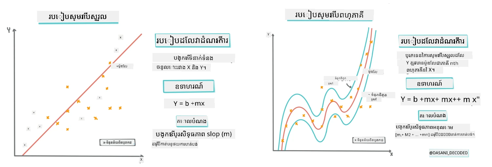
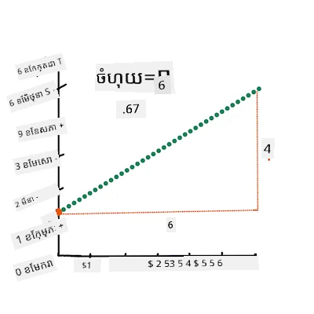
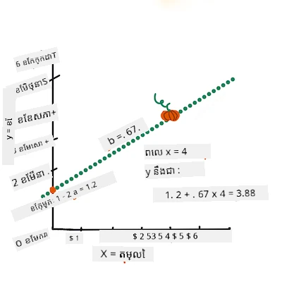
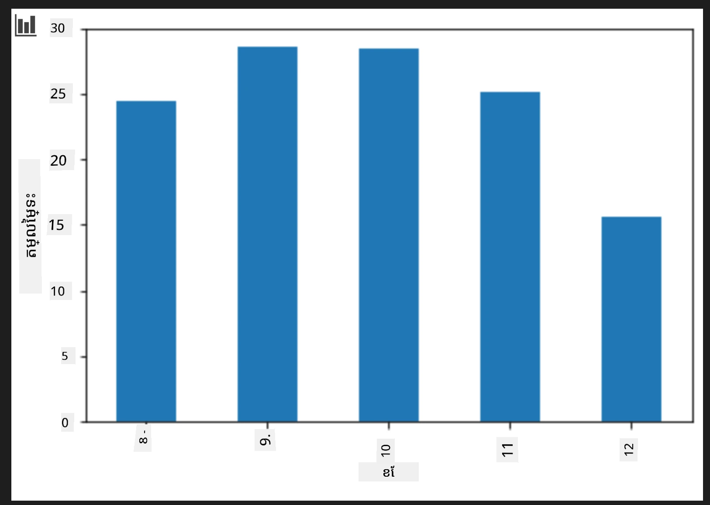
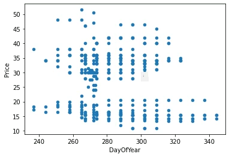
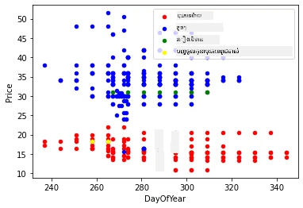
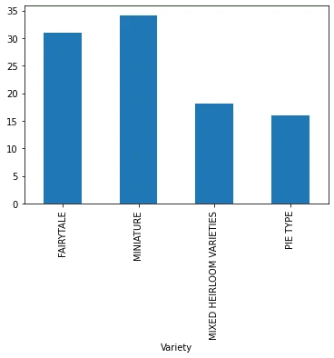
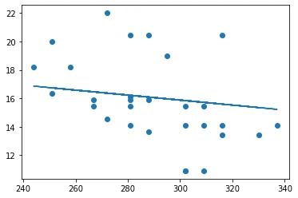
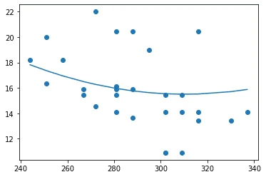

# សាងសង់ម៉ូដែលរេសគ្រីស្យុងដោយប្រើ Scikit-learn: រេសគ្រីស្យុង ជា​ចំនួនបួន​វិធី

## អសាមញ្ញករ Note

រេសគ្រីស្យុងបន្ទាត់ត្រូវបានប្រើនៅពេលដែលយើងចង់ទាយទិន្នន័យ **តម្លៃលេខ** (ឧទាហរណ៍ តម្លៃផ្ទះ សីតុណ្ហភាព ឬការលក់)។ វាដំណើរការដោយស្វែងរកបន្ទាត់ស្របមួយ ដែលតំណាងល្អបំផុតសម្រាប់ទំនាក់ទំនងរវាងមុខងារបញ្ចូល និងចេញ។

ក្នុងមេរៀននេះ យើងផ្តោតសំខាន់លើការយល់ដឹងពីគំនិតមុនពេលស្វែងយល់បន្ថែមពីបច្ចេកទេសរេសគ្រីស្យុងខ្ពស់ជាងនេះ។

> គំនូរទាក់ទងដោយ [Dasani Madipalli](https://twitter.com/dasani_decoded)
## [គន្លងប្រលងមុនមេរៀន](https://ff-quizzes.netlify.app/en/ml/)

> ### [មេរៀននេះមាននៅក្នុងភាសា R ផង!](../../../../2-Regression/3-Linear/solution/R/lesson_3.html)
### ការណែនាំ 

រហូតមកដល់បច្ចុប្បន្ន អ្នកបានស្វែងយល់ពីអ្វីដែលរេសគ្រីស្យុងជាមួយទិន្នន័យគំរូដែលបានប្រមូលពីឃ្លាំងតម្លៃគ្រប់របស់ផ្កាយប័ន្តដែលយើងនឹងប្រើពេញមួយមេរៀននេះ។ អ្នកក៏បានបង្ហាញវាជាមួយ Matplotlib។

ឥឡូវនេះ អ្នកបានត្រៀមខ្លួនដើម្បីរំដោះចូលលើរេសគ្រីស្យុងសម្រាប់ ML។ ដំណើរការបង្ហាញភាពនេះអនុញ្ញាតឱ្យអ្នកចេះយល់ពីទិន្នន័យ ប៉ុន្តែអំណាចពិតនៃប្រព័ន្ធរៀនម៉ាស៊ីនមកពី _ការបណ្តុះម៉ូដែល_។ ម៉ូដែលត្រូវបានបណ្តុះលើទិន្នន័យប្រវត្តិសាស្ត្រដើម្បីទទួលយកទំនាក់ទំនងទិន្នន័យដោយស្វ័យប្រវត្តិ ហើយវាអនុញ្ញាតឱ្យអ្នកទាយបានលទ្ធផលសម្រាប់ទិន្នន័យថ្មីដែលម៉ូដែលមិនបានឃើញពីមុន។

នៅក្នុងមេរៀននេះ អ្នកនឹងរៀនបន្ថែមអំពីប្រភេទរេសគ្រីស្យុងពីរប្រភេទ: _រេសគ្រីស្យុងបន្ទាត់មូលដ្ឋាន_ និង _រេសគ្រីស្យុងព៉ូលីណូមៀល_ ជាមួយនឹងគណិតវិទ្យាខ្លះៗដែលនៅក្រោមបច្ចេកទេសទាំងនេះ។ ម៉ូដែលទាំងនោះនឹងអនុញ្ញាតឲ្យយើងទាយតម្លៃផ្កាយប័ន្តអាស្រ័យលើទិន្នន័យបញ្ចូលខុសៗគ្នា។

[](https://youtu.be/CRxFT8oTDMg "ML for beginners - Understanding Linear Regression")

> 🎥 ចុចលើរូបភាពខាងលើសម្រាប់វីដេអូសង្ខេបអំពីរេសគ្រីស្យុងបន្ទាត់។

> ក្នុងអំឡុងពេលសិក្សាជំនាញនេះ យើងគិតថា ពុំទាមទារជំនាញគណិតវិទ្យាច្រើននោះទេ ហើយផ្តោតធ្វើឲ្យវាអាចចូលដល់បានសម្រាប់និស្សិតដែលមកពីដែនផ្សេងៗ ដូច្នេះសូមកត់សម្គាល់កំណត់ចំណាំ 🧮 ការហៅចេញ សៀវភៅរៀន និងឧបករណ៍សិក្សាផ្សេងៗ ដើម្បីជួយបង្រៀនយល់បានល្អ។

### គួរដឹងជាមុន

អ្នកគួរតែស្គាល់រចនាសម្ព័ន្ធទិន្នន័យផ្កាយដែលយើងកំពុងពិនិត្យឥឡូវនេះ។ អ្នកអាចស្រាវជ្រាវវា ដែលបានរៀបចំរួចទៅហើយក្នុងឯកសារ _notebook.ipynb_ នៃមេរៀននេះ។ នៅក្នុងឯកសារ តម្លៃផ្កាយបង្ហាញចេញជាតម្លៃមួយទៅក្នុងឈុតទិន្នន័យថ្មី។ សូមប្រាកដថាអ្នកអាចរត់ឯកសារនេះនៅក្នុងកណ្តុរប្រតិបត្តិការ Visual Studio Code។

### ការប្រៀបប្រដៅ

ជាថ្មីវិញ អ្នកកំពុងផ្ទុកទិន្នន័យនេះដើម្បីសួរចម្ងល់ពីវា។

- ពេលណាជាពេលល្អបំផុតក្នុងការជាវផ្កាយ? 
- តម្លៃដែលខ្ញុំអាចរំពឹងទុកសម្រាប់ប្រអប់ផ្កាយតូចតាចនេះ? 
- តើខ្ញុំគួរជាវវាទុកក្នុងធុងបាក់សែលកន្លះឬក្នុងប្រអប់ 1 1/9 បាសែលទេ?
តោះបន្តស្គាល់ទិន្នន័យនេះ។

ក្នុងមេរៀនមុន អ្នកបានបង្កើត DataFrame Pandas ហើយបំពេញវា ជាមួយផ្នែកមួយនៃទិន្នន័យដើម ដោយស្ដង់ដារតម្លៃតាមបាសែល។ ប៉ុន្តែតែតិច អ្នកបានប្រមូលបានប្រហែល ៤០០ចំនួនទិន្នន័យ ហើយសម្រាប់ខែរដូវស្លឹកឈើជ្រុះតែប៉ុណ្ណោះ។

សូមមើលទិន្នន័យដែលបានបញ្ចូលរួចនៅក្នុងទំព័រនេះក្នុងឯកសារ notebook នៃមេរៀន។ ទិន្នន័យបានបញ្ចូលរួច និងបង្ហាញរាងចំណុចព្រាត់ដើម្បីបង្ហាញខែ ទំនងជាយើងអាចរកបានព័ត៌មានលម្អិតបន្ថែមអំពីធម្មជាតិទិន្នន័យ ដោយសម្រួលវាបន្ថែមទៀត។

## បន្ទាត់រេសគ្រីស្យុងបន្ទាត់មួយ

ដូចដែលអ្នកបានរៀនក្នុងមេរៀន ១ គោលគំនិតនៃលំហាត់រេសគ្រីស្យុងបន្ទាត់គឺដើម្បីអាចគូរបន្ទាត់មួយសម្រាប់៖

- **បង្ហាញទំនាក់ទំនងអថេរ**។ បង្ហាញទំនាក់ទំនងរវាងអថេរ
- **ធ្វើការទាយតម្លៃ**។ ទាយតម្លៃបានត្រឹមត្រូវថាចំណុចថ្មីនឹងស្ថិតនៅឯសន្លឹកណា។

វាជារឿងទូទៅនៃ **Least-Squares Regression** ដើម្បីគូរបែបនេះ។ ពាក្យ "Least-Squares" មានន័យថាផលបិទកំហុសរួមមិនធំ។ សម្រាប់ចំណុចទិន្នន័យមួយៗ យើងវាស់រយៈកន្លះកោងចុះ (ហៅថា residual) រវាងចំណុចពិត និងបន្ទាត់រេសគ្រីស្យុង។

យើងធ្វើការការ៉េរយៈចន្លោះទាំងនេះដោយមានមូលហេតុសំខាន់ពីរគឺ:

1. **ទំហំលើទិសដៅ:** យើងចង់ពិនិត្យកំហុស -5 ដូចគ្នានឹងកំហុស +5។ ការ� square បំរេ所有តម្លៃជាផ្កាយវិជ្ជមានទាំងអស់។

2. **ពិនិត្យចំពោះចំណុចក្រៅ:** ការ square ផ្តល់តុល្យភាពលើកំហុសធំៗ បង្ខំឲ្យបន្ទាត់នៅជិតចំណុចដែលឆ្ងាយ។

យើងបន្ថែមតម្លៃការ square ទាំងនេះគ្នាទៅវិញ។ គោលបំណងគឺរកបន្ទាត់ដែលសរុបនេះតិចបំផុត (តម្លៃតិចបំផុត) ហេតុនេះហៅពីរការនេះថា "Least-Squares"។

> **🧮 បង្ហាញគណិតវិទ្យា** 
> 
> បន្ទាត់នេះ ដែលហៅថា _បន្ទាត់សម្រង់ល្អបំផុត_ អាចបង្ហាញដោយ [សមីការ](https://en.wikipedia.org/wiki/Simple_linear_regression):
> 
> ```
> Y = a + bX
> ```
>
> `X` គឺជា 'អថេរពន្យល់'។ `Y` គឺជា 'អថេរនិយម'។ ជំហាននៃបន្ទាត់គឺ `b` ហើយ `a` គឺជាចំណុចកាត់បន្ទាត់ y ដែលធ្វើអោយ `Y` រក្សាតម្លៃនៅពេល `X = 0`។ 
>
>
>
> ជំហាន `b` គណនា ជាមួយគំនូរ [Jen Looper](https://twitter.com/jenlooper)
>
> នៅក្នុងពាក្យផ្សេង ហើយយោងទៅតាមសំណួរដើមរបស់ទិន្នន័យផ្កាយ "ទាយតម្លៃផ្កាយតាមបាសែលដោយខែ" ការបញ្ចូល `X` នឹងយោងទៅតម្លៃ និង `Y` នឹងយោងទៅខែ។

>
>
> គណនាតម្លៃ Y។ ប្រសិនបើអ្នកបង់ប្រហែល $៤ វាចាំបាច់ត្រូវ April! គំនូរដោយ [Jen Looper](https://twitter.com/jenlooper)
>
> គណិតវិទ្យាដែលគណនាបន្ទាត់គួរតែបង្ហាញពីជំហាន `b` មានផ្ទៃមួយនៃការចាប់ផ្តើមតែម្តង នៅពេល `X = 0`។
>
> អ្នកអាចមើលវិធីសាស្រ្តគណនាបញ្ជាក់លម្អិតបាននៅលើវេបសាយ [Math is Fun](https://www.mathsisfun.com/data/least-squares-regression.html)។ សូមចូលទៅកាន់ [កាលគណនា Least-squares នេះ](https://www.mathsisfun.com/data/least-squares-calculator.html) ដើម្បីមើលពីរបៀបលេខប៉ះពាល់បន្ទាត់។

## សមាភាព/Correlation

ពាក្យមួយទៀតដែលត្រូវយល់គឺ **អាំងឃូផេរ៉េលេសិនកូអ៊ីហ្វ៊ីស្យង** រវាងអថេរ X និង Y ។ ប្រើ scatterplot អ្នកអាចមើលឃើញកូអ៊ីហ្វីស្យងនេះបានយ៉ាងរហ័ស។ ប្លង់ជាមួយចំណុចចំរៀងក្នុងបន្ទាត់ស្អាតនោះមានសមាភាពខ្ពស់ ប៉ុន្តែប្លង់ជាមួយចំណុចចំរាយនៅគ្រប់ទីកន្លែងរវាង X និង Y មានសមាភាពទាប។

ម៉ូដែលរេសគ្រីស្យុងបន្ទាត់ល្អនឹងជាៈ ម៉ូដែលដែលមានកូអ៊ីហ្វីស្យង់សមាភាពខ្ពស់ (ជិត ១ ជាង ០) ប្រើវិធី Least-Squares Regression ជាមួយបន្ទាត់រេសគ្រីស្យុង។

✅ រត់ notebook ដែលផ្ដល់ជាមួយមេរៀននេះ និងមើល scatterplot រវាង Month និង Price ។ តើទិន្នន័យដែលភ្ជាប់រវាង Month និង Price សម្រាប់ការលក់ផ្កាយមានសមាភាពខ្ពស់ ឬទាប ដោយយោងទៅតាមការបកស្រាយរបស់អ្នកពី scatterplot? តើវាប្រែប្រួលដែរឬទេ ប្រសិនបើអ្នកប្រើមាត្រដ្ឋានលម្អិតជាងនេះជំនួស `Month` ឧ. *day of the year* (ចំនួនថ្ងៃចាប់ពីដើមឆ្នាំ)?

នៅលើកូដខាងក្រោម យើងនឹងកត់សម្គាល់ថា យើងបានសម្អាតទិន្នន័យរួចហើយ ហើយទទួលបាន DataFrame ដែលហៅថា `new_pumpkins` ដូចក្នុងតារាងដូចខាងក្រោម៖

ID | Month | DayOfYear | Variety | City | Package | Low Price | High Price | Price
---|-------|-----------|---------|------|---------|-----------|------------|-------
70 | 9 | 267 | PIE TYPE | BALTIMORE | 1 1/9 bushel cartons | 15.0 | 15.0 | 13.636364
71 | 9 | 267 | PIE TYPE | BALTIMORE | 1 1/9 bushel cartons | 18.0 | 18.0 | 16.363636
72 | 10 | 274 | PIE TYPE | BALTIMORE | 1 1/9 bushel cartons | 18.0 | 18.0 | 16.363636
73 | 10 | 274 | PIE TYPE | BALTIMORE | 1 1/9 bushel cartons | 17.0 | 17.0 | 15.454545
74 | 10 | 281 | PIE TYPE | BALTIMORE | 1 1/9 bushel cartons | 15.0 | 15.0 | 13.636364

> កូដសម្រាប់សម្អាតទិន្នន័យមាននៅក្នុង [`notebook.ipynb`](notebook.ipynb)។ យើងបានអនុវត្តជំហានសម្អាតដូចក្នុងមេរៀនមុន ហើយបានគណនាថ្នេរជួរឈរ `DayOfYear` ដោយប្រើបន្ទាត់នេះ៖

```python
day_of_year = pd.to_datetime(pumpkins['Date']).apply(lambda dt: (dt-datetime(dt.year,1,1)).days)
```

ឥឡូវនេះដែលអ្នកមានយល់ដឹងពីគណិតវិទ្យារបស់រេសគ្រីស្យុងបន្ទាត់ អ្នកមកបង្កើតម៉ូដែល Regression ដើម្បីមើលថាតើយើងអាចទាយបានថាតើប្រអប់ផ្កាយណាដែលមានតម្លៃផ្កាយល្អបំផុត។ អ្នកដែលដែលជាវផ្កាយសម្រាប់តំបន់លំហែកាយថ្ងៃបុណ្យអាចចង់បានព័ត៌មាននេះ ដើម្បីអាចបឹតបញ្ចូលការជាវផ្កាយសម្រាប់តំបន់នោះ។

## ស្វែងរកសមាភាព

[](https://youtu.be/uoRq-lW2eQo "ML for beginners - Looking for Correlation: The Key to Linear Regression")

> 🎥 ចុចលើរូបភាពខាងលើសម្រាប់វីដេអូសង្ខេបអំពីសមាភាព។

ពីមេរៀនមុនអ្នកប្រហែលជាបានឃើញថាតម្លៃមធ្យមនៃខែផ្សេងៗមានរូបរាងដូចជា:



នេះបង្ហាញថាមានសមាភាពមួយ ហើយយើងអាចព្យាយាមបណ្តុះម៉ូដែលរេសគ្រីស្យុងបន្ទាត់ដើម្បីទាយទំនាក់ទំនងរវាង `Month` និង `Price` ឬរវាង `DayOfYear` និង `Price`។ នេះគឺជា scatter plot បង្ហាញទំនាក់ទំនងបន្ថែម:

 

មកមើលពី `corr` មុខងារថា មានសមាភាពម្តេច៖

```python
print(new_pumpkins['Month'].corr(new_pumpkins['Price']))
print(new_pumpkins['DayOfYear'].corr(new_pumpkins['Price']))
```

វាបង្ហាញថាសមាភាពតូចណាស់ - ប្រាំពីរយភាគរយដោយ `Month` និង -០.១៧ ដោយ `DayOfMonth` ប៉ុន្តែអាចមានទំនាក់ទំនងសំខាន់ផ្សេងទៀត។ វាហាក់ដូចជាមានក្រុមតម្លៃផ្សេងគ្នាដែលអាចទាក់ទងនឹងប្រភេទផ្កាយផ្សេងគ្នា។ ដើម្បីបញ្ជាក់ គោលដៅនេះ យើងចុះជ្រាប និងគូរផ្សេងគ្នាសម្រាប់ផ្កាយក្នុងប្រភេទតូចៗដោយបន្ទាត់ពណ៌ផ្សេងទៀត។ ដោយផ្តល់ប៉ារ៉ាម៉ែត្រ `ax` ទៅមុខងារ scatter ការគូរអាចបង្ហាញចំណុចទាំងអស់នៅលើក្រាបនេះបាន៖

```python
ax=None
colors = ['red','blue','green','yellow']
for i,var in enumerate(new_pumpkins['Variety'].unique()):
    df = new_pumpkins[new_pumpkins['Variety']==var]
    ax = df.plot.scatter('DayOfYear','Price',ax=ax,c=colors[i],label=var)
```

 

ការស៊ើបអង្កេតបង្ហាញថាប្រភេទផ្កាយមានឥទ្ធិពលលើតម្លៃនៃការលក់ច្រើនជាងកាលបរិច្ឆេទលក់។ យើងអាចមើលឃើញនេះជាមួយក្រាបបារ:

```python
new_pumpkins.groupby('Variety')['Price'].mean().plot(kind='bar')
```

 

ចូរយើងផ្ដោតលើប្រភេទផ្កាយតែមួយបច្ចុប្បន្ននេះ 'pie type' ហើយមើលឥទ្ធិពលនៃកាលបរិច្ឆេទលើតម្លៃ៖

```python
pie_pumpkins = new_pumpkins[new_pumpkins['Variety']=='PIE TYPE']
pie_pumpkins.plot.scatter('DayOfYear','Price') 
```
 

បើយើងគណនាសមាភាពរវាង `Price` និង `DayOfYear` ដោយប្រើ `corr` អ្នកនឹងបានប្រហែល `-0.27` - មានន័យថាការបណ្តុះម៉ូដែលទាយត្រូវមានអត្ថន័យ។

> មុនពេលបណ្តុះម៉ូដែលរេសគ្រីស្យុងបន្ទាត់ វាជារឿងសំខាន់ក្នុងការធ្វើអោយទិន្នន័យរបស់យើងបានស្អាត។ រេសគ្រីស្យុងបន្ទាត់មិនល្អសម្រាប់តម្លៃដែលខ្វះទេ ដូច្នេះវាមានអត្ថន័យក្នុងការដកចេញចំណុចទិន្នន័យខ្វះទាំងអស់៖

```python
pie_pumpkins.dropna(inplace=True)
pie_pumpkins.info()
```

វិធីសាស្រ្តមួយផ្សេងទៀតគឺបំពេញតម្លៃទទេនោះជាមួយតម្លៃមធ្យមពីជួរឈរចំរៀង។

## រេសគ្រីស្យុងបន្ទាត់សាមញ្ញ

[](https://youtu.be/e4c_UP2fSjg "ML for beginners - Linear and Polynomial Regression using Scikit-learn")

> 🎥 ចុចលើរូបភាពខាងលើសម្រាប់វីដេអូសង្ខេបអំពីរេសគ្រីស្យុងបន្ទាត់ និងព៉ូលីណូមៀល។

ដើម្បីបណ្តុះម៉ូដែលរេសគ្រីស្យុងបន្ទាត់របស់យើង យើងនឹងប្រើបណ្ណាល័យ **Scikit-learn**។

```python
from sklearn.linear_model import LinearRegression
from sklearn.metrics import mean_squared_error
from sklearn.model_selection import train_test_split
```

យើងចាប់ផ្តើមដោយបំបែកតម្លៃបញ្ចូល (Features) និងលទ្ធផលដែលរំពឹងទុក (Label) ទៅជា array numpy បំបែក:

```python
X = pie_pumpkins['DayOfYear'].to_numpy().reshape(-1,1)
y = pie_pumpkins['Price']
```

> សូមចំណាំថា យើងបានធ្វើ `reshape` លើទិន្នន័យបញ្ចូល ដើម្បីឲ្យកញ្ចប់ Linear Regression យល់បានត្រឹមត្រូវ។ Linear Regression រំពឹងថានឹងទទួល array ទំហំ 2D ដែលជួរដេកនីមួយៗជាគេហ្មត់មុខងារបញ្ចូលមួយ។ ក្នុងករណីយើងមានតែមុខងារតែមួយ ដូច្នេះត្រូវការតម្រូវ array ទៅជា N&times;1 ដែល N គឺជាចំនួនទិន្នន័យ។

បន្ទាប់មកយើងត្រូវបំបែកទិន្នន័យជាកញ្ចប់ហ្វឹកហាត់ និងតេស្ត ដើម្បីអាចត្រួតពិនិត្យម៉ូដែលបន្ទាប់ពីបណ្តុះ:

```python
X_train, X_test, y_train, y_test = train_test_split(X, y, test_size=0.2, random_state=0)
```

ចុងក្រោយ ការបណ្តុះម៉ូដែលរេសគ្រីស្យុងបន្ទាត់ពិតត្រឹមពីរជួរដេកកូដប៉ុណ្ណោះ។ យើងកំណត់វត្ថុ `LinearRegression` ហើយបង្វួលវាទៅលើទិន្នន័យដោយប្រើ `fit` វិធីសាស្រ្ត៖

```python
lin_reg = LinearRegression()
lin_reg.fit(X_train,y_train)
```

វត្ថុ `LinearRegression` បន្ទាប់ពីធ្វើការ `fit` មានគ្រប់គ្រាន់នៃអនុគមន៍រាងក្រាបដែលអាចចូលដំណើរការបានដោយប្រើគុណលក្ខណៈ `.coef_`។ ក្នុងករណីរបស់យើង មានគ្រាន់តែអនុគមន៍រាងតែមួយ ដែលគួរតែនឹងទៅជាទីប្រហែល `-0.017`។ វាជាអត្ថន័យថា តម្លៃមានទំនងធ្លាក់ខ្សែពេលវេលាបន្តិចបន្តួច ប៉ុន្តែមិនច្រើនទេ ប្រមាណពីរចិនសសម្រាប់មួយថ្ងៃ។ យើងអាចចូលដំណើរការចំណុចកាត់នៃក្រាបជាមួយអ័ក្ស Y ដោយប្រើ `lin_reg.intercept_` - វានឹងនៅជិត `21` ក្នុងករណីរបស់យើង បង្ហាញពីតម្លៃនៅដើមឆ្នាំ។

ដើម្បីមើលថា ម៉ូឌែលរបស់យើងមានត្រឹមត្រូវប៉ុណ្ណា យើងអាចប៉ាន់ស្មានតម្លៃនៅលើទិន្នន័យសាកល្បង ហើយបន្ទាប់មកវាស់ថាតើការព្យាករណ៍របស់យើងនៅជិតតម្លៃដែលរំពឹងទុកយ៉ាងដូចម្តេច។ វាអាចធ្វើបានដោយប្រើសន្ទស្សន៍ root mean square error (RMSE) ដែលជាគម្លាតព្រំជាមួយមធ្យមនៃចំនួនឯកតាជាដើមរវាងតម្លៃរំពឹងទុក និងតម្លៃដែលបានព្យាករណ៍។

```python
pred = lin_reg.predict(X_test)

rmse = np.sqrt(mean_squared_error(y_test,pred))
print(f'RMSE: {rmse:3.3} ({rmse/np.mean(pred)*100:3.3}%)')
```

កំហុសរបស់យើងមានទំនងជាច្រើនជាង២ ពិន្ទុ ដែលប្រមាណជា ~17%។ មិនល្អពេកទេ។ ទាំងនេះគឺជាសន្ទស្សន៍ដាក់ទំនាក់ទំនងគុណភាពម៉ូឌែល អាចទទួលបានជា **coefficient of determination** ដូចខាងក្រោម៖

```python
score = lin_reg.score(X_train,y_train)
print('Model determination: ', score)
```
 ប្រសិនបើតម្លៃគឺ 0 វាមានន័យថា ម៉ូឌែលមិនយកទិន្នន័យអោយបានជាការបញ្ចូល និងដំណើរការជា *predictor linear អាក្រក់បំផុត* ដែលជាមធ្យមតម្លៃលទ្ធផលប៉ុណ្ណោះ។ តម្លៃ 1 មានន័យថាយើងអាចព្យាករណ៍លទ្ធផលទាំងអស់បានយ៉ាងពេញលេញ។ ក្នុងករណីរបស់យើង អនុគមន៍សង្ខេបគឺជាទីប្រហែល 0.06 ដែលគឺទាបណាស់។

យើងអាចគូសបង្ហាញទិន្នន័យសាកល្បងជាមួយខ្សែ regression ដើម្បីមើលឃើញថា regression ធ្វើការយ៉ាងដូចម្តេចក្នុងករណីរបស់យើងបានកាន់តែច្បាស់៖

```python
plt.scatter(X_test,y_test)
plt.plot(X_test,pred)
```



## Regression ប៉ូលីណូមី

ប្រភេទមួយផ្សេងទៀតនៃ Linear Regression គឺ Polynomial Regression។ ខណៈពេលពេលដែលពេលខ្លះ មានទំនាក់ទំនងបន្ទាត់រវាងអថេរណ៍ - ការរំលាយបំពងត្រូវបានវាស់ចំណុះកាន់តែធំ ទីផ្សារក៏កាន់តែល្អ - ពេលខ្លះទំនាក់ទំនងទាំងនេះមិនអាចត្រូវបានគូសបង្ហាញជាល្វែងឬបន្ទាត់តែមួយបានទេ។

✅ សូមមើល [ឧទាហរណ៍បន្ថែម](https://online.stat.psu.edu/stat501/lesson/9/9.8) ទិន្នន័យដែលអាចប្រើបាន Polynomial Regression

មើលម្ដងទៀតលើទំនាក់ទំនងរវាង Date និង Price។ តើ scatterplot នេះមើលទៅដូចជាគួរត្រូវបានវិភាគតាមបន្ទាត់តែមួយទេ? តើតម្លៃនៃតម្លៃតម្លើងនឹងមានការធ្លាក់ឡើង? ក្នុងករណីនេះ អ្នកអាចសាកល្បង polynomial regression។

✅ ប៉ូលីណូមីគឺជាការបង្ហាញគណិតវិទ្យាដែលអាចមានអថេរណ៍មួយឬច្រើន និងគុណលក្ខណៈ

Polynomial regression បង្កើតខ្សែជារបារោងក្រោងសម្រាប់ផ្គូរផ្គងទិន្នន័យប្លែកៗសម្រាប់ការព្យាករណ៍។ ក្នុងករណីរបស់យើង ប្រសិនបើយើងបញ្ចូលអថេរ `DayOfYear` កាយក្រិតទីពីរចូល ទិន្នន័យបញ្ចូល យើងអាចជួយឱ្យត្រូវបានផ្គូរផ្គងជាមួយខ្សែប្រមាណប៉ារ៉ាបល (parabolic curve) ដែលមានតម្លៃអប្បបរមានៅចំណុចមួយក្នុងឆ្នាំ។

Scikit-learn មាន [pipeline API](https://scikit-learn.org/stable/modules/generated/sklearn.pipeline.make_pipeline.html?highlight=pipeline#sklearn.pipeline.make_pipeline) ជំនួយសម្រាប់បង្រួមជំហាន ផលិតផលនៃដំណើរការទិន្នន័យជាមួយគ្នា។ **pipeline** ជាចំនងចងគ្នានៃ **estimators**។ ក្នុងករណីរបស់យើង យើងនឹងបង្កើត pipeline ដែលបន្ថែមលក្ខណៈ polynomial មុនបណ្តុះ regression:

```python
from sklearn.preprocessing import PolynomialFeatures
from sklearn.pipeline import make_pipeline

pipeline = make_pipeline(PolynomialFeatures(2), LinearRegression())

pipeline.fit(X_train,y_train)
```

ការ​ប្រើប្រាស់ `PolynomialFeatures(2)` មានន័យថាយើងនឹងបញ្ចូលក polynomial ពីដំណើរការថ្នាក់ទីពីរទាំងអស់ ពីទិន្នន័យបញ្ចូល។ ក្នុងករណីរបស់យើង វានឹងមានតែ `DayOfYear`<sup>2</sup> ប៉ុណ្ណោះ ប៉ុន្តែសម្រាប់អថេរឈ្មោះ X និង Y ខុសគ្នា វានឹងបន្ថែម X<sup>2</sup> XY និង Y<sup>2</sup>។ យើងអាចប្រើ polynomial ថ្នាក់ខ្ពស់ជាងនេះប្រសិនបើចង់បាន។

Pipeline អាចប្រើដូចជាវត្ថុ `LinearRegression` ដើម គឺយើងអាច `fit` pipeline ហើយបន្ទាប់មកប្រើ `predict` ដើម្បីទទួលបានលទ្ធផល។ នេះជាក្រាផាងបង្ហាញទិន្នន័យសាកល្បង និងខ្សែប្រមាណ៖



ដោយប្រើ Polynomial Regression យើងអាចទទួលបាន MSE ទាបបន្តិច និង coefficient determination ខ្ពស់ជាង ប៉ុន្តែមិនច្រើនខ្លាំងទេ។ យើងត្រូវយកចិត្តទុកដាក់ទៅលើលក្ខណៈផ្សេងទៀតផង!

> អ្នកអាចសង្កេតឃើញថា តម្លៃបណ្ដូលរបស់ កំបោរភាគច្រើនបង្ហាញនៅក្បែរបុណ្យ Halloween។ តើធ្វើដូចម្តេចដើម្បីពន្យល់ពីនេះ?

🎃 អបអរសាទរ អ្នកទើបបង្កើតម៉ូឌែលអាចជួយព្យាករណ៍តម្លៃកំបោរភាគបាយបាន។ អ្នកប្រហែលជាអាចធ្វើបែបនេះសម្រាប់ប្រភេទកំបោរទាំងអស់ ប៉ុន្តែវាអាចធ្វើឱ្យធុញនឿយ។ យើងនឹងរៀនពីរបៀបយកប្រភេទកំបោរចូលទៅក្នុងម៉ូឌែល!

## លក្ខណៈប្រភេទ (Categorical Features)

នៅពិភពល្អ គួរតែមានសមត្ថភាពក្នុងការព្យាករណ៍តម្លៃសម្រាប់ប្រភេទកំបោរផ្សេងៗដោយប្រើម៉ូឌែលដូចគ្នា។ ក៏ប៉ុន្តែ បន្ទាត់ `Variety` ខុសគ្នាពីបន្ទាត់ដូចជា `Month` ពីព្រោះវាមានតម្លៃមិនមែនជាចំនួន។ បន្ទាត់ដូចនេះហៅថា **categorical**។

[](https://youtu.be/DYGliioIAE0 "ML for beginners - Categorical Feature Predictions with Linear Regression")

> 🎥 ចុចរូបភាពខាងលើដើម្បីមើលវីដេអូចង្អុលបង្ហាញខ្លីអំពីការប្រើលក្ខណៈ categorical។

នៅទីនេះ អ្នកអាចមើលឃើញថាតម្លៃមធ្យមនៃតម្លៃអាស្រ័យលើប្រភេទ៖


ដើម្បីយកប្រភេទគិតចូល ជាអង្គភាពចំនួន យើងត្រូវកំណត់វាទៅជាទ្រង់ទ្រាយចំនួនឬ **encode** វា។ មានវិធីខ្លះៗដូចនេះ៖

* **numeric encoding** ងាយស្រួលបង្កើតតារាងប្រភេទផ្សេងៗ ហើយប្តូរឈ្មោះប្រភេទជាទីតាំងក្នុងតារាង។ នេះមិនល្អសម្រាប់ linear regression ព្រោះ linear regression ប្រើតម្លៃចំនួនជាក់លាក់របស់ index ហើយបូកលទ្ធផលដោយគុណនឹង coefficient មួយ។ នៅក្នុងករណីរបស់យើង ទំនាក់ទំនងរវាងលេខរៀងនិងតម្លៃមិនមែនជាបន្ទាត់ទេ ទោះបីយើងតម្រៀបតាមលំដាប់ជាការពិត។
* **One-hot encoding** ជំនួបបន្ទាត់ `Variety` ជាមួយបន្ទាត់ ៤ ប្រភេទផ្សេងៗ បន្ទាត់មួយសម្រាប់ប្រភេទនីមួយៗ។ រាល់បន្ទាត់ នឹងមាន `1` ប្រសិនបើជាបន្ទាត់នៃប្រភេទនោះ និង `0` ប្រសិនបើមិនមែន។ នោះមានន័យថា មានគុណលក្ខណៈបួននៅក្នុង linear regression សម្រាប់ប្រភេទកំបោរផ្សេងៗ ដែលរួមបញ្ចូលតម្លៃចាប់ផ្តើម (ឬតម្លៃបន្ថែម) សម្រាប់ប្រភេទនោះ។

កូដខាងក្រោមបង្ហាញពីរបៀបបម្លែងប្រភេទទៅ one-hot encoding៖

```python
pd.get_dummies(new_pumpkins['Variety'])
```

 ID | FAIRYTALE | MINIATURE | MIXED HEIRLOOM VARIETIES | PIE TYPE
----|-----------|-----------|--------------------------|----------
70 | 0 | 0 | 0 | 1
71 | 0 | 0 | 0 | 1
... | ... | ... | ... | ...
1738 | 0 | 1 | 0 | 0
1739 | 0 | 1 | 0 | 0
1740 | 0 | 1 | 0 | 0
1741 | 0 | 1 | 0 | 0
1742 | 0 | 1 | 0 | 0

ដើម្បីបណ្តុះ linear regression ជាមួយ one-hot encoded variety ជាដំណើរការបញ្ចូល បូកផ្សំពីការចាប់ផ្តើម `X` និង `y` ត្រូវបានកំណត់ត្រឹមត្រូវ៖

```python
X = pd.get_dummies(new_pumpkins['Variety'])
y = new_pumpkins['Price']
```

កូដដែលនៅសល់ដូចគ្នានឹងវាដែលបានប្រើខាងលើសម្រាប់បណ្តុះ Linear Regression។ ប្រសិនបើអ្នកសាកល្បង វានឹងបង្ហាញថា mean squared error ប្រហែលដូចគ្នា ប៉ុន្តែ coefficient determination ទទួលបានខ្ពស់ជាង (~77%)។ ដើម្បីទទួលបានការព្យាករណ៍ត្រឹមត្រូវច្រើនទៀត អ្នកអាចយកលក្ខណៈ categorical ផ្សេងៗ និងលក្ខណៈចំនួនដូចជា `Month` ឬ `DayOfYear` មកគិតរួម។ ដើម្បីទទួលបាន array លក្ខណៈធំមួយ អ្នកអាចប្រើ `join`៖

```python
X = pd.get_dummies(new_pumpkins['Variety']) \
        .join(new_pumpkins['Month']) \
        .join(pd.get_dummies(new_pumpkins['City'])) \
        .join(pd.get_dummies(new_pumpkins['Package']))
y = new_pumpkins['Price']
```

នៅទីនេះ យើងក៏នឹងយក `City` និងប្រភេទ `Package` ទៅគិតផង ដែលផ្តល់ឱ្យយើង MSE 2.84 (10%) និង coefficient determination 0.94!

## បង្ហាប់គ្រប់យ៉ាងរួមគ្នា

ដើម្បីបង្កើតម៉ូឌែលល្អបំផុត យើងអាចប្រើទិន្នន័យបញ្ចូលរួមគ្នា (categorical one-hot encoded + numeric) ពីឧទាហរណ៍ខាងលើជាមួយ Polynomial Regression។ រួចកូដពេញលេញសម្រាប់ការងាររបស់អ្នក៖

```python
# ប្រើប្រាស់ទិន្នន័យសម្រាប់ហាត់ប្រាណ
X = pd.get_dummies(new_pumpkins['Variety']) \
        .join(new_pumpkins['Month']) \
        .join(pd.get_dummies(new_pumpkins['City'])) \
        .join(pd.get_dummies(new_pumpkins['Package']))
y = new_pumpkins['Price']

# បំបែកទិន្នន័យចេញជាបំណែកហាត់ប្រាណ និងសាកល្បង
X_train, X_test, y_train, y_test = train_test_split(X, y, test_size=0.2, random_state=0)

# រៀបចំ និងហាត់ប្រាណផ្លូវប្រតិបត្តិការ
pipeline = make_pipeline(PolynomialFeatures(2), LinearRegression())
pipeline.fit(X_train,y_train)

# ព្យាករណ៍លទ្ធផលសម្រាប់ទិន្នន័យសាកល្បង
pred = pipeline.predict(X_test)

# គណនារាង MSE និងកំណត់ការសម្រេច
mse = np.sqrt(mean_squared_error(y_test,pred))
print(f'Mean error: {mse:3.3} ({mse/np.mean(pred)*100:3.3}%)')

score = pipeline.score(X_train,y_train)
print('Model determination: ', score)
```

នេះគួរតែផ្តល់ឱ្យយើងនូវ coefficient determination ខ្ពស់ជាងគេប្រមាណ 97% និង MSE=2.23 (~8% កំហុសព្យាករណ៍) ។

| ម៉ូឌែល | MSE | Coefficient determination |
|-------|-----|---------------------------|
| `DayOfYear` Linear | 2.77 (17.2%) | 0.07 |
| `DayOfYear` Polynomial | 2.73 (17.0%) | 0.08 |
| `Variety` Linear | 5.24 (19.7%) | 0.77 |
| លក្ខណៈទាំងអស់ Linear | 2.84 (10.5%) | 0.94 |
| លក្ខណៈទាំងអស់ Polynomial | 2.23 (8.25%) | 0.97 |

🏆 តើអ្នកបានធ្វើបានល្អ! អ្នកបង្កើតម៉ូឌែល Regression បួនក្នុងមួយមេរៀន ហើយបង្កើតគុណភាពម៉ូឌែលបានទៅដល់97%។ នៅក្នុងផ្នែកចុងក្រោយ នៃមេរៀន Regression អ្នកនឹងរៀនអំពី Logistic Regression ដើម្បីកំណត់ប្រភេទ។

---
## 🚀 បញ្ញើ

សាកល្បងអថេរផ្សេងៗគ្នាក្នុងកំណត់ត្រានេះ ដើម្បីមើលថាតើការតភ្ជាប់ទំនាក់ទំនងសមរម្យទៅប៉ុណ្ណា ជាមួយគុណភាពម៉ូឌែល។

## [ការប្រលងក្រោយមេរៀន](https://ff-quizzes.netlify.app/en/ml/)

## សិក្សាផ្ទាល់ខ្លួន

នៅក្នុងមេរៀននេះ យើងបានរៀនអំពី Linear Regression។ មានប្រភេទ Regression ផ្សេងទៀតដែលសំខាន់។ សូមអានអំពី Stepwise, Ridge, Lasso និង Elasticnet។ វគ្គសិក្សាល្អសម្រាប់រៀនបន្ថែមគឺ [វគ្គសិក្សារបស់ Stanford Statistical Learning](https://online.stanford.edu/courses/sohs-ystatslearning-statistical-learning)

## ការបង្រៀន

[បង្កើតម៉ូឌែល](assignment.md)

---

<!-- CO-OP TRANSLATOR DISCLAIMER START -->
**ការព្រមាន**៖  
ឯកសារនេះត្រូវបានបកប្រែដោយប្រើសេវាប្រែសម្រួល AI [Co-op Translator](https://github.com/Azure/co-op-translator)។ ខណៈពេលដែលយើងខិតខំប្រឹងប្រែងចំពោះភាពត្រឹមត្រូវ សូមយកចិត្តទុកដាក់ថាការប្រែសម្រួលដោយស្វ័យប្រវត្តិនោះអាចមានកំហុសឬការខ្វះខាតបាន។ ឯកសារដើមក្នុងភាសាមាតុភូមិគួរត្រូវបានយកទៅពិចារណាជាតម្រូវការសំខាន់។ សម្រាប់ព័ត៌មានសំខាន់ៗ ការប្រែសម្រួលដោយអ្នកជំនាញមនុស្សគឺត្រូវបានផ្ដល់អនុសាសន៍។ យើងមិនទទួលខុសត្រូវចំពោះការយល់ច្រឡំ ឬការបកប្រែខុសចាប់ពីការប្រើប្រាស់ការប្រែសម្រួលនេះឡើយ។
<!-- CO-OP TRANSLATOR DISCLAIMER END -->