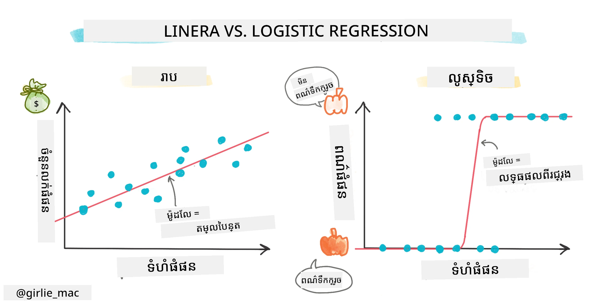
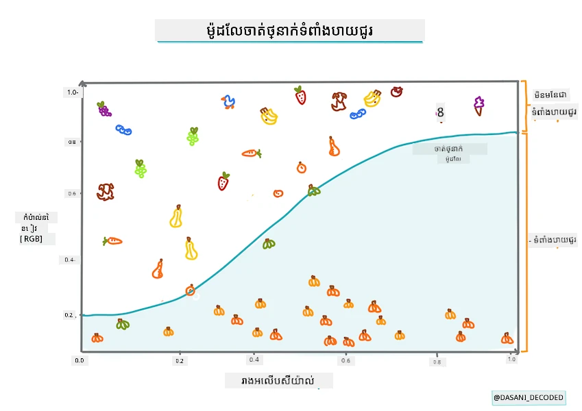
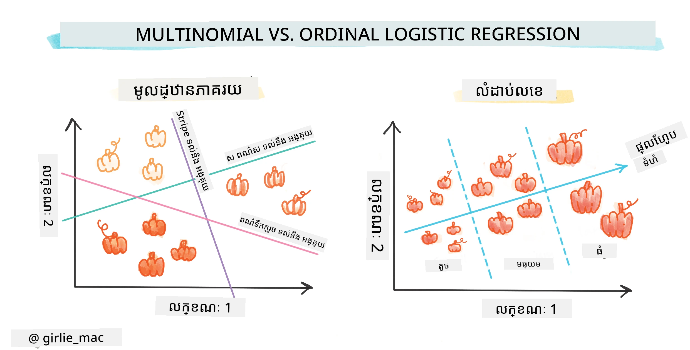
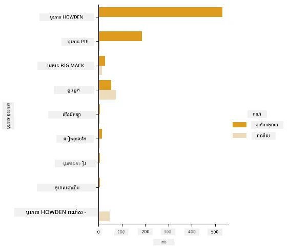
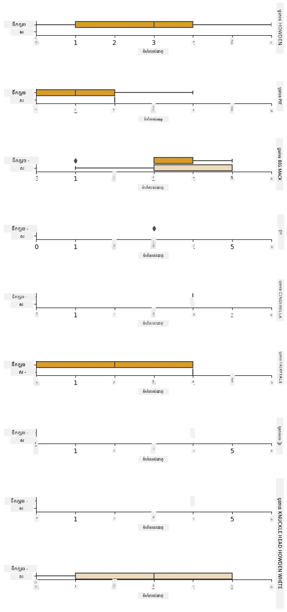
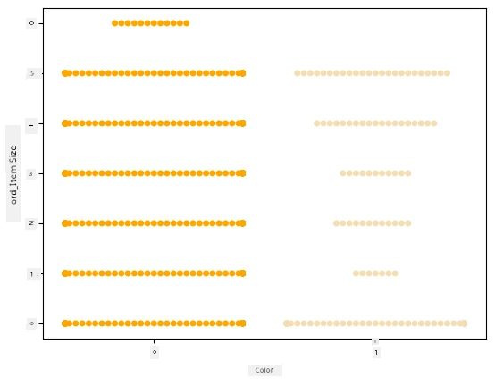
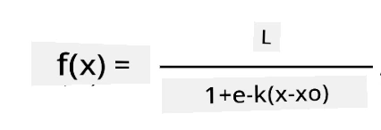
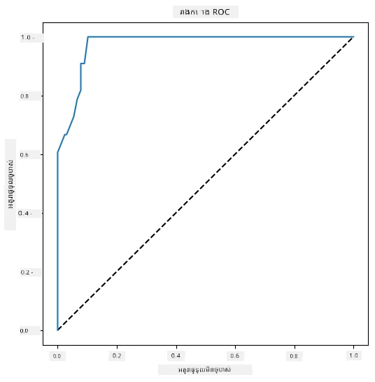

# Logistic regression ដើម្បីទាយកាតេកូរី



## [ការប្រលងមុនម៉ោងផ្សាយ](https://ff-quizzes.netlify.app/en/ml/)

> ### [មេរៀននេះមានស្រាប់នៅក្នុង R!](../../../../2-Regression/4-Logistic/solution/R/lesson_4.html)

## ការណែនាំ

នៅក្នុងមេរៀនចុងក្រោយនេះលើការឧទ្ទិសសំណុំទិន្នន័យ Regression ដែលជាតិចរបស់បច្ចេកទេស ML _បុរាណ_, យើងនឹងស្គាល់ Logistic Regression។ អ្នកនឹងប្រើបច្ចេកទេសនេះដើម្បីរកមើលលំនាំដើម្បីទាយកាតេកូរីពីរបាន។ តើស្ករគឺជាស្វាម៉េតឫមិនមែន? តើជម្ងឺនេះឆ្លងឬមិន? តើអតិថិជននេះនឹងរើសផលិតផលនេះឫមិន?

នៅក្នុងមេរៀននេះ អ្នកនឹងរៀន៖

- បណ្ណាល័យថ្មីសម្រាប់ការមើលទិន្នន័យ
- បច្ចេកទេសសម្រាប់ logistic regression

✅ ជ្រាបចំហពីការប្រើ regression ប្រភេទនេះក្នុង [មូឌុលរៀន](https://docs.microsoft.com/learn/modules/train-evaluate-classification-models?WT.mc_id=academic-77952-leestott)

## ការត្រៀមខ្លួន

បន្ទាប់ពីបានធ្វើការលេងជាមួយទិន្នន័យកម្រាលផ្លែឈើ pumpkin យើងមានការស្គាល់គ្រប់គ្រាន់ដើម្បីយល់ថាមានកាតេកូរីពីរមួយដែលអាចប្រើបានគឺ `Color`។

មកបង្កើតម៉ូដែល logistic regression ដើម្បីទាយថា ពីអថេរខ្លះៗ _ពណ៌របស់ pumpkin មួយដែលបានផ្តល់ចង្អុលបង្ហាញនឹងមានអ្វីនៅលើទៅ_ (ទឹកក្រូច 🎃 ឬ ពណ៌ស 👻)។

> ហេតុអ្វីបានយើងពិភាក្សាពីចំណាត់ថ្នាក់ពីរ ក្នុងមេរៀនដែលពាក់ព័ន្ធនឹង regression? គ្រាន់តែសម្រាប់ភាពងាយស្រួលភាសា បើទោះបី logistic regression ជាវិធីចំណាត់ថ្នាក់មួយ [ពិតប្រាកដ](https://scikit-learn.org/stable/modules/linear_model.html#logistic-regression) ក៏ដោយ ដែលមានមូលដ្ឋានលើខ្សែតួ។ រៀនអំពីវិធីផ្សេងទៀតក្នុងការចាត់ថ្នាក់ទិន្នន័យនៅមេរៀនក្រោយ។

## កំណត់សំណួរ

សម្រាប់គោលបំណងរបស់យើង យើងនឹងបង្ហាញនេះជាការចាត់តាមពីរយ៉ាង៖ 'ពណ៌ស' ឬ 'មិនមែនពណ៌ស'។ ក៏មានកាតេកូរី 'ពណ៌ប៊ិច' ផងដែលមាននៅលើdataset, ប៉ុន្តែមានករណីតិច ជាថ្មីយើងមិនប្រើវាទេ។ វានឹងបាត់បង់នៅពេលយើងដកទិន្នន័យដែលមានតម្លៃគ្មានអ្វីពី dataset ផងដែរ។

> 🎃 ព័ត៌មានរីករាយ គេពេលខ្លះហៅ pumpkin ពណ៌សថា pumpkin 'ភ្នំ'. វាមិនងាយក្នុងការចំអិន ដូច្នេះវាមិនពេញនិយមប៉ុន្មានដូច pumpkin ទឹកក្រូច, ប៉ុន្តែវាមើលទាក់ទាញណាស់! ដូច្នេះ យើងអាចកែសំណួររបស់យើងជាថា៖ 'ភ្នំ' ឬ 'មិនភ្នំ' 👻។

## អំពី logistic regression

Logistic regression ផ្សេងពី linear regression ដែលអ្នកបានរៀនមុននេះនៅក្នុងបញ្ហាខ្លះ។

[](https://youtu.be/KpeCT6nEpBY "ML for beginners - Understanding Logistic Regression for Machine Learning Classification")

> 🎥 ចុចលើរូបភាពខាងលើសម្រាប់វីដេអូមោទនភាពខ្លីអំពី logistic regression។

### ចាត់ថ្នាក់ពីរជាន់

Logistic regression មិនផ្តល់លក្ខណៈដូច linear regression ទេ។ Logistic regression ផ្តល់ទាយន័យអំពីកាតេកូរីពីរដូចជា ("ពណ៌ស ឬ មិនពណ៌ស") ខណៈដែល linear regression អាចទាយតម្លៃជាបន្ត (បិទនេះផ្អែកលើដើម pumpkin និងពេលកាប់ ប្រហែលថា _តម្លៃរបស់វានឹងឡើងប៉ុន្មាន_)។


> រូបភាពដោយ [Dasani Madipalli](https://twitter.com/dasani_decoded)

### ចាត់ថ្នាក់ផ្សេងៗ

មានប្រភេទ logistic regression ផ្សេងទៀត រួមមាន multinomial និង ordinal៖

- **Multinomial** ដែលមានកាតេកូរីលើសពីមួយៈ "ទឹកក្រូច, ពណ៌ស និង ប៊ិច"។
- **Ordinal** ដែលមានកាតេកូរីតាមលំដាប់ ដែលមានប្រយោជន៍ប្រសិនបើយើងចង់តម្រៀបលទ្ធផលយ៉ាងមានตรรกะដូច pumpkin ដែលមានទំហំកំណត់ (តូច ធំមធ្យម ធំ លំដាប់គ្នា)។



### អថេរមិនចាំបាច់ត្រូវពាក់ព័ន្ធគ្នា

ចងចាំថា linear regression ធ្វើបានល្អជាមួយអថេរសមាសភាពល្អជាងទេ? Logistic regression ផ្ទុយទៅវិញ - អថេរមិនបាច់ត្រូវដូចគ្នា។ វាត្រូវនឹងទិន្នន័យនេះដែលមានសមាសភាពអន់។

### អ្នកត្រូវតែមានទិន្នន័យស្អាតច្រើន

Logistic regression នឹងនាំឲ្យបានលទ្ធផលត្រឹមត្រូវឡើង ប្រសិនបើអ្នកប្រើទិន្នន័យច្រើន; dataset តូចរបស់យើងមិនល្អសម្រាប់ការងារនេះទេ ដូច្នេះសូមចងចាំ។

[](https://youtu.be/B2X4H9vcXTs "ML for beginners - Data Analysis and Preparation for Logistic Regression")

> 🎥 ចុចលើរូបភាពខាងលើសម្រាប់វីដេអូមោទនភាពខ្លីអំពីការត្រៀមទិន្នន័យសម្រាប់ linear regression

✅ គិតអំពីប្រភេទទិន្នន័យដែលសមរម្យសម្រាប់ logistic regression

## ការហាត់ប្រាណ - រៀបចំទិន្នន័យ

ជំហានដំបូង សម្អាតទិន្នន័យ បោះបង់តម្លៃគ្មានអ្វី និងជ្រើសរើសកូឡុំប៉ុន្មាន៖

1. បន្ថែមកូដដូចខាងក្រោម៖

    ```python
  
    columns_to_select = ['City Name','Package','Variety', 'Origin','Item Size', 'Color']
    pumpkins = full_pumpkins.loc[:, columns_to_select]

    pumpkins.dropna(inplace=True)
    ```

    អ្នកអាចមើល dataframe ថ្មីរបស់អ្នកបាននៅពេលណាដែលចង់បានៈ

    ```python
    pumpkins.info
    ```

### ការមើលទិន្នន័យ - គំនូរសញ្ញាកាតេកូរី

ឥឡូវនេះ អ្នកបានផ្ទុកចូល [សៀវភៅកំណត់ចំណាំដើម](./notebook.ipynb) ជាមួយទិន្នន័យ pumpkin ម្តងទៀត ហើយបានសម្អាតវាដូច្នេះដើម្បីរក្សាទុក dataset ដែលមានអថេរមួយចំនួន រួមមាន `Color`។ អ្នកចង់គំនូរសម្រាប់ dataframe នៅក្នុងសៀវភៅកំណត់ចំណាំ ដោយប្រើបណ្ណាល័យផ្សេងទៀតគឺ [Seaborn](https://seaborn.pydata.org/index.html) ដែលបង្កើតលើ Matplotlib ដែលយើងបានប្រើមុន។

Seaborn ផ្តល់វិធីល្អក្នុងការមើលទិន្នន័យរបស់អ្នក។ ឧទាហរណ៍ អ្នកអាចប្រៀបធៀបទិន្នន័យសម្រាប់រាល់ `Variety` និង `Color` ក្នុងគំនូរសញ្ញាកាតេកូរី។

1. បង្កើតគំនូរដូចនេះដោយប្រើមុខងារ `catplot` ប្រាប់ពី data pumpkin របស់យើង `pumpkins` និងកំណត់ផែនទីពណ៌សម្រាប់រាល់កាតេកូរី pumpkin (ទឹកក្រូច ឬ ពណ៌ស)៖

    ```python
    import seaborn as sns
    
    palette = {
    'ORANGE': 'orange',
    'WHITE': 'wheat',
    }

    sns.catplot(
    data=pumpkins, y="Variety", hue="Color", kind="count",
    palette=palette, 
    )
    ```

    

    ដោយមើលទិន្នន័យ អ្នកអាចឃើញពីទំនាក់ទំនងរវាងទិន្នន័យ Color និង Variety។

    ✅ តាមគំនូរម៉ូតនេះ តើអ្នកអាចយល់ពីការស្រាវជ្រាវណាមួយដល់?

### ការព្យាបាលទិន្នន័យជាមុន: ការអ៊ិនកូដលក្ខណៈ និងស្លាក

Dataset pumpkins របស់យើងមានតម្លៃអក្សរសម្រាប់គ្រប់កូឡុំ។ ការងារជាមួយទិន្នន័យកាតេកូរីគឺងាយស្រួលសម្រាប់មនុស្ស ប៉ុន្តែមិនសម្រាប់ម៉ាស៊ីនទេ។ អាល់គុណិទិ៍ machine learning បំរើល្អជាមួយលេខ។ ដូច្នេះការអ៊ិនកូដគឺជជើងជម្រាបសំខាន់នៅដំណាក់កាលព្យាបាលទិន្នន័យ ដែលជួយបំលែងទិន្នន័យកាតេកូរីទៅកាន់ទិន្នន័យលេខ ដោយមិនបាត់បង់ព័ត៌មាន។ ការអ៊ិនកូដល្អនាំឲ្យបង្កើតម៉ូដែលល្អ។

សម្រាប់ feature encoding មានប្រភេទ encoder ពីរចម្បង៖

1. Ordinal encoder: សមស្របសម្រាប់អថេរអាគុយរបស់ ordinal ដែលជាកាតេកូរីដែលមានលំដាប់ដូចជា `Item Size` នៅក្នុង dataset របស់យើង។ វាបង្កើតផែនទីដែលរាល់កាតេកូរីត្រូវបានតំណាងដោយលេខ ដែលជាលំដាប់របស់កាតេកូរនោះនៅក្នុងកូឡុំ។

    ```python
    from sklearn.preprocessing import OrdinalEncoder

    item_size_categories = [['sml', 'med', 'med-lge', 'lge', 'xlge', 'jbo', 'exjbo']]
    ordinal_features = ['Item Size']
    ordinal_encoder = OrdinalEncoder(categories=item_size_categories)
    ```

2. Categorical encoder: សមស្របសម្រាប់អថេរអាគុយរបស់ nominal ដែលជាកាតេកូរីដែលមិនមានលំដាប់ដូចគ្នា ដូចជា លក្ខណៈផ្សេងទៀតក្រៅពី `Item Size` ក្នុង dataset របស់យើង។ វាជា one-hot encoding ដែលមានន័យថារាល់កាតេកូរត្រូវបានតំណាងដោយកូឡុំប៊ីណារី៖ អថេរអ៊ិនកូដស្មើនឹង 1 ប្រសិនបើ pumpkin ស្ថិតក្នុង Variety នោះ និង 0 មិនដល់។

    ```python
    from sklearn.preprocessing import OneHotEncoder

    categorical_features = ['City Name', 'Package', 'Variety', 'Origin']
    categorical_encoder = OneHotEncoder(sparse_output=False)
    ```
បន្ទាប់មក `ColumnTransformer` ត្រូវបានប្រើដើម្បីបញ្ចូល encoder ច្រើនទៅជាជំហានតែមួយ និងអនុវត្តលើកូឡុំដែលសមរម្យ។

```python
    from sklearn.compose import ColumnTransformer
    
    ct = ColumnTransformer(transformers=[
        ('ord', ordinal_encoder, ordinal_features),
        ('cat', categorical_encoder, categorical_features)
        ])
    
    ct.set_output(transform='pandas')
    encoded_features = ct.fit_transform(pumpkins)
```
ផ្ទៃផ្សេងទៀត សម្រាប់ encode ស្លាក label យើងប្រើថ្នាក់ `LabelEncoder` របស់ scikit-learn ដែលជាឧបករណ៍ជួយnormalize ស្លាកបែប ដែលធ្វើឲ្យមានតម្លៃក្នុងរកមួយពី 0 ដល់ n_classes-1 (នៅទីនេះ 0 និង 1)។

```python
    from sklearn.preprocessing import LabelEncoder

    label_encoder = LabelEncoder()
    encoded_label = label_encoder.fit_transform(pumpkins['Color'])
```
បន្ទាប់ពី encode feature និង label រួច យើងអាចបញ្ចូលពួកវាទៅក្នុង dataframe ថ្មី `encoded_pumpkins`។

```python
    encoded_pumpkins = encoded_features.assign(Color=encoded_label)
```
✅ អត្ថប្រយោជន៍នៃការប្រើ ordinal encoder សម្រាប់កូឡុំ `Item Size` មានអ្វីខ្លះ?

### វិភាគទំនាក់ទំនងរវាងអថេរ

ឥឡូវនេះដែលយើងបានព្យាបាលទិន្នន័យជាមុនហើយ អាចវិភាគទំនាក់ទំនងរវាង feature និង label ដើម្បីយល់ពីថា ម៉ូដែលអាចទាយបានល្អប៉ុណ្ណា នៅពេលផ្តល់ចំណូលអថេរ។
វិធីល្អបំផុតសម្រាប់វាយតម្លៃនេះគឺគំនូរ។ យើងនឹងប្រើមុខងារ catplot របស់ Seaborn វិញ ដើម្បីបង្ហាញទំនាក់ទំនងរវាង `Item Size`, `Variety` និង `Color` ក្នុងគំនូរសញ្ញាកាតេកូរី។ ដើម្បីបង្កើតគំនូរ យើងនឹងប្រើកូឡុំ `Item Size` ដែលបាន encode ហើយ និងកូឡុំ `Variety` មិនបាន encode។

```python
    palette = {
    'ORANGE': 'orange',
    'WHITE': 'wheat',
    }
    pumpkins['Item Size'] = encoded_pumpkins['ord__Item Size']

    g = sns.catplot(
        data=pumpkins,
        x="Item Size", y="Color", row='Variety',
        kind="box", orient="h",
        sharex=False, margin_titles=True,
        height=1.8, aspect=4, palette=palette,
    )
    g.set(xlabel="Item Size", ylabel="").set(xlim=(0,6))
    g.set_titles(row_template="{row_name}")
```


### ប្រើស្វាមប្រភេទគំនូរពណ៌

ព្រោះ Color ជាកាតេកូរពីរ (ពណ៌ស ឬ មិន) វាត្រូវការ '[វិធីពិសេស](https://seaborn.pydata.org/tutorial/categorical.html?highlight=bar) សម្រាប់ការមើលទិន្នន័យ'។ មានវិធីផ្សេងទៀតក្នុងការមើលទំនាក់ទំនងរបស់កាតេកូរនេះជាមួយអថេរផ្សេងទៀត។

អ្នកអាចមើលអថេរជាអ៊ុមណាមួយរាប់មុខជាមួយគំនូរ Seaborn។

1. សាកល្បងគំនូរស្វាម ដើម្បីបង្ហាញការចែកចាយតម្លៃ៖

    ```python
    palette = {
    0: 'orange',
    1: 'wheat'
    }
    sns.swarmplot(x="Color", y="ord__Item Size", data=encoded_pumpkins, palette=palette)
    ```

    

**សូមប្រយ័ត្ន**: កូដខាងលើអាចបង្កើតសារព្រមាន ព្រោះ seaborn មិនអាចបង្ហាញចំណុចទិន្នន័យច្រើនប៉ុណ្ណោះក្នុងគំនូរស្វាមបានទេ។ ដំណោះស្រាយមួយគឺកាត់បន្ថយទំហំម៉ាកឯកសារ ដោយប្រើប៉ារ៉ាម៉ែត្រ 'size'។ ប៉ុន្តែសូមដឹងថា វានឹងប៉ះពាល់ទៅលើភាពអាចអាននៃគំនូរ។

> **🧮 បង្ហាញគណិតវិទ្យា**
>
> Logistic regression ពឹងផ្អែកលើគំនិត 'maximum likelihood' ដោយប្រើ [function sigmoid](https://wikipedia.org/wiki/Sigmoid_function)។ 'Sigmoid Function' នៅលើគំនូរមើលទៅដូចជារូប 'S'។ វាទទួលតម្លៃមួយហើយផ្គូរផ្គងឲ្យមានតម្លៃនៅចន្លោះ 0 និង 1។ ខ្សែវាក៏ហៅថា 'logistic curve'។ សមីការរូបនេះមានរូបរាងដូចខាងក្រោម៖
>
> 
>
> ដែល midpoint របស់ sigmoid មាននៅចំណុច x = 0, L ជាតម្លៃអតិបរមានៃខ្សែ, និង k ជាកម្រិតកាច់ជ្រាបនៃខ្សែ។ ប្រសិនបើលទ្ធផលនៃ function លើស 0.5 ស្លាកនោះនឹងត្រូវចាត់ថាជាប្រភេទ '1' នៃជម្រើសពីរ។ បើមិនបញ្ជាក់ នឹងចាត់ថាជាប្រភេទ '0'។

## បង្កើតម៉ូដែលរបស់អ្នក

ការបង្កើតម៉ូដែលសម្រាប់រកចំណាត់ថ្នាក់ពីរនេះគឺងាយស្រួលក្នុង Scikit-learn។

[](https://youtu.be/MmZS2otPrQ8 "ML for beginners - Logistic Regression for classification of data")

> 🎥 ចុចលើរូបភាពខាងលើសម្រាប់វីដេអូសង្ខេបស្តីពីការបង្កើតម៉ូដែល logistic regression

1. ជ្រើសរើសអថេរដែលអ្នកចង់ប្រើនៅក្នុងម៉ូដែលចាត់ថ្នាក់ ហើយបំបែក training និង test ដោយហៅ `train_test_split()`៖

    ```python
    from sklearn.model_selection import train_test_split
    
    X = encoded_pumpkins[encoded_pumpkins.columns.difference(['Color'])]
    y = encoded_pumpkins['Color']

    X_train, X_test, y_train, y_test = train_test_split(X, y, test_size=0.2, random_state=0)
    
    ```

2. ឥឡូវអ្នកអាចបណ្តុះម៉ូដែលដោយហៅ `fit()` ជាមួយទិន្នន័យ training ហើយបោះពុម្ពលទ្ធផលរបស់វា៖

    ```python
    from sklearn.metrics import f1_score, classification_report 
    from sklearn.linear_model import LogisticRegression

    model = LogisticRegression()
    model.fit(X_train, y_train)
    predictions = model.predict(X_test)

    print(classification_report(y_test, predictions))
    print('Predicted labels: ', predictions)
    print('F1-score: ', f1_score(y_test, predictions))
    ```

    មើលទៅក្រឡា scoreboard របស់ម៉ូដែលអ្នក។ វាមិនអាក្រាតទេ បើគិតថាអ្នកមានត្រឹមប្រហែល 1000 ជួរទិន្នន័យប៉ុណ្ណោះ៖

    ```output
                       precision    recall  f1-score   support
    
                    0       0.94      0.98      0.96       166
                    1       0.85      0.67      0.75        33
    
        accuracy                                0.92       199
        macro avg           0.89      0.82      0.85       199
        weighted avg        0.92      0.92      0.92       199
    
        Predicted labels:  [0 0 0 0 0 0 0 0 0 0 0 0 0 0 0 0 0 0 0 0 1 0 0 1 0 0 0 0 0 0 0 0 1 0 0 0 0
        0 0 0 0 0 1 0 1 0 0 1 0 0 0 0 0 1 0 1 0 1 0 1 0 0 0 0 0 0 0 0 0 0 0 0 0 0
        1 0 0 0 0 0 0 0 1 0 0 0 0 0 0 0 1 0 0 0 0 0 0 0 0 1 0 1 0 0 0 0 0 0 0 1 0
        0 0 0 0 0 0 0 0 0 0 0 0 0 0 0 0 0 0 0 0 0 1 0 0 0 0 0 0 0 0 1 0 0 0 1 1 0
        0 0 0 0 1 0 0 0 0 0 1 0 0 0 0 0 0 0 0 0 0 0 0 0 0 0 0 0 0 0 0 0 0 0 0 0 1
        0 0 0 1 0 0 0 0 0 0 0 0 1 1]
        F1-score:  0.7457627118644068
    ```

## យល់បានល្អជាងគេតាមរយៈ confusion matrix

លោកអាចទទួលបានរបាយការណ៍ scoreboard ដោយបោះពុម្ពវត្ថុខាងលើ [terms](https://scikit-learn.org/stable/modules/generated/sklearn.metrics.classification_report.html?highlight=classification_report#sklearn.metrics.classification_report) ប៉ុន្តែអ្នកអាចយល់ម៉ូដែលបានលឿនជាងដោយប្រើ [confusion matrix](https://scikit-learn.org/stable/modules/model_evaluation.html#confusion-matrix) ដើម្បីយល់ពីប្រសិទ្ធិភាពម៉ូដែល។

> 🎓 '[confusion matrix](https://wikipedia.org/wiki/Confusion_matrix)' (ឬ 'error matrix') ជាតារាងបង្ហាញពីការធ្វើត្រឹមត្រូវ និងមិនត្រឹមត្រូវនៃការទាយរបស់ម៉ូដែល ដូច្នេះវាផ្តល់ការវាយតម្លៃភាពត្រឹមត្រូវនៃទាយទំនាក់ទំនង។

1. ដើម្បីប្រើ confusion matrix, ហៅ `confusion_matrix()`៖

    ```python
    from sklearn.metrics import confusion_matrix
    confusion_matrix(y_test, predictions)
    ```

    មើលទៅ confusion matrix របស់ម៉ូដែលអ្នក៖

    ```output
    array([[162,   4],
           [ 11,  22]])
    ```

នៅក្នុង Scikit-learn, ជួរដេក (axis 0) ជាស្លាកពិត និងជួរឈរ (axis 1) ជាស្លាកទាយ។

|       |   0   |   1   |
| :---: | :---: | :---: |
|   0   |  TN   |  FP   |
|   1   |  FN   |  TP   |

អ្វីកើតឡើងនៅទីនេះ? យើងនិយាយថាម៉ូដែលត្រូវបានសួរឲ្យចាត់ថ្នាក់ pumpkin រវាងប៉ារងពីរគឺ 'ពណ៌ស' និង 'មិនពណ៌ស'។

- ប្រសិនបើម៉ូដែលអ្នកទាយថា pumpkin មិនមែនពណ៌ស និងនៅពិតកម្មវិធីជាក្រុម 'មិនពណ៌ស', យើងហៅនេះថា true negative ដែលបង្ហាញដោយលេខខាងលើឆ្វេង។
- ប្រសិនបើម៉ូដែលទាយថា pumpkin ជាពណ៌ស ប៉ុន្តែពិតជាក្នុងក្រុម 'មិនពណ៌ស' យើងហៅថា false negative ដែលបង្ហាញដោយលេខខាងក្រោមឆ្វេង។
- ប្រសិនបើម៉ូដែលទាយថា pumpkin មិនមែនពណ៌ស ប៉ុន្តែពិតជា 'ពណ៌ស', យើងហៅថា false positive ដែលបង្ហាញដោយលេខខាងលើស្តាំ។
- ប្រសិនបើម៉ូដែលទាយថា pumpkin ជាពណ៌ស ហើយពិតជា 'ពណ៌ស', យើងហៅថា true positive ដែលបង្ហាញដោយលេខខាងក្រោមស្តាំ។
យ៉ាងដែលអ្នកអាចបានគិត មុននេះវាជាការល្អបំផុតក្នុងការមានចំនួន TP (true positives) និង TN (true negatives) ច្រើន ហើយមានចំនួន FP (false positives) និង FN (false negatives) តិច  ដែលបង្ហាញថាម៉ូដែលមានប្រសិទ្ធភាពល្អជាង។

តើ matrix រញ្ជួយទាក់ទងទៅនឹង precision និង recall យ៉ាងដូចម្តេច? ចូរចងចាំថា របាយការណ៍ចាត់ថ្នាក់ដែលបានបោះពុម្ពនៅលើ បានបង្ហាញពី precision (0.85) និង recall (0.67)។

Precision = tp / (tp + fp) = 22 / (22 + 4) = 0.8461538461538461

Recall = tp / (tp + fn) = 22 / (22 + 11) = 0.6666666666666666

✅ សំនួរ៖ យោងតាម matrix រញ្ជួយ ម៉ូដែលបានធ្វើការយ៉ាងដូចម្ដេច? ដាច់ចិត្ត៖ មិនអាក្រក់ទេ; មានចំនួន true negatives ច្រើនល្អ ប៉ុន្តែនៅតែមួយចំនួន false negatives ផងដែរ។

ចូលទៅវិញវិលទស្សនា លក្ខណៈដែលយើងបានឃើញពីមុន ជាមួយនឹងជំនួយកំណត់ទីតាំង TP/TN និង FP/FN នៃ matrix រញ្ជួយ៖

🎓 Precision: TP/(TP + FP) ភាគរយនៃករណីដែលពាក់ទាក់ទងក្នុងចំណោមករណីដែលបានយក (ឧ. ស្លាកណាដែលត្រូវបានស្លាកបានល្អ)

🎓 Recall: TP/(TP + FN) ភាគរយនៃករណីដែលពាក់ទាក់ទង ដែលត្រូវបានយក មិនថាត្រូវបានស្លាកបានល្អឬអត់

🎓 f1-score: (2 * precision * recall)/(precision + recall) មធ្យម តុល្យភាពនៃ precision និង recall ដែលល្អបំផុតគឺ 1 និងអាក្រក់បំផុតគឺ 0

🎓 Support: ចំនួនករណីនៃស្លាកនីមួយៗដែលបានយក

🎓 Accuracy: (TP + TN)/(TP + TN + FP + FN) ភាគរយនៃស្លាកដែលបានទំនាក់ទំនងត្រឹមត្រូវសម្រាប់គំរូ។

🎓 Macro Avg: ការគណនាតម្លៃមធ្យមប្រាក់មិនបង្គបង់សម្រាប់ស្លាកនីមួយៗ ដោយមិនគិតពីភាពមិនសមរម្យនៃស្លាក។

🎓 Weighted Avg: ការគណនាតម្លៃមធ្យមសម្រាប់ស្លាកនីមួយៗ ដោយទុកចិត្តលើភាពមិនសមរម្យនៃស្លាកដោយវាស់តំលៃតាមកម្រិតស្នេះ (ចំនួនករណីសព្វថ្ងៃសម្រាប់ស្លាកនីមួយៗ)។

✅ តើអ្នកគិតថាតម្លៃណាមួយដែលអ្នកគួរតែនៅត្រួតពិនិត្យ ប្រសិនបើអ្នកចង់ឲ្យម៉ូដែលរបស់អ្នកបន្ថយចំនួន false negatives?

## បង្ហាញរាងកោង ROC របស់ម៉ូដែលនេះ

[](https://youtu.be/GApO575jTA0 "ML for beginners - Analyzing Logistic Regression Performance with ROC Curves")

> 🎥 ចុចលើរូបភាពខាងលើសម្រាប់វីដេអូចំលងខ្លីអំពីរាងកោង ROC

យើងចាំបាច់ត្រូវធ្វើបង្ហាញមួយទៀត ដើម្បីមើលរាងកោងដែលហៅថា ‘ROC’៖

```python
from sklearn.metrics import roc_curve, roc_auc_score
import matplotlib
import matplotlib.pyplot as plt
%matplotlib inline

y_scores = model.predict_proba(X_test)
fpr, tpr, thresholds = roc_curve(y_test, y_scores[:,1])

fig = plt.figure(figsize=(6, 6))
plt.plot([0, 1], [0, 1], 'k--')
plt.plot(fpr, tpr)
plt.xlabel('False Positive Rate')
plt.ylabel('True Positive Rate')
plt.title('ROC Curve')
plt.show()
```

ប្រើ Matplotlib ដើម្បីគូររាងកោង [Receiving Operating Characteristic](https://scikit-learn.org/stable/auto_examples/model_selection/plot_roc.html?highlight=roc) ឬ ROC របស់ម៉ូដែល។ រាងកោង ROC ត្រូវបានប្រើជាញឹកញាប់ដើម្បីមើលលទ្ធផលរបស់ម៉ាស៊ីនចាត់ថ្នាក់ក្នុងការប្រៀបធៀបចំណុច positive ត្រឹមត្រូវ និង false positives។ "រាងកោង ROC ជាធម្មតាបង្ហាញអត្រា true positive នៅលើអ័ក្ស Y ហើយ false positive នៅលើអ័ក្ស X"។ ដូច្នេះ, ភាពខ្ពស់របស់រាងកោង និងចន្លោះរវាងខ្សែ​បន្ទាត់កណ្តាល និងរាងកោងសំខាន់នឹង៖ អ្នកចង់បានរាងកោងមួយរំកិលឡើងលឿន ហើយឆ្លងកាត់ខ្សែបន្ទាត់។ ក្នុងករណីរបស់យើង there are false positives to start with, and then the line heads up and over properly:



ចុងក្រោយ ប្រើ Scikit-learn’s [`roc_auc_score` API](https://scikit-learn.org/stable/modules/generated/sklearn.metrics.roc_auc_score.html?highlight=roc_auc#sklearn.metrics.roc_auc_score) ដើម្បីគណនាតម្លៃពិតប្រាកដ 'ផ្ទៃក្រោមរាងកោង' (AUC)៖

```python
auc = roc_auc_score(y_test,y_scores[:,1])
print(auc)
```
 លទ្ធផលគឺ `0.9749908725812341`។ ពីព្រោះ AUC មានតម្លៃចន្លោះពី 0 ដល់ 1, អ្នកចង់បានពិន្ទុធំ ព្រោះម៉ូដែលដែលត្រឹមត្រូវ 100% នឹងមាន AUC ដល់ 1; ក្នុងករណីនេះ ម៉ូដែលនេះគឺ _ល្អជាងមធ្យម_។

នៅមុខ បង្រៀននាពេលក្រោយអំពីចំណាត់ថ្នាក់ អ្នកនឹងរៀនពីរបៀបធ្វើ iteration ដើម្បីបង្កើនពិន្ទុម៉ូដែល។ ប៉ុន្តាសម្រាប់ពេលនេះ សូមអបអរសាទរ! អ្នកបានបញ្ចប់មេរៀន regression ទាំងនេះហើយ!

---
## 🚀 ការប្រកួតប្រជែង

មានអ្វីដែលត្រូវស្វែងយល់បន្ថែមទៀតអំពី logistic regression! ប៉ុន្តារបៀបល្អបំផុតក្នុងការរៀន គឺធ្វើតេស្ត។ ស្វែងរក dataset មួយដែលសមនឹងការវិភាគប្រភេទនេះ ហើយបង្កើតម៉ូដែលជាមួយវា។ តើអ្នកបានរៀនអ្វីខ្លះ? ជំនួយ៖ ព្យាយាម [Kaggle](https://www.kaggle.com/search?q=logistic+regression+datasets) សម្រាប់ dataset ដែលគួរឱ្យចាប់អារម្មណ៍។

## [តេស្តក្រោយមេរៀន](https://ff-quizzes.netlify.app/en/ml/)

## សារសង្ខេប និង អប់រំបន្ថែម

អានទំព័រដើមខ្លះៗ នៃ [ឯកសារនេះពីស្ថានីយ៍ Stanford](https://web.stanford.edu/~jurafsky/slp3/5.pdf) អំពីការប្រើប្រាស់ប្រក្រតីមួយចំនួនសម្រាប់ logistic regression។ ស្វែករកភារកិច្ចណាដែលសមស្របសម្រាប់ប្រភេទ regression មួយឬមួយផ្សេងទៀត ដែលយើងបានរៀនរហូតដល់ពេលនេះ។ តើអ្វីដែលនឹងដំណើរការល្អបំផុត?

## បេសកកម្ម 

[Retrying this regression](assignment.md)

---

<!-- CO-OP TRANSLATOR DISCLAIMER START -->
**ការព្រមាន**:  
ឯកសារនេះត្រូវបានបកប្រែដោយប្រើសេវាកម្មបកប្រែ AI [Co-op Translator](https://github.com/Azure/co-op-translator)។ ខណៈពេលដែលយើងខិតខំសម្រាប់ភាពត្រឹមត្រូវ សូមជ្រាបថាការបកប្រែដោយស្វ័យប្រវត្តិអាចមានកំហុសឬភាពមិនត្រឹមត្រូវ។ ឯកសារដើមក្នុងភាសាមាតុភូមិគួរត្រូវបានចាត់ទុកជាមូលដ្ឋានដែលមានសិទ្ធិ។ សម្រាប់ព័ត៌មានសំខាន់ៗ ការបកប្រែដោយអ្នកជំនាញមនុស្សគឺត្រូវបានផ្តល់អនុសាសន៍។ យើងមិនទទួលខុសត្រូវចំពោះការយល់ច្រឡំ ឬការបកស្រាយខុសពីរណាមួយដែលកើតមានពីការប្រើប្រាស់ការបកប្រែនេះទេ។
<!-- CO-OP TRANSLATOR DISCLAIMER END -->