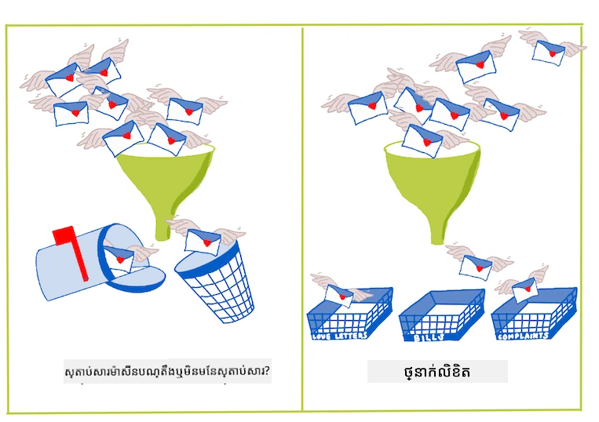
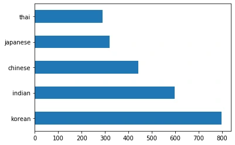
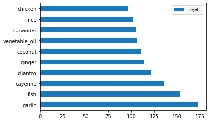
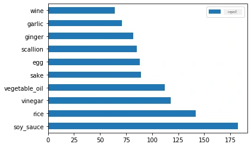
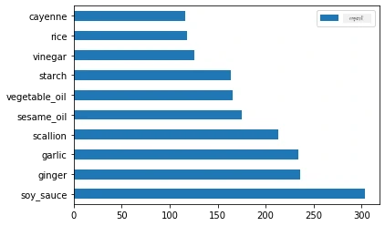
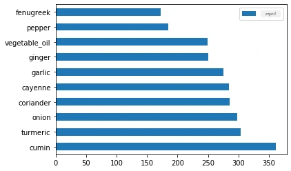
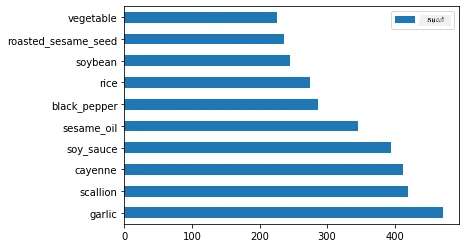

# ការណែនាំអំពីការបែងចែកចំណាត់ថ្នាក់

ក្នុងមេរៀនបួននេះ អ្នកនឹងបានសិក្សាពីចំណុចសំខាន់មួយនៃការសិក្សាម៉ាស៊ីនបែបចាស់ៗមួយ - _ការបែងចែកចំណាត់ថ្នាក់_។ យើងនឹងដំណើរការប្រើប្រាស់អាល់គូរីធึមបែងចំណាត់ថ្នាក់នានាជាមួយនឹងទិន្នន័យអំពីម្ហូបឆុងសាធារណៈទាំងអាស៊ីនិងឥណ្ឌា។ សូមសង្ឃឹមថាអ្នកនៅពេលនេះមានអាហារស្តុក!


> ប្រារព្ធរំលឹកមុខម្ហូបប៉ាន-អាស៊ីក្នុងមេរៀនទាំងនេះ! រូបភាពដោយ [Jen Looper](https://twitter.com/jenlooper)

ការបែងចំណាត់ថ្នាក់គឺជារបៀបមួយនៃ [ការសិក្សាដោយមានតំណាង](https://wikipedia.org/wiki/Supervised_learning) ដែលមានអារម្មណ៍ស្រដៀងនឹងបច្ចេកទេសរេហ្គ្រេស្យុង។ ប្រសិនបើការសិក្សាម៉ាស៊ីនគឺស្តីពីការព្យាករណ៍តម្លៃឬឈ្មោះរបស់វត្ថុតាមរយៈទិន្នន័យ។ ការបែងចំណាត់ថ្នាក់មានពីរប្រភេទទូទៅគឺ: _ការបែងចំណាត់ថ្នាក់ពីរប្រាំពីរណ៍_ និង _ការបែងចំណាត់ថ្នាក់ច្រើនថ្នាក់_។

[](https://youtu.be/eg8DJYwdMyg "Introduction to classification")

> 🎥 ចុចលើរូបភាពខាងលើសម្រាប់វីដេអូ៖ John Guttag ពី MIT បង្ហាញអំពីការបែងចំណាត់ថ្នាក់

ចងចាំ៖

- **រេហ្គ្រេស្យុងបន្ទាត់** បានជួយអ្នកព្យាករណ៍ទំនាក់ទំនងរវាងអថេរនានា និងធ្វើព្យាករណ៍ត្រឹមត្រូវថាតម្លៃទិន្នន័យថ្មីនឹងស្ថិតនៅកន្លែងណាអំពីបន្ទាត់នោះ។ ដូច្នេះ អ្នកអាចព្យាករណ៍ថា _តម្លៃផ្លែហ្គែលនៅខែកញ្ញាឬខែធ្នូ_ ដូចជា។
- **រេហ្គ្រេស្យុងឡូហ្ស៊ីស្ទិក** បានជួយអ្នករកឃើញ "ប្រភេទពីរប្រាំពីរណ៍": នៅតម្លៃតំលៃនេះ _ផ្លែហ្គែលនេះពណ៌ទ្រុងឬមិនទ្រុង_?

ការបែងចំណាត់ថ្នាក់ប្រើអាល់គូរីធឹមជាច្រើនដើម្បីកំណត់វិធីផ្សេងៗក្នុងការបញ្ជាក់ស្លាក ឬថ្នាក់របស់ចំណុចទិន្នន័យ។ យើងនឹងប្រើទិន្នន័យម្ហូបនេះដើម្បីមើលថាតើដោយសង្កេតមើលក្រុមគ្រឿងផ្សំមួយ អាចកំណត់បានថាម្ហូបនេះមានប្រភពពីខេត្តណាបានឬជាអាច។

## [ការប្រលងមុនមេរៀន](https://ff-quizzes.netlify.app/en/ml/)

> ### [មេរៀននេះអាចប្រើបានក្នុង R!](../../../../4-Classification/1-Introduction/solution/R/lesson_10.html)

### ការណែនាំ

ការបែងចំណាត់ថ្នាក់គឺជាកម្មវិធីមួយសំខាន់សម្រាប់អ្នកស្រាវជ្រាវម៉ាស៊ីនសិក្សា និងអ្នកវិទ្យាស្ថានទិន្នន័យមួយ។ ចាប់ពីការបែងចំណាត់ថ្នាក់ពីរប្រាំពីរណ៍មូលដ្ឋាន ("អ៊ីមែលនេះជាស្គាមឬមិនមែន?"), រហូតដល់ការបែងចំណាត់ថ្នាក់រូបភាពស្មុគស្មាញ និងការបែងចំណាត់ថ្នាក់ផ្នែកដោយការមើលឃើញកុំព្យូទ័រ វាអាចមានប្រយោជន៍ជានិច្ចក្នុងការរៀបចំនូវទិន្នន័យទៅក្នុងថ្នាក់ និងសាកសួរទិន្នន័យនោះ។

ដើម្បីពន្យល់ដោយវិទ្យាសាស្ត្រនិងច្បាស់លាស់បន្ថែមវិញ វិធីសាស្ត្របែងចំណាត់ថ្នាក់របស់អ្នកបង្កើតម៉ូដែលព្យាករណ៍ដែលអនុញ្ញាតឲ្យអ្នកបំរែបំរួលទំនាក់ទំនងរវាងអថេរដំណាក់កាល ទៅកាន់អថេរបញ្ចេញ។



> បញ្ហាប្រភេទពីរប្រាំពីរណ៍ និងច្រើនថ្នាក់សម្រាប់អាល់គូរីធឹមបែងចំណាត់ថ្នាក់ត្រូវដោះស្រាយ។ រូបភាពដោយ [Jen Looper](https://twitter.com/jenlooper)

មុនចាប់ផ្តើមដំណើរការសំអាតទិន្នន័យរបស់យើង មើលគំរូវាទិន្នន័យ និងរៀបចំវាសម្រាប់ភារកិច្ច ML របស់យើង សូមយើងសិក្សាអំពីវិធីផ្សេងៗដែលម៉ាស៊ីនសិក្សាអាចប្រើដើម្បីបែងចែកទិន្នន័យ។

បានដកស្រង់ពី [ស្ថិតិវិទ្យា](https://wikipedia.org/wiki/Statistical_classification) ការបែងចំណាត់ថ្នាក់ដោយប្រើម៉ាស៊ីនសិក្សាចាស់ៗប្រើលក្ខណៈពិសេស ជាទម្រង់ `smoker`, `weight`, និង `age` ដើម្បីកំណត់ _ពលភាពនៃការកើតជំងឺ X_។ ជាចំណុចសិក្សាដោយមានតំណាង ដែលស្រដៀងនឹងហាត់រេហ្គ្រេស្យុងដែលអ្នកបានធ្វើមុននេះ ទិន្នន័យរបស់អ្នកត្រូវបានដាក់ស្លាក ហើយអាល់គូរីធឹម ML ប្រើស្លាកទាំងនោះដើម្បីបែងចំណាត់ និងព្យាករណ៍ថ្នាក់ (ឬ 'លក្ខណៈពិសេស') របស់ទិន្នន័យ និងផ្ដល់វាទៅក្រុម ឬលទ្ធផលមួយ។

✅ ចំណាយពេលស្រមៃពីទិន្នន័យអំពីម្ហូបមួយ។ ម៉ូដែលច្រើនថ្នាក់អាចឆ្លើយបានអ្វី? ម៉ូដែលពីរប្រាំពីរណ៍អាចឆ្លើយបានអ្វី? បើអ្នកចង់កំណត់ថាអ្វីមួយថាតើម្ហូបណាមួយប្រើ "fenugreek" ឬទេ? បើអ្នកចង់មើលថា ប្រសិនបើមានកាបូបទំនិញពោរពេញដោយ "star anise", "artichokes", "cauliflower", និង "horseradish" អ្នកអាចបង្កើតម្ហូបឥណ្ឌាប្រភេទមួយបានឬទេ?

[](https://youtu.be/GuTeDbaNoEU "Crazy mystery baskets")

> 🎥 ចុចលើរូបភាពខាងលើសម្រាប់វីដេអូ៖ គោលបំណងទាំងមូលនៃកម្មវិធី 'Chopped' គឺក្នុង 'កាបូបសម្ងាត់' ដែលអ្នកចម្អិនម្ហូបត្រូវបង្កើតម្ហូបពីជម្រើសគ្រឿងផ្សំនានា។ ពិតជាម៉ូដែល ML នឹងជួយបានយ៉ាងច្រើន។

## សួរវាគឺ 'classifier'

សំណួរដែលយើងចង់សួរពីទិន្នន័យម្ហូបនេះគឺជា **សំណួរច្រើនថ្នាក់**, ព្រោះយើងមានម្ហូបជាតិជាច្រើនដែលអាចប្រើបាន។ ដោយផ្អែកលើក្រុមគ្រឿងផ្សំមួយ, តើទិន្នន័យនេះនឹងស្ថិតក្នុងថ្នាក់ណា?

Scikit-learn ផ្តល់ជូននូវអាល់គូរីធឹមជាច្រើនដើម្បីប្រើបែងចំណាត់របស់ទិន្នន័យ តាមបំណង​ ប្រភេទបញ្ហាដែលអ្នកចង់ដោះស្រាយ។ ក្នុងមេរៀនពីរបន្ទាប់ អ្នកនឹងសិក្សាអំពីអាល់គូរីធឹមទាំងនេះ។

## អនុវត្តិ - សំអាត និងសមតុល្យទិន្នន័យរបស់អ្នក

កិច្ចការ​ដំបូងជាចាំបាច់ មុនចាប់ផ្តើមគម្រោងនេះ គឺសំអាត និង **សមតុល្យ** ទិន្នន័យរបស់អ្នក ដើម្បីទទួលបានលទ្ធផលល្អ។ ចាប់ផ្តើមជាមួយឯកសារ _notebook.ipynb_ ទទេនៅមូលដ្ឋានថតនេះ។

របស់ដំបូងដែលត្រូវដំឡើងគឺ [imblearn](https://imbalanced-learn.org/stable/)។ នេះជាបណ្ណាល័យ Scikit-learn មួយដែលអនុញ្ញាតឲ្យអ្នកសមតុល្យទិន្នន័យបានល្អប្រសើរជាងមុន (អ្នកនឹងរៀនអំពីភារកិច្ចនេះបន្ថែមបន្ទាប់ពីនេះ)។

1. ដើម្បីដំឡើង `imblearn`, ប្រើពាក្យបញ្ជា `pip install` ដូចខាងក្រោម៖

    ```python
    pip install imblearn
    ```

1. នាំចូលបណ្ណាល័យដែលអ្នកត្រូវការដើម្បីនាំចូលទិន្នន័យ និងបង្ហាញវីសិរម្យ បានបញ្ចូល `SMOTE` ពី `imblearn` ផងដែរ។

    ```python
    import pandas as pd
    import matplotlib.pyplot as plt
    import matplotlib as mpl
    import numpy as np
    from imblearn.over_sampling import SMOTE
    ```

    ឥឡូវនេះអ្នកបានត្រៀមខ្លួនសម្រាប់នាំចូលទិន្នន័យបន្ទាប់។

1. ភារកិច្ចបន្ទាប់គឺនាំចូលទិន្នន័យ៖

    ```python
    df  = pd.read_csv('../data/cuisines.csv')
    ```

   ការប្រើ `read_csv()` នឹងអានមាតិកានៃឯកសារ csv _cusines.csv_ ហើយដាក់វាទៅក្នុងអថេរ `df`។

1. ពិនិត្យទម្រង់ទិន្នន័យ៖

    ```python
    df.head()
    ```

   បន្ទាត់ប្រាំដំបូងមានរូបរាងដូចខាងក្រោម៖

    ```output
    |     | Unnamed: 0 | cuisine | almond | angelica | anise | anise_seed | apple | apple_brandy | apricot | armagnac | ... | whiskey | white_bread | white_wine | whole_grain_wheat_flour | wine | wood | yam | yeast | yogurt | zucchini |
    | --- | ---------- | ------- | ------ | -------- | ----- | ---------- | ----- | ------------ | ------- | -------- | --- | ------- | ----------- | ---------- | ----------------------- | ---- | ---- | --- | ----- | ------ | -------- |
    | 0   | 65         | indian  | 0      | 0        | 0     | 0          | 0     | 0            | 0       | 0        | ... | 0       | 0           | 0          | 0                       | 0    | 0    | 0   | 0     | 0      | 0        |
    | 1   | 66         | indian  | 1      | 0        | 0     | 0          | 0     | 0            | 0       | 0        | ... | 0       | 0           | 0          | 0                       | 0    | 0    | 0   | 0     | 0      | 0        |
    | 2   | 67         | indian  | 0      | 0        | 0     | 0          | 0     | 0            | 0       | 0        | ... | 0       | 0           | 0          | 0                       | 0    | 0    | 0   | 0     | 0      | 0        |
    | 3   | 68         | indian  | 0      | 0        | 0     | 0          | 0     | 0            | 0       | 0        | ... | 0       | 0           | 0          | 0                       | 0    | 0    | 0   | 0     | 0      | 0        |
    | 4   | 69         | indian  | 0      | 0        | 0     | 0          | 0     | 0            | 0       | 0        | ... | 0       | 0           | 0          | 0                       | 0    | 0    | 0   | 0     | 1      | 0        |
    ```

1. ទទួលបានព័ត៌មានអំពីទិន្នន័យនេះដោយហៅមុខងារ `info()`៖

    ```python
    df.info()
    ```

    លទ្ធផលដែលអ្នកទទួលបានមានរូបរាងដូចខាងក្រោម៖

    ```output
    <class 'pandas.core.frame.DataFrame'>
    RangeIndex: 2448 entries, 0 to 2447
    Columns: 385 entries, Unnamed: 0 to zucchini
    dtypes: int64(384), object(1)
    memory usage: 7.2+ MB
    ```

## អនុវត្តិ - រៀនអំពីម្ហូប

ឥឡូវនេះការងារចាប់ផ្តើមទៅកាន់ជំហានចាប់អារម្មណ៍បន្ថែម។ ចូរផ្សព្វផ្សាយការបែងចែកទិន្នន័យ តាមម្ហូប

1. គូសទិន្នន័យជាកំណត់ប្លង់ដកថ្នេរជាតារាងដោយហៅ `barh()`៖

    ```python
    df.cuisine.value_counts().plot.barh()
    ```

    

    មានម្ហូបច្រើនណាស់ ប៉ុន្តែការបែងចែកទិន្នន័យមិនស្មើល្អទេ។ អ្នកអាចដោះស្រាយបាន! មុននោះ សូមស្វែងយល់បន្ថែម។

1. រកមើលថាតើមានទិន្នន័យប៉ុន្មានក្នុងមួយម្ហូប ហើយបោះពុម្ពវាចេញ៖

    ```python
    thai_df = df[(df.cuisine == "thai")]
    japanese_df = df[(df.cuisine == "japanese")]
    chinese_df = df[(df.cuisine == "chinese")]
    indian_df = df[(df.cuisine == "indian")]
    korean_df = df[(df.cuisine == "korean")]
    
    print(f'thai df: {thai_df.shape}')
    print(f'japanese df: {japanese_df.shape}')
    print(f'chinese df: {chinese_df.shape}')
    print(f'indian df: {indian_df.shape}')
    print(f'korean df: {korean_df.shape}')
    ```

    លទ្ធផលដូចនេះ៖

    ```output
    thai df: (289, 385)
    japanese df: (320, 385)
    chinese df: (442, 385)
    indian df: (598, 385)
    korean df: (799, 385)
    ```

## ស្វែងរកគ្រឿងផ្សំ

ឥឡូវនេះ អ្នកអាចស្ទង់ជ្រៅទៅក្នុងទិន្នន័យ និងស្វែងរកគ្រឿងផ្សំទូទៅក្នុងមួយម្ហូប។ អ្នកគួរតែសំអាតទិន្នន័យដែលមានកំហុសច្រើនបណ្ដាលឲ្យមានការភាន់ច្រឡំរវាងម្ហូប ដូចនេះ ចូររៀនអំពីបញ្ហានេះ។

1. បង្កើតមុខងារ `create_ingredient()` ក្នុង Python ដើម្បីបង្កើត dataframe គ្រឿងផ្សំ។ មុខងារនេះនឹងចាប់ផ្តើមដោយបោះបង់ស្ថំពត៌មានមិនមានប្រយោជន៍ ហើយតម្រៀបគ្រឿងផ្សំតាមចំនួន៖

    ```python
    def create_ingredient_df(df):
        ingredient_df = df.T.drop(['cuisine','Unnamed: 0']).sum(axis=1).to_frame('value')
        ingredient_df = ingredient_df[(ingredient_df.T != 0).any()]
        ingredient_df = ingredient_df.sort_values(by='value', ascending=False,
        inplace=False)
        return ingredient_df
    ```

   ឥឡូវនេះ អ្នកអាចប្រើមុខងារនោះ ដើម្បីដឹងពីចំនួនគ្រឿងផ្សំដែលពេញនិយមចំនួនដប់ខាងលើតាមមុខម្ហូប។

1. ហៅ `create_ingredient()` ហើយគូសវាបញ្ចូល `barh()`៖

    ```python
    thai_ingredient_df = create_ingredient_df(thai_df)
    thai_ingredient_df.head(10).plot.barh()
    ```

    

1. ធ្វើដូចគ្នាសម្រាប់ទិន្នន័យជប៉ុន៖

    ```python
    japanese_ingredient_df = create_ingredient_df(japanese_df)
    japanese_ingredient_df.head(10).plot.barh()
    ```

    

1. ឥឡូវសម្រាប់គ្រឿងផ្សំចិន៖

    ```python
    chinese_ingredient_df = create_ingredient_df(chinese_df)
    chinese_ingredient_df.head(10).plot.barh()
    ```

    

1. គូសគ្រឿងផ្សំឥណ្ឌា៖

    ```python
    indian_ingredient_df = create_ingredient_df(indian_df)
    indian_ingredient_df.head(10).plot.barh()
    ```

    

1. ចុងក្រោយ គូសគ្រឿងផ្សំកូរ៉េ៖

    ```python
    korean_ingredient_df = create_ingredient_df(korean_df)
    korean_ingredient_df.head(10).plot.barh()
    ```

    

1. ឥឡូវនេះ បោះបង់គ្រឿងផ្សំពេញនិយមបំផុតដែលបង្កការភាន់ច្រឡំរវាងម្ហូបតាមរយៈការហៅ `drop()`៖

   មនុស្សគ្រប់គ្នាស្រឡាញ់បាយ, ខ្ទឹម និង ខ្ទិះខ្ទិះ!

    ```python
    feature_df= df.drop(['cuisine','Unnamed: 0','rice','garlic','ginger'], axis=1)
    labels_df = df.cuisine #.មិនម្តង()
    feature_df.head()
    ```

## សមតុល្យទិន្នន័យ

ឥឡូវនេះ អ្នកបានសំអាតទិន្នន័យហើយ ប្រើ [SMOTE](https://imbalanced-learn.org/dev/references/generated/imblearn.over_sampling.SMOTE.html) - "វិធីសាស្ត្របង្កើតគំរូបន្ថែមធម្មតា" - ដើម្បីសមតុល្យវា។

1. ហៅ `fit_resample()`, វិធីសាស្ត្រនេះបង្កើតគំរូថ្មីសម្រាប់នាំចេញតាមរយៈការបញ្ចូល។

    ```python
    oversample = SMOTE()
    transformed_feature_df, transformed_label_df = oversample.fit_resample(feature_df, labels_df)
    ```

    ដោយសមតុល្យទិន្នន័យ អ្នកនឹងទទួលបានលទ្ធផលល្អជាងពេលបែងចំណាត់វា។ សូមគិតអំពីបែងចំណាត់ពីរប្រាំពីរណ៍។ ប្រសិនបើភាគច្រើននៃទិន្នន័យមានថ្នាក់មួយថ្នាក់ណាមួយ ម៉ូដែល ML ចូលចិត្តទាយថា ថ្នាក់នោះកើតឡើងច្រើនជាងគេ ដោយសារតែវាមានទិន្នន័យច្រើន។ ការសមតុល្យទិន្នន័យ ជួយដកជម្រុញនៃទិន្នន័យហួសហេតុនั้น។

1. ឥឡូវអ្នកអាចពិនិត្យចំនួនស្លាកក្នុងគ្រឿងផ្សំ៖

    ```python
    print(f'new label count: {transformed_label_df.value_counts()}')
    print(f'old label count: {df.cuisine.value_counts()}')
    ```

    លទ្ធផលរបស់អ្នកដូចនេះ៖

    ```output
    new label count: korean      799
    chinese     799
    indian      799
    japanese    799
    thai        799
    Name: cuisine, dtype: int64
    old label count: korean      799
    indian      598
    chinese     442
    japanese    320
    thai        289
    Name: cuisine, dtype: int64
    ```

    ទិន្នន័យបានស្អាតស្អំ សមតុល្យហើយឆ្ងាញ់ណាស់!

1. ជំហានចុងក្រោយ គឺរក្សាទុកទិន្នន័យមានសមតុល្យរបស់អ្នក ដែលរួមមានស្លាក និងលក្ខណៈពិសេស ទៅក្នុង dataframe ថ្មីដែលអាចនាំចេញទៅឯកសារមួយបាន៖

    ```python
    transformed_df = pd.concat([transformed_label_df,transformed_feature_df],axis=1, join='outer')
    ```

1. អ្នកអាចមើលទិន្នន័យម្ដងទៀតដោយប្រើ `transformed_df.head()` និង `transformed_df.info()`។ រក្សាទុកច្បាប់មួយនៃទិន្នន័យសម្រាប់ប្រើនៅមេរៀនក្រោយ៖

    ```python
    transformed_df.head()
    transformed_df.info()
    transformed_df.to_csv("../data/cleaned_cuisines.csv")
    ```

    CSV ថ្មីនេះឥឡូវនេះអាចរកបាននៅក្នុងថតទិន្នន័យមូលដ្ឋាន។

---

## 🚀បញ្ហាកម្រិតខ្ពស់

មាតិកានេះមានទិន្នន័យច្រើនដែលគួរឱ្យចាប់អារម្មណ៍។ សូមស្ទង់មើលថាតើថត `data` មានទិន្នន័យណាមួយដែលសមស្របសម្រាប់ការបែងចំណាត់ពីរប្រាំពីរណ៍ ឬច្រើនថ្នាក់? តើសំណួរអ្វីដែលអ្នកចង់សួរពីទិន្នន័យនោះ?

## [ការប្រលងក្រោយមេរៀន](https://ff-quizzes.netlify.app/en/ml/)

## ការពិនិត្យ និងសិក្សាឯករាជ្យ

ស្វែងយល់អំពី API នៃ SMOTE។ តើវាភ្ជាប់នឹងការប្រើប្រាស់ពីរបៀបណា? តើវាដោះស្រាយបញ្ហាអ្វីខ្លះ?

## កិច្ចការត្រូវបំពេញ

[ស៊ើបអង្កេតវិធីសាស្ត្របែងចំណាត់ថ្នាក់](assignment.md)

---

<!-- CO-OP TRANSLATOR DISCLAIMER START -->
**ការបដិសេធ**៖  
ឯកសារនេះត្រូវបានបកប្រែដោយប្រើសេវាកម្មបកប្រែ AI [Co-op Translator](https://github.com/Azure/co-op-translator)។ ខណៈពេលដែលយើងខំប្រឹងព្យាយាមរកភាពត្រឹមត្រូវ សូមយកចិត្តទុកដាក់ថាការបកប្រែដោយស្វ័យប្រវត្តិអាចមានកំហុស ឬភាពមិនត្រឹមត្រូវបានចំណាយ។ ឯកសារដើមដែលស្របតាមភាសាទីបន្លាស់គួរត្រូវបានចាត់ទុកជាមូលដ្ឋានដែលមានអាជ្ញាបណ្ណ។ សម្រាប់ព័ត៌មានសំខាន់ៗ គួរព្យាយាមបកប្រែដោយអ្នកជំនាញមនុស្ស។ យើងមិនទទួលខុសត្រូវចំពោះការយល់ច្រឡំ ឬការបកស្រាយខុសៗពីការប្រើប្រាស់ការបកប្រែនេះឡើយ។
<!-- CO-OP TRANSLATOR DISCLAIMER END -->