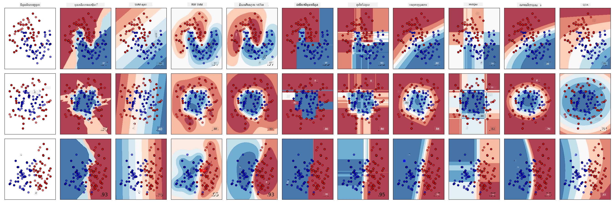
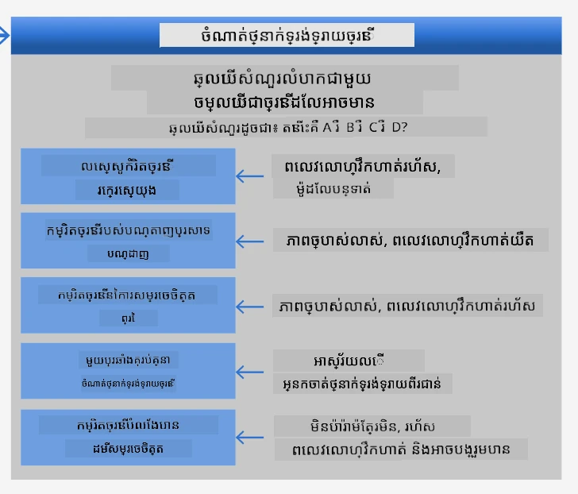
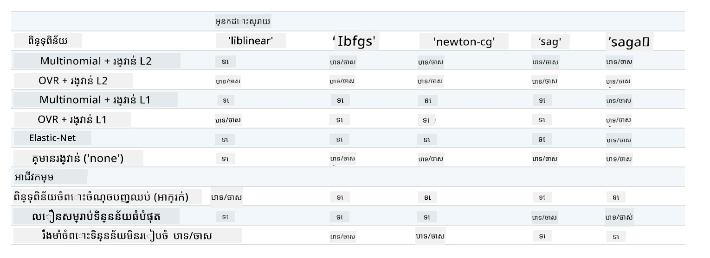

# កម្មវិធីចាត់ថ្នាក់ម្ហូបចំណី 1

នៅក្នុងមេរៀននេះ អ្នកនឹងប្រើទិន្នន័យដែលអ្នកបានរក្សាទុកពីមេរៀនមុន ដែលពេញជាមួយទិន្នន័យត្រឹមត្រូវ ស្អាត និងទាក់ទងនឹងម្ហូបចំណីទាំងអស់។

អ្នកនឹងប្រើទិន្នន័យនេះជាមួយកម្មវិធីចាត់ថ្នាក់មុខជាច្រើន ដើម្បី _ធ្វើការប៉ាន់ស្មានម្ហូបជាតិនាក់ជាក់លាក់ដោយផ្អែកលើក្រុមគ្រឿងផ្សំមួយ_. ខណៈពេលធ្វើម្តងនេះ អ្នកនឹងរៀនបន្ថែមអំពីវិធីដែលអាល់ហ្គូរីធម៌អាចប្រើបានសម្រាប់ភារកិច្ចចាត់ថ្នាក់។

## [មេរៀនជំនួញមុន](https://ff-quizzes.netlify.app/en/ml/)
# ការរៀបចំ

សន្មតបើអ្នកបានបញ្ចប់ [មេរៀនទី 1](../1-Introduction/README.md) សូមប្រាកដថាឯកសារ _cleaned_cuisines.csv_ មាននៅក្នុងថតឫស `/data` សម្រាប់មេរៀនបួននេះ។

## លំហាត់ - ប៉ាន់ស្មានម្ហូបជាតិនាក់

1. ធ្វើការងារនៅក្នុងថត _notebook.ipynb_ របស់មេរៀននេះ ដើម្បីនាំចូលឯកសារនោះជាមួយបណ្ណាល័យ Pandas៖

    ```python
    import pandas as pd
    cuisines_df = pd.read_csv("../data/cleaned_cuisines.csv")
    cuisines_df.head()
    ```

    ទិន្នន័យមានរូបរាងដូចខាងក្រោម៖

|     | Unnamed: 0 | cuisine | almond | angelica | anise | anise_seed | apple | apple_brandy | apricot | armagnac | ... | whiskey | white_bread | white_wine | whole_grain_wheat_flour | wine | wood | yam | yeast | yogurt | zucchini |
| --- | ---------- | ------- | ------ | -------- | ----- | ---------- | ----- | ------------ | ------- | -------- | --- | ------- | ----------- | ---------- | ----------------------- | ---- | ---- | --- | ----- | ------ | -------- |
| 0   | 0          | indian  | 0      | 0        | 0     | 0          | 0     | 0            | 0       | 0        | ... | 0       | 0           | 0          | 0                       | 0    | 0    | 0   | 0     | 0      | 0        |
| 1   | 1          | indian  | 1      | 0        | 0     | 0          | 0     | 0            | 0       | 0        | ... | 0       | 0           | 0          | 0                       | 0    | 0    | 0   | 0     | 0      | 0        |
| 2   | 2          | indian  | 0      | 0        | 0     | 0          | 0     | 0            | 0       | 0        | ... | 0       | 0           | 0          | 0                       | 0    | 0    | 0   | 0     | 0      | 0        |
| 3   | 3          | indian  | 0      | 0        | 0     | 0          | 0     | 0            | 0       | 0        | ... | 0       | 0           | 0          | 0                       | 0    | 0    | 0   | 0     | 0      | 0        |
| 4   | 4          | indian  | 0      | 0        | 0     | 0          | 0     | 0            | 0       | 0        | ... | 0       | 0           | 0          | 0                       | 0    | 0    | 0   | 0     | 1      | 0        |
  

1. ឥឡូវនេះ នាំចូលបណ្ណាល័យបន្ថែមមួយចំនួនទៀត៖

    ```python
    from sklearn.linear_model import LogisticRegression
    from sklearn.model_selection import train_test_split, cross_val_score
    from sklearn.metrics import accuracy_score,precision_score,confusion_matrix,classification_report, precision_recall_curve
    from sklearn.svm import SVC
    import numpy as np
    ```

1. បំបែកកូអរដោនាតេ X និង y ទៅជាdfពីរប្រភេទសម្រាប់ហ្វឹកហាត់។ `cuisine` អាចជាដាតាហ្វ្រេសសម្រាប់ស្លាក៖

    ```python
    cuisines_label_df = cuisines_df['cuisine']
    cuisines_label_df.head()
    ```

    វានឹងមានរូបរាងដូចខាងក្រោម៖

    ```output
    0    indian
    1    indian
    2    indian
    3    indian
    4    indian
    Name: cuisine, dtype: object
    ```

1. លុបជួរឈរដែលមានឈ្មោះ `Unnamed: 0` និងជួរឈរ `cuisine` ដោយហៅ `drop()`។ រក្សាទុកទិន្នន័យសល់ជាលក្ខណៈសម្បត្តិសម្រាប់ហ្វឹកហាត់៖

    ```python
    cuisines_feature_df = cuisines_df.drop(['Unnamed: 0', 'cuisine'], axis=1)
    cuisines_feature_df.head()
    ```

    លក្ខណៈសម្បត្តិរបស់អ្នកមានរូបរាងដូចខាងក្រោម៖

|      | almond | angelica | anise | anise_seed | apple | apple_brandy | apricot | armagnac | artemisia | artichoke |  ... | whiskey | white_bread | white_wine | whole_grain_wheat_flour | wine | wood |  yam | yeast | yogurt | zucchini |
| ---: | -----: | -------: | ----: | ---------: | ----: | -----------: | ------: | -------: | --------: | --------: | ---: | ------: | ----------: | ---------: | ----------------------: | ---: | ---: | ---: | ----: | -----: | -------: |
|    0 |      0 |        0 |     0 |          0 |     0 |            0 |       0 |        0 |         0 |         0 |  ... |       0 |           0 |          0 |                       0 |    0 |    0 |    0 |     0 |      0 |        0 | 0 |
|    1 |      1 |        0 |     0 |          0 |     0 |            0 |       0 |        0 |         0 |         0 |  ... |       0 |           0 |          0 |                       0 |    0 |    0 |    0 |     0 |      0 |        0 | 0 |
|    2 |      0 |        0 |     0 |          0 |     0 |            0 |       0 |        0 |         0 |         0 |  ... |       0 |           0 |          0 |                       0 |    0 |    0 |    0 |     0 |      0 |        0 | 0 |
|    3 |      0 |        0 |     0 |          0 |     0 |            0 |       0 |        0 |         0 |         0 |  ... |       0 |           0 |          0 |                       0 |    0 |    0 |    0 |     0 |      0 |        0 | 0 |
|    4 |      0 |        0 |     0 |          0 |     0 |            0 |       0 |        0 |         0 |         0 |  ... |       0 |           0 |          0 |                       0 |    0 |    0 |    0 |     0 |      1 |        0 | 0 |

ឥឡូវអ្នករួចរាល់សម្រាប់ហ្វឹកហាត់ម៉ូដែលរបស់អ្នកហើយ!

## ការជ្រើសរើសកម្មវិធីចាត់ថ្នាក់

ឥឡូវនេះទិន្នន័យរបស់អ្នកបានស្អាត និងរួចរាល់សម្រាប់ហ្វឹកហាត់ អ្នកត្រូវតែសម្រេចថា អាល់ហ្គូរីធម៌ណាដែលត្រូវប្រើសម្រាប់ភារកិច្ចនេះ។

Scikit-learn ដាក់ក្រុមការចាត់ថ្នាក់នៅក្រោមការសិក្សាប្រភេទៈអនុគ្រោះ (Supervised Learning) ហើយក្នុងប្រភេទនោះ អ្នកនឹងរកឃើញវិធីជាច្រើនសម្រាប់ចាត់ថ្នាក់។ [ភាពខុសគ្នា](https://scikit-learn.org/stable/supervised_learning.html) គឺអាចធ្វើអោយច្របូកច្របល់នៅដំណើរមុន។ វិធីសាស្រ្តខាងក្រោមទាំងអស់រួមបញ្ចូលបច្ចេកទេសចាត់ថ្នាក់៖

- ម៉ូដែលបន្ទាត់
- ម៉ាស៊ីនគាំទ្រតំបន់
- ការវិលត្រឡប់ក្រាដីអង់តឹកប្លូ
- មិត្តជិតខាង
- ដំណើរការហ្គោស៊ីយ៉ង់
- រុក្ខជាតិនិរន្តរភាព
- វិធីសាស្រ្តក្រុម (voting Classifier)
- អាល់ហ្គូរីធម៌ច្រើនថ្នាក់ និងច្រើនប្រភេទលទ្ធផល (multiclass and multilabel classification, multiclass-multioutput classification)

> អ្នកក៏អាចប្រើ [បណ្ដាញណឺរ៉ាល់សម្រាប់ចាត់ថ្នាក់ទិន្នន័យ](https://scikit-learn.org/stable/modules/neural_networks_supervised.html#classification) ដែរ ប៉ុន្តែវាអ្នកខុសពីស៊ក្តមេរៀននេះ។

### តើត្រូវជ្រើសរើសកម្មវិធីចាត់ថ្នាក់ណា?

ដូច្នេះ អ្នកគួរជ្រើសរើសកម្មវិធីចាត់ថ្នាក់ណា? ជាញឹកញាប់ ការរត់តាមកម្មវិធីជាច្រើន ហើយសំរាប់ស្វែងរកលទ្ធផលល្អគឺជាវិធីសាកល្បងមួយ។ Scikit-learn នាំមកនូវ [ការប្រៀបធៀបប្រភេទជាក្បាលតាបផ្ទាំង](https://scikit-learn.org/stable/auto_examples/classification/plot_classifier_comparison.html) លើទិន្នន័យដែលបានបង្កើត ជាមួយទម្រង់ KNeighbors, SVC ជាផ្លូវពីរប្រភេទ, GaussianProcessClassifier, DecisionTreeClassifier, RandomForestClassifier, MLPClassifier, AdaBoostClassifier, GaussianNB និង QuadraticDiscrinationAnalysis បង្ហាញលទ្ធផលជាមួយនឹងរូបភាព៖ 


> គំនូសបង្ហាញត្រូវបានបង្កើតនៅលើឯកសារណែនាំរបស់ Scikit-learn

> AutoML ដំណោះស្រាយបញ្ហានេះយ៉ាងត្រឹមត្រូវដោយរត់ការប្រៀបធៀបទាំងនេះនៅលើពពក អនុញ្ញាតឱ្យអ្នកជ្រើសរើសអាល់ហ្គូរីធម៌ល្អបំផុតសម្រាប់ទិន្នន័យរបស់អ្នក។ សូមសាកល្បង [នៅទីនេះ](https://docs.microsoft.com/learn/modules/automate-model-selection-with-azure-automl/?WT.mc_id=academic-77952-leestott)

### វិធីល្អជាងនេះ

វិធីល្អជាងការប៉ាន់ស្មានបែបចល័ត គឺតាមដានគំនិតនៅលើ [ប័ណ្ណ Cheat សម្រាប់ ML](https://docs.microsoft.com/azure/machine-learning/algorithm-cheat-sheet?WT.mc_id=academic-77952-leestott) ដែលអាចទាញយកបាន។ នៅទីនេះ យើងស្វែងឃើញថា សម្រាប់បញ្ហាច្រើនថ្នាក់ អ្នកមានជម្រើសខ្លះ៖


> ផ្នែកមួយនៃសៀវភៅ Cheat Algorithm របស់ Microsoft សង្ខេបជម្រើសចាត់ថ្នាក់ច្រើនថ្នាក់

✅ ទាញយកសៀវភៅ Cheat នេះ ព្រីនភ្លាម ហើយដាក់វាឲ្យនៅលើជញ្ជាំងផ្ទះរបស់អ្នក!

### ការពន្យល់

មកមើលថាតើយើងអាចពន្យល់វិធីនានាក្រោមកំណត់តម្រូវបានណា៖

- **បណ្ដាញណឺរ៉ែលធ្ងន់ពេក**។ ប្រភេទទិន្នន័យស្អាត ប៉ុន្តិល្អិត បូកនឹងការដំណើរការហ្វឹកហាត់នៅក្នុងកុំព្យូទ័រសៀមទារគន៍ បណ្ដាញណឺរ៉េលធ្ងន់ពេកសម្រាប់ភារកិច្ចនេះ។
- **គ្មានកម្មវិធីចាត់ពីរថ្នាក់**។ យើងមិនប្រើកម្មវិធីចាត់ពីរថ្នាក់ទេ ដូច្នេះមិនអាចប្រើ one-vs-all បាន។
- **រុក្ខជាតិចំណេក ឬបម្រែបម្រួលលូជាក់លាក់អាចបានប្រើ**។ រុក្ខជាតិនិរន្តរភាពអាចធ្វើការ ឬបម្រែបម្រួលលូជាក់លាក់សម្រាប់ទិន្នន័យច្រើនថ្នាក់។
- **រុក្ខជាតិចំណេកបង្រៀបពហុថ្នាក់ដោះស្រាយបញ្ហាផ្សេង**។ រុក្ខជាតិចំណេកបង្រៀបពហុថ្នាក់សមស្របសម្រាប់ភារកិច្ចមិនប៉ារ៉ាម៉ែត្រ ឧ. សម្រាប់សមាសធាតុបង្កើតលំដាប់ ដូច្នេះវាមិនមានអត្ថប្រយោជន៍សម្រាប់យើងទេ។

### ប្រើប្រាស់ Scikit-learn 

យើងនឹងប្រើ Scikit-learn សម្រាប់វិភាគទិន្នន័យរបស់យើង។ ទោះជាយ៉ាងណាក៏ដោយ មានវិធីជាច្រើនសម្រាប់ប្រើប្រាស់បម្រែបម្រួលលូជាក់លាក់នៅក្នុង Scikit-learn។ សូមពិនិត្យមើល [ប៉ារ៉ាម៉ែត្រ](https://scikit-learn.org/stable/modules/generated/sklearn.linear_model.LogisticRegression.html?highlight=logistic%20regressio#sklearn.linear_model.LogisticRegression) ដែលត្រូវបញ្ជូន។

ចម្បងមានប៉ារ៉ាម៉ែត្រ ពីរដ៏សំខាន់ - `multi_class` និង `solver` - ដែលយើងត្រូវកំណត់ ពេលឲ្យ Scikit-learn ធ្វើបម្រែបម្រួលលូជាក់លាក់។ តម្លៃ `multi_class` កំណត់អាកប្បកិរិយាមួយ។ តម្លៃ `solver` ជាអាល់ហ្គូរីធម៌ដែលប្រើប្រាស់។ មិនទាំងអស់លក្ខណៈអាល់ហ្គូរីធម៌អាចប្រើជាមួយ `multi_class` ទាំងអស់បានទេ។

តាមការពិពណ៌នា ក្នុងករណីច្រើនថ្នាក់ អាល់ហ្គូរីធម៌ហ្វឹកហាត់៖

- **ប្រើផែនការមួយ-vs-សល់ (OvR)** ប្រសិនបើជម្រើស `multi_class` ដាក់តម្លៃជា `ovr`
- **ប្រើការបាត់បង់ក្រូសអេនត្រូពី (cross-entropy loss)** ប្រសិនបើជម្រើស `multi_class` ដាក់តម្លៃជា `multinomial`។ (ពេលនេះជម្រើស `multinomial` គឺគ្រប់គ្រងតែដោយ ‘lbfgs’, ‘sag’, ‘saga’ និង ‘newton-cg’ solvers ទេ)"

> 🎓 "ផែនការ" នៅទីនេះអាចជាមួយ ‘ovr’ (មួយ-vs-សល់) ឬ ‘multinomial’។ ព្រោះបម្រែបម្រួលលូជាក់លាក់គឺពិតជាត្រូវបង្កើតសម្រាប់ចំណាត់ថ្នាក់ពីរថ្នាក់ schemes ទាំងនេះអនុញ្ញាតឲ្យវាទ្រទ្រង់ល្អប្រសើរក្នុងរៀបចំច្រើនថ្នាក់បាន។ [ប្រភព](https://machinelearningmastery.com/one-vs-rest-and-one-vs-one-for-multi-class-classification/)

> 🎓 "Solver" កំណត់ថា "អាល់ហ្គូរីធម៌ដែលត្រូវប្រើក្នុងបញ្ហាគណនា​ងារអុបទីម៉ិច"។ [ប្រភព](https://scikit-learn.org/stable/modules/generated/sklearn.linear_model.LogisticRegression.html?highlight=logistic%20regressio#sklearn.linear_model.LogisticRegression).

Scikit-learn ផ្តល់តារាងនេះដើម្បីពន្យល់ពីរបៀបដែល solvers ដោះស្រាយករណីប្រឈមផ្សេងៗរបស់រចនាសម្ព័ន្ធទិន្នន័យផ្ទាំងផ្សេងៗ៖



## លំហាត់ - បំបែកទិន្នន័យ

យើងអាចផ្តោតលើបម្រែបម្រួលលូជាក់លាក់សម្រាប់លំហាត់ហ្វឹកហាត់ដំបូង គឺបានរៀនកន្លងមក។

បំបែកទិន្នន័យរបស់អ្នកជាក្រុមហ្វឺងហ្វឺន និងក្រុមតេស្ត ដោយហៅ `train_test_split()`៖

```python
X_train, X_test, y_train, y_test = train_test_split(cuisines_feature_df, cuisines_label_df, test_size=0.3)
```

## លំហាត់ - ប្រើបម្រែបម្រួលលូជាក់លាក់

ដោយសារតែអ្នកកំពុងប្រើករណីច្រើនថ្នាក់ អ្នកត្រូវជ្រើសរើស _ផែនការ_ មួយ និង _solver_ មួយ។

ប្រើ LogisticRegression ជាមួយកំណត់ multiclass ហើយជ្រើស `liblinear` solver សម្រាប់ហ្វឹកហាត់។

1. បង្កើតបម្រែបម្រួលលូជាក់លាក់ ដែល `multi_class` ដាក់ `ovr` និង solver ដាក់ `liblinear`៖

    ```python
    lr = LogisticRegression(multi_class='ovr',solver='liblinear')
    model = lr.fit(X_train, np.ravel(y_train))
    
    accuracy = model.score(X_test, y_test)
    print ("Accuracy is {}".format(accuracy))
    ```

    ✅ សាកល្បង solver ផ្សេងៗដូចជា `lbfgs` ដែលភាគច្រើនត្រូវបានកំណត់ជាធរមាន

    > ចំណាំ សូមប្រើ Pandas [`ravel`](https://pandas.pydata.org/pandas-docs/stable/reference/api/pandas.Series.ravel.html) ដើម្បីបង្រួមទិន្នន័យ ប្រសិនបើចាំបាច់។

    ភាពត្រឹមត្រូវល្អ ច្រើនជាង **80%**!

1. អ្នកអាចមើលម៉ូដែលនេះដំណើរការដោយសាកល្បងជួរដេក មួយ (#50):

    ```python
    print(f'ingredients: {X_test.iloc[50][X_test.iloc[50]!=0].keys()}')
    print(f'cuisine: {y_test.iloc[50]}')
    ```

    លទ្ធផលត្រូវបានបោះពុម្ព:

   ```output
   ingredients: Index(['cilantro', 'onion', 'pea', 'potato', 'tomato', 'vegetable_oil'], dtype='object')
   cuisine: indian
   ```

   ✅ សាកល្បងជួរឈរផ្សេងៗ ហើយពិនិត្យលទ្ធផល
1. ជ្រាបចូលជាងនេះ អ្នកអាចពិនិត្យមើលភាពត្រឹមត្រូវនៃការទាយនេះ៖

    ```python
    test= X_test.iloc[50].values.reshape(-1, 1).T
    proba = model.predict_proba(test)
    classes = model.classes_
    resultdf = pd.DataFrame(data=proba, columns=classes)
    
    topPrediction = resultdf.T.sort_values(by=[0], ascending = [False])
    topPrediction.head()
    ```

    លទ្ធផលត្រូវបានបោះពុម្ព - ម្ហូបឥណ្ឌា គឺជាការសន្និដ្ឋានល្អបំផុត រួមមានប្រហែលមានភាពជាក់លាក់ល្អ៖

    |          |        0 |
    | -------: | -------: |
    |   indian | 0.715851 |
    |  chinese | 0.229475 |
    | japanese | 0.029763 |
    |   korean | 0.017277 |
    |     thai | 0.007634 |

    ✅ តើអ្នកអាចពន្យល់បានទេថាហេតុអ្វីបានជាគំរូនេះជឿជាក់ថា នេះគឺជាម្ហូបឥណ្ឌា?

1. ទទួលបានព័ត៌មានលម្អិតបន្ថែម ដោយបោះពុម្ពរបាយការណ៍ចាត់ថ្នាក់ ដូចអ្នកបានធ្វើនៅមេរៀនរេហ្គ្រេស្យុង:

    ```python
    y_pred = model.predict(X_test)
    print(classification_report(y_test,y_pred))
    ```

    |              | precision | recall | f1-score | support |
    | ------------ | --------- | ------ | -------- | ------- |
    | chinese      | 0.73      | 0.71   | 0.72     | 229     |
    | indian       | 0.91      | 0.93   | 0.92     | 254     |
    | japanese     | 0.70      | 0.75   | 0.72     | 220     |
    | korean       | 0.86      | 0.76   | 0.81     | 242     |
    | thai         | 0.79      | 0.85   | 0.82     | 254     |
    | accuracy     | 0.80      | 1199   |          |         |
    | macro avg    | 0.80      | 0.80   | 0.80     | 1199    |
    | weighted avg | 0.80      | 0.80   | 0.80     | 1199    |

## 🚀Challenge

នៅក្នុងមេរៀននេះ អ្នកបានប្រើទិន្នន័យសំអាតរបស់អ្នក ដើម្បីបង្កើតគំរូរៀនម៉ាស៊ីនដែលអាចទាយម្ហូបជាតិសញ្ជាតិមួយដោយផ្អែកលើរបៀបជ្រើសរើសគ្រឿងផ្សំមួយចំនួន។ ចំណាយពេលមួយតិច ដើម្បីអានក្រមជាច្រើនដែល Scikit-learn ផ្តល់ជូនសម្រាប់ចាត់ថ្នាក់ទិន្នន័យ។ ជ្រាបចូលលម្អិតពីមូលដ្ឋាននៃ 'solver' ដើម្បីយល់ពីអ្វីដែលកើតមាននៅខាងក្រោយមុខងារ។

## [តេស្តបន្ទាប់មេរៀន](https://ff-quizzes.netlify.app/en/ml/)

## ពិនិត្យឡើងវិញ និង រៀនដោយខ្លួនឯង

ជ្រាបចូលជ្រៅបន្ថែមពីគណិតវិទ្យាខាងក្រោយលូជាឡូជីស្ទិច regression នៅ [មេរៀននេះ](https://people.eecs.berkeley.edu/~russell/classes/cs194/f11/lectures/CS194%20Fall%202011%20Lecture%2006.pdf)
## កិច្ចការផ្ទះ

[សិក្សាអំពី solvers](assignment.md)

---

<!-- CO-OP TRANSLATOR DISCLAIMER START -->
**ការបដិសេធ**៖  
ឯកសារនេះត្រូវបានបកប្រែដោយប្រើសេវាកម្មបកប្រែ AI [Co-op Translator](https://github.com/Azure/co-op-translator)។ ខណៈពេលដែលយើងខិតខំសម្រាប់ភាពត្រឹមត្រូវ សូមជ្រាបថាការបកប្រែដោយស្វ័យប្រវត្តិអាចមានកំហុស ឬភាពមិនត្រឹមត្រូវ។ ឯកសារដើមនៅភាសាម្ចាស់ត្រូវបានគេពិចារណាថាជាឯកសារដើមដែលមានអនុភាព។ សម្រាប់ព័ត៌មានសំខាន់ៗ គួរតែប្រើការបកប្រែដោយមនុស្សឯកទេសជាប់ផ្លូវការជាជម្រើសល្អបំផុត។ យើងមិនទទួលខុសត្រូវចំពោះការយល់ច្រឡំ ឬការបកប្រែឆ្គងណាមួយដែលកើតឡើងពីការប្រើប្រាស់ការបកប្រែនេះឡើយ។
<!-- CO-OP TRANSLATOR DISCLAIMER END -->