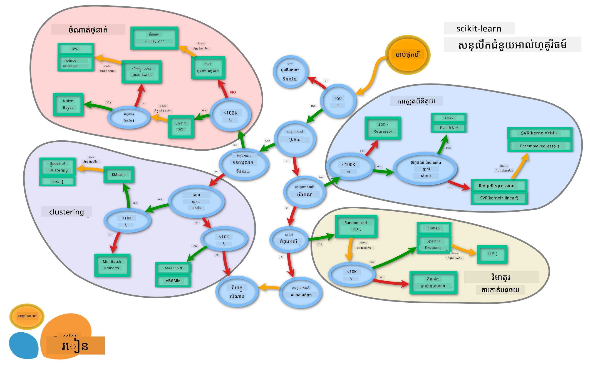

# ការបែងចែកចំណាត់ថ្នាក់ម្ហូប 2

នៅក្នុងមេរៀនបែងចែកចំណាត់ថ្នាក់ទីពីរនេះ អ្នកនឹងស្វែងយល់ពីវិធីបន្ថែមទៀតដើម្បីចាត់ថ្នាក់ទិន្នន័យលេខ។ អ្នកនឹងរៀនពីផលប៉ះពាល់នៃការជ្រើសរើសឧបករណ៍ចាត់ថ្នាក់មួយបើដាក់ប្រៀបធៀបនឹងមួយផ្សេងទៀតផងដែរ។

## [សំណួរពីមុនមេរៀន](https://ff-quizzes.netlify.app/en/ml/)

### លក្ខខណ្ឌមុន

យើងសន្និដ្ឋានថាអ្នកបានបញ្ចប់មេរៀនមុនៗ ហើយមានឯកសារទិន្នន័យបានធ្វើការសំអាតស្អាត រក្សាទុកនៅក្នុងថត `data` មានឈ្មោះ _cleaned_cuisines.csv_ នៅក្នុងឫស្សីដៃថតនេះដែលមាន៤មេរៀន។

### ការរៀបចំ

យើងបានបញ្ចូលឯកសារ _notebook.ipynb_ របស់អ្នកដែលមានទិន្នន័យបានស្អាត ហើយបានបំបែកវាជា dataframe X និង y រួចរាល់សម្រាប់ដំណើរការសាងសង់ម៉ូដែល។

## ផែនទីចាត់ថ្នាក់

មុននេះ អ្នកបានរៀនអំពីជម្រើសនានាជាមួយ Microsoft cheat sheet សម្រាប់ចាត់ថ្នាក់ទិន្នន័យ។ Scikit-learn ផ្ដល់ cheat sheet ប្រភេទដូចគ្នា ប៉ុន្តែមានការបែងចែកលម្អិតជាង ដែលអាចជួយបន្ថែមក្នុងការជ្រើសរើស estimators (ពាក្យផ្សេងសម្រាប់ឧបករណ៍ចាត់ថ្នាក់)៖


> ទិដ្ឋភាព៖ [ចូលទៅកាន់ផែនទីនេះតាមអនឡាញ](https://scikit-learn.org/stable/tutorial/machine_learning_map/) ហើយចុចតាមផ្លូវដើម្បីអានឯកសារពាក់ព័ន្ធ។

### ផែនការ

ផែនទីនេះមានប្រយោជន៍ខ្លាំងនៅពេលអ្នកមានជំនាញច្បាស់លាស់ចំពោះទិន្នន័យ​របស់អ្នក ដូច្នេះ អ្នកអាច 'ដើរដោយ' តាមផ្លូវក្នុងការជ្រើសរើសចំណាត់ថ្នាក់៖

- យើងមាន >50 ឧទាហរណ៍
- យើងចង់ទាយថាជាក្រុមប្រភេទណា
- យើងមានទិន្នន័យបានតម្រៀបស្លាកហើយ
- យើងមានឧទាហរណ៍តិចជាង 100K
- ✨ យើងអាចជ្រើស Linear SVC
- បើវាមិនដំណើរការ គឺនៅព្រោះយើងមានទិន្នន័យលេខ
    - យើងអាចសាកល្បង ✨ KNeighbors Classifier
      - បើវាមិនដំណើរការ សាកល្បង ✨ SVC និង ✨ Ensemble Classifiers

ផ្លូវនេះគឺជាការតាមដានដែលមានប្រយោជន៍ខ្លាំង។

## ហាត់ប្រាណ - បំបែកទិន្នន័យ

យោងតាមផ្លូវនេះ យើងគួរចាប់ផ្តើមដោយនាំចូលបណ្ណាល័យខ្លះៗដែលត្រូវការប្រើ។

1. នាំចូលបណ្ណាល័យដែលត្រូវការ៖

    ```python
    from sklearn.neighbors import KNeighborsClassifier
    from sklearn.linear_model import LogisticRegression
    from sklearn.svm import SVC
    from sklearn.ensemble import RandomForestClassifier, AdaBoostClassifier
    from sklearn.model_selection import train_test_split, cross_val_score
    from sklearn.metrics import accuracy_score,precision_score,confusion_matrix,classification_report, precision_recall_curve
    import numpy as np
    ```

1. បំបែកទិន្នន័យបណ្តុះបណ្តាល និងសាកល្បងរបស់អ្នក៖

    ```python
    X_train, X_test, y_train, y_test = train_test_split(cuisines_features_df, cuisines_label_df, test_size=0.3)
    ```

## ឧបករណ៍ចាត់ថ្នាក់ Linear SVC

Support-Vector clustering (SVC) គឺជាកូនខ្លួនមួយនៃគ្រួសារឧបករណ៍ម៉ាសីនស្វ័យប្រវត្តិ Support-Vector (រៀនបន្ថែមអំពីវាខាងក្រោម)។ វិធីសាស្រ្តនេះ អ្នកអាចជ្រើស `'kernel'` ដើម្បីសម្រេចថាតើចែតូចLabelsយ៉ាងដូចម្តេច។ ប៉ារ៉ាម៉ែត្រ `'C'` មានន័យថា `'regularization'` ជាតុល្យភាពដែលគ្រប់គ្រងឥទ្ធិពលនៃប៉ារ៉ាម៉ែត្រ។ Kernel អាចជាតួអ្នកជាច្រើន [មួយចំនួន](https://scikit-learn.org/stable/modules/generated/sklearn.svm.SVC.html#sklearn.svm.SVC); នៅទីនេះ យើងកំណត់វាថា `'linear'` ដើម្បីធានាថាយើងប្រើ linear SVC។ Probability ត្រូវបានកំណត់ត្រឹម `'false'`; នៅទីនេះ យើងកំណត់វាថា `'true'` ដើម្បីប្រមូលការប៉ាន់ស្មានប្រូបាប៊ីលីទី។ យើងកំណត់ random state ទៅជា `'0'` ដើម្បីរំលោភទិន្នន័យ ដើម្បីទទួលបានប្រូបាប៊ីលីទី។

### ហាត់ប្រាណ - អនុវត្ត Linear SVC

ចាប់ផ្តើមដោយបង្កើតអារ៉េ (array) នៃឧបករណ៍ចាត់ថ្នាក់។ អ្នកនឹងបញ្ចូលបន្ថែមទៅក្នុងអារ៉េនេះ ដោយជាការបន្តជាដំណាក់កាលពាក់ព័ន្ធពេលដែលយើងសាកល្បង។

1. ចាប់ផ្តើមដោយ Linear SVC៖

    ```python
    C = 10
    # បង្កើតអ្នកចាត់ថ្នាក់ខុសៗគ្នា។
    classifiers = {
        'Linear SVC': SVC(kernel='linear', C=C, probability=True,random_state=0)
    }
    ```

2. បណ្តុះម៉ូដែលរបស់អ្នកជាមួយ Linear SVC ហើយបោះពុម្ពរបាយការណ៍មួយ៖

    ```python
    n_classifiers = len(classifiers)
    
    for index, (name, classifier) in enumerate(classifiers.items()):
        classifier.fit(X_train, np.ravel(y_train))
    
        y_pred = classifier.predict(X_test)
        accuracy = accuracy_score(y_test, y_pred)
        print("Accuracy (train) for %s: %0.1f%% " % (name, accuracy * 100))
        print(classification_report(y_test,y_pred))
    ```

    លទ្ធផលគឺល្អណាស់៖

    ```output
    Accuracy (train) for Linear SVC: 78.6% 
                  precision    recall  f1-score   support
    
         chinese       0.71      0.67      0.69       242
          indian       0.88      0.86      0.87       234
        japanese       0.79      0.74      0.76       254
          korean       0.85      0.81      0.83       242
            thai       0.71      0.86      0.78       227
    
        accuracy                           0.79      1199
       macro avg       0.79      0.79      0.79      1199
    weighted avg       0.79      0.79      0.79      1199
    ```

## ឧបករណ៍ចាត់ថ្នាក់ K-Neighbors

K-Neighbors គឺជាផ្នែកមួយនៃគ្រួសារពីរ “neighbors” នៃគម្រោងម៉ាស៊ីនស្វ័យប្រវត្តិ ដែលអាចប្រើសម្រាប់ការសិក្សាដោយមានមគ្គុទេសក៍ និងគ្មានមគ្គុទេសក៍។ វិធីសាស្រ្តនេះ បង្កើតចំនួនចាំបាច់នៃចំណុចមួយហើយទិន្នន័យត្រូវបានប្រមូលជុំវិញចំណុចទាំងនេះ ដើម្បីអាចទាយបានស្លាកទូទៅសម្រាប់ទិន្នន័យ។

### ហាត់ប្រាណ - អនុវត្តឧបករណ៍ចាត់ថ្នាក់ K-Neighbors

ឧបករណ៍ចាត់ថ្នាក់មុនគឺល្អ ហើយដំណើរការល្អជាមួយទិន្នន័យ ប៉ុន្តែប្រហែលជាយើងអាចទទួលបានភាពត្រឹមត្រូវល្អជាងនេះទៀត។ សាកល្បងឧបករណ៍ចាត់ថ្នាក់ K-Neighbors។

1. បន្ថែមមួយជួរដដែលទៅក្នុងអារ៉េឧបករណ៍ចាត់ថ្នាក់របស់អ្នក (បន្ថែមខ្ទង់ក្រោយមុខរបស់ Linear SVC)៖

    ```python
    'KNN classifier': KNeighborsClassifier(C),
    ```

    លទ្ធផលគឺអន់ជាងបន្តិច៖

    ```output
    Accuracy (train) for KNN classifier: 73.8% 
                  precision    recall  f1-score   support
    
         chinese       0.64      0.67      0.66       242
          indian       0.86      0.78      0.82       234
        japanese       0.66      0.83      0.74       254
          korean       0.94      0.58      0.72       242
            thai       0.71      0.82      0.76       227
    
        accuracy                           0.74      1199
       macro avg       0.76      0.74      0.74      1199
    weighted avg       0.76      0.74      0.74      1199
    ```

    ✅ រៀនអំពី [K-Neighbors](https://scikit-learn.org/stable/modules/neighbors.html#neighbors)

## Support Vector Classifier

Support-Vector classifiers គឺជាផ្នែកមួយនៃគ្រួសាររបស់ [Support-Vector Machine](https://wikipedia.org/wiki/Support-vector_machine) នៃវិធីសាស្រ្តម៉ាស៊ីនស្វ័យប្រវត្តិដែលប្រើសម្រាប់ភារកិច្ចចាត់ថ្នាក់ និងរ៉េហ្គ្រេស្យុង។ SVMs "ផែនទីឧទាហរណ៍បណ្តុះបណ្តាលទៅកាន់ចំណុចក្នុងលំហ" ដើម្បីបង្កើនចម្ងាយរវាងក្រុមប្រភេទពីរ។ ទិន្នន័យបន្ទាប់ត្រូវបានផែនទីទៅក្នុងលំហនេះដើម្បីអាចទាយជាក្រុមប្រភេទ។

### ហាត់ប្រាណ - អនុវត្ត Support Vector Classifier

សូមសាកល្បងដើម្បីទទួលបានភាពត្រឹមត្រូវល្អជាងនេះជាមួយ Support Vector Classifier។

1. បន្ថែមខ្ទង់ក្រោយ K-Neighbors item ហើយបន្ថែមជួរបន្ទាប់៖

    ```python
    'SVC': SVC(),
    ```

    លទ្ធផលគឺល្អខ្លាំង！

    ```output
    Accuracy (train) for SVC: 83.2% 
                  precision    recall  f1-score   support
    
         chinese       0.79      0.74      0.76       242
          indian       0.88      0.90      0.89       234
        japanese       0.87      0.81      0.84       254
          korean       0.91      0.82      0.86       242
            thai       0.74      0.90      0.81       227
    
        accuracy                           0.83      1199
       macro avg       0.84      0.83      0.83      1199
    weighted avg       0.84      0.83      0.83      1199
    ```

    ✅ រៀនអំពី [Support-Vectors](https://scikit-learn.org/stable/modules/svm.html#svm)

## Ensemble Classifiers

សូមតាមផ្លូវដល់ចុងក្រោយ ទោះបីជាការសាកល្បងមុនគឺល្អមែន។ ត្រូវសាកល្បង 'Ensemble Classifiers', ជាចម្បង Random Forest និង AdaBoost៖

```python
  'RFST': RandomForestClassifier(n_estimators=100),
  'ADA': AdaBoostClassifier(n_estimators=100)
```

លទ្ធផលគឺល្អណាស់ ពិសេសសម្រាប់ Random Forest៖

```output
Accuracy (train) for RFST: 84.5% 
              precision    recall  f1-score   support

     chinese       0.80      0.77      0.78       242
      indian       0.89      0.92      0.90       234
    japanese       0.86      0.84      0.85       254
      korean       0.88      0.83      0.85       242
        thai       0.80      0.87      0.83       227

    accuracy                           0.84      1199
   macro avg       0.85      0.85      0.84      1199
weighted avg       0.85      0.84      0.84      1199

Accuracy (train) for ADA: 72.4% 
              precision    recall  f1-score   support

     chinese       0.64      0.49      0.56       242
      indian       0.91      0.83      0.87       234
    japanese       0.68      0.69      0.69       254
      korean       0.73      0.79      0.76       242
        thai       0.67      0.83      0.74       227

    accuracy                           0.72      1199
   macro avg       0.73      0.73      0.72      1199
weighted avg       0.73      0.72      0.72      1199
```

✅ រៀនអំពី [Ensemble Classifiers](https://scikit-learn.org/stable/modules/ensemble.html)

វិធីសាស្រ្តនេះនៃម៉ាសីនស្វ័យប្រវត្តិ "បញ្ចូលការព្យាករណ៍របស់អ្នកវាយតម្លៃមូលដ្ឋានច្រើន" ដើម្បីធ្វើឱ្យគុណភាពម៉ូដែលល្អប្រសើរឡើង។ ក្នុងឧទាហរណ៍របស់យើង យើងបានប្រើ Random Trees និង AdaBoost។

- [Random Forest](https://scikit-learn.org/stable/modules/ensemble.html#forest), វិធីសាស្រ្តជាមធ្យមមួយ បង្កើត 'ព្រៃ' នៃ 'ដើមឈើសម្រេចចិត្ត' ដែលបញ្ចូលករណីចៃដន្យដើម្បីជៀសវាងការបង្រួមខ្លួន។ ប៉ារ៉ាម៉ែត្រ n_estimators ត្រូវបានកំណត់ទៅចំនួនដើមឈើ។

- [AdaBoost](https://scikit-learn.org/stable/modules/generated/sklearn.ensemble.AdaBoostClassifier.html) បណ្តុះឧបករណ៍ចាត់ថ្នាក់ទៅជាលំនាំទិន្នន័យហើយបន្ទាប់មកបន្ថែមចម្លងនៃឧបករណ៍ចាត់ថ្នាក់នោះទៅលើទិន្នន័យដដែល។ វាត្រួតពិនិត្យទម្ងន់នៃធាតុដែលបានចាត់ថ្នាក់ទាន់ត្រូវខុស ហើយកែប្រែការបណ្តុះឧបករណ៍បន្ទាប់ដើម្បីកែតម្រូវ។

---

## 🚀ការប្រកួតប្រជែង

ឧបករណ៍ទាំងនេះមានប៉ារ៉ាម៉ែត្រ​ច្រើនដែលអ្នកអាចកែប្រែបាន។ ស្រាវជ្រាវពីប៉ារ៉ាម៉ែត्रរចំណាំដែលមានដើមហើយគិតអំពីអ្វីដែលការកែប្រែប៉ារ៉ាម៉ែត្រเหล่านั้นនឹងមានផលប៉ះពាល់ដល់គុណភាពម៉ូដែលយ៉ាងដូចម្តេច។

## [សំណួរបន្ទាប់មកមេរៀន](https://ff-quizzes.netlify.app/en/ml/)

## ការត្រួតពិនិត្យ និងការសិក្សាផ្ទាល់ខ្លួន

មានពាក្យសំខាន់ពោរពេញក្នុងមេរៀនទាំងនេះ ដូច្នេះសូមចំណាយពេលមួយភ្លែតដើម្បីត្រួតពិនិត្យ [បញ្ជីនេះ](https://docs.microsoft.com/dotnet/machine-learning/resources/glossary?WT.mc_id=academic-77952-leestott) នៃពាក្យសំខាន់មានប្រយោជន៍!

## ការងារ 

[ការលេងប៉ារ៉ាម៉ែត្រ](assignment.md)

---

<!-- CO-OP TRANSLATOR DISCLAIMER START -->
**ការបដិសេធ**៖  
ឯកសារនេះត្រូវបានបកប្រែដោយប្រើសេវាកម្មបកប្រែ AI [Co-op Translator](https://github.com/Azure/co-op-translator)។ ខណៈពេលដែលយើងខំប្រឹងប្រែងរកភាពត្រឹមត្រូវ សូមជ្រាបថាការបកប្រែដោយស្វ័យប្រវត្តិអាចមានកំហុសឬកង្វល់ខ្វះខាតខ្លះ។ ឯកសារដើមនៅក្នុងភាសាតំណាងរបស់វាគួរត្រូវបានទទួលស្គាល់ជាដ៏មានអាណត្តិផលចម្បង។ សម្រាប់ព័ត៌មានដែលសំខាន់ គួរតែបកប្រែដោយអ្នកវៃជំនាញមនុស្ស។ យើងមិនទទួលខុសត្រូវចំពោះការយល់ច្រឡំ ឬការបកប្រែខុសណាមួយដែលកើតមានពីការប្រើប្រាស់ការបកប្រែនេះឡើយ។
<!-- CO-OP TRANSLATOR DISCLAIMER END -->