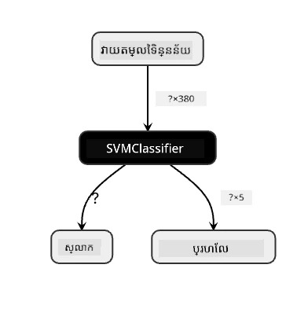
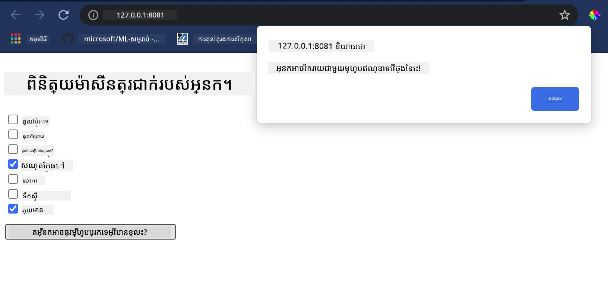

# កសាងកម្មវិធីេបសាយផ្តល់អត្ថសម្គាល់អំពីម្ហូប

នៅមេរៀននេះ អ្នកនឹងកសាងម៉ូដែលចាត់ថ្នាក់ដោយប្រើបច្ចេកទេសខ្លះៗដែលអ្នកបានរៀនពីមេរៀនមុនៗ និងដោយប្រើឃ្លើងទិន្នន័យម្ហូបឆ្ងាញ់ដែលបានប្រើជារឿយៗក្នុងស៊េរីនេះ។ លើសពីនេះ អ្នកនឹងកសាងកម្មវិធីេបសាយតូចមួយ ដើម្បីប្រើម៉ូដែលដែលបានរក្សាទុក ដោយប្រើ Onnx រចនាសម្ព័ន្ធក្នុងបណ្តាញ។

មួយក្នុងចំណោមការប្រើប្រាស់ប្រព័ន្ធស្វ័យប្រវត្តិមានប្រយោជន៍បំផុត គឺការកសាងប្រព័ន្ធផ្ដល់សំណើណែនាំ ហើយអ្នកអាចចាប់ផ្តើមជំហានដំបូងនោះថ្ងៃនេះ!

[](https://youtu.be/17wdM9AHMfg "Applied ML")

> 🎥 ចុចលើរូបភាពខាងលើសម្រាប់វីដេអូៈ Jen Looper សាងសង់កម្មវិធីេបសាយដោយប្រើទិន្នន័យអាហារចាត់ថ្នាក់

## [វាយតម្លៃមុនការបង្រៀន](https://ff-quizzes.netlify.app/en/ml/)

នៅមេរៀននេះ អ្នកនឹងរៀនពី៖

- របៀបកសាងម៉ូដែល ហើយរក្សាទុកវាជា Onnx ម៉ូដែល
- របៀបប្រើ Netron ដើម្បីពិនិត្យម៉ូដែល
- របៀបប្រើម៉ូដែលរបស់អ្នកនៅក្នុងកម្មវិធីេបសាយសម្រាប់ការប៉ាន់ស្មាន

## កសាងម៉ូដែលរបស់អ្នក

ការកសាងប្រព័ន្ធ ML អនុវត្តមានសារៈសំខាន់ក្នុងការប្រើប្រាស់បច្ចេកវិទ្យាទាំងនេះសម្រាប់ប្រព័ន្ធអាជីវកម្មរបស់អ្នក។ អ្នកអាចប្រើម៉ូដែលនៅក្នុងកម្មវិធីេបសាយរបស់អ្នក (ហើយដូច្នេះអាចប្រើវាក្នុងបរិបទក្រៅបណ្ដាញ ប្រសិនបើចាំបាច់) ដោយប្រើ Onnx។

ក្នុងមេរៀនមុន ([មេរៀនមុន](../../3-Web-App/1-Web-App/README.md)) អ្នកបានកសាងម៉ូដែល Regression នៃការកាន់កាប់ UFO ហើយរក្សាទុកវា "pickled" ហើយបានប្រើវានៅក្នុងកម្មវិធី Flask។ ទោះបីជាស្ថាបត្យកម្មនេះមានប្រយោជន៍ដល់ការយល់ដឹង ក៏វាជាកម្មវិធី Python ពេញលេញ ហើយតម្រូវការរបស់អ្នកអាចមានការប្រើប្រាស់កម្មវិធី JavaScript។

នៅក្នុងមេរៀននេះ អ្នកអាចកសាងប្រព័ន្ធមូលដ្ឋានដែលបង្កើតជាកកម្មវិធី JavaScript សម្រាប់ការប៉ាន់ស្មាន។ ប៉ុន្តែមុននឹងនោះ អ្នកត្រូវហ្វឹកហាត់ម៉ូដែល និងបម្លែងវាសម្រាប់ប្រើជាមួយ Onnx ។

## វាយតម្លៃ - ហ្វឹកហាត់ម៉ូដែលចាត់ថ្នាក់

ដំបូង សូមហ្វឹកហាត់ម៉ូដែលចាត់ថ្នាក់ ដោយប្រើឃ្លើងទិន្នន័យម្ហូបដដែលដែលបានសំអាត។

1. ចាប់ផ្តើមដោយនាំចូលបណ្ណាល័យមានប្រយោជន៍៖

    ```python
    !pip install skl2onnx
    import pandas as pd 
    ```

    អ្នកត្រូវការពាក្យ '[skl2onnx](https://onnx.ai/sklearn-onnx/)' ដើម្បីជួយបម្លែងម៉ូដែល Scikit-learn របស់អ្នកទៅទ្រង់ទ្រាយ Onnx ។

1. បន្ទាប់មក ប្រើព័ត៌មានរបស់អ្នកដូចជាដែលបានធ្វើក្នុងមេរៀនមុន ដោយអានឯកសារ CSV ដោយប្រើ `read_csv()`៖

    ```python
    data = pd.read_csv('../data/cleaned_cuisines.csv')
    data.head()
    ```

1. ចេញពីធាតុពីរដំបូងដែលមិនចាំបាច់ ហើយរក្សាទុកទិន្នន័យនៅសល់ជា 'X'៖

    ```python
    X = data.iloc[:,2:]
    X.head()
    ```

1. រក្សាទុកស្លាកជា 'y'៖

    ```python
    y = data[['cuisine']]
    y.head()
    
    ```

### ចាប់ផ្តើមដំណើរការហ្វឹកហាត់

យើងនឹងប្រើបណ្ណាល័យ 'SVC' ដែលមានភាពត្រឹមត្រូវល្អ។

1. នាំចូលបណ្ណាល័យដែលត្រឹមត្រូវពី Scikit-learn :

    ```python
    from sklearn.model_selection import train_test_split
    from sklearn.svm import SVC
    from sklearn.model_selection import cross_val_score
    from sklearn.metrics import accuracy_score,precision_score,confusion_matrix,classification_report
    ```

1. បំបែកទិន្នន័យហ្វឹកហាត់ និងសំណាកអត្រា៖

    ```python
    X_train, X_test, y_train, y_test = train_test_split(X,y,test_size=0.3)
    ```

1. កសាងម៉ូដែល SVC Classification ដូចដែលបានធ្វើក្នុងមេរៀនមុន៖

    ```python
    model = SVC(kernel='linear', C=10, probability=True,random_state=0)
    model.fit(X_train,y_train.values.ravel())
    ```

1. ឥឡូវនេះ សាកល្បងម៉ូដែលរបស់អ្នក ដោយហៅ `predict()`៖

    ```python
    y_pred = model.predict(X_test)
    ```

1. បោះពុម្ពរបាយការណ៍ចាត់ថ្នាក់ ដើម្បីពិនិត្យគុណភាពម៉ូដែល៖

    ```python
    print(classification_report(y_test,y_pred))
    ```

    ដូចដែលបានឃើញមុននេះ ត្រឹមត្រូវល្អ៖

    ```output
                    precision    recall  f1-score   support
    
         chinese       0.72      0.69      0.70       257
          indian       0.91      0.87      0.89       243
        japanese       0.79      0.77      0.78       239
          korean       0.83      0.79      0.81       236
            thai       0.72      0.84      0.78       224
    
        accuracy                           0.79      1199
       macro avg       0.79      0.79      0.79      1199
    weighted avg       0.79      0.79      0.79      1199
    ```

### បម្លែងម៉ូដែលរបស់អ្នកទៅ Onnx

សូមប្រាកដថាបម្លែងដោយប្រើលេខ Tensor ត្រឹមត្រូវ។ ឃ្លើងទិន្នន័យនេះមាន ៣៨០ សមាសធាតុ ដែលត្រូវសរសេរលេខនោះនៅក្នុង `FloatTensorType`:

1. បម្លែងដោយប្រើលេខ tensor ៣៨០ ។

    ```python
    from skl2onnx import convert_sklearn
    from skl2onnx.common.data_types import FloatTensorType
    
    initial_type = [('float_input', FloatTensorType([None, 380]))]
    options = {id(model): {'nocl': True, 'zipmap': False}}
    ```

1. បង្កើត onx ហើយរក្សាទុកជា​ឯកសារ **model.onnx**៖

    ```python
    onx = convert_sklearn(model, initial_types=initial_type, options=options)
    with open("./model.onnx", "wb") as f:
        f.write(onx.SerializeToString())
    ```

    > សេចក្ដីចំណាំ អ្នកអាចបញ្ជូន [ជម្រើស](https://onnx.ai/sklearn-onnx/parameterized.html) ក្នុងស្គ្រីបបម្លែងរបស់អ្នក។ ក្នុងករណីនេះ យើងបានបញ្ជូន 'nocl' ជា True និង 'zipmap' ជា False។ ដោយសារតែនេះជាម៉ូដែលចាត់ថ្នាក់ អ្នកមានជម្រើសដើម្បីដកចេញ ZipMap ដែលបង្កើតបញ្ជីវចនានុក្រម (មិនចាំបាច់)។ `nocl` មានន័យពីព័ត៌មានថ្នាក់បានរួមបញ្ចូលក្នុងម៉ូដែល។ បន្ថយទំហំម៉ូដែលរបស់អ្នកដោយកំណត់ `nocl` ជា 'True' ។ 

ការប្រើបញ្ចូលទាំងស្រុងនៃកំណត់ត្រានេះ នឹងកសាង Onnx ម៉ូដែល ហើយរក្សាទុកវាទៅក្នុងថតនេះ។

## មើលម៉ូដែលរបស់អ្នក

ម៉ូដែល Onnx មិនងាយស្រួលមើលក្នុង Visual Studio code ជាមូលដ្ឋានទេ ប៉ុន្តែមានកម្មវិធីសំណើមដោយឥតគិតថ្លៃមួយដែលអ្នកស្រាវជ្រាវជាច្រើនប្រើសម្រាប់មើលម៉ូដែល ដើម្បីធានាថាម៉ូដែលត្រូវបានសាងសង់យ៉ាងត្រឹមត្រូវ។ សូមទាញយក [Netron](https://github.com/lutzroeder/Netron) ហើយបើកឯកសារ model.onnx របស់អ្នក។ អ្នកអាចមើលម៉ូដែលសាមញ្ញរបស់អ្នកដូចរូបភាព ផ្តល់ជាមួយ ៣៨០​ inputs និងម៉ាស៊ីនចាត់ថ្នាក់៖



Netron គឺជាឧបករណ៍មានប្រយោជន៍សម្រាប់មើលម៉ូដែលរបស់អ្នក។

ឥឡូវអ្នកបានរួចរាល់ក្នុងការប្រើម៉ូដែលនេះនៅក្នុងកម្មវិធីេបសាយ។ មកកសាងកម្មវិធីមួយដែលមានប្រយោជន៍ពេលអ្នកមើលក្នុងទូរទឹកកក ហើយព្យាយាមស្វែងរកភាពចម្រុះនៃសមាសធាតុដែលនៅសល់ អ្នកអាចប្រើវាសម្រាប់ធ្វើម្ហូបជាមួយម្ហូបជាតិដែលម៉ូដែលសម្គាល់បាន។

## កសាងកម្មវិធីេបសាយផ្ដល់អត្ថសម្គាល់

អ្នកអាចប្រើម៉ូដែលរបស់អ្នកដោយផ្ទាល់នៅក្នុងកម្មវិធីេបសាយ។ រចនាសម្ព័ន្ធនេះអនុញ្ញាតឲ្យអ្នកដំណើរការវាផ្ទាល់និងក្រៅបណ្ដាញ ប្រសិនបើចាំបាច់។ ចាប់ផ្តើមដោយបង្កើតឯកសារ `index.html` ក្នុងថតដដែលដែលអ្នកបានរក្សាទុកឯកសារ `model.onnx` របស់អ្នក។

1. ក្នុងឯកសារ _index.html_ នេះ បន្ថែម markup ខាងក្រោម៖

    ```html
    <!DOCTYPE html>
    <html>
        <header>
            <title>Cuisine Matcher</title>
        </header>
        <body>
            ...
        </body>
    </html>
    ```

1. ឥឡូវនេះ ដំណើរការក្នុងស្លាក `body` បន្ថែម markup តូចមួយសម្រាប់បង្ហាញបញ្ជីប្រអប់ជ្រើសរើសដែលបង្ហាញសមាសធាតុខ្លះៗ៖

    ```html
    <h1>Check your refrigerator. What can you create?</h1>
            <div id="wrapper">
                <div class="boxCont">
                    <input type="checkbox" value="4" class="checkbox">
                    <label>apple</label>
                </div>
            
                <div class="boxCont">
                    <input type="checkbox" value="247" class="checkbox">
                    <label>pear</label>
                </div>
            
                <div class="boxCont">
                    <input type="checkbox" value="77" class="checkbox">
                    <label>cherry</label>
                </div>
    
                <div class="boxCont">
                    <input type="checkbox" value="126" class="checkbox">
                    <label>fenugreek</label>
                </div>
    
                <div class="boxCont">
                    <input type="checkbox" value="302" class="checkbox">
                    <label>sake</label>
                </div>
    
                <div class="boxCont">
                    <input type="checkbox" value="327" class="checkbox">
                    <label>soy sauce</label>
                </div>
    
                <div class="boxCont">
                    <input type="checkbox" value="112" class="checkbox">
                    <label>cumin</label>
                </div>
            </div>
            <div style="padding-top:10px">
                <button onClick="startInference()">What kind of cuisine can you make?</button>
            </div> 
    ```

    សូមកត់សម្គាល់ថាប្រអប់ជ្រើសរើសនីមួយៗមានតម្លៃ ផ្សារភ្ជាប់ទៅនឹងលេខរៀងដែលសមាសធាតុនោះមានក្នុងឃ្លឹងទិន្នន័យ។ ផ្លែប៉ោមឧទាហរណ៍ នៅក្នុងបញ្ជីតម្រៀបតាមអក្សរ មានកន្លែងនៅជួរដេកទីប្រាំហើយតម្លៃរបស់វាគឺកំណត់ជា '4' ពីព្រោះយើងរាប់ចាប់ពី 0។ អ្នកអាចពិនិត្យ [សៀវភៅបញ្ជីសំគ្រិត](../../../../4-Classification/data/ingredient_indexes.csv) ដើម្បីស្វែងរកលេខរៀងសមាសធាតុ។

    បន្តការងាររបស់អ្នកនៅក្នុងឯកសារ index.html បន្ថែមបរិច្ឆេទ script ដែលហៅម៉ូដែលក្រោយពី `</div>` បិទចុងក្រោយ។

1. ជាងដំបូង នាំចូល [Onnx Runtime](https://www.onnxruntime.ai/)៖

    ```html
    <script src="https://cdn.jsdelivr.net/npm/onnxruntime-web@1.9.0/dist/ort.min.js"></script> 
    ```

    > Onnx Runtime ត្រូវបានប្រើដើម្បីអនុញ្ញាតឲ្យដំណើរការម៉ូដែល Onnx របស់អ្នកនៅលើឧបករណ៍តំណាងខុសៗគ្នា ដូចជាការបំពេញប្រសិទ្ធភាព និង API សម្រាប់ប្រើប្រាស់។

1. ពេលមាន Runtime ស្រេច អ្នកអាចហៅវា៖

    ```html
    <script>
        const ingredients = Array(380).fill(0);
        
        const checks = [...document.querySelectorAll('.checkbox')];
        
        checks.forEach(check => {
            check.addEventListener('change', function() {
                // toggle the state of the ingredient
                // based on the checkbox's value (1 or 0)
                ingredients[check.value] = check.checked ? 1 : 0;
            });
        });

        function testCheckboxes() {
            // validate if at least one checkbox is checked
            return checks.some(check => check.checked);
        }

        async function startInference() {

            let atLeastOneChecked = testCheckboxes()

            if (!atLeastOneChecked) {
                alert('Please select at least one ingredient.');
                return;
            }
            try {
                // create a new session and load the model.
                
                const session = await ort.InferenceSession.create('./model.onnx');

                const input = new ort.Tensor(new Float32Array(ingredients), [1, 380]);
                const feeds = { float_input: input };

                // feed inputs and run
                const results = await session.run(feeds);

                // read from results
                alert('You can enjoy ' + results.label.data[0] + ' cuisine today!')

            } catch (e) {
                console.log(`failed to inference ONNX model`);
                console.error(e);
            }
        }
               
    </script>
    ```

ក្នុងកូដនេះ មានអ្វីៗជាច្រើនកើតឡើង៖

1. អ្នកបានបង្កើតអារេ ៣៨០ តម្លៃដែលអាចជា 1 ឬ 0 ដើម្បីកំណត់ និងផ្ញើទៅម៉ូដែលសម្រាប់ការប៉ាន់ស្មាន ពីព្រោះប្រសិនបើប្រអប់ជ្រើសរើសត្រូវបានតំណល់។
2. អ្នកបានបង្កើតអារេប្រអប់ជ្រើសរើស និងវិធីសាស្រ្តក្នុងការកំណត់ថាតើពួកវាត្រូវបានជ្រើសឬទេ នៅក្នុងមុខងារ `init` ដែលត្រូវបានហៅនៅពេលកម្មវិធីចាប់ផ្តើម។ ពេលប្រអប់ជ្រើសរើសត្រូវបានកំណត់ `ingredients` អារេនឹងផ្លាស់ប្តូរដើម្បីបង្ហាញសមាសធាតុដែលត្រូវបានជ្រើស។
3. អ្នកបានបង្កើតមុខងារ `testCheckboxes` ដែលពិនិត្យថាតើមានប្រអប់ជ្រើសរើសណាហើយត្រូវបានជ្រើស។
4. អ្នកប្រើមុខងារ `startInference` នៅពេលពិន្ទុត្រូវបានចុច ហើយ ប្រសិនបើមានប្រអប់ជ្រើសរើស ត្រូវចាប់ផ្តើមការប៉ាន់ស្មាន។
5. វិធីសាស្រ្តប៉ាន់ស្មាន រួមមាន៖
   1. កំណត់ការផ្ទុកម៉ូដែលប្រភេទអាស៊ីនក
   2. បង្កើតរចនាសម្ព័ន្ធ Tensor ដើម្បីផ្ញើទៅម៉ូដែល
   3. បង្កើត 'feeds' ដែលបង្ហាញ `float_input` ជាញឹកញាប់ដែលបានបង្កើតនៅពេលហ្វឹកហាត់ម៉ូដែល (អ្នកអាចប្រើ Netron ដើម្បីផ្ទៀងផ្ទាត់ឈ្មោះនោះ)
   4. ផ្ញើ 'feeds' ទៅម៉ូដែល ហើយរង់ចាំការឆ្លើយតបទៅវិញ

## សាកល្បងកម្មវិធីរបស់អ្នក

បើក​ការ​សម្‍មរណ៍​បញ្ជា (terminal) នៅក្នុង Visual Studio Code ក្នុងថតដែលមានឯកសារ index.html របស់អ្នក។ ប្រាកដថាអ្នកបានដំឡើង [http-server](https://www.npmjs.com/package/http-server) ជាទូទៅរួចហើយ ហើយវាយ `http-server` នៅក្នុងបញ្ជាលេខា។ វ៉ិបសឺវ័របើកឡើងក្នុង localhost ហើយអ្នកអាចមើលកម្មវិធីេបសាយរបស់អ្នកបាន។ ពិនិត្យមើលម្ហូបណាដែលផ្ដល់ជាមួយមុខម្ហូបណាមួយដោយផ្អែកលើសមាសធាតុផ្សេងៗ៖



សូមអបអរ যাচាហ៎ អ្នកបានបង្កើតកម្មវិធីេបសាយ 'ផ្ដល់អត្ថសម្គាល់' ជាមួយវាលតិចៗមួយចំនួន។ ចំណាយពេលបន្តកសាងប្រព័ន្ធនេះ!

## 🚀កញ្ញាប្រលង

កម្មវិធីេបសាយរបស់អ្នកមានលក្ខណៈគ្រួសារគតិយុត្តិ ផ្ទាល់បន្តកសាងវាជាមួយសមាសធាតុ និងលេខរៀងរបស់ពួកវាពីទិន្នន័យ [ingredient_indexes](../../../../4-Classification/data/ingredient_indexes.csv)។ តើការចម្រុះរសជាតិនានាដែលអាចធ្វើឱ្យផលិតម្ហូបជាតិណាដែលបានកំណត់?

## [វាយតម្លៃបន្ទាប់ពីការបង្រៀន](https://ff-quizzes.netlify.app/en/ml/)

## សង្ខេប និងអានដើម្បីរៀនបន្តផ្ទាល់ខ្លួន

ព្រោះមេរៀននេះទើបតែប៉ះពាល់លើការជួយបង្កើតប្រព័ន្ធផ្ដល់សំណើអំពីសមាសធាតុម្ហូប បរិបទនេះគឺសម្បូរទៅដោយឧទាហរណ៍។ សូមអានបន្ថែមពីរបៀបដែលប្រព័ន្ធទាំងនេះបានកសាង៖

- https://www.sciencedirect.com/topics/computer-science/recommendation-engine
- https://www.technologyreview.com/2014/08/25/171547/the-ultimate-challenge-for-recommendation-engines/
- https://www.technologyreview.com/2015/03/23/168831/everything-is-a-recommendation/

## កិច្ចការ

[កសាងកម្មវិធីផ្ដល់អត្ថសម្គាល់ថ្មី](assignment.md)

---

<!-- CO-OP TRANSLATOR DISCLAIMER START -->
**ការមិនទទួលខុសត្រូវ**៖  
ឯកសារនេះបានបកប្រែដោយប្រើសេវាកម្មបកប្រែ AI [Co-op Translator](https://github.com/Azure/co-op-translator)។ យើងខិតខំប្រឹងប្រែងសម្រាប់ភាពត្រឹមត្រូវ ប៉ុន្តែសូមជ្រាបថាការបកប្រែដោយស្វ័យប្រវត្តិនាះអាចមានកំហុស ឬភាពមិនច្បាស់លាស់បាន។ ឯកសារដើមដើមនៅក្នុងភាសាមាតុភាគគួរត្រូវបានគេដឹងថាជាផ្លូវការជាចម្បង។ សម្រាប់ព័ត៌មានសំខាន់ៗ ការបកប្រែដោយមនុស្សជំនាញត្រូវបានណែនាំ។ យើងមិនទទួលខុសត្រូវចំពោះការយល់ច្រឡំ ឬការបកស្រាយខុសពីការប្រើប្រាស់ការបកប្រែនេះឡើយ។
<!-- CO-OP TRANSLATOR DISCLAIMER END -->