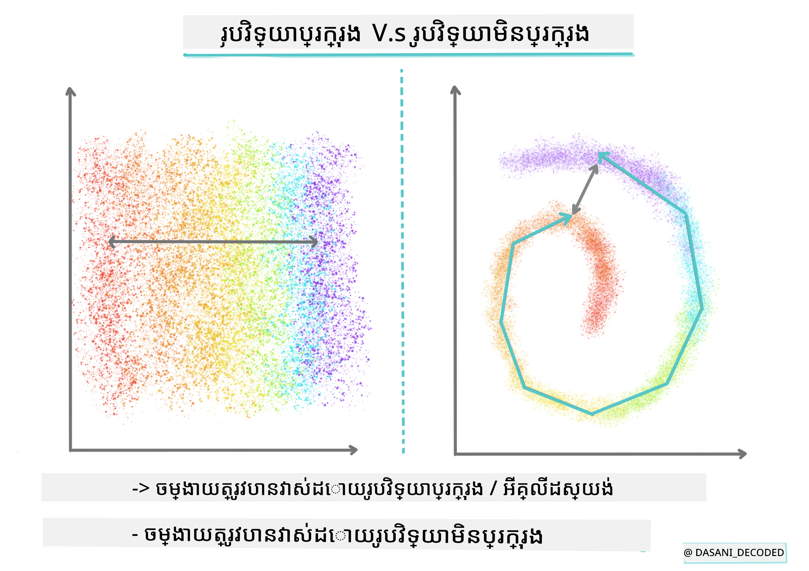
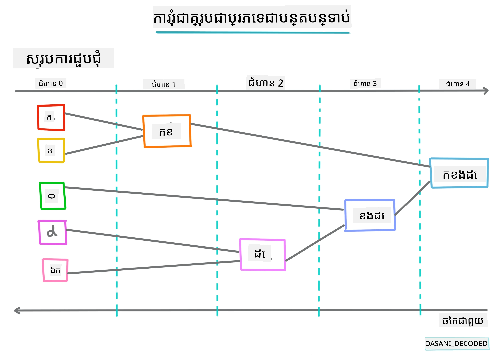
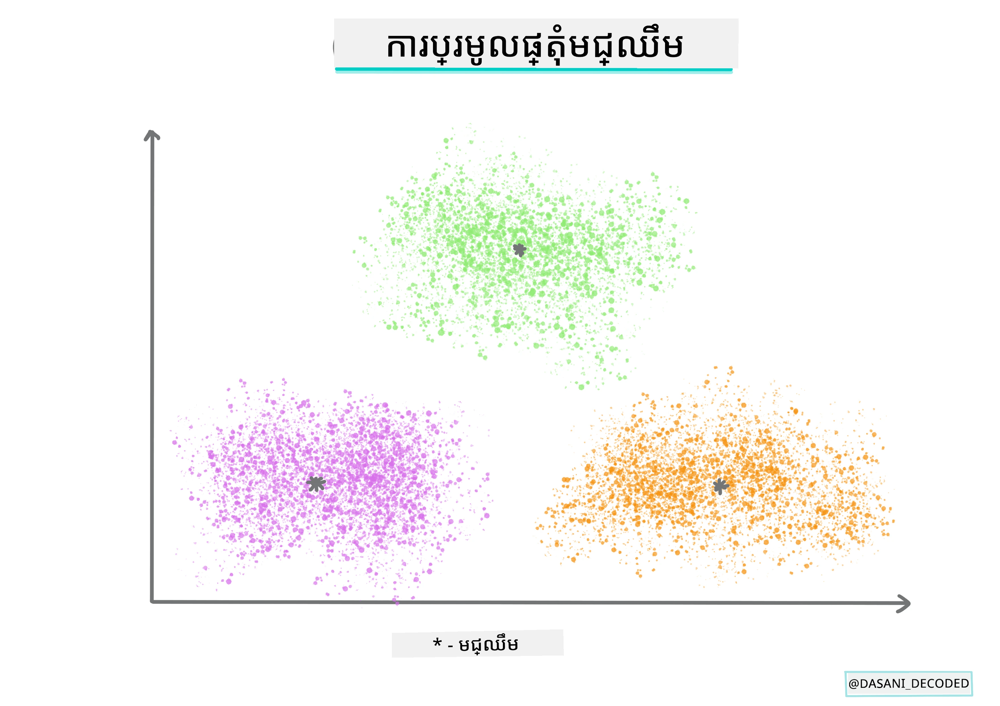
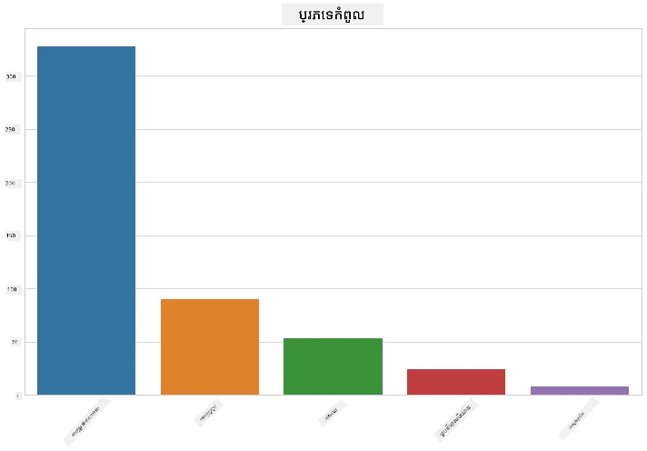
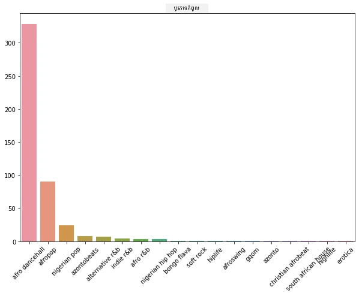
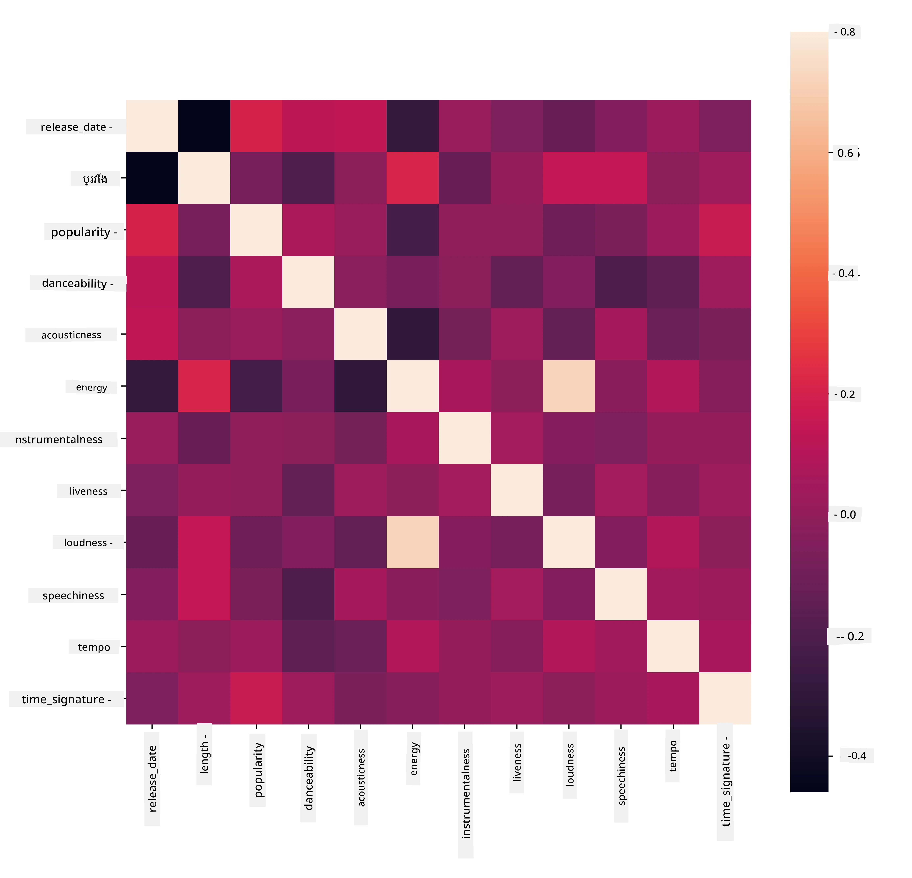
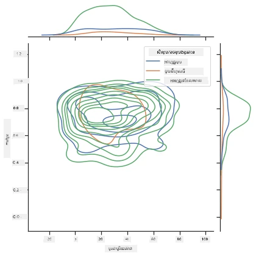
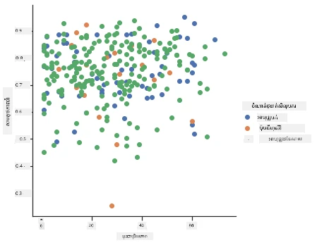

# សេចក្ដីផ្តើមអំពីការចែកទំព័រ

ការចែកទំព័រជាប្រភេទ [ការសិក្សាឥតគ្រប់គ្រង](https://wikipedia.org/wiki/Unsupervised_learning) ដែលគិតថា អាសយដ្ឋានទិន្នន័យមួយគ្មានស្លាក ឬថា បញ្ចូលរបស់វាមិនបានផ្គូរផ្គងជាមួយលទ្ធផលដែលកំណត់រួចជាស្រេច។ វា​ប្រើប្រាស់​អាល់ហ្គរីធម៍ផ្សេងៗ ដើម្បីខ្វះខាតតាមទិន្នន័យគ្មានស្លាក និងផ្តល់ការបែងចែកតាមលំនាំដែលវាស្គាល់បានក្នុងទិន្នន័យ។

[](https://youtu.be/ty2advRiWJM "No One Like You by PSquare")

> 🎥 ចុចរូបភាពខាងលើសម្រាប់វីដេអូ។ ខណៈពេលដែលអ្នកកំពុងសិក្សាអំពីការសិក្សាម៉ាស៊ីនជាមួយការចែកទំព័រ សូមរីករាយជាមួយបទចម្រៀង Dance Hall នៃប្រទេសណាយហ្សេរី - នេះជាបទដែលមានការវាយតម្លៃខ្ពស់បំផុតពីឆ្នាំ ២០១៤ ដោយ PSquare។

## [សំណួរលទ្ធផលមុនជំនอบ](https://ff-quizzes.netlify.app/en/ml/)

### សេចក្ដីផ្តើម

[ការចែកទំព័រ](https://link.springer.com/referenceworkentry/10.1007%2F978-0-387-30164-8_124) មានប្រយោជន៍ខ្លាំងសម្រាប់ការស្វែងរកទិន្នន័យ។ មកមើលថាវាអាចជួយរកឃើញនិន្នាការនិងលំនាំក្នុងរបៀបដែលអ្នកទស្សនាណាយហ្សេរីប្រើប្រាស់តន្ត្រី។

✅ ចំណាយពេលមួយនាទី ដើម្បីគិតពីការប្រើប្រាស់ចែកទំព័រ។ ក្នុងជីវិតពិត ការចែកទំព័រកើតឡើងពេលដែលអ្នកមានសំលៀកបំពាក់មិនកខ្វះ និងត្រូវរុំសំលៀកបំពាក់របស់សមាជិកគ្រួសារ 🧦👕👖🩲។ ក្នុងវិទ្យាសាស្ត្រទិន្នន័យ ការចែកទំព័រកើតឡើងពេលកំពុងព្យាយាមវិភាគចំណូលចិត្តរបស់អ្នកប្រើ ឬកំណត់លក្ខណៈពិសេសនៃឯកសារទិន្នន័យគ្មានស្លាកមួយ។ ការចែកទំព័រជាទម្រង់មួយជួយធ្វើអោយមានការយល់ដឹងអំពីអ្វីដែលមិនប្រក្រតី ដូចជាប្រអប់ស្បែកជើង។

[](https://youtu.be/esmzYhuFnds "Introduction to Clustering")

> 🎥 ចុចរូបភាពខាងលើសម្រាប់វីដេអូ: John Guttag នៃ MIT ផ្តល់បង្ហាញអំពីការចែកទំព័រ

នៅក្នុងបរិបទវិជ្ជាជីវៈ ការចែកទំព័រអាចប្រើសម្រាប់កំណត់របស់ដូចជា បំបែកទីផ្សារ កំណត់អាយុក្រុមដែលទិញទំនិញណាមួយ ជាដើម។ ការប្រើប្រាស់មួយផ្សេងទៀតគឺកំណត់ការរកឃើញករណីបញ្ហា ដូចជាការរកឃើញការលួចសារ ប្រសិនបើមានទិន្នន័យប្រតិបត្តិការកាតឥណទាន។ ឬអ្នកអាចប្រើការចែកទំព័រដើម្បីកំណត់ឆៅនៅក្នុងស្កេនវេជ្ជសាស្ត្រជាច្រើន។

✅ ចំណាយពេលមួយនាទីគិតពីរបៀបដែលអ្នកប្រហែលជាបានប្រទះមកការចែកទំព័រ 'ក្នុងធម្មជាតិ' នៅក្នុងបរិបទធនាគារ អ៊ី-ម៉ាស៊ីនបំពង់ ឬអាជីវកម្ម។

> 🎓 វិជ្ជាជីវៈដែលគួរឲ្យចាប់អារម្មណ៍ ការវិភាគក្រុមត្រូវបានចាប់ផ្តើមនៅក្នុងដែនវិទ្យាសាស្ត្រអង់ត្រូប្យូឡូជី និង ហ្សីកូឡូជី ក្នុងឆ្នាំ ១៩៣០។ តើអ្នកអាចស្រមៃថាវាបានប្រើប្រាស់ដូចម្តេច?

ផ្សេងទៀត អ្នកអាចប្រើសម្រាប់ក្រុមលទ្ធផលស្វែងរក - តាមតំណភ្ជាប់ទំនិញ រូបភាព ឬ ការវាយតម្លៃ ជាដើម។ ការចែកទំព័រមានប្រយោជន៍ពេលអ្នកមានទិន្នន័យធំដែលអ្នកចង់បន្ថយ ហើយចង់អនុវត្តវិភាគលម្អិតជាងនេះ ដូច្នេះបច្ចេកវិទ្យានេះអាចប្រើសម្រាប់រៀនអំពីទិន្នន័យមុនពេលម៉ូដែលផ្សេងទៀតត្រូវបានបង្កើត។

✅ ពេលទិន្នន័យរបស់អ្នកត្រូវរៀបចំជាក្រុម អ្នកផ្ដល់លេខសម្គាល់ក្រុម ហើយបច្ចេកទេសនេះអាចមានប្រយោជន៍ពេលរក្សាទុកឯកជនភាពនៃទិន្នន័យ; អ្នកអាចយោងទៅតាមចំណុចទិន្នន័យដោយលេខសម្គាល់ក្រុមជំនួស លេខសម្គាល់ដែលបង្ហាញអត្តសញ្ញាណខ្លះៗជាងនេះ។ តើអ្នកអាចគិតមូលហេតុផ្សេងទៀតដែលអ្នកនឹងយោងលេខសម្គាល់ក្រុមជំនួសធាតុផ្សេងៗក្នុងក្រុមដើម្បីកំណត់វា?

ពង្រីកការយល់ដឹងរបស់អ្នកអំពីបច្ចេកទេសចែកទំព័រនៅក្នុង [មូឌុលរៀននេះ](https://docs.microsoft.com/learn/modules/train-evaluate-cluster-models?WT.mc_id=academic-77952-leestott)
## ការចាប់ផ្តើមជាមួយការចែកទំព័រ

[Scikit-learn ផ្ដល់ជម្រើសធំទូលាយ](https://scikit-learn.org/stable/modules/clustering.html) នៃវិធីសាស្ត្រដើម្បីអនុវត្តការចែកទំព័រ។ ប្រភេទដែលអ្នកជ្រើសរើសនឹងអាស្រ័យលើការប្រើប្រាស់របស់អ្នក។ គោលបំណងផ្អែកលើឯកសារយោង នីតិវិធីមួយៗមានអត្ថប្រយោជន៍ជាច្រើន។ ទីនេះគឺជាតារាងសាមញ្ញនៃវិធីដែល Scikit-learn គាំទ្រ និងករណីប្រើប្រាស់សមរម្យ៖

| ឈ្មោះវិធីសាស្ត្រ                | ករណីប្រើប្រាស់                                                         |
| :------------------------------ | :-------------------------------------------------------------------- |
| K-Means                        | ប្រើទូទៅ ជាវិធីចូលពីមុខ                                              |
| Affinity propagation           | ក្រុមច្រើន មិនស្មើរ ជាវិធីចូលពីមុខ                                  |
| Mean-shift                     | ក្រុមច្រើន មិនស្មើរ ជាវិធីចូលពីមុខ                                  |
| Spectral clustering            | ក្រុមកាត់សរុប មួយចំនួន ស្មើរ ជាវិធីប្រើផ្ទាល់                       |
| Ward hierarchical clustering   | ក្រុមច្រើន មានកំណត់ ជាវិធីប្រើផ្ទាល់                                |
| Agglomerative clustering       | ក្រុមច្រើន មានកំណត់ ចម្ងាយមិនមែន Euclidean ជាវិធីប្រើផ្ទាល់         |
| DBSCAN                        | ជីមេត្រីមិនស្មើរ មិនស្មើរ ជាវិធីប្រើផ្ទាល់                           |
| OPTICS                        | ជីមេត្រីមិនស្មើរ មិនស្មើរជាមួយដង់ស៊ីតេចម្រុះ ជាវិធីប្រើផ្ទាល់          |
| Gaussian mixtures             | ជីមេត្រីស្មើរ ជាវិធីចូលពីមុខ                                         |
| BIRCH                         | ទិន្នន័យធំពីរដុំជាមួយ outliers ជាវិធីចូលពីមុខ                       |

> 🎓 របៀបយើងបង្កើតក្រុមមានទំនាក់ទំនងយ៉ាងខ្លាំងជាមួយរបៀបយើងបម្លែងចំណុចទិន្នន័យទៅជាក្រុម។ មកពន្យល់ពាក្យមួយចំនួន៖
>
> 🎓 ['ប្រភេទប្រើផ្ទាល់' ទល់នឹង 'ចូលពីមុខ'](https://wikipedia.org/wiki/Transduction_(machine_learning))
> 
> ការអនុវត្តប្រភេទប្រើផ្ទាល់ចេញមកពីករណីបណ្តុះបណ្តាលដែលត្រូវម៉េចទៅករណីតេស្តជាក់លាក់។ ការអនុវត្តចូលពីមុខចេញពីករណីបណ្តុះបណ្តាលដែលប្រើទៅលក្ខណៈទូទៅ ហើយបន្ទាប់មកអនុវត្ដទៅករណីតេស្ត។
> 
> ឧទាហរណ៍៖ សូមស្រមៃថាអ្នកមានទិន្នន័យដែលមានស្លាកតិចតួច។ អ្វីខ្លះជារេកតិត (records), អ្វីខ្លះជាលីបស៊ីឌី (cds), ហើយអ្វីខ្លះទៀតទទេ។ ការងាររបស់អ្នកគឺផ្ដល់ស្លាកមកសម្រាប់អ្វីទទេ។ ប្រសិនបើអ្នកជ្រើសរើសវិធីចូលពីមុខ អ្នកនឹងបង្ហាត់ម៉ូដែលស្វែងរករេកតិត និងលីបស៊ីឌី ហើយអនុវត្តស្លាកទាំងនោះទៅលើទិន្នន័យគ្មានស្លាក។ វិធីនេះនឹងមានបញ្ហាក្នុងការបែងចែកវត្ថុដែលពិតជាជាស៊ីស៊ីត (cassettes)។ តាមផ្ទុយ, វិធីប្រើផ្ទាល់មានសមត្ថភាពច្រើនក្នុងការដោះស្រាយទិន្នន័យមិនស្គាល់ ដោយវាធ្វើការបែងចែកវត្ថុដូចគ្នាជាក្រុម ហើយបន្ទាប់មកផ្ដល់ស្លាកទៅក្រុម។ ក្នុងករណីនេះ ក្រុមអាចបង្ហាញថាអ្វីដែលជាវត្ថុនឹងទំនាក់ទំនងទៅនឹងតន្ត្រីធ្វើដូចជា 'រង្វង់តន្ត្រី' និង 'ការ៉េតន្ត្រី'។
> 
> 🎓 ['ជីមេត្រីមិនស្មើ' ទល់នឹង 'ជីមេត្រីស្មើ'](https://datascience.stackexchange.com/questions/52260/terminology-flat-geometry-in-the-context-of-clustering)
> 
> ប្រភពលើកទឹកចិត្តពីពាក្យគណិតវិទ្យា ជីមេត្រមិនស្មើ និងជីមេត្រីស្មើ បង្ហាញពីវិធីវាស់ចម្ងាយរវាងចំណុច ដោយប្រើវិធីជីមេត្រស្មើ ([Euclidean](https://wikipedia.org/wiki/Euclidean_geometry)) ឬ មិនស្មើ (non-Euclidean)។
>
>'ជីមេត្រីស្មើ' មានន័យជាជីមេត្រយូក្លីដ (ដែលផ្នែកមួយត្រូវបានបង្រៀនជាជីមេត្រប្លែន), ខណៈដែលជីមេត្រមិនស្មើមានន័យជាជីមេត្រមិនយូឃ្លីដ។ តើជីមេត្រមានទំនាក់ទំនងយ៉ាងដូចម្តេចជាមួយការសិក្សាម៉ាស៊ីន? ជាផ្នែកមួយនៃវិស័យវិទ្យាសាស្ត្រគណិតវិទ្យា ត្រូវមានវិធីសម្រាប់វាស់ចម្ងាយរវាងចំណុចនៅក្នុងក្រុម និងវា អាចធ្វើបានក្នុងរបៀប 'ស្មើ' ឬ 'មិនស្មើ' ដោយហេតុផលពីធម្មជាតិនៃទិន្នន័យ។ [ចម្ងាយយូឃ្លីដ](https://wikipedia.org/wiki/Euclidean_distance) គឺវាស់ថា​វែងបន្ទាត់រវាងចំណុចពីរដុល។ [ចម្ងាយមិនយូឃ្លីដ](https://wikipedia.org/wiki/Non-Euclidean_geometry) គឺវាស់ជាប្រវែងតាមខ្សែវង់។ ប្រសិនបើទិន្នន័យរបស់អ្នក, ដែលបានបង្ហាញរូបមន្ត, មិនមានលំនាំស្មើផ្លែនទេ អ្នកប្រហែលជាត្រូវប្រើអាល់ហ្គរីធម៍ពិសេសមួយដើម្បីដោះស្រាយវា។
>

> រូបភាពបង្ហាញដោយ [Dasani Madipalli](https://twitter.com/dasani_decoded)
>
> 🎓 ['ចម្ងាយ'](https://web.stanford.edu/class/cs345a/slides/12-clustering.pdf)
>
> ក្រុមត្រូវបានកំណត់ដោយ ម៉ាទ្រីចចម្ងាយរបស់ពួកវា ពិរុទ្ធជា ចម្ងាយរវាងចំណុច។ ចម្ងាយនេះអាចវាស់បានជាច្រើនវិធី។ ក្រុមយូឃ្លីដត្រូវបានកំណត់ដោយមធ្យមនៃតម្លៃចំណុច ហើយមាន 'ចំណុចកណ្តាល' ឬចំណុចមជ្ឈមណ្ឌល។ ចម្ងាយត្រូវវាស់ដោយចម្ងាយទៅរកចំណុចមជ្ឈមណ្ឌលនោះ។ ចម្ងាយមិនយូឃ្លីដត្រូវបានទាក់ទងទៅនឹង 'clustroids' ដែលជាចំណុចនៅជិតចំណុចផ្សេងទៀតបំផុត។ Clustroids អាចត្រូវបានកំណត់ដោយវិធីផ្សេងៗ។
>
> 🎓 ['មានកំណត់'](https://wikipedia.org/wiki/Constrained_clustering)
>
> [Constrained Clustering](https://web.cs.ucdavis.edu/~davidson/Publications/ICDMTutorial.pdf) ណែនាំការសិក្សាជាដំណែក<em>ធ្វើយូរអចលន៍</em>ទៅវិធីសាស្ត្រឥតគ្រប់គ្រងនេះ។ អត្ថិភាពរវាងចំណុចត្រូវបានពិនិត្យថា 'មិនអាចភ្ជាប់' ឬ 'ត្រូវភ្ជាប់' ដូច្នេះ ឬជាការបង្ខំច្បាប់លើទិន្នន័យ។
>
>ឧទាហរណ៍៖ ប្រសិនបើអាល់ហ្គរីធម៍ត្រូវបានដាក់ឲ្យប្រើលើឈុតទិន្នន័យដែលគ្មានស្លាក ឬស្លាកប៉ុន្មានភាគ ក្រុមដែលវាបង្កើតឡើងអាចមានគុណភាពទាប។ ក្នុងឧទាហរណ៍ខាងលើ ក្រុមអាចបែងចែកជា 'រង្វង់តន្ត្រី', 'ការ៉េចតន្ត្រី', 'បីកោណ' និង 'ខូចខាត'។ ប្រសិនបើមានកំណត់ ឬច្បាប់ ("វត្ថុត្រូវបានផលិតពីប្លាស្ទិច", "វត្ថុត្រូវមានសមត្ថភាពបង្កើតតន្ត្រី") នេះជួយច្រោះអាល់ហ្គរីធម៍ឲ្យជ្រើសរើសល្អជាង។
> 
> 🎓 'ដង់ស៊ីតេ'
>
> ទិន្នន័យដែលមាន 'សំឡេងរំខាន' ត្រូវបានកំណត់ថា 'ដង់ស៊ីតេ'។ ចម្ងាយរវាងចំណុចក្នុងក្រុមមួយៗអាចបង្ហាញថា ដង់ស៊ីតេ ឬ 'ម៉ាស៊ីនជ្រៅ' ហើយទិន្នន័យនេះត្រូវបានវាយតម្លៃជាមួយវិធីចែកទំព័រដែលសមរម្យ។ [អត្ថបទនេះ](https://www.kdnuggets.com/2020/02/understanding-density-based-clustering.html) បង្ហាញខុសគ្នារវាងការប្រើប្រាស់ K-Means និងអាល់ហ្គរីធម៍ HDBSCAN ដើម្បីស្វែងរកទិន្នន័យដែលមានសំលេងរំខានជាមួយដង់ស៊ីតេចម្រុះ។

## អាល់ហ្គរីធម៍ចែកទំព័រ

មានអាល់ហ្គរីធម៍ចែកទំព័រលើស ១០០ គឺ ដោយប្រើប្រាស់គឺអាស្រ័យលើធម្មជាតិនៃទិន្នន័យ។ នេះជាការពិភាក្សាអំពីខ្លះៗនៃអាល់ហ្គរីធម៍សំខាន់ៗ៖

- **ការចែកទំព័រប្រភេទលំដាប់លំដោយ**។ ប្រសិនបើវត្ថុត្រូវបានចាត់ថ្នាក់ដោយភាពជិតស្និទ្ធទៅអ្វីដែលនៅជិតវា ជំនួសការជិតទៅវត្ថុចម្ងាយជាង ពួកក្រុមត្រូវបានបង្កើតឡើង ដោយផ្អែកលើចម្ងាយរវាងសមាជិកទៅនឹងវត្ថុផ្សេងៗ។ ការចែកទំព័រអាហ្គ្លូម៉ើត៊ីវរបស់ Scikit-learn គឺប្រភេទលំដាប់លំដោយ។

   
   > រូបភាពបង្ហាញដោយ [Dasani Madipalli](https://twitter.com/dasani_decoded)

- **ការចែកទំព័រចំណុចកណ្តាល**។ អាល់ហ្គរីធម៍ល្បីឈ្មោះនេះត្រូវការជ្រើសរើស 'k' រឺ ចំនួនក្រុមដែលត្រូវបង្កើត បន្ទាប់មកអាល់ហ្គរីធម៍កំណត់ចំណុចមជ្ឈមណ្ឌលរបស់ក្រុម និងប្រមូលទិន្នន័យនៅជុំវិញចំណុចនោះ។ [K-means clustering](https://wikipedia.org/wiki/K-means_clustering) គឺជាប្រភេទពេញនិយមនៃការចែកទំព័រចំណុចកណ្តាល។ ចំណុចមជ្ឈមណ្ឌលត្រូវបានកំណត់ដោយមធ្យមជិតបំផុត ដូច្នេះឈ្មោះ។ ចម្ងាយកោណត្រូវបានបន្តិចបន្តួច។

   
   > រូបភាពបង្ហាញដោយ [Dasani Madipalli](https://twitter.com/dasani_decoded)

- **ការចែកទំព័រដែលផ្អែកលើចែកចាយ**។ មានមូលដ្ឋានលើគំរូស្ថិតិ ការចែកទំព័រដែលផ្អែកលើចែកចាយផ្តោតលើការកំណត់ពិតភាពថាចំណុចទិន្នន័យទាក់ទងទៅក្រុមណាមួយ ហើយផ្ដាច់ផ្តាច់ទៅតាមរបៀប។ វិធី Gaussian mixture ស្ថិតនៅក្នុងប្រភេទនេះ។

- **ការចែកទំព័រលើមូលដ្ឋានដង់ស៊ីតេ**។ ចំណុចទិន្នន័យត្រូវបានតែងតាំងទៅក្រុម ដោយផ្អែកលើដង់ស៊ីតេរបស់ពួកវា ឬការប្រមូលផ្តុំគ្នា។ ចំណុចទិន្នន័យដែលឆ្ងាយពីក្រុម ត្រូវបានគេចាត់ទុកថាជាផលប៉ះពាល់ខាងក្រៅ ឬសំឡេងរំខាន។ DBSCAN, Mean-shift និង OPTICS ស្ថិតក្នុងប្រភេទនេះ។

- **ការចែកទំព័រលើមូលដ្ឋានក្រឡា**។ សម្រាប់ទិន្នន័យពហុវិមាត្រ ក្រឡាត្រូវបានបង្កើត ហើយទិន្នន័យត្រូវបានចែកចាយទៅក្នុងវាលនៃក្រឡា បង្កើតក្រុមឡើង។

## លំហាត់ - ចែកទិន្នន័យរបស់អ្នកជាក្រុម

ការចែកទំព័រជាបច្ចេកទេស ត្រូវបានជួយស្រាលដូចខុសគ្នា ដោយការពិពណ៌នារូបភាពដូចត្រឹមត្រូវ ដូច្នេះសូមចាប់ផ្តើមដោយបង្ហាញទិន្នន័យតន្ត្រីរបស់យើង។ លំហាត់នេះនឹងជួយយើងសម្រេចចិត្តថាតើយ៉ាងដូចម្តេចក្នុងចំណោមវិធីចែកទំព័រដែលគួរប្រើសម្រាប់ធម្មជាតិនៃទិន្នន័យនេះ។

1. បើកឯកសារ [_notebook.ipynb_](https://github.com/microsoft/ML-For-Beginners/blob/main/5-Clustering/1-Visualize/notebook.ipynb) ក្នុងថតនេះ។

1. នាំចូលកញ្ចប់ `Seaborn` សម្រាប់ការពិពណ៌នាទិន្នន័យល្អ។

    ```python
    !pip install seaborn
    ```

1. បន្ថែមទិន្នន័យបទចម្រៀងពី [_nigerian-songs.csv_](https://github.com/microsoft/ML-For-Beginners/blob/main/5-Clustering/data/nigerian-songs.csv)។ បង្ហាញ data frame មានទិន្នន័យពីបទចម្រៀង។ រៀបចំខ្លួនដើម្បីស្វែងរកទិន្នន័យនេះដោយនាំចូលបណ្ណាល័យ និងបង្ហាញទិន្នន័យ៖

    ```python
    import matplotlib.pyplot as plt
    import pandas as pd
    
    df = pd.read_csv("../data/nigerian-songs.csv")
    df.head()
    ```

    ពិនិត្យមើលខ្សែដំបូងៗនៃទិន្នន័យ:

    |     | name                     | album                        | artist              | artist_top_genre | release_date | length | popularity | danceability | acousticness | energy | instrumentalness | liveness | loudness | speechiness | tempo   | time_signature |
    | --- | ------------------------ | ---------------------------- | ------------------- | ---------------- | ------------ | ------ | ---------- | ------------ | ------------ | ------ | ---------------- | -------- | -------- | ----------- | ------- | -------------- |
    | 0   | Sparky                   | Mandy & The Jungle           | Cruel Santino       | alternative r&b  | 2019         | 144000 | 48         | 0.666        | 0.851        | 0.42   | 0.534            | 0.11     | -6.699   | 0.0829      | 133.015 | 5              |
    | 1   | shuga rush               | EVERYTHING YOU HEARD IS TRUE | Odunsi (The Engine) | afropop          | 2020         | 89488  | 30         | 0.71         | 0.0822       | 0.683  | 0.000169         | 0.101    | -5.64    | 0.36        | 129.993 | 3              |
    | 2   | LITT!                    | LITT!                        | AYLØ                | indie r&b        | 2018         | 207758 | 40         | 0.836        | 0.272        | 0.564  | 0.000537         | 0.11     | -7.127   | 0.0424      | 130.005 | 4              |
    | 3   | Confident / Feeling Cool | Enjoy Your Life              | Lady Donli          | nigerian pop     | 2019         | 175135 | 14         | 0.894        | 0.798        | 0.611  | 0.000187         | 0.0964   | -4.961   | 0.113       | 111.087 | 4              |
    | 4   | wanted you               | rare.                        | Odunsi (The Engine) | afropop          | 2018         | 152049 | 25         | 0.702        | 0.116        | 0.833  | 0.91             | 0.348    | -6.044   | 0.0447      | 105.115 | 4              |

1. សូមទទួលបានព័ត៌មានមួយចំនួនអំពី DataFrame ដោយអំពាវនាវ `info()`៖

    ```python
    df.info()
    ```

   លទ្ធផលបង្ហាញដូចជា៖

    ```output
    <class 'pandas.core.frame.DataFrame'>
    RangeIndex: 530 entries, 0 to 529
    Data columns (total 16 columns):
     #   Column            Non-Null Count  Dtype  
    ---  ------            --------------  -----  
     0   name              530 non-null    object 
     1   album             530 non-null    object 
     2   artist            530 non-null    object 
     3   artist_top_genre  530 non-null    object 
     4   release_date      530 non-null    int64  
     5   length            530 non-null    int64  
     6   popularity        530 non-null    int64  
     7   danceability      530 non-null    float64
     8   acousticness      530 non-null    float64
     9   energy            530 non-null    float64
     10  instrumentalness  530 non-null    float64
     11  liveness          530 non-null    float64
     12  loudness          530 non-null    float64
     13  speechiness       530 non-null    float64
     14  tempo             530 non-null    float64
     15  time_signature    530 non-null    int64  
    dtypes: float64(8), int64(4), object(4)
    memory usage: 66.4+ KB
    ```

1. ពិនិត្យម្តងទៀតសម្រាប់តម្លៃ null ដោយហៅ `isnull()` ហើយធានាថារួមបញ្ចូលត្រឹម 0៖

    ```python
    df.isnull().sum()
    ```

    មើលទៅល្អ៖

    ```output
    name                0
    album               0
    artist              0
    artist_top_genre    0
    release_date        0
    length              0
    popularity          0
    danceability        0
    acousticness        0
    energy              0
    instrumentalness    0
    liveness            0
    loudness            0
    speechiness         0
    tempo               0
    time_signature      0
    dtype: int64
    ```

1. ពិពណ៌នាអំពីទិន្នន័យ៖

    ```python
    df.describe()
    ```

    |       | release_date | length      | popularity | danceability | acousticness | energy   | instrumentalness | liveness | loudness  | speechiness | tempo      | time_signature |
    | ----- | ------------ | ----------- | ---------- | ------------ | ------------ | -------- | ---------------- | -------- | --------- | ----------- | ---------- | -------------- |
    | count | 530          | 530         | 530        | 530          | 530          | 530      | 530              | 530      | 530       | 530         | 530        | 530            |
    | mean  | 2015.390566  | 222298.1698 | 17.507547  | 0.741619     | 0.265412     | 0.760623 | 0.016305         | 0.147308 | -4.953011 | 0.130748    | 116.487864 | 3.986792       |
    | std   | 3.131688     | 39696.82226 | 18.992212  | 0.117522     | 0.208342     | 0.148533 | 0.090321         | 0.123588 | 2.464186  | 0.092939    | 23.518601  | 0.333701       |
    | min   | 1998         | 89488       | 0          | 0.255        | 0.000665     | 0.111    | 0                | 0.0283   | -19.362   | 0.0278      | 61.695     | 3              |
    | 25%   | 2014         | 199305      | 0          | 0.681        | 0.089525     | 0.669    | 0                | 0.07565  | -6.29875  | 0.0591      | 102.96125  | 4              |
    | 50%   | 2016         | 218509      | 13         | 0.761        | 0.2205       | 0.7845   | 0.000004         | 0.1035   | -4.5585   | 0.09795     | 112.7145   | 4              |
    | 75%   | 2017         | 242098.5    | 31         | 0.8295       | 0.403        | 0.87575  | 0.000234         | 0.164    | -3.331    | 0.177       | 125.03925  | 4              |
    | max   | 2020         | 511738      | 73         | 0.966        | 0.954        | 0.995    | 0.91             | 0.811    | 0.582     | 0.514       | 206.007    | 5              |

> 🤔 ប្រសិនបើយើងកំពុងធ្វើការជាមួយ clustering ដែលជា វិធីសាស្ត្រ unsupervised មួយដែលមិនត្រូវការទិន្នន័យមានស្លាក ហេតុអ្វីបានយើងចង្អុលបង្ហាញទិន្នន័យនេះជាមួយស្លាក? ក្នុងដំណាក់កាលចាប់ផ្តើមស្វែងរកទិន្នន័យ ស្លាកទាំងនេះមានប្រយោជន៍ ប៉ុន្តែវាមិនចាំបាច់សម្រាប់អាល់គ័រីធម clustering ដើម្បីដំណើរការ។ អ្នកអាចយកចេញក្បាលជួរឈរនៅតែមិនប៉ះពាល់ ដើម្បីយោងទិន្នន័យតាមលេខជួរឈរ។

មើលតម្លៃទូទៅនៃទិន្នន័យ។ សូមចំណាំថា popularity អាចមានតម្លៃជា '0' ដែលបង្ហាញពីចម្រៀងដែលមិនមានចំណាត់ថ្នាក់។ យើងនឹងដកចេញចម្រៀងទាំងនោះក្នុងពេលឆាប់ៗនេះ។

1. ប្រើប្លង់បារដើម្បីស្វែងរកប្រភេទចម្រៀងដែលពេញនិយមបំផុត៖

    ```python
    import seaborn as sns
    
    top = df['artist_top_genre'].value_counts()
    plt.figure(figsize=(10,7))
    sns.barplot(x=top[:5].index,y=top[:5].values)
    plt.xticks(rotation=45)
    plt.title('Top genres',color = 'blue')
    ```

    

✅ ប្រសិនបើអ្នកចង់មើលតម្លៃកំពូលច្រើនជាងនេះ សូមប្តូរ top `[:5]` ទៅជាតម្លៃធំជាងនេះ ឬដកវាចេញដើម្បីមើលទាំងអស់។

សូមចំណាំ ពេលដែលប្រភេទចម្រៀងកំពូលត្រូវបានពិពណ៌នាជា 'Missing' មានន័យថា Spotify មិនបានចាត់ថ្នាក់វា ដូចនេះយើងត្រូវដកវាចេញ។

1. ដកចេញទិន្នន័យដែលខ្វះដោយការត្រងវាចេញ

    ```python
    df = df[df['artist_top_genre'] != 'Missing']
    top = df['artist_top_genre'].value_counts()
    plt.figure(figsize=(10,7))
    sns.barplot(x=top.index,y=top.values)
    plt.xticks(rotation=45)
    plt.title('Top genres',color = 'blue')
    ```

    ឥឡូវនេះសូមពិនិត្យមើលប្រភេទចម្រៀងម្ដងទៀត៖

    

1. ប្រភេទចម្រៀងកំពូលបី មានអំណាចលើទិន្នន័យនេះ។ យើងសូមផ្តោតទៅលើ `afro dancehall`, `afropop`, និង `nigerian pop` ហើយត្រងទិន្នន័យដើម្បីដកចេញវត្ថុដែលមានតម្លៃ popularity ដែលស្មើ 0 (មានន័យថាវាមិនត្រូវបានចាត់ថ្នាក់ដោយ popularity ក្នុងទិន្នន័យ ហើយអាចត្រូវបានចាត់ទុកជាសំលេងរំខានសម្រាប់គោលបំណងរបស់យើង)៖

    ```python
    df = df[(df['artist_top_genre'] == 'afro dancehall') | (df['artist_top_genre'] == 'afropop') | (df['artist_top_genre'] == 'nigerian pop')]
    df = df[(df['popularity'] > 0)]
    top = df['artist_top_genre'].value_counts()
    plt.figure(figsize=(10,7))
    sns.barplot(x=top.index,y=top.values)
    plt.xticks(rotation=45)
    plt.title('Top genres',color = 'blue')
    ```

1. ប្រត្ដិបត្ដិមួយជាបន្ទាន់ដើម្បីមើលថាទិន្នន័យមានការពាក់ព័ន្ធយ៉ាងខ្លាំងវិញឬអត់៖

    ```python
    corrmat = df.corr(numeric_only=True)
    f, ax = plt.subplots(figsize=(12, 9))
    sns.heatmap(corrmat, vmax=.8, square=True)
    ```

    

    ការពាក់ព័ន្ធតែមួយដែលខ្លាំងគឺរវាង `energy` និង `loudness` ដែលមិនមែនជារឿងភ្ញាក់ផ្អើលទេ ព្រោះតែលំនៅសំឡេងខ្ពស់ជារឿយៗដូចជាអ្នកមានថាមពលខ្លាំង។ អ្នកលំដាប់ប្រសើរពីរវាងផ្សេងទៀតគួរជារបាយការណ៍ខ្សោយ។ វានឹងគួរអោយចាប់អារម្មណ៍មើលពីអាល់គ័រីធម clustering អាចយល់ដឹងអ្វីខ្លះពីទិន្នន័យនេះបាន។

    > 🎓 សូមចំណាំថាការពាក់ព័ន្ធមិនមានន័យថាការកើតមាន! យើងមានភស្តុតាងនៃការពាក់ព័ន្ធ ប៉ុន្តែមិនមានភស្តុតាងនៃការកើតមាន។ គេហទំព័រមួយដែលគួរឱ្យចាប់អារម្មណ៍ [amusing web site](https://tylervigen.com/spurious-correlations) ផ្តល់នូវរូបភាពសម្រាប់ពិចារណារឿងនេះ។

តើមានការប្រមូលផ្តុំគ្នានៅក្នុងទិន្នន័យនេះអំពីការមើលឃើញនូវពន្លឺនិង danceability របស់ចម្រៀងមួយទេ? FacetGrid បង្ហាញថាមានរង្វង់ច្រវ៉ាក់អាចផ្គូរផ្គងគ្នា បើទោះបីជាមានបែបបទផ្សេងៗគ្នាក៏ដោយ។ តើអាចមានការចូលចិត្តនៃនាយាជននៅជាមួយមួយកម្រិតបំណងចិត្តលើលំនាំនេះ?

✅ សាកល្បងបច្ចេកទិន្នន័យផ្សេងទៀត (energy, loudness, speechiness) និងប្រភេទតន្ត្រីផ្សេងៗ ឬច្រើនជាងនេះ។ តើអ្នកអាចរកឃើញអ្វីខ្លះ? សូមមើលតារាង `df.describe()` ដើម្បីមើលការវេចខ្ចប់ទូទៅនៃចំណុចទិន្នន័យ។

### វាយតម្លៃ - ការបែងចែកទិន្នន័យ

តើប្រភេទចម្រៀងបីនេះមានភាពខុសគ្នាយ៉ាងច្បាស់ក្នុងការមើលឃើញ danceability របស់ពួកគេ ដោយផ្អែកលើកម្រិត popularity?

1. ពិនិត្យមើលការបែងចែកទិន្នន័យរបស់បីប្រភេទកំពូលសម្រាប់ popularity និង danceability នៅលើអ័ក្ស x និង y ដែលមានការបញ្ជាក់។

    ```python
    sns.set_theme(style="ticks")
    
    g = sns.jointplot(
        data=df,
        x="popularity", y="danceability", hue="artist_top_genre",
        kind="kde",
    )
    ```

    អ្នកអាចរកឃើញរង្វង់ច្រវ៉ាក់នៅជុំវិញចំណុចមួយបាន កំណត់បង្ហាញពីបែងចែកចំណុច។

    > 🎓 សូមចំណាំឧទាហរណ៍នេះប្រើក្រាហ្វ KDE (Kernel Density Estimate) ដែលតំណាងឱ្យទិន្នន័យដោយ curve មានប្រហែលភាពគុណភាពជាបន្ត។ នេះអាចអោយយើងផ្ដល់អត្ថន័យទិន្នន័យនៅពេលធ្វើការជាមួយការបែងចែកច្រើន។

    ជាទូទៅ ប្រភេទចម្រៀងបីភាគបន្តិចឆ្លុះបញ្ចាំងគ្នានៅក្នុងចំណោម popularity និង danceability។ ការទាញយកក្រុមនៅក្នុងទិន្នន័យដែលមានការបង្ហាញខាងលើនេះគឺជាភាពលំបាកជា​មួយ៖

    

1. បង្កើតប្លង់ scatter៖

    ```python
    sns.FacetGrid(df, hue="artist_top_genre", height=5) \
       .map(plt.scatter, "popularity", "danceability") \
       .add_legend()
    ```

    ប្លង់ scatter នៃអ័ក្សដូចគ្នាបង្ហាញលំនាំស្រដៀងគ្នារបស់ការប្រមូលផ្តុំ

    

ជាទូទៅ សម្រាប់ clustering អ្នកអាចប្រើប្លង់ scatter ដើម្បីបង្ហាញក្រុមទិន្នន័យ ដូច្នេះការបង្កប់ចំណេះដឹងនៅលើការបង្ហាញទូរគមនាគមន៍នេះគឺមានប្រយោជន៍ខ្លាំង។ នៅមេរៀនបន្ទាប់ យើងនឹងយកទិន្នន័យដែលបានត្រងនេះ ដើម្បីប្រើ k-means clustering ដើម្បីស្វែងរកក្រុមក្នុងទិន្នន័យដែលពាក់ព័ន្ធគ្នាជាបែបគួរឱ្យចាប់អារម្មណ៍។

---

## 🚀បញ្ចាំង

ក្នុងការរៀបចំសម្រាប់មេរៀនបន្ទាប់ សូមបង្កើតតារាងអំពីអាល់គ័រីធម clustering ផ្សេងៗដែលអ្នកអាចស្វែងរក និងប្រើក្នុងបរិដ្ឋានផលិតកម្ម។ តើបញ្ហាប្រភេទអ្វីដែល clustering ព្យាយាមដោះស្រាយ?

## [ប្រលងក្រោយមេរៀន](https://ff-quizzes.netlify.app/en/ml/)

## សេចក្តីពិនិត្យ និងសិក្សាផ្ទាល់ខ្លួន

មុនពេលអ្នកអនុវត្តអាល់គ័រីធម clustering ដូចដែលយើងបានរៀន វាគួរឱ្យចាប់អារម្មណ៍ក្នុងការយល់ដឹងពីធម្មជាតិទិន្នន័យរបស់អ្នក។ ចំណាយពេលអានបន្ថែមស្តីពីប្រធានបទនេះ [ទីនេះ](https://www.kdnuggets.com/2019/10/right-clustering-algorithm.html)

[អត្ថបទជួយដល់នេះ](https://www.freecodecamp.org/news/8-clustering-algorithms-in-machine-learning-that-all-data-scientists-should-know/) នឹងដឹកនាំអ្នក តាមរយៈវិធីផ្សេងៗដែលអាល់គ័រីធម clustering ប្រតិបត្តិការពិតដោយផ្អែកលើរូបរាងទិន្នន័យផ្សេងៗ។

## ការងារ

[ស្វែងយល់អំពីការបង្ហាញទិន្នន័យផ្សេងទៀតសម្រាប់ clustering](assignment.md)

---

<!-- CO-OP TRANSLATOR DISCLAIMER START -->
**ការបដិសេធ**៖  
ឯកសារនេះត្រូវបានបកប្រែដោយប្រើសេវាកម្មបកប្រែ AI [Co-op Translator](https://github.com/Azure/co-op-translator)។ ទោះបីយើងខិតខំរក្សាការត្រឹមត្រូវ ក៏សូមយកចិត្តទុកដាក់ថាការបកប្រែដោយស្វ័យប្រវត្តិអាចមានកំហុស ឬភាពមិនត្រឹមត្រូវលើកកន្លែងណាមួយ។ ឯកសារដើមនៅក្នុងភាសាមូលដ្ឋានរបស់វាគួរត្រូវបានចាត់ទុកជាដើមខ្យល់សម្រាប់ព័ត៌មាន។ សម្រាប់ព័ត៌មានសំខាន់ៗ ការបកប្រែដោយមនុស្សជំនាញត្រូវបានណែនាំ។ យើងមិនទទួលខុសត្រូវចំពោះការយល់ច្រឡំ ឬការបកប្រែខុសធីងអ្វីៗដែលកើតឡើងពីការប្រើប្រាស់ការបកប្រែនេះទេទេ។
<!-- CO-OP TRANSLATOR DISCLAIMER END -->