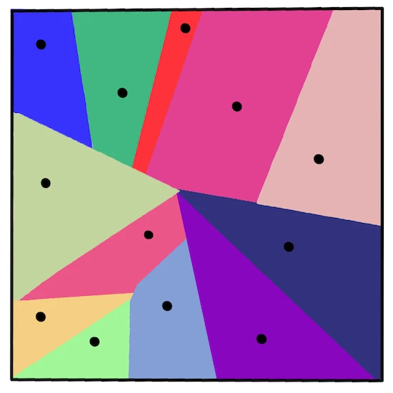
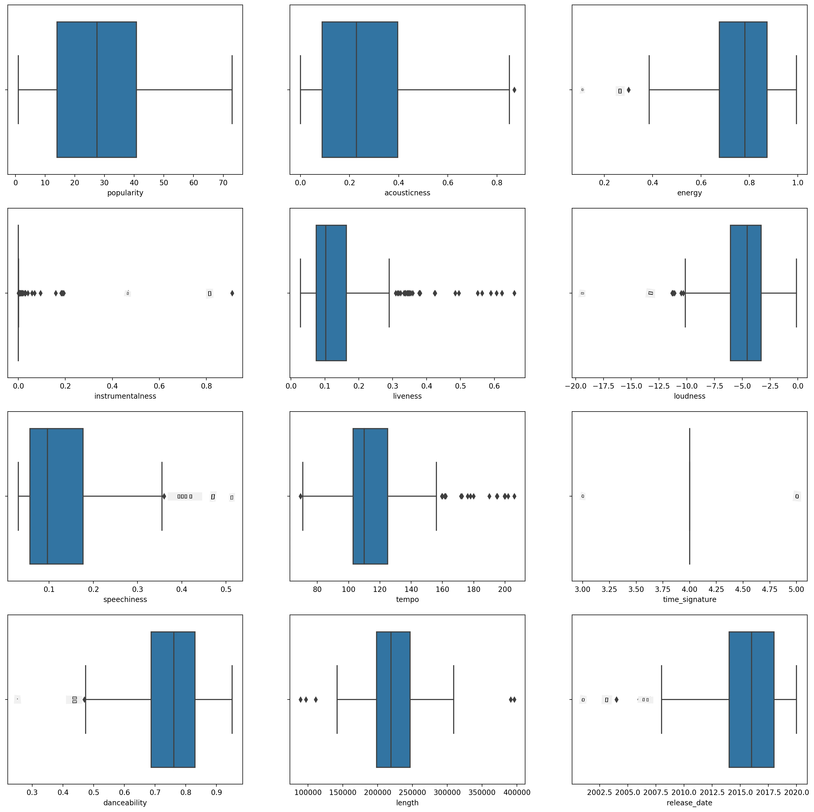
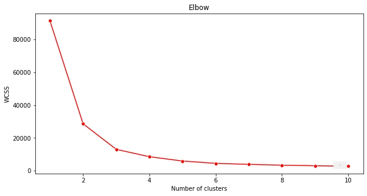
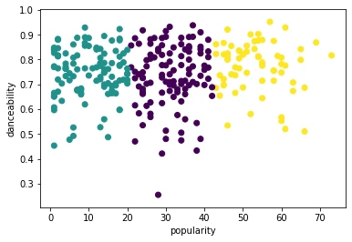
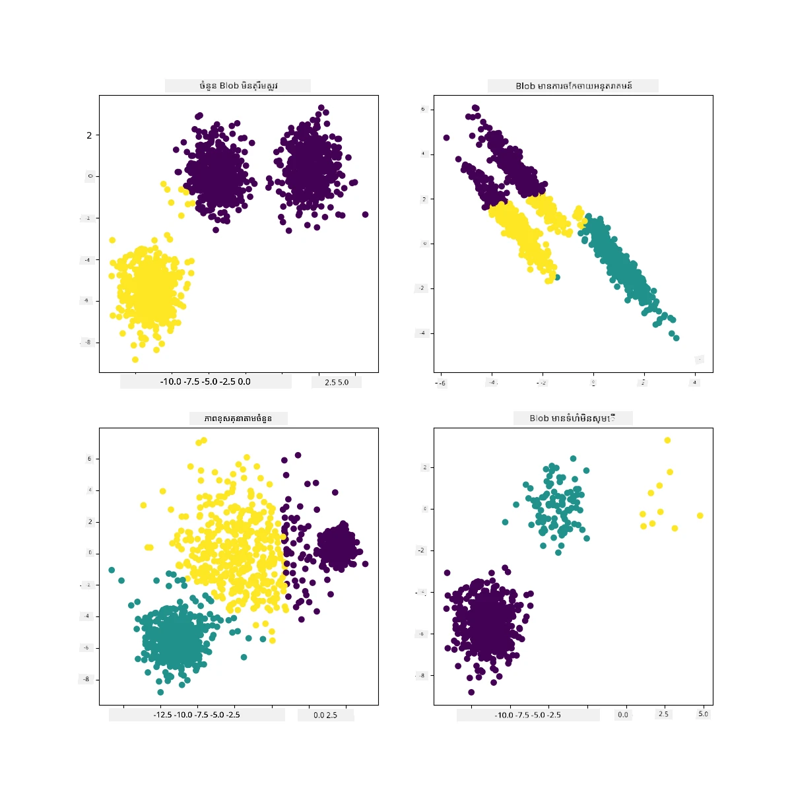

# ការបែងចែកក្រុម K-Means

## [វិញ្ញាសាមុនវគ្គ](https://ff-quizzes.netlify.app/en/ml/)

ក្នុងមេរៀននេះ អ្នក​នឹងរៀនពីរបៀបបង្កើត​ក្រុមឲ្យបានដោយប្រើ Scikit-learn និងឯកសារគម្រប់តន្ត្រីនីហ្សេរីយ៉ាដើម្បីនាំចូលមុននេះ។ យើង​នឹងរៀបរាប់ពីមូលដ្ឋាននៃ K-Means សម្រាប់​ការ​បែងចែក​ក្រុម។ សូមចងចាំថា ដូចដែលអ្នកបានរៀន​ក្នុងមេរៀនមុន មានរបៀបច្រើន​ក្នុងការប្រើក្រុម ហើយវិធីដែលអ្នកប្រើនឹងអាស្រ័យលើទិន្នន័យរបស់អ្នក។ យើង​នឹងសាកល្បង K-Means ព្រោះវាជា​បច្ចេកទេសបែងចែកក្រុមធម្មតា​បំផុត។ ចាប់ផ្តើមទៅ!

ពាក្យសំខាន់ដែលអ្នក​នឹងរៀនពី៖

- ពិន្ទុ Silhouette
- វិធី Elbow
- Inertia
- ភាពខុសគ្នា (Variance)

## ការណែនាំ

[K-Means Clustering](https://wikipedia.org/wiki/K-means_clustering) គឺ​ជា​វិធីមួយ​ចេញពី​វិស័យ​ការបញ្ចេញសញ្ញា។ វាត្រូវបានប្រើសម្រាប់បែងចែកក្រុមទិន្នន័យជា 'k' ក្រុមដោយប្រើសន្ទស្សន៍ជាច្រើន។ សន្ទស្សន៍នីមួយៗ​នឹងធ្វើការជួញដូរ​ដាក់​ជាក្រុម​និងទិន្នន័យ​ដែលជិតកន្លែង 'mean' ឬ​កាចំណុចមជ្ឈមណ្ឌលរបស់ក្រុម។

ក្រុមអាចត្រូវបាននាំមុខជារូបភាពជា [វ៉រ៉ូណូយ](https://wikipedia.org/wiki/Voronoi_diagram) ដែលរួមមានចំណុច (ឬ 'គ្រាប់') និងតំបន់​ដែលសមស្របមួយចំនួន។



> រូបតំណាងដោយ [Jen Looper](https://twitter.com/jenlooper)

ដំណើរការបែងចែកក្រុម K-Means [អនុវត្តក្នុងដំណើរការបីជំហាន](https://scikit-learn.org/stable/modules/clustering.html#k-means):

1. អាល់ហ្គូរីធម์ជ្រើសចំណុចមជ្ឈមណ្ឌលចំនួន k ដោយការជ្រើសតំណាងពីឯកសារទិន្នន័យ។ បន្ទាប់មកវាលូប:
    1. វាកំណត់កំណត់តំណាងនីមួយៗទៅកាន់បណ្តោយជិតបំផុត។
    2. វាបង្កើតចំណុចមជ្ឈមណ្ឌលថ្មីដោយយកតម្លៃមធ្យមនៃទិន្នន័យទាំងអស់ដែលបានចាត់ទៅកាន់ចំណុចមជ្ឈមណ្ឌលមុន។
    3. បន្ទាប់មក វាគណនាចំនួនខុសគ្នារវាងចំណុចមជ្ឈមណ្ឌលថ្មីនិងចំណុចចាស់ ហើយធ្វើឡើងវិញរហូតដល់ចំណុចមជ្ឈមណ្ឌលមានស្ថិរភាព។

ចំណុចខ្សោយមួយនៃការប្រើ K-Means គឺអ្នកត្រូវបង្កើត 'k' ដែលជាចំនួនចំណុចមជ្ឈមណ្ឌល។ ជាសំណាងវិធី 'elbow method' ជួយប៉ាន់ប្រមាណតម្លៃដើមល្អសម្រាប់ 'k'។ អ្នកនឹងសាកល្បងវិធីនេះមួយភ្លឺ។

## លក្ខខណ្ឌមុន

អ្នក​នឹង​ធ្វើការងារ​នៅក្នុង​ឯកសារ [_notebook.ipynb_](https://github.com/microsoft/ML-For-Beginners/blob/main/5-Clustering/2-K-Means/notebook.ipynb) ក្នុងមេរៀននេះ ដែលរួមមានការនាំចូល និងសម្អាតដំណើរការដំបូងដែលអ្នកបានធ្វើនៅមេរៀនមុន។

## អនុវត្ត - រៀបចំ

ចាប់ផ្តើមដោយមើលទិន្នន័យចម្រៀងម្តងទៀត។

1. បង្កើត boxplot ដោយហៅ `boxplot()` សម្រាប់ជួរឈរនីមួយៗ៖

    ```python
    plt.figure(figsize=(20,20), dpi=200)
    
    plt.subplot(4,3,1)
    sns.boxplot(x = 'popularity', data = df)
    
    plt.subplot(4,3,2)
    sns.boxplot(x = 'acousticness', data = df)
    
    plt.subplot(4,3,3)
    sns.boxplot(x = 'energy', data = df)
    
    plt.subplot(4,3,4)
    sns.boxplot(x = 'instrumentalness', data = df)
    
    plt.subplot(4,3,5)
    sns.boxplot(x = 'liveness', data = df)
    
    plt.subplot(4,3,6)
    sns.boxplot(x = 'loudness', data = df)
    
    plt.subplot(4,3,7)
    sns.boxplot(x = 'speechiness', data = df)
    
    plt.subplot(4,3,8)
    sns.boxplot(x = 'tempo', data = df)
    
    plt.subplot(4,3,9)
    sns.boxplot(x = 'time_signature', data = df)
    
    plt.subplot(4,3,10)
    sns.boxplot(x = 'danceability', data = df)
    
    plt.subplot(4,3,11)
    sns.boxplot(x = 'length', data = df)
    
    plt.subplot(4,3,12)
    sns.boxplot(x = 'release_date', data = df)
    ```

    ទិន្នន័យនេះមានសំឡេងរំខានតិចតួច៖ ដោយមើលជាបទបង្ហាញ boxplot នីមួយៗ អ្នកអាចមើលឃើញព្រំដែនដែលឆ្លងកាត់។

    

អ្នកអាចធ្វើការលុបចោលព្រំដែនទាំងនេះពីឯកសារទិន្នន័យ ប៉ុន្តែវានឹងធ្វើឱ្យទិន្នន័យតិចតួចបន្ថែម។

1. សម្រាប់បច្ចុប្បន្ន ជ្រើសជួរឈរដែលអ្នកចង់ប្រើសម្រាប់លំហាត់បែងចែកក្រុមរបស់អ្នក។ ជ្រើសជួរឈរដែលមានចន្លោះស្រដៀងគ្នា និងផ្ទេរព័ត៌មានប្រែប្រួល `artist_top_genre` ទៅជាទិន្នន័យជាចំនួន៖

    ```python
    from sklearn.preprocessing import LabelEncoder
    le = LabelEncoder()
    
    X = df.loc[:, ('artist_top_genre','popularity','danceability','acousticness','loudness','energy')]
    
    y = df['artist_top_genre']
    
    X['artist_top_genre'] = le.fit_transform(X['artist_top_genre'])
    
    y = le.transform(y)
    ```

1. ឥឡូវហើយ អ្នកត្រូវជ្រើសរើសចំនួនក្រុមដែលអ្នកចង់បែងចែក។ អ្នកដឹងថាមានចម្រៀង 3 មុខចម្រៀងដែលយើងបានដកចេញពីឯកសារទិន្នន័យ ដូច្នេះសាកល្បង 3៖

    ```python
    from sklearn.cluster import KMeans
    
    nclusters = 3 
    seed = 0
    
    km = KMeans(n_clusters=nclusters, random_state=seed)
    km.fit(X)
    
    # ខាតថានអំពីក្រុមសម្រាប់ចំណុចទិន្នន័យនីមួយៗ
    
    y_cluster_kmeans = km.predict(X)
    y_cluster_kmeans
    ```

អ្នកនឹងឃើញអារេមួយបោះពុម្ពជាមួយក្រុមដែលបានទាយទោល (0, 1, ឬ 2) សម្រាប់ជួរដេតាប្រេមមួយៗ។

1. ប្រើអារេនេះដើម្បីគណនាពិន្ទុ 'silhouette':

    ```python
    from sklearn import metrics
    score = metrics.silhouette_score(X, y_cluster_kmeans)
    score
    ```

## ពិន្ទុ Silhouette

ស្វែងរកពិន្ទុ silhouette ដែលឆៀងទៅកាន់ 1។ ពិន្ទុនេះប្រែប្រួលពី -1 ទៅ 1 ហើយ បើពិន្ទុជាប្រាំមួយ គឺក្រុមមានភាពរឹងមាំ និងបំបែកច្បាស់ពីក្រុមផ្សេងទៀត។ តម្លៃជិត 0 បង្ហាញពីក្រុមដែលមានការច្របូកច្របល់ ជួរដេតានៅជិតព្រំដែនសម្រាច់របស់ក្រុមជិតខាង។ [(ប្រភព)](https://dzone.com/articles/kmeans-silhouette-score-explained-with-python-exam)

ពិន្ទុរបស់យើងគឺ **.53**, ដូច្នេះវាជាកណ្តាល។ នេះបង្ហាញថា ទិន្នន័យរបស់យើងគ្មានសមត្ថភាពល្អយ៉ាងខ្លាំងសម្រាប់បែបនេះនៃការបែងចែកក្រុម ប៉ុន្តែយើងនឹងបន្ត។

### អនុវត្ត - សង់ម៉ូដែល

1. នាំចូល `KMeans` ហើយចាប់ផ្តើមដំណើរការបែងចែកក្រុម។

    ```python
    from sklearn.cluster import KMeans
    wcss = []
    
    for i in range(1, 11):
        kmeans = KMeans(n_clusters = i, init = 'k-means++', random_state = 42)
        kmeans.fit(X)
        wcss.append(kmeans.inertia_)
    
    ```

    មានផ្នែកខ្លះនៅទីនេះដែលត្រូវការពន្យល់។

    > 🎓 range: វាជាចំនួន iteration នៃដំណើរការបែងចែកក្រុម

    > 🎓 random_state: "កំណត់ការបង្កើតលេខចៃដន្យសម្រាប់ការចាប់ផ្តើមចំណុចមជ្ឈមណ្ឌល។" [ប្រភព](https://scikit-learn.org/stable/modules/generated/sklearn.cluster.KMeans.html#sklearn.cluster.KMeans)

    > 🎓 WCSS: "ផលបូកចំនួនក្រឡាចត្រង្គនៅក្នុងក្រុម" វាស់ខុសបរិមាណក្រឡាចត្រង្គមធ្យមនៃចំណុចទាំងអស់នៅក្នុងក្រុមធៀបជាមួយចំណុចមជ្ឈមណ្ឌលក្រុម។ [ប្រភព](https://medium.com/@ODSC/unsupervised-learning-evaluating-clusters-bd47eed175ce).

    > 🎓 Inertia: អាល់ហ្គូរីធម៍ K-Means ព្យាយាមជ្រើសចំណុចមជ្ឈមណ្ឌលដើម្បីកាត់បន្ថយ 'inertia' ដែលជាការវាស់ថា ក្រុមមានភាពរឹងមាំក្នុងខ្លួនយ៉ាងណា។ [ប្រភព](https://scikit-learn.org/stable/modules/clustering.html) តម្លៃនេះត្រូវបានបន្ថែមទៅអថេរ wcss នៅរាល់ចំនួន iteration។

    > 🎓 k-means++: នៅ [Scikit-learn](https://scikit-learn.org/stable/modules/clustering.html#k-means) អ្នកអាចប្រើការបង្កើតចំណុចមជ្ឈមណ្ឌល 'k-means++' ដែល "ចាប់ផ្តើមចំណុចមជ្ឈមណ្ឌលឲ្យនៅឆ្ងាយពីគ្នាដោយទូទៅ បណ្ដាលអោយលទ្ធផលប្រសើរជាងការចាប់ផ្តើមចៃដន្យ។

### វិធី Elbow

មុននេះ អ្នកបានសន្និដ្ឋានថា ដូចជាអ្នកបានគោលបំណងចម្រៀង 3 ប្រភេទ អ្នកគួរជ្រើសក្រុម 3 តែតើពិតទេ?

1. ប្រើវិធី 'elbow method' ដើម្បីធានា។

    ```python
    plt.figure(figsize=(10,5))
    sns.lineplot(x=range(1, 11), y=wcss, marker='o', color='red')
    plt.title('Elbow')
    plt.xlabel('Number of clusters')
    plt.ylabel('WCSS')
    plt.show()
    ```

    ប្រើអថេរ `wcss` ដែលអ្នកបានបង្កើតនៅជំហានមុន ដើម្បីបង្កើតក្រាផិកបង្ហាញទីដែលមាន 'bend' ក្នុង elbow ដោយបង្ហាញពីចំនួនក្រុម​អប្បបរមា។ ប្រហែលជា វា **ជាអច់** 3!

    

## អនុវត្ត - បង្ហាញក្រុម

1. សាកល្បងដំណើរការតម្កល់ម្តងទៀត កំណត់ក្រុម 3 ដង ហើយបង្ហាញក្រុមជារ៉ែតូច៖

    ```python
    from sklearn.cluster import KMeans
    kmeans = KMeans(n_clusters = 3)
    kmeans.fit(X)
    labels = kmeans.predict(X)
    plt.scatter(df['popularity'],df['danceability'],c = labels)
    plt.xlabel('popularity')
    plt.ylabel('danceability')
    plt.show()
    ```

1. ពិនិត្យភាពត្រឹមត្រូវនៃម៉ូដែល៖

    ```python
    labels = kmeans.labels_
    
    correct_labels = sum(y == labels)
    
    print("Result: %d out of %d samples were correctly labeled." % (correct_labels, y.size))
    
    print('Accuracy score: {0:0.2f}'. format(correct_labels/float(y.size)))
    ```

    ភាពត្រឹមត្រូវរបស់ម៉ូដែលនេះមិនល្អទេ ហើយរូបរាងក្រុមផ្តល់សញ្ញាឲ្យអ្នកដឹងមូលហេតុ។

    

    ទិន្នន័យនេះមិន​តុល្យភាពគ្រប់គ្រាន់ ទំនាក់ទំនងតិចហើយ​មានភាពខុសគ្នាច្រើនរវាងតម្លៃជួរឈរដើម្បីបែងចែកក្រុមឲ្យបានល្អ។ ជាក់ស្តែង ក្រុមដែលបង្កើតឡើងស័ក្ដិ influenced ឬ មានភាពច្រាសច្រោមយ៉ាងខ្លាំងដោយក្រុមចម្រៀង 3 មុខដែលយើងបានកំណត់ពីមុន។ នេះជាដំណើរការសិក្សា!

    ឯកសារនៃ Scikit-learn អ្នកអាចមើលឃើញថា ម៉ូដែលដូចនេះ ដែលក្រុមមិនបានបំបែកច្បាស់ មានបញ្ហា 'variance'៖

    
    > រូបតំណាងពី Scikit-learn

## ភាពខុសគ្នា (Variance)

ភាពខុសគ្នាបានកំណត់ថា "ជាមធ្យមនៃភាពខុសគ្នាចត្រង្គពីមធ្យម" [(ប្រភព)](https://www.mathsisfun.com/data/standard-deviation.html)។ នៅក្នុងបរិបទនៃបញ្ហាបែងចែកក្រុមនេះ វាសម្រាប់បញ្ជាក់ពីទិន្នន័យដែលចំនួនក្នុងឯកសារទិន្នន័យច្រាំងចេញពីមធ្យមច្រើនពេក។

✅ នេះជាពេលវេលាល្អក្នុងការគិតពីវិធីទាំងអស់ដែលអ្នកអាចកែតម្រូវបញ្ហានេះ។ ចំពោះទិន្នន័យមួយ? ប្រើជួរឈរផ្សេង? ប្រើអាល់ហ្គូរីធម៍ផ្សេង? សេចក្តីផ្តល់អនុសាសន៍: សាកល្បង [ការប្រភេទទិន្នន័យរបស់អ្នក](https://www.mygreatlearning.com/blog/learning-data-science-with-k-means-clustering/) ដើម្បីធ្វើឲ្យវាមានស្តង់ដារនិងសាកល្បងជួរឈរផ្សេងៗ។

> សាកល្បង '[កម្មវិធីគណនា variance](https://www.calculatorsoup.com/calculators/statistics/variance-calculator.php)' ដើម្បីយល់ពីគំនិតនេះបន្ថែម។

---

## 🚀챌린지

ចំណាយពេលជាមួយ notebook នេះ ប៉ិនប្រមាណប៉ារ៉ាម៉ែត្រ។ អ្នកអាចធ្វើឲ្យភាពត្រឹមត្រូវនៃម៉ូដែលកាន់តែប្រសើរដោយសម្អាតទិន្នន័យច្រើនជាងមុន (ដូចជាលុបចោលព្រំដែន)? អ្នកអាចប្រើទំងន់ដើម្បីផ្ដល់ទំងន់ចំពោះទិន្នន័យខ្លះៗ។ តើមានអ្វីទៀតដែលអ្នកអាចធ្វើដើម្បីបង្កើតក្រុមល្អជាងនេះ?

សេចក្តីផ្តល់អនុសាសន៍៖ សាកល្បងបញ្ចូលការប្រភេទទិន្នន័យ។ មានកូដដែលបានព្រីនុចក្នុង notebook ដែលបន្ថែមការប្រភេទស្តង់ដារដើម្បីឲ្យជួរឈរទិន្នន័យមានម៉ាស្សារូបរាងដូចគ្នាច្រើនជាង។ អ្នកនឹងរកឃើញថា ខណៈពិន្ទុ silhouette បន្ថយ កំណត់ 'kink' នៅក្រាផិក elbow ចេញរាបស្មើឡើង។ នេះដោយសារពេលទិន្នន័យមិនត្រូវបានប្រភេទ ក្រុមដែលមានភាពខុសខាតតិចនឹងមានទំងន់ធ្ងន់ជាង។ អានបន្ថែមអំពីបញ្ហានេះ [នៅទីនេះ](https://stats.stackexchange.com/questions/21222/are-mean-normalization-and-feature-scaling-needed-for-k-means-clustering/21226#21226)។

## [វិញ្ញាសាក្រោយវគ្គ](https://ff-quizzes.netlify.app/en/ml/)

## ពិនិត្យឡើងវិញ & សិក្សាឯកតាឯករាជ្យ

មើលឧបករណ៍រៀបចំ K-Means [ដូចទម្រង់នេះ](https://user.ceng.metu.edu.tr/~akifakkus/courses/ceng574/k-means/)។ អ្នកអាចប្រើឧបករណ៍នេះដើម្បីបង្ហាញចំណុចទិន្នន័យគំរូ និងកំណត់ចំណុចមជ្ឈមណ្ឌលរបស់វា។ អ្នកអាចកែប្រែ randomness ទិន្នន័យ ចំនួនក្រុម និងចំនួនចំណុចមជ្ឈមណ្ឌល។ តើវាជួយអ្នកបានគំនិតពីរបៀបបែងចែកទិន្នន័យជាក្រុម?

ក្រៅពីនេះ មើលឯកសារនេះ [K-Means](https://stanford.edu/~cpiech/cs221/handouts/kmeans.html) ពីស្ថានទិន្នន័យ Stanford ។

## កិច្ចការផ្ទះ

[សាកល្បងកិច្ចការបែងចែកក្រុមផ្សេងៗ](assignment.md)

---

<!-- CO-OP TRANSLATOR DISCLAIMER START -->
**ការបដិបត្តិ**៖  
ឯកសារនេះត្រូវបានបកប្រែដោយប្រើសេវាកម្មបកប្រែ AI [Co-op Translator](https://github.com/Azure/co-op-translator)។ ខណៈពេលយើងខិតខំធ្វើឱ្យបានច្បាស់លាស់ សូមយល់ថា ការបកប្រែដោយស្វ័យប្រវត្តិក្នុងសំណុំនេះអាចមានកំហុស ឬការមិនត្រឹមត្រូវ។ ឯកសារដើមក្នុងភាសាទីផ្សារដើមគួរត្រូវបានពិចារណាថាជា ប្រភពដែលមានសក្តានុពល។ សម្រាប់ព័ត៌មានសំខាន់ៗ សូមណែនាំឲ្យប្រើសេវាកម្មបកប្រែដែលធ្វើដោយមនុស្សជំនាញ។ យើងមិនទទួលខុសត្រូវចំពោះការយល់ច្រឡំ ឬការបកប្រែរបស់មិនត្រឹមត្រូវណាមួយដែលកើតឡើងពីការប្រើប្រាស់ការបកប្រែនេះ។
<!-- CO-OP TRANSLATOR DISCLAIMER END -->