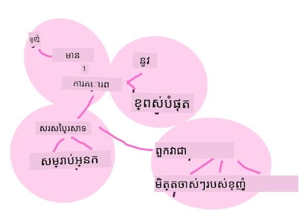
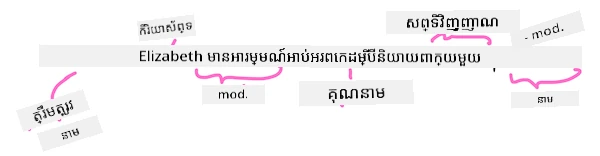

# ការងារជាទូទៅនៃដំណើរការបម្លែងភាសាជាស្រ្តី និងបច្ចេកទេសផ្សេងៗ

សម្រាប់ការងារ *ដំណើរការបម្លែងភាសាជាស្រ្តី* សន្តិសុខមួយចំនួន ប្រយោលដែលត្រូវដំណើរការ ត្រូវបានបំបែក ចែកសមាសភាព និងរក្សាទុកលទ្ធផល ឬយោងតាមច្បាប់ និងឈុតទិន្នន័យ។ ការងារទាំងនេះ អនុញ្ញាតឲ្យកម្មវិធីកុំព្យូទ័រចេញចំណេះដឹងពី _អត្ថន័យ_ ឬ _បំណង_ ឬគឺ _ចំនួនកើតឡើង_ នៃពាក្យ និងពាក្យសំដីនៅក្នុងអត្ថបទ។

## [សំណួរប្រឡងមុនពេលសិក្សា](https://ff-quizzes.netlify.app/en/ml/)

មកស្វែងយល់ពីបច្ចេកទេសទូទៅប្រើប្រាស់ក្នុងការដំណើរការអត្ថបទ។ រួមបញ្ចូលជាមួយការរៀនម៉ាស៊ីន បច្ចេកទេសទាំងនេះជួយអ្នកវិភាគអត្ថបទច្រើនយ៉ាងមានប្រសិទ្ធភាព។ មុនពេលអនុវត្តការរៀនម៉ាស៊ីនទៅការងារទាំងនេះ ទោះជាយ៉ាងណា មកយល់ពីបញ្ហាដែលជំនាញ NLP បានជួបប្រទៈ។

## ការងារទូទៅសម្រាប់ NLP

មានវិធីផ្សេងៗក្នុងការវិភាគអត្ថបទដែលអ្នកកំពុងធ្វើការ។ មានការងារដែលអ្នកអាចអនុវត្តបាន ហើយតាមរយៈការងារទាំងនេះ អ្នកអាចវាស់វែងការយល់ដឹងអំពីអត្ថបទ និងទាញយកសេចក្តីសន្និដ្ឋាន។ វាធម្មតាអ្នកអនុវត្តការងារទាំងនេះតាមលំដាប់ជួរ។

### ការបំបែកពាក្យ

ប្រហែលជារឿងដំបូងដែលអាល់ហ្គរីធម៍ NLP ចាំបាច់ធ្វើ គឺបំបែកអត្ថបទទៅជាពាក្យ ឬ token។ ទោះបីវាមើលទៅសាមញ្ញ ក៏ដោយ ត្រូវរាប់បញ្ចូល ចំណុចពាក្យសម្គាល់ និងភាសារផ្សេងៗដែលមានរំលេចពាក្យ និងប្រយោគ អាចធ្វើឲ្យវារវល់។ អ្នកប្រហែលជាត្រូវប្រើវិធីផ្សេងៗក្នុងកំណត់ព្រំដែន។


> ការបំបែកពាក្យប្រយោគមួយពី **Pride and Prejudice**។ រូបភាពដោយ [Jen Looper](https://twitter.com/jenlooper)

### ការចម្លងបំលែង <i>Embeddings</i>

[Word embeddings](https://wikipedia.org/wiki/Word_embedding) គឺជាវិធីមួយក្នុងការបម្លែងទិន្នន័យអត្ថបទរបស់អ្នកទៅជាលេខ។ Embeddings ត្រូវធ្វើម៉្យាងដែលពាក្យដែលមានអត្ថន័យស្រដៀងឬពាក្យដែលប្រើប្រាស់រួមគ្នា ត្រូវរួមជាក្រុមគ្នា។


> "ខ្ញុំមានកិត្យាស្រយាលខ្ពស់ចំពោះសរសៃប្រសាទរបស់អ្នក ពួកវាជាមិត្តបងប្អូនចាស់របស់ខ្ញុំ។" - Word embeddings សម្រាប់ប្រយោគមួយនៅ **Pride and Prejudice**។ រូបភាពដោយ [Jen Looper](https://twitter.com/jenlooper)

✅ សាកល្បង [ឧបករណ៍ចម្លែកនេះ](https://projector.tensorflow.org/) ដើម្បីសាកល្បង word embeddings។ ចុចលើពាក្យមួយ បង្ហាញក្រុមពាក្យស្រដៀងៗគ្នា៖ 'toy' រួមជាមួយ 'disney', 'lego', 'playstation', និង 'console'។

### ការវិភាគផ្លូវរចនា និង គ្រឿងតុបតែងភាសា (POS Tagging)

ពាក្យរាល់ពាក្យដែលបានបំបែកអាចត្រូវបានផ្ដល់ស្លាកជាប្រភេទគ្រឿងតុបតែងភាសា - ឈ្មោះនាម, កិរិយាស័ព្ទ, ឬគុណនាម។ ប្រយោគ `the quick red fox jumped over the lazy brown dog` អាចត្រូវបានបញ្ចូលស្លាក POS ដូចជា fox = នាម, jumped = កិរិយាស័ព្ទ។



> ការវិភាគចំពោះប្រយោគមួយពី **Pride and Prejudice**។ រូបភាពដោយ [Jen Looper](https://twitter.com/jenlooper)

ការវិភាគ គឺសម្គាល់ថាពាក្យមួយៗមានទំនាក់ទំនងគ្នាយ៉ាងដូចម្តេចនៅក្នុងប្រយោគ - ឧទាហរណ៍ `the quick red fox jumped` ជាលំដាប់គុណនាម-នាម-កិរិយាស័ព្ទ ដែលបំបែកខុសពីលំដាប់ `lazy brown dog`។

### ចំនួនកើតឡើងនៃពាក្យ និងវាក្យសម្រុក

វិធីប្រើប្រាស់មានប្រយោជន៍មួយនៅពេលវិភាគអត្ថបទធំមួយ គឺបង្កើតវចនានុក្រមនៃពាក្យ ឬវាក្យសម្រុកដែលចាប់អារម្មណ៍ និងចំនួនកើតឡើងរបស់វា។ វាក្យសម្រុក `the quick red fox jumped over the lazy brown dog` មានចំនួនកើតឡើង 2 សម្រាប់ពាក្យ the។

មកមើលអត្ថបទឧទាហរណ៍មួយដែលយើងរាប់ចំនួនកើតឡើងនៃពាក្យ។ យកកាដើមទសព្យពាក្យ Rugyard Kipling "The Winners" មានវត្រង់ដូចខាងក្រោម៖

```output
What the moral? Who rides may read.
When the night is thick and the tracks are blind
A friend at a pinch is a friend, indeed,
But a fool to wait for the laggard behind.
Down to Gehenna or up to the Throne,
He travels the fastest who travels alone.
```

ដោយសារវាក្យសម្រុកអាចសំរាប់ភ្ជាប់ចំរូង case sensitive ឬ case insensitive តាមការត្រូវការ ប៉ុន្តែវាក្យសម្រុក `a friend` មានចំនួនកើតឡើង 2 ហើយ `the` មានចំនួនកើតឡើង 6 ហើយ `travels` មានចំនួន 2។

### N-grams

អត្ថបទអាចត្រូវបានចែកជា លំដាប់ពាក្យដែលមានប្រវែងបង្កប់មួយ ដូចជា ពាក្យតែមួយ (unigram), ពាក្យពីរ (bigrams), ពាក្យបី (trigrams) ឬជាចំនួនពាក្យណាមួយ (n-grams)។

ឧទាហរណ៍ `the quick red fox jumped over the lazy brown dog` ជាមួយពិន្ទុ n-gram 2 ផលិតនូវ n-grams ខាងក្រោម៖

1. the quick 
2. quick red 
3. red fox
4. fox jumped 
5. jumped over 
6. over the 
7. the lazy 
8. lazy brown 
9. brown dog

វាអាចងាយស្រួលប្រសើរជាងជាមួយនឹងការថតដំបូងលើប្រយោគ។ ជាលំនាំអំពី n-grams 3 ពាក្យ n-gram ពណ៌ត្រង់ក្នុងមួយប្រយោគដូចខាងក្រោម៖ 

1.   <u>**the quick red**</u> fox jumped over the lazy brown dog
2.   the **<u>quick red fox</u>** jumped over the lazy brown dog
3.   the quick **<u>red fox jumped</u>** over the lazy brown dog
4.   the quick red **<u>fox jumped over</u>** the lazy brown dog
5.   the quick red fox **<u>jumped over the</u>** lazy brown dog
6.   the quick red fox jumped **<u>over the lazy</u>** brown dog
7.   the quick red fox jumped over <u>**the lazy brown**</u> dog
8.   the quick red fox jumped over the **<u>lazy brown dog</u>**


> តម្លៃ N-gram 3៖ រូបមន្តដោយ [Jen Looper](https://twitter.com/jenlooper)

### ការនាំយកវាក្យភាសា ឬ Noun phrase

នៅក្នុងប្រយោគភាគច្រើន មាននាមមួយដែលជា ប្រធាន ឬវត្ថុរបស់ប្រយោគ។ ក្នុងភាសាអង់គ្លេស វាពិបាកស្គាល់ដូចជាមានពាក្យ 'a' ឬ 'an' ឬ 'the' មុខវា។ ការសម្គាល់ប្រធាន ឬវត្ថុដោយ 'នាំយកវាក្យភាសា' គឺជាការងារមួយទូទៅនៅក្នុង NLP នៅពេលដែលព្យាយាមយល់អត្តន័យរបស់ប្រយោគ។

✅ ក្នុងប្រយោគ "I cannot fix on the hour, or the spot, or the look or the words, which laid the foundation. It is too long ago. I was in the middle before I knew that I had begun." អ្នកអាចសម្គាល់វាក្យភាសា?

ក្នុងប្រយោគ `the quick red fox jumped over the lazy brown dog` មានវាក្យភាសា 2៖ **quick red fox** និង **lazy brown dog**។

### វិភាគអារម្មណ៍

ប្រយោគ ឬអត្ថបទអាចត្រូវបានវិភាគសម្រាប់អារម្មណ៍ ឬថាតើវា *វិជ្ជមាន* ឬ *អវិជ្ជមាន* មួយ។ អារម្មណ៍វាស់វែងជាពណ៌អំណស្សក៍ និងអតិបរមា/អធិបរមា (polarity និង objectivity/subjectivity)។ Polarity វាស់វែងពី -1.0 ទៅ 1.0 (អវិជ្ជមានទៅវិជ្ជមាន) និង 0.0 ទៅ 1.0 (សំរាប់អតិបរមាទៅអធិបរមា) ។

✅ នៅពេលក្រោយ អ្នកនឹងរៀនថាមានវិធីផ្សេងៗក្នុងការកំណត់អារម្មណ៍ដោយប្រើការរៀនម៉ាស៊ីន ប៉ុន្តែវិធីមួយគឺមានបញ្ជីពាក្យ និងវាក្យសម្រុកដែលត្រូវបានចាត់ថ្នាក់ជា positive ឬ negative ដោយអ្នកជំនាញមនុស្ស ហើយអនុវត្តគំរូទៅលើអត្ថបទដើម្បីគណនាចំនួន polarity។ អ្នកអាចមើលឃើញថាវាធ្វើដូចម្តេចនៅស្ថានការណ៍ខ្លះ និងតិចក្នុងស្ថានការណ៍ផ្សេងទៀត?

### Inflection

Inflection អនុញ្ញាតឲ្យអ្នកយកពាក្យមួយ ហើយទទួលបាននាមវត្ថុម្នាក់ឬពហុវត្ថុនៃពាក្យនោះ។

### Lemmatization

<i>lemma</i> គឺជាគោលដៅ ឬពាក្យដើមសម្រាប់ជុំវិញពាក្យមួយក្រុម បទពិសោធន៍ដូចជា *flew*, *flies*, *flying* មាន lemma គឺកិរិយាស័ព្ទ *fly*។

ក៏មានមូលដ្ឋានទិន្នន័យមានប្រយោជន៍សម្រាប់អ្នកស្រាវជ្រាវ NLP ដូចជាៈ

### WordNet

[WordNet](https://wordnet.princeton.edu/) គឺជាមូលដ្ឋានទិន្នន័យពាក្យ សមាសភាពសំដីប្រយោគ និងព័ត៌មានផ្សេងៗសម្រាប់ពាក្យរាល់ពាក្យក្នុងភាសាច្រើនផ្សេងៗគ្នា។ វាមានប្រយោជន៍ខ្លាំងនៅពេលព្យាយាមបង្កើតការប្រែប្រាស់ កម្មវិធីកំណត់អក្សរត្រួតពិនិត្យ ឬឧបករណ៍ភាសាប្រភេទណាមួយ។

## បណ្ណាល័យ NLP

សំណាងល្អ អ្នកមិនចាំបាច់បង្កើតបច្ចេកទេសទាំងនេះផ្ទាល់ទាំងអស់ទេ ព្រោះមានបណ្ណាល័យ Python ល្អៗដែលធ្វើឲ្យវាងាយស្រួលសម្រាប់អ្នកអភិវឌ្ឍដែលមិនពិសេសក្នុងដំណើរការបម្លែងភាសាជាស្រ្តី ឬការរៀនម៉ាស៊ីន។ មេរៀនបន្ទាប់មានឧទាហរណ៍បន្ថែមច្រើនខាងលើ ប៉ុន្តែទីនេះ អ្នកនឹងរៀនឧទាហរណ៍ប្រយោជន៍ខ្លះៗដើម្បីជួយអ្នកកិច្ចការ។

### លំហាត់ - ប្រើបណ្ណាល័យ `TextBlob`

មកប្រើបណ្ណាល័យដែលហៅថា TextBlob ព្រោះវាមាន API ផ្តល់ជំនួយសម្រាប់ដោះស្រាយប្រភេទការងារទាំងនេះ។ TextBlob "ឈរលើស្មារតីដ៏ធំនៃ [NLTK](https://nltk.org) និង [pattern](https://github.com/clips/pattern) ហើយមានការបញ្ចូលសាមញ្ញជាមួយទាំងពីរ"។ វាមានបរិមាណ ML មានជាច្រើននៅក្នុង API របស់វា។

> កំនត់ចំណាំ៖ មានមគ្គុទេសក៍ [Quick Start](https://textblob.readthedocs.io/en/dev/quickstart.html#quickstart) ដែលមានប្រយោជន៍សម្រាប់ TextBlob ដែលបានផ្តល់អត្ថប្រយោជន៍សម្រាប់អ្នកអភិវឌ្ឍ Python មានបទពិសោធន៍។

នៅពេលព្យាយាមសម្គាល់ *វាក្យភាសា* TextBlob ផ្តល់ជម្រើស extractor ជាច្រើនសម្រាប់រកវាក្យភាសា។

1. មើលទៅហើយលើ `ConllExtractor`។

    ```python
    from textblob import TextBlob
    from textblob.np_extractors import ConllExtractor
    # នាំចូល ហើយបង្កើតឧបករណ៍ទាញយក Conll ដើម្បីប្រើក្រោយ
    extractor = ConllExtractor()
    
    # ក្រោយពេលដែលអ្នកត្រូវការឧបករណ៍ទាញយកវាក្យបុព្វបទសកម្មភាពចំណាំ:
    user_input = input("> ")
    user_input_blob = TextBlob(user_input, np_extractor=extractor)  # សម្គាល់ថាឧបករណ៍ទាញយកមិនមែនលំនាំដើមត្រូវបានបញ្ជាក់ឡើយ
    np = user_input_blob.noun_phrases                                    
    ```

    > តើមានអ្វីកើតឡើងនៅទីនេះ? [ConllExtractor](https://textblob.readthedocs.io/en/dev/api_reference.html?highlight=Conll#textblob.en.np_extractors.ConllExtractor) ជា "ឧបករណ៍នាំយកវាក្យភាសាមួយដែលប្រើការជម្រះ chunk parsing ដែលបានបង្រៀនជាមួយ ConLL-2000 training corpus"។ ConLL-2000 សំដៅទៅកាន់សន្និបាត 2000 ផ្នែកចំណេះដឹងដំណើរការភាសាជាស្រ្តីដោយកុំព្យូទ័រ។ គ្រប់ឆ្នាំ សន្និបាតនេះមានសិក្ខាសាលាផ្តល់ដោះស្រាយបញ្ហា NLP ពិបាក ហើយឆ្នាំ 2000 គឺជាការចែកម៉ូដែល noun chunking។ ម៉ូដែលត្រូវបានបង្រៀននៅលើ Wall Street Journal ជាមួយ "ផ្នែក 15-18 ជាដាតាប្រើសម្រាប់បង្រៀន (211727 tokens) និងផ្នែក 20 ជាដាតាសម្រាប់សាកល្បង (47377 tokens)"។ អ្នកអាចមើលដំណើរការដំណើរ [ទីនេះ](https://www.clips.uantwerpen.be/conll2000/chunking/) និង [លទ្ធផល](https://ifarm.nl/erikt/research/np-chunking.html)។

### បញ្ហា - បង្កើត bot របស់អ្នកឲ្យប្រសើរជាមួយ NLP

ក្នុងមេរៀនមុន អ្នកបានបង្កើតbotសំណួរ-ចម្លើយងាយៗមួយ។ ឥឡូវនេះ អ្នកនឹងធ្វើឲ្យ Marvin មើលទៅមានមនុស្សធម៌បន្តិច ដោយវិភាគអារម្មណ៍នៃការបញ្ចូលព័ត៌មាន រួចបោះពុម្ពមតិក្នុងការឆ្លើយតបសមរម្យតាមអារម្មណ៍។ អ្នកក៏ត្រូវសំគាល់ `noun_phrase` ហើយសួរអំពីវា។

ជំហានរបស់អ្នកនៅពេលបង្កើត bot សន្ទនា ប្រសើរជាងមុន៖

1. បោះពុម្ពអនុសាសន៍ណែនាំដល់អ្នកប្រើអំពីរបៀបធ្វើការ ជាមួយ bot
2. ចាប់ផ្ដើមចូលរង្វាន់ (loop)
   1. ទទួលការបញ្ចូលពីអ្នកប្រើ
   2. ប្រសិនបើអ្នកប្រើបានស្នើសុំចាកចេញ ចប់កម្មវិធី
   3. ដំណើរការបញ្ចូលពីអ្នកប្រើ ហើយកំណត់ការឆ្លើយតបតាមអារម្មណ៍
   4. ប្រសិនបើមានវាក្យភាសាត្រូវបានរកឃើញ នៅក្នុងអារម្មណ៍ សូមបង្វះវា និងសួរពាណិជ្ជកម្មបន្ថែមអំពីប្រធានបទនោះ
   5. បោះពុម្ពចម្លើយ
3. ត្រលប់ទៅជំហាន 2

នេះគឺជាឧទាហរណ៍កូដកំណត់អារម្មណ៍ដោយប្រើ TextBlob។ សូមចំណាំថាមានតែបួន *កម្រិត* នៃចម្លើយអារម្មណ៍តែប៉ុណ្ណោះ (អ្នកអាចមានច្រើនជាងនេះ ប្រសិនបើចង់បាន)៖

```python
if user_input_blob.polarity <= -0.5:
  response = "Oh dear, that sounds bad. "
elif user_input_blob.polarity <= 0:
  response = "Hmm, that's not great. "
elif user_input_blob.polarity <= 0.5:
  response = "Well, that sounds positive. "
elif user_input_blob.polarity <= 1:
  response = "Wow, that sounds great. "
```

នេះជាឧទាហរណ៍ចេញព័ត៌មានមួយ ដើម្បីណែនាំអ្នក (ការបញ្ចូលអ្នកប្រើមាននៅលើបន្ទាត់ដែលចាប់ផ្ដើមជាមួយ >):

```output
Hello, I am Marvin, the friendly robot.
You can end this conversation at any time by typing 'bye'
After typing each answer, press 'enter'
How are you today?
> I am ok
Well, that sounds positive. Can you tell me more?
> I went for a walk and saw a lovely cat
Well, that sounds positive. Can you tell me more about lovely cats?
> cats are the best. But I also have a cool dog
Wow, that sounds great. Can you tell me more about cool dogs?
> I have an old hounddog but he is sick
Hmm, that's not great. Can you tell me more about old hounddogs?
> bye
It was nice talking to you, goodbye!
```

ដំណោះស្រាយមួយសម្រាប់ការងារនេះគឺ [នៅទីនេះ](https://github.com/microsoft/ML-For-Beginners/blob/main/6-NLP/2-Tasks/solution/bot.py)

✅ ការត្រួតពិនិត្យចំណេះដឹង

1. តើអ្នកគិតថាចម្លើយដែលមានការស្រលាញ់នឹងអាច 'ជួញដូរ' មនុស្សម្នាក់ឲ្យគិតថាbotបានយល់ពួកគេមែនទេ?
2. តើការបន្ថែមវាក្យភាសាធ្វើឲ្យបូតមើលទៅ 'ជាក់ស្តែង' ឡើងដែរឬទេ?
3. ហេតុអ្វីបានជា ការនាំយក 'វាក្យភាសា' ពីប្រយោគគឺជារឿងមានប្រយោជន៍?

---

អនុវត្ត bot ក្នុងការត្រួតពិនិត្យចំណេះដឹង និងសាកល្បងវាចំពោះមិត្តភក្តិ។ តើវាអាចបោកពួកគេបានទេ? តើអាចធ្វើឲ្យ bot របស់អ្នកមើលទៅ 'ជាក់ស្តែង' ជាងមុនបានទេ?

## 🚀បញ្ហា

យកការងារមួយក្នុងការត្រួតពិនិត្យចំណេះដឹងមុន ហើយព្យាយាមអនុវត្តវា។ សាកល្បង bot ជាមួយមិត្តភក្តិ។ តើវាអាចបោកបានទេ? តើអ្នកអាចធ្វើឲ្យ bot របស់អ្នកប្រសើរជាងមុនបានទេ?

## [សំណួរប្រឡងបន្ទាប់មក](https://ff-quizzes.netlify.app/en/ml/)

## ការត្រួតពិនិត្យ និងសិក្សាឯករាជ្យ

ក្នុងមេរៀនបន្ទាប់ អ្នកនឹងស្គាល់បន្ថែមអំពីវិភាគអារម្មណ៍។ ស្រាវជ្រាវបច្ចេកទេសចម្លែកនេះតាមអត្ថបទដូចជា នៅលើ [KDNuggets](https://www.kdnuggets.com/tag/nlp)

## កិច្ចការផ្ទះ

[បង្កើត robot ដែលអាចសន្ទនាតប្ដូរ](assignment.md)

---

<!-- CO-OP TRANSLATOR DISCLAIMER START -->
**ការបដិសេធ**៖  
ឯកសារនេះត្រូវបានបកប្រែដោយប្រើសេវាបកប្រែ AI [Co-op Translator](https://github.com/Azure/co-op-translator)។ ខណៈពេលដែលយើងខិតខំប្រឹងប្រែងដើម្បីភាពត្រឹមត្រូវ សូមយល់ព្រមថាការបកប្រែដោយស្វ័យប្រវត្តិអាចមានកំហុស ឬភាពមិនត្រឹមត្រូវ។ ឯកសារដើមក្នុងភាសាដើមគួរត្រូវបានពិនិត្យជាតំណាងផ្លូវការជាប្រភព។ សម្រាប់ព័ត៌មានសំខាន់ៗ គួរតែប្រើប្រាស់ការបកប្រែដោយអ្នកជំនាញមនុស្ស។ យើងមិនទទួលខុសត្រូវចំពោះការយល់ច្រឡំ ឬការបកប្រែខុសដែលកើតមានពីការប្រើប្រាស់ការបកប្រែនេះឡើយ។
<!-- CO-OP TRANSLATOR DISCLAIMER END -->