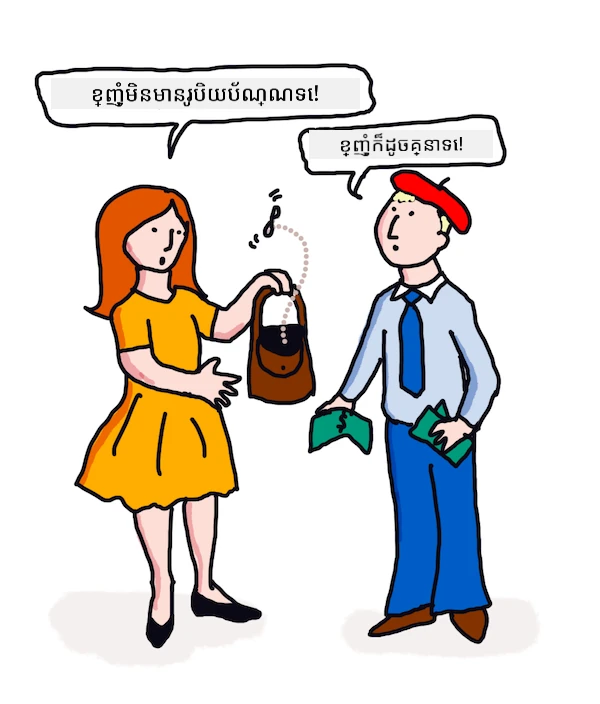

# ការបកប្រែ និងវិភាគអារម្មណ៍ជាមួយ ML

ក្នុងមេរៀនមុន អ្នកបានរៀនពីរបៀបសាងសង់បុត្រមូលដ្ឋានប្រើ `TextBlob` ដែលជាបណ្ណាល័យដែលបញ្ចូល ML នៅពីក្រោយដើម្បីអនុវត្តបេសកកម្ម NLP មូលដ្ឋានដូចជាការទាញយកគន្លឹះ នៃវាក្យប្បទាន។ បញ្ហាសំខាន់មួយទៀតក្នុងវិទ្យាសាស្ត្រភាសាគណនា​គឺការ​បកប្រែ_យ៉ាងត្រឹមត្រូវ_នៃ​ប្រយោគ​ពី​ភាសាប្រកបដោយសន្ទនា ឬបានសរសេរ មួយ ទៅភាសាផ្សេងទៀត។

## [គណនាសំណួរមុនម៉ោងបង្រៀន](https://ff-quizzes.netlify.app/en/ml/)

ការបកប្រែកឺជាបញ្ហាដ៏ស្មុគស្មាញខ្លាំង ព្រោះមានភាសាច្រើនក្នុងពិភពលោក ហើយភាសាទាំងនោះអាចមានវិន័យវចនានុក្រមខុសគ្នាយ៉ាងខ្លាំង។ មួយវិធីមួយគឺបម្លែងវិន័យផ្លូវការសម្រាប់ភាសាមួយ ដូចជាភាសាអង់គ្លេស​ទៅកាន់រចនាសម្ព័ន្ធមិនពឹងផ្អែកលើភាសា ហើយបន្ទាប់មកបកប្រែវាដោយបម្លែងវិញទៅភាសាផ្សេងទៀត។ វិធីនេះព្រមទាំងត្រូវដំណើរការជំហានដូចខាងក្រោម៖

1. **កំណត់អត្តសញ្ញាណ**។កំណត់ ឬមីតភាសា​ពាក្យនៅក្នុងភាសាបញ្ចូលទៅជាគោលវចនានុក្រមដូចជា នាម សកម្មនាម ជាដើម។
2. **បង្កើតការបកប្រែ**។ ផលិតការបកប្រែផ្ទាល់នៃពាក្យនីមួយៗនៅក្នុងទ្រង់ទ្រាយភាសាគោលដៅ។

### ប្រយោគគំរូ, ពីអង់គ្លេសទៅភាសាអៀរឡង់

នៅក្នុងភាសា 'អង់គ្លេស' ប្រយោគ _I feel happy_ មានបីពាក្យលំដាប់ដូចជា៖

- **រូបនាម** (I)
- **សកម្មនាម** (feel)
- **ពាក្យលក្ខណៈនាម** (happy)

ប៉ុន្តែក្នុងភាសា 'អៀរឡង់' ប្រយោគដូចគ្នាមានរចនាសម្ព័ន្ធវិន័យខុសពីគ្នាយ៉ាងខ្លាំង - អារម្មណ៍ដូចជា "*សប្បាយចិត្ត*" ឬ "*សោកសៅ*" ត្រូវបានបង្ហាញថា *នៅលើ* អ្នក។

ប្រយោគអង់គ្លេស `I feel happy` ក្នុងភាសាអៀរឡង់នឹងមានជា `Tá athas orm`។ ការបកប្រែ *តាមពិត* គឺជា `Happy is upon me`។

អ្នកនិយាយភាសាអៀរឡង់បកប្រែទៅអង់គ្លេសនឹងនិយាយថា `I feel happy` មិនមែន `Happy is upon me` ទេ ព្រោះពួកគេយល់ន័យនៃប្រយោគ ទោះបីជាពាក្យ និងរចនាសម្ព័ន្ធប្រយោគខុសគ្នាក៏ដោយ។

លំដាប់ផ្លូវការរបស់ប្រយោគក្នុងភាសាអៀរឡង់គឺ៖

- **សកម្មនាម** (Tá ឬ is)
- **ពាក្យលក្ខណៈនាម** (athas, ឬ happy)
- **រូបនាម** (orm, ឬ upon me)

## ការបកប្រែ

កម្មវិធីបកប្រែកម្រង់អាចបកប្រែតែក្នុងកំឡុងពាក្យ ដោយមិនប្រើរចនាសម្ព័ន្ធប្រយោគ។

✅ ប្រសិនបើអ្នកបានរៀនភាសាទីពីរឬទីបីជាអ្នកធំ អ្នកអាចមានការចាប់ផ្តើមគិតជាភាសា​ដើម ហើយបកប្រែពាក្យមួយៗនៅក្នុងខួរក្បាលទៅភាសាទីពីរ ហើយបន្ទាប់និយាយនូវការបកប្រែរបស់អ្នក។ វា​ដូច​នឹង​ដែលកម្មវិធីបកប្រែ​កុំព្យូទ័រមួួយចំនួន កំពុងធ្វើនេះ។ វាសំខាន់ក្នុងការទៅឆ្ពោះដល់រាងភាសាអាចនិយាយបានរចនាសម្ព័ន្ធហ្គ្រាសយ៉ាងល្អ!

ការបកប្រែសាមញ្ញនាំឲ្យមានការបកប្រែខុស (ហើយខ្លះពេលសើច)៖ `I feel happy` បកប្រែថា `Mise bhraitheann athas` ក្នុងភាសាអៀរឡង់។ នេះមានន័យ (តាមដិតដល់) `me feel happy` ហើយមិនមែនជាប្រយោគអៀរឡង់ត្រឹមត្រូវទេ។ ទោះបីជាភាសាអង់គ្លេស និងអៀរឡង់ជាភាសានិយាយនៅលើកោះជិតៗគ្នា ប៉ុន្តែវាជាភាសាផ្សេងគ្នាដោយមានរចនាសម្ព័ន្ធវិន័យខុសគ្នា។

> អ្នកអាចមើលវីដេអូជាច្រើនអំពីប្រពៃណីភាសាអៀរឡង់ដូចជា [នេះ](https://www.youtube.com/watch?v=mRIaLSdRMMs)

### វិធីសាស្រ្ត machine learning

រហូតមកដល់ពេលបច្ចុប្បន្ន អ្នកបានរៀនពីវិធីសាស្រ្តច្បាប់ផ្លូវការសម្រាប់កំណត់ប្រតិបត្តិការភាសាជាធម្មជាតិ។ វិធីសាស្រ្តមួយផ្សេងទៀតគឺមិនគិតពីន័យពាក្យទេ ហើយ _វិលមកប្រើ​​ machine learning ដើម្បីស្វែងរកលំនាំ_។ វា​អាច​ប្រើបាន​ក្នុងការបកប្រែ ប្រសិនបើអ្នកមានអត្ថបទច្រើន (កុលប្បធាន) ឬអត្ថបទជាច្រើន (កុលប្បធាន plural) ក្នុងភាសាម្ដង និងភាសាគោលដៅទាំងពីរ។

ឧទាហរណ៍ មើលករណី *Pride and Prejudice* គឺនិពន្ធអង់គ្លេសល្បីមួយដែល Jane Austen បានសរសេរនៅឆ្នាំ 1813។ ប្រសិនបើអ្នកពិនិត្យសៀវភៅជាភាសាអង់គ្លេស និងការបកប្រែដោយមនុស្សជា​ភាសាប្រទេស​បារាំង អ្នកអាចរកឃើញវាក្យប្បទានមួយដែលបានបកប្រែជា *អត្ថន័យ​តំណាង* ទៅឆ្មុះហើយផ្សេងគ្នា។ អ្នកនឹងធ្វើវានៅពេលក្រោយ។

ឧទាហរណ៍ ពេលពាក្យអង់គ្លេសដូចជា `I have no money` បកប្រែតាមដិតទៅជាបារាំង វាអាចក្លាយជាសម័យ `Je n'ai pas de monnaie`។ "Monnaie" គឺជាពាក្យបារាំងដែលគេហៅថា 'false cognate' មួយ មានន័យខុសពី 'money' ដូច្នេះមិនស្មើគ្នាទេ។ ការបកប្រែល្អជាងដែលអ្នកមនុស្សអាចធ្វើបាន គឺ `Je n'ai pas d'argent` ព្រោះវាពន្យល់ន័យថាអ្នកគ្មានលុយ (ប្រាក់កត្ថាន) មិនមែន​ជាការកក់បាក់តូចៗដែលមានន័យថា 'monnaie' ទេ។



> រូបថតដោយ [Jen Looper](https://twitter.com/jenlooper)

ប្រសិនបើម៉ូដែល ML មានការបកប្រែដោយមនុស្សគ្រប់គ្រាន់សម្រាប់សាងម៉ូដែល វាអាចបញ្ចឹតភាពត្រឹមត្រូវនៃការបកប្រែដោយរកលំនាំធម្មតា ក្នុងអត្ថបទដែលបានបកប្រែដោយអ្នកនិយាយជំនាញទាំងពីរភាសា។

### ការហាត់ប្រាណ - ការបកប្រែ

អ្នកអាចប្រើ `TextBlob` ដើម្បីបកប្រែប្រយោគ។ សាកល្បងប្រយោគទីមួយល្បីនៃ **Pride and Prejudice**៖

```python
from textblob import TextBlob

blob = TextBlob(
    "It is a truth universally acknowledged, that a single man in possession of a good fortune, must be in want of a wife!"
)
print(blob.translate(to="fr"))

```

`TextBlob` ធ្វើការបកប្រែបានល្អ៖ "C'est une vérité universellement reconnue, qu'un homme célibataire en possession d'une bonne fortune doit avoir besoin d'une femme!" ។

អាចប្រកាន់ខុសថា ការបកប្រែរបស់ TextBlob ត្រឹមត្រូវជាងការបកប្រែជាភាសាបារាំងនៅឆ្នាំ 1932 ដែលបានធ្វើឡើងដោយ V. Leconte និង Ch. Pressoir៖

"C'est une vérité universelle qu'un célibataire pourvu d'une belle fortune doit avoir envie de se marier, et, si peu que l'on sache de son sentiment à cet egard, lorsqu'il arrive dans une nouvelle résidence, cette idée est si bien fixée dans l'esprit de ses voisins qu'ils le considèrent sur-le-champ comme la propriété légitime de l'une ou l'autre de leurs filles."

ក្នុងករណីនេះ ការបកប្រែដែលបានជួយដោយ ML ធ្វើបានល្អជាងអ្នកបកប្រែមនុស្ស ដែលបញ្ចូលពាក្យមិនចាំបាច់ក្នុងមាត់អ្នកនិពន្ធដើមសម្រាប់ 'ភាពច្បាស់លាស់'។

> តើមានអ្វីកើតឡើងនៅទីនេះ? ហើយហេតុអ្វី TextBlob ជាអ្នកបកប្រែបានល្អចិត្ត? ខាងក្រោយវាកំពុងប្រើ Google translate ដែលជាបច្ចេកវិទ្យាស៊ីជម្រៅ AI ដែលអាចវិភាគពាក្យរាប់លានៗ ដើម្បីទាយទោលខ្សែអត្ថបទល្អបំផុតសម្រាប់បេសកកម្ម។ គ្មានដំណើរការដោយដៃខាងក្រោយ ហើយអ្នកត្រូវការតភ្ជាប់អ៊ីនធឺណិតដើម្បីប្រើ `blob.translate`។

✅ សាកល្បងប្រយោគខ្លះទៀត។ តើអ្វីល្អជាងគេខ្លះ ML ឬការបកប្រែមនុស្ស? ក្នុងករណីណាខ្លះ?

## វិភាគអារម្មណ៍

តំបន់មួយផ្សេងទៀតដែល machine learning អាចមានប្រសិទ្ធភាពគឺក្នុងវិភាគអារម្មណ៍។ វិធីមួយដែលមិនប្រើ ML សម្រាប់វិភាគអារម្មណ៍គឺកំណត់ពាក្យនិងវាក្យប្បទានដែលមានន័យ 'វិជ្ជមាន' និង 'អវិជ្ជមាន'។ បន្ទាប់មក ប្រើអត្ថបទថ្មី គណនាតម្លៃសរុបនៃពាក្យវិជ្ជមាន អវិជ្ជមាន និងមិនច្បាស់លាស់ ដើម្បីកំណត់អារម្មណ៍ទូទៅ។

វិធីនេះងាយដួលបាំងដូចដែលអ្នកបានឃើញក្នុងការងារម៉ាហ្វិន - ប្រយោគ `Great, that was a wonderful waste of time, I'm glad we are lost on this dark road` តម្លៃអារម្មណ៍អវិជ្ជមានដោយសារប្រើពាក្យ 'great', 'wonderful', 'glad' ជាវិជ្ជមាន និង 'waste', 'lost' និង 'dark' ជាអវិជ្ជមាន។ អារម្មណ៍សរុបត្រូវបានរំអិលដោយពាក្យបាតុកម្មទាំងនេះ។

✅ បញ្ឈប់មួយវិនាទី ហើយគិតពីរបៀបដែលយើងបញ្ជាក់អារម្មណ៍រដួលចិត្តជាមនុស្សនិយាយ។ សោមខ្យល់នៅសំឡេងរបស់អ្នកមានសារៈសំខាន់។ សាកល្បងនិយាយប្រយោគថា "Well, that film was awesome" ជាច្រើនរបៀប ដើម្បីស្វែងរករបៀបសំឡេងរបស់អ្នកបញ្ជាក់ន័យ។

### វិធី ML

វិធី ML គឺប្រមូលអត្ថបទអវិជ្ជមាន និងវិជ្ជមានដោយដៃ - ជារៀងរហូត អាចជាប្រកាសតាម Twitter រឺពិនិត្យភាពយន្ត ឬអ្វីគ្រប់យ៉ាងដែលមនុស្សបានផ្ដល់ពិន្ទុ និងយោបល់។ បច្ចេកទេស NLP អាចប្រើប្រតិបត្តិលើយោបល់ និងពិន្ទុ ដើម្បីរកលំនាំ (ឧទាហរណ៍ ពិនិត្យភាពយន្តវិជ្ជមានមានពាក្យ 'Oscar worthy' ច្រើនជាងពិនិត្យភាពយន្តអវិជ្ជមាន ឬពិនិត្យភោជនីយដ្ឋានវិជ្ជមានមានពាក្យ 'gourmet' ច្រើនជាង 'disgusting')។

> ⚖️ **ឧទាហរណ៍**៖ ប្រសិនបើអ្នកធ្វើការក្នុងការិយាល័យនយោបាយម្នាក់ ហើយមានច្បាប់ថ្មីមួយកំពុងពិភាក្សា ប្រជាពលរដ្ឋអាចសរសេរអ៊ីមែលគាំទ្រឬប្រឆាំងច្បាប់ថ្មី។ សន្មតថាអ្នកត្រូវអានអ៊ីមែលទាំងនោះ ហើយចាត់ថ្នាក់វាទៅជា 2 ក្រុម គឺ *គាំទ្រ* និង *ប្រឆាំង*។ ប្រសិនបើមានអ៊ីមែលច្រើន អ្នកអាចនៅក្រោមបន្ទុកក្នុងការអានវាទាំងអស់។ តើមិនល្អប្រសើរទេ ប្រសិនបើបុត្រ អាចអានគ្រប់អ៊ីមែលសម្រាប់អ្នក បានយល់ដឹង ហើយប្រាប់អ្នកថា អ៊ីមែលណាខ្លះនៅក្នុងក្រុមណា?

> មួយវិធីដើម្បីសម្រេចចិត្តនេះ គឺប្រើ Machine Learning។ អ្នកបណ្តុះម៉ូដែលជាមួយផ្នែកមួយនៃអ៊ីមែល *ប្រឆាំង* និងផ្នែកមួយនៃអ៊ីមែល *គាំទ្រ*។ ម៉ូដែលនឹងភ្ជាប់ពាក្យ និងលំនាំជាមួយក្រុមប្រឆាំង និងគាំទ្រ ប៉ុន្តែវាមិនយល់ពីមាតិកា* ទេ គ្រាន់តែពាក្យ និងលំនាំខ្លះៗច្រើនរើសបានប្រើក្នុងអ៊ីមែល *ប្រឆាំង* ឬ *គាំទ្រ*។ អ្នកអាចសាកល្បងវាជាមួយអ៊ីមែលមួយចំនួនដែលមិនបានប្រើបណ្តុះម៉ូដែល ហើយមើលថាវាមានមតិដូចជាអ្នកទេឬ? បន្ទាប់មក ពេលអ្នកពេញចិត្តនឹងភាពត្រឹមត្រូវរបស់ម៉ូដែល អ្នកអាចដំណើរការអ៊ីមែលនៅពេលក្រោយដោយមិនចាំបាច់អានទាំងអស់ទៀត។

✅ តើដំណើរការនេះសម្លឹងទៅដូចនឹងដំណើរការដែលអ្នកបានប្រើរៀងៗខាងមុនទេ?

## ការហាត់ប្រាណ - ប្រយោគមានអារម្មណ៍

អារម្មណ៍វាស់ដោយ *polarity* ពី -1 ទៅ 1, មានន័យថា -1 ជាអារម្មណ៍អវិជ្ជមានខំរាំងខ្លាំងបំផុត ហើយ 1 ជាអារម្មណ៍វិជ្ជមានខំរាំងខ្លាំងបំផុត។ អារម្មណ៍វាស់បានក៏ដោយជាមួយពិន្ទុ 0 - 1 សម្រាប់លក្ខណៈវាស់ចម្ងាយ(objectivity) (0) និងរូបភាពឯកជន(subjectivity) (1)។

សូមមើលម្ដងទៀត *Pride and Prejudice* របស់ Jane Austen។ អត្ថបទត្រូវបានចែករំលែកនៅទីនេះ [Project Gutenberg](https://www.gutenberg.org/files/1342/1342-h/1342-h.htm)។ ឧទាហរណ៍ខាងក្រោមបង្ហាញកម្មវិធីខ្លីមួយដែលវិភាគអារម្មណ៍ក្នុងប្រយោគដំបូង និងចុងក្រោយពីសៀវភៅ និងបង្ហាញ polarity និង subjectivity/objectivity របស់វា។

អ្នកគួរប្រើបណ្ណាល័យ `TextBlob` (បានពិពណ៌នាចំពោះខាងលើ) ដើម្បីកំណត់ `sentiment` (អ្នកមិនចាំបាច់សរសេរកំណត់ត្រាអារម្មណ៍ផ្ទាល់) ក្នុងភារកិច្ចខាងក្រោម។

```python
from textblob import TextBlob

quote1 = """It is a truth universally acknowledged, that a single man in possession of a good fortune, must be in want of a wife."""

quote2 = """Darcy, as well as Elizabeth, really loved them; and they were both ever sensible of the warmest gratitude towards the persons who, by bringing her into Derbyshire, had been the means of uniting them."""

sentiment1 = TextBlob(quote1).sentiment
sentiment2 = TextBlob(quote2).sentiment

print(quote1 + " has a sentiment of " + str(sentiment1))
print(quote2 + " has a sentiment of " + str(sentiment2))
```

អ្នកឃើញលទ្ធផលដូចខាងក្រោម៖

```output
It is a truth universally acknowledged, that a single man in possession of a good fortune, must be in want # of a wife. has a sentiment of Sentiment(polarity=0.20952380952380953, subjectivity=0.27142857142857146)

Darcy, as well as Elizabeth, really loved them; and they were
     both ever sensible of the warmest gratitude towards the persons
      who, by bringing her into Derbyshire, had been the means of
      uniting them. has a sentiment of Sentiment(polarity=0.7, subjectivity=0.8)
```

## បញ្ហាសាកល្បង - ពិនិត្យ polarity អារម្មណ៍

ភារកិច្ចរបស់អ្នកគឺកំណត់ ប្រើ polarity អារម្មណ៍ ថា *Pride and Prejudice* មានប្រយោគវិជ្ជមានជាច្រើនជាងប្រយោគអវិជ្ជមានទេឬទេ។ សម្រាប់ភារកិច្ចនេះ អ្នកអាចសន្មតថា polarity 1 ឬ -1 តំណាងឲ្យវិជ្ជមាន ឬអវិជ្ជមានយ៉ាងពេញលេញ។

**ជំហាន៖**

1. ទាញយក [ចម្លង​ឯកសារ Pride and Prejudice](https://www.gutenberg.org/files/1342/1342-h/1342-h.htm) ពី Project Gutenberg ជាឯកសារ .txt។ លុបបណ្ដាញបន្ថែម ដូចជា metadata នៅចាប់ផ្តើម និងចុងឯកសារ ដើម្បីទុកតែអត្ថបទដើម។
2. បើកឯកសារនៅក្នុង Python ហើយទាញយកខ្លឹមសារជាសរុប
3. បង្កើត TextBlob ដោយប្រើខ្សែអត្ថបទសៀវភៅ
4. វិភាគប្រយោគមួយៗក្នុងសៀវភៅ ក្នុងរង្វិល
   1. ប្រសិនបើ polarity គឺ 1 ឬ -1 សូមរក្សាទុកប្រយោគនោះក្នុងអារេឬបញ្ជីប្រយោគវិជ្ជមាន ឬអវិជ្ជមាន
5. នៅចុងក្រោយ បោះពុម្ពប្រយោគវិជ្ជមាន និងអវិជ្ជមានទាំងអស់ (ចែករំលែក) និងចំនួននៃប្រយោគនីមួយៗ

នេះជាឧទាហរណ៍ [ដំណោះស្រាយ](https://github.com/microsoft/ML-For-Beginners/blob/main/6-NLP/3-Translation-Sentiment/solution/notebook.ipynb)។

✅ ការត្រួតពិនិត្យចំណេះដឹង

1. អារម្មណ៍នេះគ្រប់គ្រាន់មកពីពាក្យដែលបានប្រើក្នុងប្រយោគ ក៏ប៉ុន្តែកម្មវិធីនេះ *យល់* ពាក្យទេឬ?
2. តើអ្នកគិតថា polarity អារម្មណ៍ត្រឹមត្រូវ ឬប្រែថា តើអ្នក *យល់ស្រប* ជាមួយពិន្ទុទាំងនោះ?

   1. ជាពិសេស តើអ្នកយល់ស្របឬមិនយល់ស្របជាមួយ polarity **វិជ្ជមាន** ពេញលេញនៃប្រយោគខាងក្រោមនេះ?

      * “What an excellent father you have, girls!” said she, when the door was shut.
      * “Your examination of Mr. Darcy is over, I presume,” said Miss Bingley; “and pray what is the result?” “I am perfectly convinced by it that Mr. Darcy has no defect.
      * How wonderfully these sort of things occur!
      * I have the greatest dislike in the world to that sort of thing.
      * Charlotte is an excellent manager, I dare say.
      * “This is delightful indeed!
      * I am so happy!
      * Your idea of the ponies is delightful.

   2. ប្រយោគបីវាគ្មិនបន្ទាប់ត្រូវបានគេផ្ដល់ polarity វិជ្ជមានពេញលេញ ប៉ុន្តែរំពឹង​ពីការអានយ៉ាងម៉ត់ចត់ វាមិនមែនប្រយោគវិជ្ជមានទេ។ ហេតុអ្វីបានជា​វិភាគអារម្មណ៍គិតថាវាជាប្រយោគវិជ្ជមាន?

      * Happy shall I be, when his stay at Netherfield is over!” “I wish I could say anything to comfort you,” replied Elizabeth; “but it is wholly out of my power.
      * If I could but see you as happy!
      * Our distress, my dear Lizzy, is very great.

   3. តើអ្នកយល់ស្របឬមិនយល់ស្របជាមួយ polarity **អវិជ្ជមាន** ពេញលេញនៃប្រយោគខាងក្រោមនេះ?

      - Everybody is disgusted with his pride.
      - “I should like to know how he behaves among strangers.” “You shall hear then—but prepare yourself for something very dreadful.
      - The pause was to Elizabeth’s feelings dreadful.
      - It would be dreadful!

✅ គ្រប់អ្នកដែលចូលចិត្ត Jane Austen នឹងយល់ថា នាងជាញឹកញាប់ប្រើសៀវភៅរបស់នាង ដើម្បីវិភាគកម្រិតលើសំបុកសំបែរ នៃសង្គម Regency អង់គ្លេស។ Elizabeth Bennett ដែលជាតួអង្គដ៏សំខាន់ក្នុង *Pride and Prejudice* ជាអ្នកត្រួតពិនិត្យសង្គមយ៉ាងម៉ត់ចត់ (ដូចអ្នកនិពន្ធ) ហើយភាសារបស់នាងគឺពោរពេញនូវអត្ថន័យស្មុគស្មាញ។ ម្ចាស់បំណង Mr. Darcy (ជាទំនាញស្នេហាជាក្នុងរឿង) ក៏បានដឹងនូវការប្រើភាសារបស់ Elizabeth ដែលពេញនឹងការលេងសើច និងចកកាយ៖ "I have had the pleasure of your acquaintance long enough to know that you find great enjoyment in occasionally professing opinions which in fact are not your own."

---

## 🚀បញ្ហាសាកល្បង

តើអ្នកអាចធ្វើឲ្យ Marvin ល្អប្រសើរឡើងទៀត ដោយទាញយកលក្ខណៈផ្សេងទៀតពីការបញ្ចូលរបស់អ្នកប្រើ?

## [គណនាសំណួរថ្មីក្រោយម៉ោងបង្រៀន](https://ff-quizzes.netlify.app/en/ml/)

## សង្ខេប និងសិក្សាឯករាជ្យ
មានវិធីជាច្រើនដើម្បីដកស្រង់អារម្មណ៍ពីអត្ថបទ។ សូមគិតពីកម្មវិធីជាអាជីវកម្មដែលអាចប្រើប្រាស់បច្ចេកវិទ្យានេះ។ សូមគិតអំពីរបៀបដែលវាអាចខូចខាតបាន។ អានបន្ថែមអំពីប្រព័ន្ធសម្រាប់សហគ្រាសដែលមានលទ្ធភាពវិជ្ជាជីវៈខ្ពស់ ដែលវិភាគអារម្មណ៍ដូចជា [Azure Text Analysis](https://docs.microsoft.com/azure/cognitive-services/Text-Analytics/how-tos/text-analytics-how-to-sentiment-analysis?tabs=version-3-1?WT.mc_id=academic-77952-leestott)។ សាកល្បងប្រយោគខ្លះពី Pride and Prejudice ខាងលើ ហើយមើលថាវាអាចរកឃើញការប្រែប្រួលសម្បទានោះទេ។

## កិច្ចការដាក់ស្នើ

[Poetic license](assignment.md)

---

<!-- CO-OP TRANSLATOR DISCLAIMER START -->
**ការបដិសេធ**៖  
ឯកសារនេះត្រូវបានបកប្រែដោយការប្រើសេវាកម្មបកប្រែ AI [Co-op Translator](https://github.com/Azure/co-op-translator)។ ខណៈដែលយើងខិតខំធ្វើឲ្យមានភាពត្រឹមត្រូវ សូមយល់ថាការបកប្រែដោយស្វ័យប្រវត្តិអាចមានកំហុសឬភាពមិនត្រឹមត្រូវ។ ឯកសារដើមជាភាសារបស់ខ្លួនគួរត្រូវបានជាឯកសារយោងដ៏ត្រឹមត្រូវ។ សម្រាប់ព័ត៌មានសំខាន់ៗ សូមណែនាំឱ្យបកប្រែដោយអ្នកជំនាញមនុស្សវិជ្ជាជីវៈ។ យើងមិនទទួលខុសត្រូវចំពោះការយល់ច្រឡំ ឬការបកប្រែខុសពីការប្រើប្រាស់ការបកប្រែនេះឡើយ។
<!-- CO-OP TRANSLATOR DISCLAIMER END -->