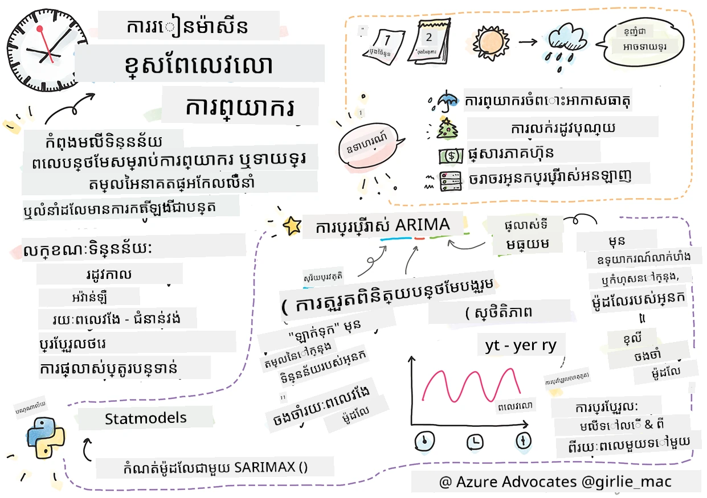
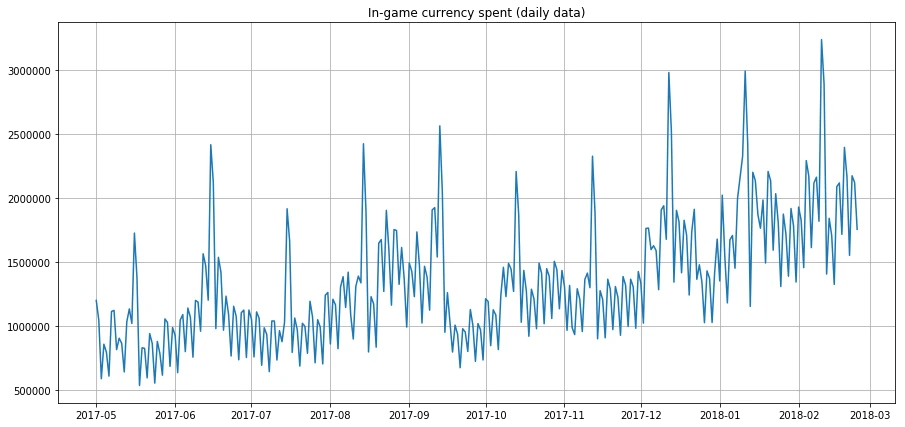
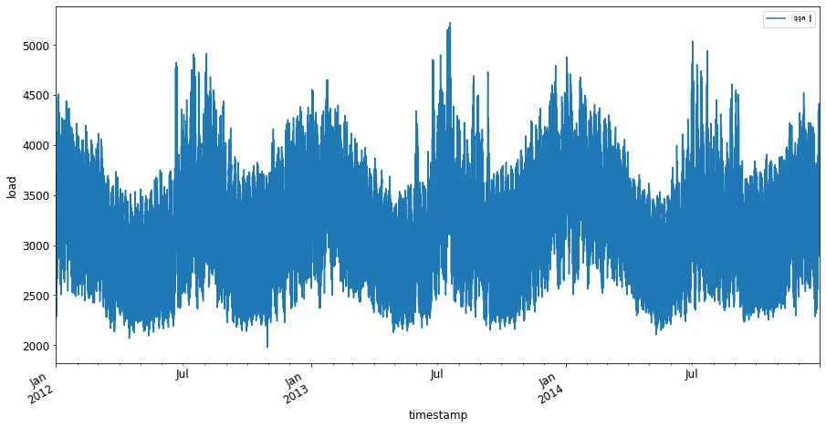
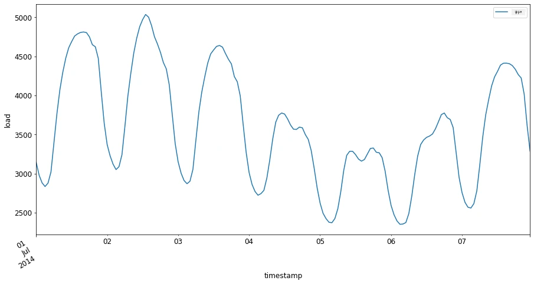

# ការណែនាំអំពីការព្យាករណ៍រយៈពេល



> ស្នាដៃស្នាដៃដោយ [Tomomi Imura](https://www.twitter.com/girlie_mac)

នៅក្នុងមេរៀននេះ និងមេរៀនបន្ទាប់ អ្នកនឹងរៀនបន្តិចអំពីការព្យាករណ៍រយៈពេល ដែលជាផ្នែកមួយគួរឱ្យចាប់អារម្មណ៍ និងមានតម្លៃក្នុងសមាសភាគរបស់វិទ្យាសាស្រ្តកំពុងរៀនម៉ាស៊ីន ដែលមិនគឺមានដំណឹងច្រើនដូចប្រធានបទផ្សេងទៀត។ ការព្យាករណ៍រយៈពេលគឺជាប្រភេទ “កញ្ចក់គ្រាប់ផ្លែក”: អាស្រ័យលើការដំណើរការពីមុននៃអថេរមួយដូចជា តម្លៃ អ្នកអាចទាយទុកតម្លៃអនាគតរបស់វា។

[](https://youtu.be/cBojo1hsHiI "ការណែនាំអំពីការព្យាករណ៍រយៈពេល")

> 🎥 ចុចរូបភាពខាងលើសម្រាប់វីដេអូវីដេអូអំពីការព្យាករណ៍រយៈពេល

## [លំហាត់មុនមេរៀន](https://ff-quizzes.netlify.app/en/ml/)

វាជាផ្នែកដែលមានប្រយោជន៍ និងគួរឱ្យចាប់អារម្មណ៍ មានតម្លៃពិតប្រាកដចំពោះអាជីវកម្ម ដោយសារតែការប្រើប្រាស់ផ្ទាល់ខ្លួនសម្រាប់បញ្ហាចាក់តម្លៃ សារធាតុ និងបញ្ហាសង្វាក់ផ្គត់ផ្គង់។ ខណៈពេលដែលបច្ចេកទេសរៀនជ្រាលជ្រៅបានចាប់ផ្តើមប្រើប្រាស់ដើម្បីទទួលបានយល់ដឹងបន្ថែមដើម្បីព្យាករណ៍លទ្ធផលអនាគតបានល្អជាងមុន ការព្យាករណ៍រយៈពេលនៅតែជាផ្នែកមួយដែលត្រូវបានជ្រៀតជ្រែកយ៉ាងខ្លាំងដោយបច្ចេកទេស ML ចាស់ៗ។

> វគ្គសិក្សារយៈពេលមានតម្លៃរបស់ Penn State អាចរកបាន [នៅទីនេះ](https://online.stat.psu.edu/stat510/lesson/1)

## ការណែនាំ

សន្មត់ថាអ្នកគ្រប់គ្រងមួយជួរម៉ែត្រចត់ឡានឆ្លាត ដែលផ្តល់ទិន្នន័យអំពីការប្រើប្រាស់ជាប្រចាំ និងរយៈពេលវែងប៉ុណ្ណា។

> តើអ្នកអាចទាយទុកបានទេ ដោយផ្អែកលើការដំណើរការពីមុនរបស់ម៉ែត្រនោះ តម្លៃអនាគតរបស់វាផ្អែកលើច្បាប់នៃការផ្គត់ផ្គង់ និងតម្រូវការ?

ការព្យាករណ៍បានច្បាស់លាស់ពីពេលណាដើម្បីដំណើរការដើម្បីសម្រេចគោលដៅរបស់អ្នក គឺជាការប្រឈមមួយដែលអាចដោះស្រាយបានដោយការព្យាករណ៍រយៈពេល។ វាអាចមិនធ្វើអោយមនុស្សរីករាយនឹងត្រូវគិតថ្លៃច្រើននៅពេលយ៉ាងច្រើនណាស់ពេលពួកគេកំពុងស្វែងរកកន្លែងចតឡានទេ ប៉ុន្តែវាជាវិធីដែលប្រាកដដើម្បីបង្កើតប្រាក់ចំណូលសម្រាប់សំអាតផ្លូវ!

មកយើងអាចស្វែងយល់ពីប្រភេទផ្សេងៗនៃអាល់ហ្គរីធម៍រយៈពេល ហើយចាប់ផ្តើមកំណត់សៀវភៅកំណត់ត្រាមួយដើម្បីសម្អាត និងរៀបចំទិន្នន័យមួយ។ ទិន្នន័យដែលអ្នកនឹងវិភាគ មានមូលដ្ឋានមកពីការប្រកួតព្យាករណ៍ GEFCom2014។ វាមានរយៈពេល 3 ឆ្នាំនៃទម្លាប់អគ្គិសនីម៉ោង និងតម្លៃសីតុណ្ហភាពចន្លោះឆ្នាំ 2012 ដល់ 2014។ អាស្រ័យលើលំនាំប្រវត្តិសាស្រ្តនៃទម្លាប់អគ្គិសនី និងសីតុណ្ហភាព អ្នកអាចទាយទុកតម្លៃអនាគតនៃទម្លាប់អគ្គិសនី។

ក្នុងឧទាហរណ៍នេះ អ្នកនឹងរៀនពីវិធីព្យាករណ៍មួយជំហានមុខ ប្រាប់តែប្រើទិន្នន័យទម្លាប់ប្រវត្តិសាស្ត្រតែប៉ុណ្ណោះ។ មុនចាប់ផ្តើម ទោះយ៉ាងណា វាជារឿងល្អក្នុងការយល់អំពីអ្វីកើតឡើងនៅក្រោយទំព័រដូច្នេះ។

## ពាក្យនិយមមួយចំនួន

ពេលប្រទះពាក្យ 'រយៈពេល' អ្នកត្រូវយល់ពីការប្រើប្រាស់វានៅក្នុងបរិបទខុសៗគ្នាច្រើន។

🎓 **រយៈពេល**

ក្នុងគណិតវិទ្យា "រយៈពេលគឺជាជួរមួយនៃចំណុចទិន្នន័យដែលបានដាក់លេខសំគាល់ (ឬបានបញ្ជី ឬបានគូស) តាមលំដាប់ពេល។ គ្រប់ពេល ប្រភេទរយៈពេលជាដំណាលចំនួនដែលបានទាញយកនៅចំណុច​ចម្រុះ​ដែលមានចន្លោះពេលស្មើគ្នា។" ឧទាហរណ៍នៃរយៈពេលគឺតម្លៃបិទប្រចាំថ្ងៃនៃ [Dow Jones Industrial Average](https://wikipedia.org/wiki/Time_series)। ការប្រើប្រាស់គំនូសរយៈពេល និងម៉ូដែលស្ថិតិគឺតែងតែពេលជួបប្រទៈនៅក្នុងដំណើរការសញ្ញា, ការព្យាករណ៍អាកាសធាតុ, ការទាយអាគម និងវិស័យផ្សេងទៀតដែលមានព្រឹត្តិការណ៍កើតឡើង ហើយចំណុចទិន្នន័យអាចគូសបានតាមពេល។

🎓 **វិភាគរយៈពេល**

វិភាគរយៈពេល គឺជាការវិភាគទិន្នន័យរយៈពេលខាងលើ។ ទិន្នន័យរយៈពេលអាចមានរាងនានា រួមមាន 'រយៈពេលដែលបានរំខាន' ដែលស្វែងរកលំនាំនៅក្នុងការវិវត្តរបស់រយៈពេលមួយមុន និងក្រោយព្រឹត្តិការណ៍រំខានមួយ។ ប្រភេទវិភាគដែលត្រូវការសម្រាប់រយៈពេលផ្អែកលើធម្មជាតិទិន្នន័យ។ ទិន្នន័យរយៈពេលផ្ទាល់អាចមានរាងជាចំណុចលេខ ឬតួអក្សរ។

វិភាគដែលត្រូវធ្វើមានប្រើវិធីផ្សេងៗ រួមបញ្ចូលពីដែនប្រេកង់ និងដែនពេល, គន្លងបន្ទាត់ និងមិនបន្ទាត់, និងច្រើនទៀត។ [សូមស្វែងយល់បន្ថែម](https://www.itl.nist.gov/div898/handbook/pmc/section4/pmc4.htm) អំពីវិធីជាច្រើនក្នុងការវិភាគទិន្នន័យប្រភេទនេះ។

🎓 **ការព្យាករណ៍រយៈពេល**

ការព្យាករណ៍រយៈពេលគឺជាការប្រើម៉ូដែលដើម្បីទាយទុកតម្លៃអនាគតដោយផ្អែកលើលំនាំដែលបង្ហាញដោយទិន្នន័យដែលបានប្រមូលនៅមុន។ បើទោះបីជាអាចប្រើម៉ូដែលរេហ្គ្រេស្យុងដើម្បីស្វែងយល់ទិន្នន័យរយៈពេលដោយមានអថេរពេលជាអថេរជំរៅលើនិទ្ទេសមួយនោះក៏ដោយ ទិន្នន័យបែបនេះប្រសើរជាងរាល់ករណីត្រូវបានវិភាគដោយម៉ូដែលពិសេស។

ទិន្នន័យរយៈពេលគឺជាបញ្ជីនៃការសង្កេតតែងតាំងលំដាប់ ខុសពីទិន្នន័យដែលអាចវិភាគដោយរេហ្គ្រេស្យុងបន្ទាត់។ ម៉ូដែលទូទៅបំផុតគឺ ARIMA ដែលជាអក្សរកាត់សម្រាប់ "Autoregressive Integrated Moving Average"។

[ម៉ូដែល ARIMA](https://online.stat.psu.edu/stat510/lesson/1/1.1) "ភ្ជាប់តម្លៃបច្ចុប្បន្ននៃជួរមួយទៅនឹងតម្លៃមុន និងកំហុសការព្យាករណ៍ពីមុន។" ពួកវាមានសមត្ថភាពល្អសម្រាប់វិភាគទិន្នន័យដែនពេល ដែលទិន្នន័យត្រូវបានលំដាប់តាមពេល។

> មានម៉ូដែល ARIMA ច្រើនប្រភេទ ដែលអ្នកអាចរៀនអំពីវា [នៅទីនេះ](https://people.duke.edu/~rnau/411arim.htm) ហើយដែលអ្នកនឹងប្រើប្រាស់ក្នុងមេរៀនបន្ទាប់។

នៅក្នុងមេរៀនបន្ទាប់ អ្នកនឹងបង្កើតម៉ូដែល ARIMA ដោយប្រើ [រយៈពេលយូនីវ៉ារីយ៉ាតីវ](https://itl.nist.gov/div898/handbook/pmc/section4/pmc44.htm) ដែលផ្ដោតលើអថេរមួយដែលប្ដូរតម្លៃរបស់វានៅពេលណាមួយ។ ឧទាហរណ៍នៃទិន្នន័យប្រភេទនេះគឺ [សំណុំទិន្នន័យនេះ](https://itl.nist.gov/div898/handbook/pmc/section4/pmc4411.htm) ដែលកត់ត្រាការមានផ្ទុក CO2 ប្រចាំខែ​នៅ Mauna Loa Observatory៖

|  CO2   | YearMonth | Year  | Month |
| :----: | :-------: | :---: | :---: |
| 330.62 |  1975.04  | 1975  |   1   |
| 331.40 |  1975.13  | 1975  |   2   |
| 331.87 |  1975.21  | 1975  |   3   |
| 333.18 |  1975.29  | 1975  |   4   |
| 333.92 |  1975.38  | 1975  |   5   |
| 333.43 |  1975.46  | 1975  |   6   |
| 331.85 |  1975.54  | 1975  |   7   |
| 330.01 |  1975.63  | 1975  |   8   |
| 328.51 |  1975.71  | 1975  |   9   |
| 328.41 |  1975.79  | 1975  |  10   |
| 329.25 |  1975.88  | 1975  |  11   |
| 330.97 |  1975.96  | 1975  |  12   |

✅ សម្គាល់អថេរដែលផ្លាស់ប្តូរតាមពេលនៅក្នុងសំណុំទិន្នន័យនេះ

## លក្ខណៈទិន្នន័យរយៈពេលដែលត្រូវគិតគូរ

ពេលមើលទៅទិន្នន័យរយៈពេល អ្នកអាចសង្កេតឃើញថាវាមាន [លក្ខណៈពិសេសមួយចំនួន](https://online.stat.psu.edu/stat510/lesson/1/1.1) ដែលអ្នកត្រូវគិតគូរ និងកាត់បន្ថយដើម្បីយល់ពីលំនាំរបស់វាបានល្អកាន់តែច្រើន។ ប្រសិនបើអ្នកគិតទិន្នន័យរយៈពេលជាសញ្ញាមួយដែលអ្នកចង់វិភាគ លក្ខណៈទាំងនេះអាចត្រូវគេគិតថាជាសំឡេងរំខាន។ អ្នកភាគច្រើននឹងត្រូវបន្ថយសំឡេងនេះដោយផ្ដល់តុល្យភាពលក្ខណៈខ្លះៗជាមួយបច្ចេកទេសស្ថិតិ។

នេះជាគំនិតមួយចំនួនដែលអ្នកគួរតែយល់ដើម្បីអាចធ្វើការជាមួយរយៈពេល៖

🎓 **លំនាំ**

លំនាំត្រូវបានកំណត់ឱ្យជាការកើនឡើង និងចុះបន្តិចបន្តួចដែលអាចវាស់បានតាមពេល។ [អានបន្ថែម](https://machinelearningmastery.com/time-series-trends-in-python)។ នៅក្នុងបរិបទរយៈពេល វាស្តីពីរបៀបប្រើ និង ប្រសិនបើចាំបាច់ ក៏ដកលំនាំចេញពីរយៈពេលរបស់អ្នក។

🎓 **[រដូវកាល](https://machinelearningmastery.com/time-series-seasonality-with-python/)**

រដូវកាលត្រូវបានកំណត់ជាការវិលត្រឡប់ជាប្រចាំ ដូចជាការរញ្ជួយពេលបុណ្យដែលអាចប៉ះពាល់ដល់ការលក់ ជាឧទាហរណ៍។ [មើល](https://itl.nist.gov/div898/handbook/pmc/section4/pmc443.htm) របៀបដែលគំនូសផ្សេងៗបង្ហាញរដូវកាលក្នុងទិន្នន័យ។

🎓 **ចំណុចចម្លែក**

ចំណុចចម្លែកមានភាពតែមកផុតពីបម្លែងទិន្នន័យធម្មតា។

🎓 **វដ្តរយៈពេលវែង**

ដោយឡែកពីរដូវកាល ទិន្នន័យអាចបង្ហាញវដ្តរយៈពេលវែងដូចជាវដ្តអនយោគមួយដែលយូរជាងមួយឆ្នាំ។

🎓 **ភាពប្រែប្រួលថេរ**

តាមពេលខ្លះទិន្នន័យបង្ហាញភាពប្រែប្រួលថេរ ដូចជាការប្រើប្រាស់ថាមពលរយៈពេលមួយថ្ងៃ និងយប់។

🎓 **ការផ្លាស់ប្តូរបែបក្រៅមធ្យម**

ទិន្នន័យអាចបង្ហាញការផ្លាស់ប្តូរច្បាស់លាស់ ដែលអាចត្រូវការវិភាគបន្ថែម។ ការបិទជើងហោះហើរជាបន្ទាន់ដោយសារ COVID ជាឧទាហរណ៍មួយដែលបណ្តាលអោយមានការផ្លាស់ប្តូរនៅក្នុងទិន្នន័យ។

✅ នេះគឺជាគំនូសរយៈពេលគំរូមួយ [sample time series plot](https://www.kaggle.com/kashnitsky/topic-9-part-1-time-series-analysis-in-python) បង្ហាញការចំណាយរូបិយវត្ថុក្នុងហ្គេមប្រចាំថ្ងៃក្នុងរយៈពេលពីរបីឆ្នាំ។ តើអ្នកអាចសម្គាល់លក្ខណៈណាមួយដែលបានរាយនាមខាងលើនៅក្នុងទិន្នន័យនេះទេ?



## លំហាត់ - ចាប់ផ្តើមជាមួយទិន្នន័យប្រើថាមពល

មកចាប់ផ្តើមបង្កើតម៉ូដែលរយៈពេលមួយ ដើម្បីទាយទុកប្រើថាមពលអនាគតដោយផ្អែកលើការប្រើប្រាស់ពីមុន។

> ទិន្នន័យក្នុងឧទាហរណ៍នេះចាប់យកពីការប្រកួតព្យាករណ៍ GEFCom2014។ វាមានរយៈពេល 3 ឆ្នាំនៃទំងន់អគ្គិសនីម៉ោង និងតម្លៃសីតុណ្ហភាពចន្លោះឆ្នាំ 2012 ដល់ 2014។
>
> Tao Hong, Pierre Pinson, Shu Fan, Hamidreza Zareipour, Alberto Troccoli និង Rob J. Hyndman, "Probabilistic energy forecasting: Global Energy Forecasting Competition 2014 and beyond", International Journal of Forecasting, vol.32, no.3, pp 896-913, July-September, 2016.

1. នៅក្នុងថត `working` នៃមេរៀននេះ បើកឯកសារ _notebook.ipynb_។ ចាប់ផ្តើមដោយបន្ថែមបណ្ណាល័យ ដែលជួយអ្នកដំណើរការ និងមើលទិន្នន័យ

    ```python
    import os
    import matplotlib.pyplot as plt
    from common.utils import load_data
    %matplotlib inline
    ```

    ចំណាំ អ្នកកំពុងប្រើឯកសារពីថត `common` ដែលបានចូលរួមមកជាមួយ ដែលរៀបចំបរិយាកាសរបស់អ្នក ហើយដំណើរការចេញទិន្នន័យ។

2. បន្ទាប់មក សូមពិនិត្យទិន្នន័យជាដាតាហ្វ្រេម ដោយហៅ `load_data()` និង `head()`៖

    ```python
    data_dir = './data'
    energy = load_data(data_dir)[['load']]
    energy.head()
    ```

    អ្នកអាចឃើញថាមានកូឡុំពីរ តំណាងឲ្យកាលបរិច្ឆេទ និងទំងន់៖

    |                     |  load  |
    | :-----------------: | :----: |
    | 2012-01-01 00:00:00 | 2698.0 |
    | 2012-01-01 01:00:00 | 2558.0 |
    | 2012-01-01 02:00:00 | 2444.0 |
    | 2012-01-01 03:00:00 | 2402.0 |
    | 2012-01-01 04:00:00 | 2403.0 |

3. ឥឡូវ សូមគូសរូបភាពទិន្នន័យ ដោយហៅ `plot()`៖

    ```python
    energy.plot(y='load', subplots=True, figsize=(15, 8), fontsize=12)
    plt.xlabel('timestamp', fontsize=12)
    plt.ylabel('load', fontsize=12)
    plt.show()
    ```

    

4. ឥឡូវ សូមគូសរូបភាពសប្តាហ៍ទីមួយរបស់ខែកក្កដា 2014 ដោយផ្ដល់វាជាអ្នកបញ្ចូលទៅក្នុង `energy` ដែលមានគំរូ `[ពីកាលបរិច្ឆេទ]: [ទៅកាន់កាលបរិច្ឆេទ]`៖

    ```python
    energy['2014-07-01':'2014-07-07'].plot(y='load', subplots=True, figsize=(15, 8), fontsize=12)
    plt.xlabel('timestamp', fontsize=12)
    plt.ylabel('load', fontsize=12)
    plt.show()
    ```

    

    គំនូសស្អាតណាស់! សូមមើលគំនូសទាំងនេះ ហើយមើលថាតើអ្នកអាចកំណត់លក្ខណៈណាមួយដែលបញ្ជាក់ខាងលើក្នុងទិន្នន័យនេះបានទេ។ តើយើងអាចទាញបញ្ចេញអ្វីបានពីការមើលគំនូសទិន្នន័យនេះ?

នៅក្នុងមេរៀនបន្ទាប់ អ្នកនឹងបង្កើតម៉ូដែល ARIMA ដើម្បីបង្កើតការព្យាករណ៍ខ្លះ។

---

## 🚀បញ្ញាសមហេតុ

រៀបចុំនីតិសង្ខេបនៃរោងចក្រ និងវិស័យស្រាវជ្រាវទាំងឡាយដែលអ្នកគិតថាអាចទទួលបានផលពីការព្យាករណ៍រយៈពេល។ តើអ្នកអាចគិតពីកម្មវិធីណាមួយនៃបច្ចេកទេសទាំងនេះនៅក្នុងវិចិត្រសិល្បៈទេ? ក្នុងប្រពន្ធវិជ្ជា? បរិស្ថានវិទ្យា? រាយវិល? ឧស្សាហកម្ម? ហិរញ្ញវត្ថុ? តើនៅកន្លែងណាផ្សេងទៀត?

## [លំហាត់បន្ទាប់មេរៀន](https://ff-quizzes.netlify.app/en/ml/)

## សេចក្តីសង្ខេប និងសិក្សាឯករាជ្យ

ទោះបីជាយើងមិនគ្របដណ្តប់វានៅទីនេះក៏ដោយ បណ្តាញប្រសាទ (neural networks) មួយចំនួនត្រូវបានប្រើសម្រាប់បង្កើនប្រសិទ្ធភាពវិធីចាស់ៗនៃការព្យាករណ៍រយៈពេល។ អានបន្ថែមអំពីវានៅ [អត្ថបទនេះ](https://medium.com/microsoftazure/neural-networks-for-forecasting-financial-and-economic-time-series-6aca370ff412)

## កិច្ចការផ្ញើរ

[គូសរូបភាពរយៈពេលបន្ថែមមួយចំនួន](assignment.md)

---

<!-- CO-OP TRANSLATOR DISCLAIMER START -->
**ការបដិសេធ** ៖  
ឯកសារនេះត្រូវបានបកប្រែដោយប្រើសេវាបកប្រែ AI [Co-op Translator](https://github.com/Azure/co-op-translator)។ ខណៈពេលដែលយើងខិតខំធ្វើអោយមានភាពត្រឹមត្រូវ សូមយល់ឲ្យបានថាការបកប្រែដោយស្វយ័តអាចមានកំហុស ឬភាពមិនត្រឹមត្រូវ។ ឯកសារដើមនៅក្នុងភាសាដើមត្រូវបានគេសង្កត់សំខាន់ថាជាផ្លូវការ។ សម្រាប់ព័ត៌មានសំខាន់ៗ សូមផ្ដល់អនុសាសន៍ឲ្យប្រើការបកប្រែដោយអ្នកជំនាញមនុស្ស។ យើងមិនទទួលខុសត្រូវចំពោះការយល់ច្រឡំ ឬការបកស្រាយខុសៗដែលបណ្តាលមកពីការប្រើប្រាស់ការបកប្រែនេះឡើយ។
<!-- CO-OP TRANSLATOR DISCLAIMER END -->