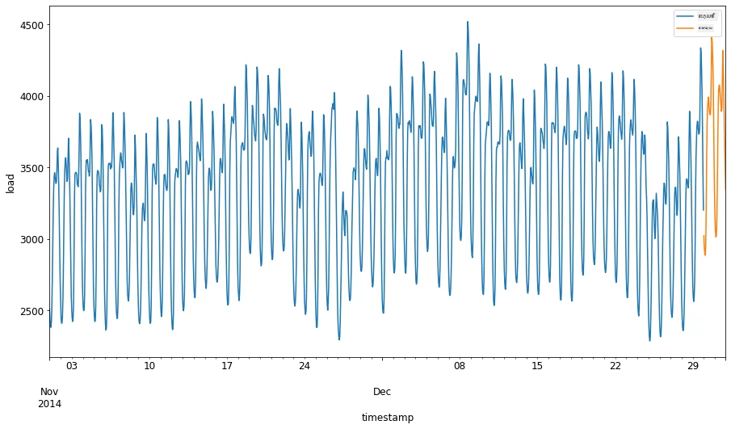
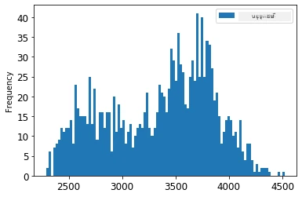
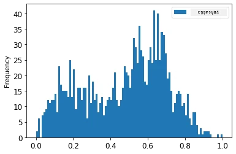
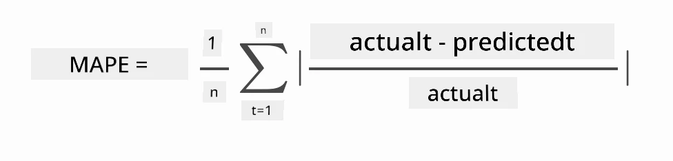
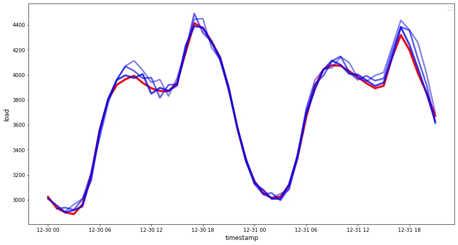

# ការទាយទ្រង់ទ្រាយពេលវេលាជាមួយ ARIMA

នៅថ្នាក់មុន អ្នកបានរៀនពីការទាយទ្រង់ទ្រាយពេលវេលា ហើយបានបង្ហាញកំណត់ត្រាដែលបង្ហាញការប្រែប្រួលនៃទិន្នន័យភារកិច្ចអគ្គិសនីជាមួយរយៈពេល។

[](https://youtu.be/IUSk-YDau10 "Introduction to ARIMA")

> 🎥 ចុចរូបភាពខាងលើសម្រាប់វីដេអូ៖ ការណែនាំខ្លីអំពីម៉ូដែល ARIMA។ ឧទាហរណ៍ត្រូវបានធ្វើក្នុង R ប៉ុន្តែគំនិតទាំងនេះគឺទូទៅ។

## [ពិន្ទុវាយតម្លៃមុនថ្នាក់បង្រៀន](https://ff-quizzes.netlify.app/en/ml/)

## ការណែនាំ

នៅក្នុងមេរៀននេះ អ្នកនឹងស្វែងយល់ពីវិធីពិសេសមួយក្នុងការបង្កើតម៉ូដែលជាមួយ [ARIMA: *A*uto*R*egressive *I*ntegrated *M*oving *A*verage](https://wikipedia.org/wiki/Autoregressive_integrated_moving_average)។ ម៉ូដែល ARIMA សម ħafnaសម្រាប់ផ្ទុកទិន្នន័យដែលបង្ហាញ [non-stationarity](https://wikipedia.org/wiki/Stationary_process)។

## គំនិតទូទៅ

ដើម្បីអាចធ្វើការជាមួយ ARIMA មានគំនិតខ្លះដែលអ្នកត្រូវដឹង៖

- 🎓 **Stationarity**។ ពីរយៈពេលស្ថិតិ ស្ថានភាព stationarity គឺបញ្ជាក់ពីទិន្នន័យដែលការចែកចាយមិនផ្លាស់ប្តូរនៅពេលផ្លាស់ប្តូរពេល។ ទិន្នន័យដែលមិនមែន stationarity បង្ហាញពីការប្រែប្រួលដោយសារតែផ្លូវនៃទិន្នន័យដែលត្រូវតែផ្លាស់ប្តូរដើម្បីវិភាគបាន។ ឧទាហរណ៍ ដំណាក់កាលរដូវអាចបង្ករជាការប្រែប្រួលនៅក្នុងទិន្នន័យ ហើយអាចដកចេញបានដោយប្រើដំណើរការត្រូវបានហៅថា 'seasonal-differencing'។

- 🎓 **[Differencing](https://wikipedia.org/wiki/Autoregressive_integrated_moving_average#Differencing)**។ ការប្រែប្រួលទិន្នន័យ (differencing) ពីការស្ថិតិបង្ហាញពីដំណើរការផ្លាស់ប្តូរទិន្ននយ៍មិនមែន stationarity ទៅជា stationarity ដោយយកចេញពីផ្លូវដែលមិនម៉ោងថេរ។ "Differencing បំបាត់ការផ្លាស់ប្តូរទ្រង់ទ្រាយក្នុងមួយរយៈពេល ហើយដកចេញផ្លូវនិងរដូវបក្ស ដូចនេះធ្វើឲ្យពីរយៈពេលនោះមានមធ្យមថេរ។" [ក្រុមហ៊ុន Shixiong et al](https://arxiv.org/abs/1904.07632)

## ARIMA នៅក្នុងបរិបទនៃឈុតពេលវេលា

មកវិញពន្យល់ផ្នែករបស់ ARIMA ដើម្បីយល់បានល្អថាវាដូចម្តេចធ្វើឲ្យយើងសិក្សា និងបង្កើតការទាយទ្រង់ទ្រាយពេលវេលានិងជួយយើងបង្កើតការទាយ។

- **AR - សម្រាប់ AutoRegressive**។ ម៉ូដែល autoregressive ដូចឈ្មោះវា បង្ហាញពីការមើលត្រឡប់ក្រោយក្នុងពេលវេលា ដើម្បីវិភាគតម្លៃមុនៗក្នុងទិន្នន័យរបស់អ្នក និងធ្វើការសន្មត់អំពីវា។ តម្លៃមុនៗទាំងនេះហៅថា 'lags'។ ឧទាហរណ៍ គឺទិន្នន័យដែលបង្ហាញការលក់ខ្មៅខ្មៅប្រចាំខែ។ តម្លៃលក់គ្រប់ខែគឺជាផលបន្លាស់ការចល័តនៅក្នុងឈុតទិន្នន័យ។ ម៉ូដែលនេះត្រូវបានបង្កើតដោយការចងក្រង “ផ្លាស់បន្លាស់នៃអថេរដែលទាក់ទងជាមួយលើតម្លៃ lag មួយរបស់ខ្លួន។” [wikipedia](https://wikipedia.org/wiki/Autoregressive_integrated_moving_average)

- **I - សម្រាប់ Integrated**។ ផ្ទុយពីម៉ូដែល ARMA ស្រដៀងគ្នា អង់គ្លេខាង I ក្នុង ARIMA សំដៅលើផ្នែក *[integrated](https://wikipedia.org/wiki/Order_of_integration)* របស់វា។ ទិន្នន័យត្រូវបាន 'integrated' នៅពេលដំណាក់កាល differencing ត្រូវបានអនុវត្តដើម្បីដកចេញ non-stationarity។

- **MA - សម្រាប់ Moving Average**។ ផ្នែក [moving-average](https://wikipedia.org/wiki/Moving-average_model) នៃម៉ូដែលនេះ បង្ហាញពីអថេរចេញដែលកំណត់ដោយការសង្កេតតម្លៃបច្ចុប្បន្ន និងមុនៗនៃ lag។

ព័ត៌មានសំខាន់៖ ARIMA ត្រូវបានប្រើសម្រាប់ធ្វើឲ្យម៉ូដែលសមស្របតាមទ្រង់ទ្រាយពេលវេលាពិសេសខ្ពស់បំផុត។

## លំហាត់ - បង្កើតម៉ូដែល ARIMA

បើកថត [_/working_](https://github.com/microsoft/ML-For-Beginners/tree/main/7-TimeSeries/2-ARIMA/working) ក្នុងមេរៀននេះ ហើយស្វែងរកឯកសារ [_notebook.ipynb_](https://github.com/microsoft/ML-For-Beginners/blob/main/7-TimeSeries/2-ARIMA/working/notebook.ipynb)។

1. ប្រតិបត្តិនៅក្នុង notebook ដើម្បីបញ្ចូលបណ្ណាល័យ Python `statsmodels`; អ្នកត្រូវការសម្រាប់ម៉ូដែល ARIMA។

1. បញ្ចូលបណ្ណាល័យដែលចាំបាច់

1. ឥឡូវនេះ បញ្ចូលបណ្ណាល័យផ្សេងៗទៀតដែលមានប្រយោជន៍សម្រាប់គូរទិន្នន័យ៖

    ```python
    import os
    import warnings
    import matplotlib.pyplot as plt
    import numpy as np
    import pandas as pd
    import datetime as dt
    import math

    from pandas.plotting import autocorrelation_plot
    from statsmodels.tsa.statespace.sarimax import SARIMAX
    from sklearn.preprocessing import MinMaxScaler
    from common.utils import load_data, mape
    from IPython.display import Image

    %matplotlib inline
    pd.options.display.float_format = '{:,.2f}'.format
    np.set_printoptions(precision=2)
    warnings.filterwarnings("ignore") # កំណត់ឱ្យមិនយកចិត្តទុកដាក់សារ​ព្រមាន
    ```

1. បញ្ចូលទិន្នន័យពីឯកសារ `/data/energy.csv` ទៅក្នុង Pandas dataframe ហើយមើលវា៖

    ```python
    energy = load_data('./data')[['load']]
    energy.head(10)
    ```

1. គូរទិន្នន័យថាមពលដែលមានចាប់ពីខែមករ ឆ្នាំ 2012 ដល់ខែធ្នូ ឆ្នាំ 2014។ គ្មានអ្វីផ្ទុយពីដែលយើងបានមើលក្នុងមេរៀនមុនទេ៖

    ```python
    energy.plot(y='load', subplots=True, figsize=(15, 8), fontsize=12)
    plt.xlabel('timestamp', fontsize=12)
    plt.ylabel('load', fontsize=12)
    plt.show()
    ```

    ឥឡូវ បង្កើតម៉ូដែលមួយ!

### បង្កើតឈុតទិន្នន័យបណ្តុះបណ្តាល និងសាកល្បង

ឥឡូវនេះទិន្នន័យរបស់អ្នកត្រូវបានបញ្ចូលហើយ ដូច្នេះអ្នកអាចបំបែកវាជាឈុតបណ្តុះបណ្តាល និងសាកល្បង។ អ្នកនឹងបណ្តុះម៉ូដែលលើឈុតបណ្តុះបណ្តាល។ ដូចជាស្ថិតិ អ្នកនឹងវាយតម្លៃភាពត្រឹមត្រូវរបស់វាជាមួយឈុតសាកល្បងបន្ទាប់ពីបណ្តុះបណ្តាលរួច។ អ្នកត្រូវប្រាកដថាឈុតសាកល្បងគ្របដណ្តប់រយៈពេលក្រោយពីឈុតបណ្តុះបណ្តាល ដើម្បីប្រាកដមិនឲ្យម៉ូដែលបានទទួលព័ត៌មានពីរយៈពេលអនាគត។

1. បែងចែករយៈពេលពីរ ខែពីថ្ងៃទី 1 ខែកញ្ញា ដល់ថ្ងៃទី 31 ខែតុលាឆ្នាំ 2014 ជាឈុតបណ្តុះបណ្តាល។ ឈុតសាកល្បងនឹងរួមបញ្ចូលរយៈពេលពីរខែពីថ្ងៃទី 1 ខែវិច្ឆិកា ដល់ថ្ងៃទី 31 ខែធ្នូ ឆ្នាំ 2014៖

    ```python
    train_start_dt = '2014-11-01 00:00:00'
    test_start_dt = '2014-12-30 00:00:00'
    ```

    ពីព្រោះទិន្នន័យនេះបង្ហាញពីការប្រើប្រាស់ថាមពលរៀងរាល់ថ្ងៃ មានរូបមន្តរដូវកាលចម្រូងចម្រាស់ខ្លាំង ប៉ុន្តែការប្រើប្រាស់ស្រដៀងទៅនឹងថ្ងៃថ្មីៗជាង។

1. មើលភាពខុសគ្នា៖

    ```python
    energy[(energy.index < test_start_dt) & (energy.index >= train_start_dt)][['load']].rename(columns={'load':'train'}) \
        .join(energy[test_start_dt:][['load']].rename(columns={'load':'test'}), how='outer') \
        .plot(y=['train', 'test'], figsize=(15, 8), fontsize=12)
    plt.xlabel('timestamp', fontsize=12)
    plt.ylabel('load', fontsize=12)
    plt.show()
    ```

    

    ដូច្នេះ ការប្រើបង្អួចពេលវេលាតូចសម្រាប់បណ្តុះបណ្តាលគឺគ្រប់គ្រាន់ហើយ។

    > សម្គាល់៖ ពីព្រោះមុខងារដែលយើងប្រើសម្រាប់សមមូលម៉ូដែល ARIMA អនុវត្ត validation ក្នុងសំណុំទិន្នន័យលើកដំបូង (in-sample) ក្រោមការសមមូល យើងនឹងមិនប្រើទិន្នន័យ pour validation។

### រៀបចំទិន្នន័យសម្រាប់បណ្តុះបណ្តាល

ឥឡូវនេះ អ្នកត្រូវរៀបចំទិន្នន័យសម្រាប់បណ្តុះបណ្តាលដោយអនុវត្តការត្រង់ និងការវាស់អណ្ដាតនៃទិន្នន័យ។ ត្រង់ឈុតទិន្នន័យរបស់អ្នកឲ្យរួមបញ្ចូលតែកាលបរិច្ឆេទ និងជួរឈរដែលអ្នកត្រូវការ ហើយវាស់អណ្ដាតដើម្បីធានាថាទិន្នន័យត្រូវបង្ហាញក្នុងចន្លោះពី 0,1។

1. ត្រង់ឈុតទិន្នន័យដើមរួមបញ្ចូលតែកាលបរិច្ឆេទ និងជួរឈរដែលបានលើកឡើងថា 'load':

    ```python
    train = energy.copy()[(energy.index >= train_start_dt) & (energy.index < test_start_dt)][['load']]
    test = energy.copy()[energy.index >= test_start_dt][['load']]

    print('Training data shape: ', train.shape)
    print('Test data shape: ', test.shape)
    ```

    អ្នកអាចមើលទម្រង់ទិន្នន័យ៖

    ```output
    Training data shape:  (1416, 1)
    Test data shape:  (48, 1)
    ```

1. វាស់អណ្ដាតទិន្នន័យឲ្យមានចន្លោះ (0, 1)។

    ```python
    scaler = MinMaxScaler()
    train['load'] = scaler.fit_transform(train)
    train.head(10)
    ```

1. មើលទិន្នន័យដើមប្រៀបធៀបនឹងទិន្នន័យដែលបានវាស់អណ្ដាត៖

    ```python
    energy[(energy.index >= train_start_dt) & (energy.index < test_start_dt)][['load']].rename(columns={'load':'original load'}).plot.hist(bins=100, fontsize=12)
    train.rename(columns={'load':'scaled load'}).plot.hist(bins=100, fontsize=12)
    plt.show()
    ```

    

    > ទិន្នន័យដើម

    

    > ទិន្នន័យដែលបានវាស់អណ្ដាត

1. ឥឡូវនេះអ្នកបានកាលកម្មទិន្នន័យដែលបានវាស់អណ្ដាត អ្នកអាចវាស់អណ្ដាតទិន្នន័យសាកល្បងបាន៖

    ```python
    test['load'] = scaler.transform(test)
    test.head()
    ```

### អនុវត្ត ARIMA

ពេលវេលាទស្សនា ARIMA! ឥឡូវនេះអ្នកត្រូវប្រើបណ្ណាល័យ `statsmodels` ដែលបានដំឡើងមុន។

ឥឡូវអ្នកត្រូវអនុវត្តជំហានខ្លះៗ៖

   1. កំណត់ម៉ូដែលដោយហៅ `SARIMAX()` ហើយបញ្ជូនប៉ារ៉ាម៉ែត្រ៖ p, d, និង q រួមទាំង P, D, និង Q ។
   2. រៀបចំម៉ូដែលសម្រាប់ទិន្នន័យបណ្តុះបណ្តាលដោយហៅមុខងារ fit()។
   3. ធ្វើការទាយដោយហៅមុខងារ `forecast()` និងបញ្ជាក់ចំនួនជំហាន (horizon) ដែលត្រូវទាយ។

> 🎓 ប៉ារ៉ាម៉ែត្រទាំងនេះមានអ្វីខ្លះ? នៅក្នុងម៉ូដែល ARIMA មានប៉ារ៉ាម៉ែត្រចំនួន 3 ដែលត្រូវបានប្រើក្នុងការសមមូលរឿងសំខាន់ៗក្នុងឈុតពេលវេលា៖ រដូវកាល, ផ្លូវ, និងសំឡេង។ ប៉ារ៉ាម៉ែត្រទាំងនេះគឺ៖

`p`: ប៉ារ៉ាម៉ែត្រភ្ជាប់សម្រាប់ផ្នែក autoregressive ដែលភ្ជាប់តម្លៃ *ពីមុន*។
`d`: ប៉ារ៉ាម៉ែត្រភ្ជាប់សម្រាប់ផ្នែក integrated ដែលមានឥទ្ធិពលលើកម្រិតនៃ *differencing* (🎓 ចងចាំ differencing 👆?) ដែលអនុវត្តលើឈុតពេលវេលា។
`q`: ប៉ារ៉ាម៉ែត្រភ្ជាប់សម្រាប់ផ្នែក moving-average ។

> សម្គាល់៖ ប្រសិនបើទិន្នន័យរបស់អ្នកមានលក្ខណៈរដូវកាល - ដែលនេះធ្វើ - យើងប្រើម៉ូដែល ARIMA រដូវ (SARIMA)។ ក្នុងករណីនេះ អ្នកត្រូវប្រើប៉ារ៉ាម៉ែត្រថ្មី P, D, និង Q ដែលសមនឹង p, d, និង q ប៉ុន្តែបង្ហាញលក្ខណៈរដូវកាល។

1. ចាប់ផ្តើមដោយកំណត់តម្លៃ horizon ដែលអ្នកចង់បាន។ មកសាកល្បង 3 ម៉ោង៖

    ```python
    # បញ្ជាក់ចំនួនជំហានសម្រាប់ទាយអនាគត
    HORIZON = 3
    print('Forecasting horizon:', HORIZON, 'hours')
    ```

    ការជ្រើសរើសតម្លៃល្អសម្រាប់ប៉ារ៉ាម៉ែត្រ ARIMA អាចជាការលំបាក ព្រោះវាមានអារម្មណ៍ផ្ទាល់ខ្លួន និងចំណាយពេល។ អ្នកអាចពិចារណាដាក់បញ្ចូលមុខងារ `auto_arima()` ពីបណ្ណាល័យ [`pyramid`](https://alkaline-ml.com/pmdarima/0.9.0/modules/generated/pyramid.arima.auto_arima.html)។

1. សម្រាប់ពេលនេះ សាកល្បងជ្រើសរើសដោយដៃដើម្បីស្វែងរកម៉ូដែលល្អមួយ។

    ```python
    order = (4, 1, 0)
    seasonal_order = (1, 1, 0, 24)

    model = SARIMAX(endog=train, order=order, seasonal_order=seasonal_order)
    results = model.fit()

    print(results.summary())
    ```

    តារាងលទ្ធផលត្រូវបានបោះពុម្ភ។

អ្នកបានបង្កើតម៉ូដែលដំបូងរបស់អ្នក! ឥឡូវនេះយើងត្រូវស្វែងរកវិធីវាយតម្លៃវា។

### វាយតម្លៃម៉ូដែលរបស់អ្នក

ដើម្បីវាយតម្លៃម៉ូដែលរបស់អ្នក អ្នកអាចអនុវត្ត `walk forward` validation។ ក្នុងការអនុវត្តពិតប្រាកដ ម៉ូដែលពេលវេលាត្រូវបណ្តុះបណ្តាលឡើងវិញរៀងរាល់ពេលមានទិន្នន័យថ្មី។ វាធ្វើឲ្យម៉ូដែលអាចបង្កើតការទាយបានល្អបំផុតនៅក្នុងជំហានពេលវេលា។

ចាប់ផ្តើមពីដើមឈុតពេលវេលា ដោយប្រើវិធីនេះ បណ្តុះម៉ូដែលលើឈុតទិន្នន័យបណ្តុះបណ្តាល។ បន្ទាប់មកធ្វើការទាយនៅជំហានបន្ទាប់។ ការទាយត្រូវបានវាយតម្លៃបង្កប់តាមតម្លៃពិត។ ឈុតបណ្តុះបណ្តាលបន្តពង្រីករួមបញ្ចូលតម្លៃពិត ហើយដំណើរការនេះត្រូវបានធ្វើឡើងម្តងទៀត។

> សម្គាល់៖ អ្នកគួរតែរក្សាបង្អួចឈុតបណ្តុះបណ្តាលនៅមិនប្ដូរដើម្បីបណ្តុះបណ្តាលមានប្រសិទ្ធភាពខ្ពស់ជាង ដូច្នេះរៀងរាល់ពេលអ្នកបន្ថែមការសង្កេតថ្មីចូលទៅ គួរយកការសង្កេតចាស់ចេញពីដើមឈុត។

ដំណើរការនេះផ្តល់នូវការប៉ាន់ប្រមាណរឹងមាំថាម៉ូដែលនឹងដំណើរការ ដោយមានការចំណាយកំណត់ចំពោះបុព្វជំនាញ។ វាជាការទទួលយកបាន ប្រសិនបើទិន្នន័យតូច ឬម៉ូដែលសាមញ្ញ ប៉ុន្តាអាចជាបញ្ហាសម្រាប់ទិន្នន័យធំ។

Walk-forward validation គឺជាមាត្រដ្ឋានមាសសម្រាប់ការវាយតម្លៃម៉ូដែលពេលវេលា ហើយត្រូវបានណែនាំសម្រាប់គម្រោងផ្ទាល់ខ្លួនរបស់អ្នក។

1. ជាលើកដំបូង បង្កើតចំណុចទិន្នន័យសាកល្បងសម្រាប់រាល់ជំហាន HORIZON។

    ```python
    test_shifted = test.copy()

    for t in range(1, HORIZON+1):
        test_shifted['load+'+str(t)] = test_shifted['load'].shift(-t, freq='H')

    test_shifted = test_shifted.dropna(how='any')
    test_shifted.head(5)
    ```

    |            |          | load | load+1 | load+2 |
    | ---------- | -------- | ---- | ------ | ------ |
    | 2014-12-30 | 00:00:00 | 0.33 | 0.29   | 0.27   |
    | 2014-12-30 | 01:00:00 | 0.29 | 0.27   | 0.27   |
    | 2014-12-30 | 02:00:00 | 0.27 | 0.27   | 0.30   |
    | 2014-12-30 | 03:00:00 | 0.27 | 0.30   | 0.41   |
    | 2014-12-30 | 04:00:00 | 0.30 | 0.41   | 0.57   |

    ទិន្នន័យត្រូវបានបញ្ជូនទៅផ្នែកកូស៊ីនេតិចតាមចំនុច horizon។

1. ធ្វើការទាយលើទិន្នន័យសាកល្បង ប مستخدمវិធីស៊ីលីងវីនដូក្នុងរង្វង់ដែលមានប្រវែងស្មើនឹងប្រវែងទិន្នន័យសាកល្បង៖

    ```python
    %%time
    training_window = 720 # អញ្ជើញចំណាយពេល ៣០ ថ្ងៃ (៧២០ ម៉ោង) សម្រាប់ការបណ្តុះបណ្តាល

    train_ts = train['load']
    test_ts = test_shifted

    history = [x for x in train_ts]
    history = history[(-training_window):]

    predictions = list()

    order = (2, 1, 0)
    seasonal_order = (1, 1, 0, 24)

    for t in range(test_ts.shape[0]):
        model = SARIMAX(endog=history, order=order, seasonal_order=seasonal_order)
        model_fit = model.fit()
        yhat = model_fit.forecast(steps = HORIZON)
        predictions.append(yhat)
        obs = list(test_ts.iloc[t])
        # ផ្លាស់ទីបង្អួចបណ្តុះបណ្តាល
        history.append(obs[0])
        history.pop(0)
        print(test_ts.index[t])
        print(t+1, ': predicted =', yhat, 'expected =', obs)
    ```

    អ្នកអាចមើលការបណ្តុះបណ្តាលកំពុងធ្វើការ៖

    ```output
    2014-12-30 00:00:00
    1 : predicted = [0.32 0.29 0.28] expected = [0.32945389435989236, 0.2900626678603402, 0.2739480752014323]

    2014-12-30 01:00:00
    2 : predicted = [0.3  0.29 0.3 ] expected = [0.2900626678603402, 0.2739480752014323, 0.26812891674127126]

    2014-12-30 02:00:00
    3 : predicted = [0.27 0.28 0.32] expected = [0.2739480752014323, 0.26812891674127126, 0.3025962399283795]
    ```

1. ប្រៀបធៀបការទាយនឹងតម្លៃពិត៖

    ```python
    eval_df = pd.DataFrame(predictions, columns=['t+'+str(t) for t in range(1, HORIZON+1)])
    eval_df['timestamp'] = test.index[0:len(test.index)-HORIZON+1]
    eval_df = pd.melt(eval_df, id_vars='timestamp', value_name='prediction', var_name='h')
    eval_df['actual'] = np.array(np.transpose(test_ts)).ravel()
    eval_df[['prediction', 'actual']] = scaler.inverse_transform(eval_df[['prediction', 'actual']])
    eval_df.head()
    ```

    លទ្ធផល
    |     |            | timestamp | h   | prediction | actual   |
    | --- | ---------- | --------- | --- | ---------- | -------- |
    | 0   | 2014-12-30 | 00:00:00  | t+1 | 3,008.74   | 3,023.00 |
    | 1   | 2014-12-30 | 01:00:00  | t+1 | 2,955.53   | 2,935.00 |
    | 2   | 2014-12-30 | 02:00:00  | t+1 | 2,900.17   | 2,899.00 |
    | 3   | 2014-12-30 | 03:00:00  | t+1 | 2,917.69   | 2,886.00 |
    | 4   | 2014-12-30 | 04:00:00  | t+1 | 2,946.99   | 2,963.00 |


    សង្កេតការទាយទិន្នន័យរោងម៉ោង ប្រៀបធៀបនឹងភារកិច្ចពិត។ ត្រឹមត្រូវប៉ុន្មាន?

### ពិនិត្យភាពត្រឹមត្រូវម៉ូដែល

ពិនិត្យភាពត្រឹមត្រូវរបស់ម៉ូដែលដោយវាស់ mean absolute percentage error (MAPE) លើការទាយទាំងអស់។

> **🧮 បង្ហាញគណិតវិទ្យា**
>
> 
>
>  [MAPE](https://www.linkedin.com/pulse/what-mape-mad-msd-time-series-allameh-statistics/) ត្រូវបានប្រើសម្រាប់បង្ហាញភាពត្រឹមត្រូវនៃការទាយជាគំនូសដែលកំណត់តាមរូបមន្តខាងលើ។ បម្រែបម្រួលរវាង actual<sub>t</sub> និង predicted<sub>t</sub> ត្រូវបានបែងចែកដោយ actual<sub>t</sub>។ "តម្លៃ absolute នៃការគណនានេះត្រូវបានបូកសម្រាប់រាល់ចំណុចដែលបានទាយ ហើយចែកតាមចំនួនចំណុច fitted n។" [wikipedia](https://wikipedia.org/wiki/Mean_absolute_percentage_error)
1. Express equation in code:

    ```python
    if(HORIZON > 1):
        eval_df['APE'] = (eval_df['prediction'] - eval_df['actual']).abs() / eval_df['actual']
        print(eval_df.groupby('h')['APE'].mean())
    ```

1. Calculate one step's MAPE:

    ```python
    print('One step forecast MAPE: ', (mape(eval_df[eval_df['h'] == 't+1']['prediction'], eval_df[eval_df['h'] == 't+1']['actual']))*100, '%')
    ```

    One step forecast MAPE:  0.5570581332313952 %

1. Print the multi-step forecast MAPE:

    ```python
    print('Multi-step forecast MAPE: ', mape(eval_df['prediction'], eval_df['actual'])*100, '%')
    ```

    ```output
    Multi-step forecast MAPE:  1.1460048657704118 %
    ```

    A nice low number is best: consider that a forecast that has a MAPE of 10 is off by 10%.

1. But as always, it's easier to see this kind of accuracy measurement visually, so let's plot it:

    ```python
     if(HORIZON == 1):
        ## គូសគំនូសការព្យាករណ៍ជំហានតែមួយ
        eval_df.plot(x='timestamp', y=['actual', 'prediction'], style=['r', 'b'], figsize=(15, 8))

    else:
        ## គូសគំនូសការព្យាករណ៍ជាច្រើនជំហាន
        plot_df = eval_df[(eval_df.h=='t+1')][['timestamp', 'actual']]
        for t in range(1, HORIZON+1):
            plot_df['t+'+str(t)] = eval_df[(eval_df.h=='t+'+str(t))]['prediction'].values

        fig = plt.figure(figsize=(15, 8))
        ax = plt.plot(plot_df['timestamp'], plot_df['actual'], color='red', linewidth=4.0)
        ax = fig.add_subplot(111)
        for t in range(1, HORIZON+1):
            x = plot_df['timestamp'][(t-1):]
            y = plot_df['t+'+str(t)][0:len(x)]
            ax.plot(x, y, color='blue', linewidth=4*math.pow(.9,t), alpha=math.pow(0.8,t))

        ax.legend(loc='best')

    plt.xlabel('timestamp', fontsize=12)
    plt.ylabel('load', fontsize=12)
    plt.show()
    ```

    

🏆 គំនូសតាងល្អណាស់ បង្ហាញពីម៉ូដែលដែលមានភាពត្រឹមត្រូវល្អ។ អបអរសាទរ!

---

## 🚀ការប្រឈម

រំលឹកចូលទៅក្នុងវិធីសាស្រ្តសាកល្បងភាពត្រឹមត្រូវរបស់ម៉ូដែលរយៈពេលតារាង។ យើងបានប៉ះពាល់លើ MAPE នៅមេរៀននេះ ប៉ុន្តែមានវិធីផ្សេងទៀតដែលអ្នកអាចប្រើបានទេ? សូមស្រាវជ្រាវហើយបញ្ចូលសម្គាល់របស់អ្នក។ ឯកសារដែលមានប្រយោជន៍អាចរកបាន [នៅទីនេះ](https://otexts.com/fpp2/accuracy.html)

## [ប្រឡងបន្ទាប់មកបន្ទាប់មក](https://ff-quizzes.netlify.app/en/ml/)

## ការពិនិត្យឡើងវិញ & ការសិក្សាឯកឡើងវិញ

មេរៀននេះប៉ះពាល់លើគោលការណ៍មូលដ្ឋាននៃការព្យាករណ៍រយៈពេលតារាងជាមួយ ARIMA។ សូមចំណាយពេលបន្ថែមដើម្បីជ្រាបច្បាស់ជាងនេះដោយរុករក [ឃ្លាំងនេះ](https://microsoft.github.io/forecasting/) និងប្រភេទម៉ូដែលផ្សេងៗរបស់វាទៅសិក្សាវិធីផ្សេងទៀតក្នុងការសាងសង់ម៉ូដែលរយៈពេលតារាង។

## ការងារ

[ម៉ូដែល ARIMA ថ្មី](assignment.md)

---

<!-- CO-OP TRANSLATOR DISCLAIMER START -->
**ការបដិសេធ**៖  
ឯកសារនេះត្រូវបានបកប្រែដោយប្រើសេវាបកប្រែ AI [Co-op Translator](https://github.com/Azure/co-op-translator)។ ខណៈពេលដែលយើងខិតខំស្តាប់សំរាប់ភាពត្រឹមត្រូវ សូមអនុញ្ញាតឱ្យដឹងថាការបកប្រែដោយស្វ័យឆ្លាតអាចមានកំហុសឬការបាត់បង់ព័ត៌មានខ្លះ។ ឯកសារដើមដែលជា​ភាសានាទីកំណត់គួរត្រូវបានគេពិចារណាជា ប្រភពដើមត្រឹមត្រូវ។ សម្រាប់ព័ត៌មានដែលមានសារៈសំខាន់ ការបកប្រែដោយអ្នកជំនាញផ្នែកមនុស្សគឺត្រូវបានណែនាំ។ យើងមិនទទួលខុសត្រូវចំពោះការយល់ច្រឡំ ឬការបកស្រាយខុស ពីការប្រើប្រាស់ការបកប្រែនេះទេ។
<!-- CO-OP TRANSLATOR DISCLAIMER END -->