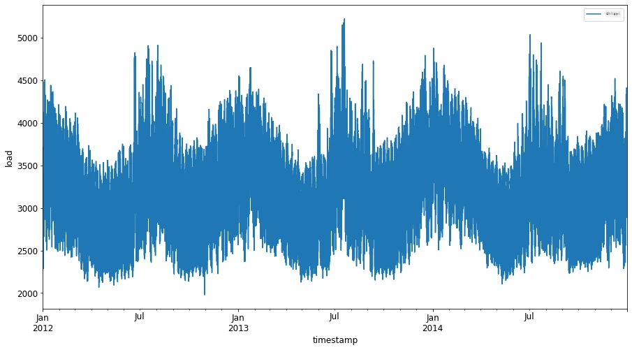
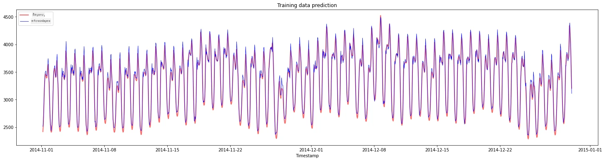
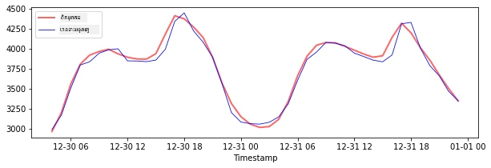
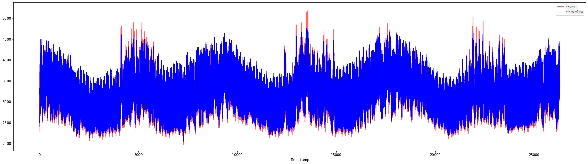

# ការព្យាករណ៍លំដាប់ពេលវេលា ជាមួយ Support Vector Regressor

នៅក្នុងមេរៀនមុន អ្នកបានរៀនពីវិធីប្រើម៉ូដែល ARIMA ដើម្បីធ្វើការព្យាករណ៍លំដាប់ពេលវេលា។ ឥឡូវនេះ អ្នកនឹងស្វែងយល់ពីម៉ូដែល Support Vector Regressor ដែលជាម៉ូដែល regressors ដែលប្រើក្នុងការព្យាករណ៍ទិន្នន័យបន្ដ។

## [ប្រលងមុនម៉េរៀន](https://ff-quizzes.netlify.app/en/ml/) 

## ការណែនាំ

ក្នុងមេរៀននេះ អ្នកនឹងស្វែងរកវិធីជាក់លាក់មួយក្នុងការបង្កើតម៉ូដែលជាមួយ [**SVM**: **S**upport **V**ector **M**achine](https://en.wikipedia.org/wiki/Support-vector_machine) សម្រាប់ regression, ឬ **SVR: Support Vector Regressor**។

### SVR ក្នុងបរិបទនៃលំដាប់ពេលវេលា [^1]

មុនពេលយល់ពីសារៈសំខាន់របស់ SVR ក្នុងការព្យាករណ៍លំដាប់ពេលវេលា នេះជាគំនិតសំខាន់ៗខ្លះដែលអ្នកត្រូវដឹង៖

- **Regression:** ជាបច្ចេកទេសរៀនក្រោមការត្រួតពិនិត្យ ដើម្បីព្យាករណ៍តម្លៃបន្ដពីការបញ្ចូលដែលបានផ្ដល់។ គំនិតគឺដាក់កម្រាស់ (ឬបន្ទាត់) នៅក្នុងប្រឡាយលក្ខណៈដែលមានចំនួនចំណុចទិន្នន័យច្រើនបំផុត។ [ចុចទីនេះ](https://en.wikipedia.org/wiki/Regression_analysis) សម្រាប់ព័ត៌មានបន្ថែម។
- **Support Vector Machine (SVM):** ប្រភេទម៉ូដែលម៉ាស៊ីនរៀនក្រោមការត្រួតពិនិត្យដែលប្រើសម្រាប់ការបែងចែកថ្នាក់, regression និងការរកឃើញចំណុចខូចខាត។ ម៉ូដែលគឺជា hyperplane នៅក្នុងប្រឡាយលក្ខណៈ ដែលរឿងបែងចែកធ្វើជា​ព្រំដែន ហើយការរឿង regression ដំណើរការជាបន្ទាត់អនុគមន៍ល្អបំផុត។ ក្នុង SVM, មុខងារកឺណែលគឺត្រូវបានប្រើសម្រាប់បំលែងទិន្នន័យទៅប្រឡាយដែលមានមิติច្រើនជាង ដើម្បីអាចបំបែកបានស្រួល។ [ចុចទីនេះ](https://en.wikipedia.org/wiki/Support-vector_machine) សម្រាប់ព័ត៌មានបន្ថែមអំពី SVM។
- **Support Vector Regressor (SVR):** ជាប្រភេទ SVM ដើម្បីស្វែងរកបន្ទាត់ល្អបំផុត (ដែលនៅក្នុងករណី SVM គឺជា hyperplane) ដែលមានចំនួនចំណុចទិន្នន័យច្រើនបំផុត។

### ហេតុអ្វីបានជា SVR? [^1]

នៅក្នុងមេរៀនមុន អ្នកបានរៀនអំពី ARIMA ដែលជាវិធីសាស្រ្តស្ថិតិស្របនឹងបន្ទាត់ដែលមានភាពជោគជ័យខ្លាំងក្នុងការព្យាករណ៍លំដាប់ពេលវេលា។ ទោះជាយ៉ាងណា ក្នុងករណីជាច្រើន ទិន្នន័យលំដាប់ពេលវេលាមាន *មិនលីនុយ* ដែលមម៉ូដែលលីនុយមិនអាចផ្គូរផ្គងបាន។ ក្នុងករណីទាំងនេះ សមត្ថភាពរបស់ SVM ក្នុងការបង្ហាប់មិនលីនុយក្នុងទិន្នន័យសម្រាប់ភារកិច្ច regression ធ្វើឲ្យ SVR មានភាពជោគជ័យក្នុងការព្យាករណ៍លំដាប់ពេលវេលា។

## ការហ្វឹកហាត់ - បង្កើតម៉ូដែល SVR

ជំហានដំបូងក្នុងការរៀបចំទិន្នន័យដូចគ្នានឹងមេរៀនមុននៃ [ARIMA](https://github.com/microsoft/ML-For-Beginners/tree/main/7-TimeSeries/2-ARIMA)។

បើកថត [_/working_](https://github.com/microsoft/ML-For-Beginners/tree/main/7-TimeSeries/3-SVR/working) ក្នុងមេរៀននេះ ហើយស្វែងរកឯកសារ [_notebook.ipynb_](https://github.com/microsoft/ML-For-Beginners/blob/main/7-TimeSeries/3-SVR/working/notebook.ipynb)។[^2]

1. រត់ notebook និងនាំចូលបណ្ណាល័យដែលត្រូវការ៖  [^2]

   ```python
   import sys
   sys.path.append('../../')
   ```

   ```python
   import os
   import warnings
   import matplotlib.pyplot as plt
   import numpy as np
   import pandas as pd
   import datetime as dt
   import math
   
   from sklearn.svm import SVR
   from sklearn.preprocessing import MinMaxScaler
   from common.utils import load_data, mape
   ```

2. ផ្ទុកទិន្នន័យពីឯកសារ `/data/energy.csv` ចូលក្នុង dataframe នៃ Pandas ហើយមើលទិន្នន័យ៖  [^2]

   ```python
   energy = load_data('../../data')[['load']]
   ```

3. គូរ​ទិន្នន័យថាមពលទាំងអស់ដែលមានចាប់ពីខែមករា ២០១២ ដល់ធ្នូ ២០១៤៖ [^2]

   ```python
   energy.plot(y='load', subplots=True, figsize=(15, 8), fontsize=12)
   plt.xlabel('timestamp', fontsize=12)
   plt.ylabel('load', fontsize=12)
   plt.show()
   ```

   

   ឥឡូវនេះ យើងចាប់ផ្តើមបង្កើតម៉ូដែល SVR។

### បង្កើតឯកសារបណ្តុះបណ្តាល និងសាកល្បង

ឥឡូវនេះទិន្នន័យរបស់អ្នក បានផ្ទុករួចហើយ អ្នកអាចបំបែកវាទៅជាសំណុំបណ្តុះបណ្តាល និងសាកល្បង។ បន្ទាប់មក អ្នកនឹងបម្លែងទិន្នន័យធ្វើជា dataset ដែលផ្អែកលើជំហានពេលវេលា ដែលចាំបាច់សម្រាប់ SVR។ អ្នកនឹងបណ្តុះម៉ូដែលលើសំណុំបណ្តុះបណ្តាល។ បន្ទាប់ពីម៉ូដែលបញ្ចប់ការបណ្តុះ អ្នកនឹងវាយតម្លៃភាពត្រឹមត្រូវរបស់វាលើសំណុំបណ្តុះបណ្តាល សំណុំសាកល្បង ហើយបន្ទាប់បង្អស់លើទិន្នន័យទាំងមូល ដើម្បីមើលការសម្តែងសរុប។ អ្នកត្រូវប្រាកដថាសំណុំសាកល្បងគ្របដណ្តប់រយៈពេលក្រោយសំណុំបណ្តុះបណ្តាល ដើម្បីធានាថាម៉ូដែលមិនទទួលបានពូជព័ត៌មានពីរយៈពេលអនាគត។ [^2] (ស្ថានភាពដែលហៅថា *Overfitting*)។

1. ចាត់តាំងរយៈពេលពីខែកញ្ញា ១ ដល់ ៣១ កញ្ញា ឆ្នាំ ២០១៤ សម្រាប់សំណុំបណ្តុះបណ្តាល។ សំណុំសាកល្បងនឹងរួមបញ្ចូលរយៈពេលពីខែវិច្ឆិកា ១ ដល់ ៣១ ធ្នូ ឆ្នាំ ២០១៤: [^2]

   ```python
   train_start_dt = '2014-11-01 00:00:00'
   test_start_dt = '2014-12-30 00:00:00'
   ```

2. មើលឃើញភាពខុសគ្នា៖ [^2]

   ```python
   energy[(energy.index < test_start_dt) & (energy.index >= train_start_dt)][['load']].rename(columns={'load':'train'}) \
       .join(energy[test_start_dt:][['load']].rename(columns={'load':'test'}), how='outer') \
       .plot(y=['train', 'test'], figsize=(15, 8), fontsize=12)
   plt.xlabel('timestamp', fontsize=12)
   plt.ylabel('load', fontsize=12)
   plt.show()
   ```

   


### រៀបចំទិន្នន័យសម្រាប់បណ្តុះបណ្តាល

ឥឡូវនេះ អ្នកត្រូវរៀបចំទិន្នន័យសម្រាប់បណ្តុះបណ្តាល ដោយការបំលាស់តម្រង និងបញ្ចៀសទំហំទិន្នន័យ។ សូមតម្រង dataset ទៅតែរយៈពេល និងទល់ដែលអ្នកត្រូវការ ហើយបញ្ចៀសទំហំដើម្បីធានាថាទិន្នន័យត្រូវបានបង្ហាញនៅចន្លោះទី 0 និង 1។

1. តម្រង dataset ដើមដើម្បីរួមបញ្ចូលតែកាលបរិច្ឆេទនិងកូឡុំ 'load' ដែលចាំបាច់តែមួយក្នុងសំណុំទិន្នន័យនីមួយៗ៖ [^2]

   ```python
   train = energy.copy()[(energy.index >= train_start_dt) & (energy.index < test_start_dt)][['load']]
   test = energy.copy()[energy.index >= test_start_dt][['load']]
   
   print('Training data shape: ', train.shape)
   print('Test data shape: ', test.shape)
   ```

   ```output
   Training data shape:  (1416, 1)
   Test data shape:  (48, 1)
   ```
   
2. បញ្ចៀសទំហំនៃទិន្នន័យសម្រាប់សំណុំបណ្តុះបណ្តាលក្នុងចន្លោះ (0, 1): [^2]

   ```python
   scaler = MinMaxScaler()
   train['load'] = scaler.fit_transform(train)
   ```
   
4. ឥឡូវនេះ អ្នកបញ្ចៀសទំហំនៃទិន្នន័យសម្រាប់សំណុំសាកល្បង៖ [^2]

   ```python
   test['load'] = scaler.transform(test)
   ```

### បង្កើតទិន្នន័យជាជំហានពេលវេលា [^1]

សម្រាប់ SVR, អ្នកបម្លែងទិន្នន័យបញ្ចូលឲ្យមានទ្រង់ទ្រាយ `[batch, timesteps]`។ ដូច្នេះ អ្នកបម្លែង `train_data` និង `test_data` ដែលមានស្រាប់ ដើម្បីបង្កើតវិមាត្រថ្មីដែលសំដៅទៅលើជំហានពេលវេលា។

```python
# ការបម្លែងទៅជាអារេ numpy
train_data = train.values
test_data = test.values
```

សម្រាប់ឧទាហរណ៍នេះ យើងកំណត់ `timesteps = 5`។ ដូច្នេះ ទិន្នន័យបញ្ចូលទៅម៉ូដែលគឺទិន្នន័យរបស់ 4 ជំហានពេលវេលាដំបូង ហើយទិន្នន័យចេញនឹងជាទិន្នន័យសម្រាប់ជំហានពេលវេលាទី 5។

```python
timesteps=5
```

បម្លែងទិន្នន័យបណ្តុះបណ្តាលទៅជា 2D tensor ដោយប្រើការរួមបញ្ចូលបញ្ជីមួយ:

```python
train_data_timesteps=np.array([[j for j in train_data[i:i+timesteps]] for i in range(0,len(train_data)-timesteps+1)])[:,:,0]
train_data_timesteps.shape
```

```output
(1412, 5)
```

បម្លែងទិន្នន័យសាកល្បងទៅជា 2D tensor:

```python
test_data_timesteps=np.array([[j for j in test_data[i:i+timesteps]] for i in range(0,len(test_data)-timesteps+1)])[:,:,0]
test_data_timesteps.shape
```

```output
(44, 5)
```

 ជ្រើសរើសទិន្នន័យបញ្ចូល និងចេញពីទិន្នន័យបណ្តុះបណ្តាល និងសាកល្បង:

```python
x_train, y_train = train_data_timesteps[:,:timesteps-1],train_data_timesteps[:,[timesteps-1]]
x_test, y_test = test_data_timesteps[:,:timesteps-1],test_data_timesteps[:,[timesteps-1]]

print(x_train.shape, y_train.shape)
print(x_test.shape, y_test.shape)
```

```output
(1412, 4) (1412, 1)
(44, 4) (44, 1)
```

### អនុវត្ត SVR [^1]

ឥឡូវនេះពេលវេលាអនុវត្ត SVR។ ដើម្បីអានបន្ថែមអំពីការអនុវត្តនេះ អ្នកអាចយោងទៅកាន់ [ឯកសារ​នេះ](https://scikit-learn.org/stable/modules/generated/sklearn.svm.SVR.html)។ សម្រាប់ការអនុវត្តរបស់យើង យើងផ្ដល់តាមជំហានខាងក្រោម៖

  1. កំណត់ម៉ូដែលដោយហៅ `SVR()` ហើយផ្តល់ប៉ារ៉ាម៉ែត្រម៉ូដែលៈ kernel, gamma, c និង epsilon
  2. រៀបចំម៉ូដែលសម្រាប់ទិន្នន័យបណ្តុះបណ្តាល​ដោយហៅមុខងារ `fit()`
  3. ធ្វើការព្យាករណ៍ដោយហៅមុខងារ `predict()`

ឥឡូវនេះយើងបង្កើតម៉ូដែល SVR។ នៅទីនេះយើងប្រើ [kernel RBF](https://scikit-learn.org/stable/modules/svm.html#parameters-of-the-rbf-kernel) ហើយកំណត់ប៉ារ៉ាម៉ែត្រ gamma, C និង epsilon ជា 0.5, 10 និង 0.05 តាមលំដាប់។

```python
model = SVR(kernel='rbf',gamma=0.5, C=10, epsilon = 0.05)
```

#### តម្រឹមម៉ូដែលលើទិន្នន័យបណ្តុះបណ្តាល [^1]

```python
model.fit(x_train, y_train[:,0])
```

```output
SVR(C=10, cache_size=200, coef0=0.0, degree=3, epsilon=0.05, gamma=0.5,
    kernel='rbf', max_iter=-1, shrinking=True, tol=0.001, verbose=False)
```

#### ធ្វើការព្យាករណ៍ម៉ូដែល [^1]

```python
y_train_pred = model.predict(x_train).reshape(-1,1)
y_test_pred = model.predict(x_test).reshape(-1,1)

print(y_train_pred.shape, y_test_pred.shape)
```

```output
(1412, 1) (44, 1)
```

អ្នកបានបង្កើត SVR រួចហើយ! ឥឡូវនេះយើងត្រូវវាយតម្លៃវា។

### វាយតម្លៃម៉ូដែលរបស់អ្នក [^1]

សម្រាប់ការ​វាយ​តម្លៃ ជា​ដំបូង​មុន យើង​នឹង​បំលែង​ទិន្នន័យ​វិញ​ទៅ​ទំហំដើម។ បន្ទាប់មក ដើម្បីពិនិត្យប្រសិទ្ធភាព យើងនឹងគូររូបតារាងលំដាប់ពេលវេលាដើម និងដែលបានព្យាករណ៍ ហើយក៏បោះពុម្ពលទ្ធផល MAPE ផងដែរ។

បញ្ចៀសទំហំទិន្នន័យដែលបានព្យាករណ៍ និងដើម៖

```python
# ការតម្រូវទិន្នន័យទាយទុក
y_train_pred = scaler.inverse_transform(y_train_pred)
y_test_pred = scaler.inverse_transform(y_test_pred)

print(len(y_train_pred), len(y_test_pred))
```

```python
# ការបម្លែងតម្លៃដើម
y_train = scaler.inverse_transform(y_train)
y_test = scaler.inverse_transform(y_test)

print(len(y_train), len(y_test))
```

#### ពិនិត្យប្រសិទ្ធភាពម៉ូដែលលើទិន្នន័យបណ្តុះបណ្តាល និងសាកល្បង [^1]

យើងដកយកកាលបរិច្ឆេទពី dataset ដើម្បីបង្ហាញនៅផខ្វារដេខាង x នៃធាតុគូរ។ ចំណាំថា យើងប្រើតម្លៃ ```timesteps-1``` ដំបូងជាinput សម្រាប់ចេញលទ្ធផលដំបូង ដូច្នេះកាលបរិច្ឆេទសម្រាប់លទ្ធផលនឹងចាប់ផ្តើមក្រោយពីពេលនោះ។

```python
train_timestamps = energy[(energy.index < test_start_dt) & (energy.index >= train_start_dt)].index[timesteps-1:]
test_timestamps = energy[test_start_dt:].index[timesteps-1:]

print(len(train_timestamps), len(test_timestamps))
```

```output
1412 44
```

គូរព្យាករណ៍សម្រាប់ទិន្នន័យបណ្តុះបណ្តាល៖

```python
plt.figure(figsize=(25,6))
plt.plot(train_timestamps, y_train, color = 'red', linewidth=2.0, alpha = 0.6)
plt.plot(train_timestamps, y_train_pred, color = 'blue', linewidth=0.8)
plt.legend(['Actual','Predicted'])
plt.xlabel('Timestamp')
plt.title("Training data prediction")
plt.show()
```



បោះពុម្ព MAPE សម្រាប់ទិន្នន័យបណ្តុះបណ្តាល

```python
print('MAPE for training data: ', mape(y_train_pred, y_train)*100, '%')
```

```output
MAPE for training data: 1.7195710200875551 %
```

គូរព្យាករណ៍សម្រាប់ទិន្នន័យសាកល្បង

```python
plt.figure(figsize=(10,3))
plt.plot(test_timestamps, y_test, color = 'red', linewidth=2.0, alpha = 0.6)
plt.plot(test_timestamps, y_test_pred, color = 'blue', linewidth=0.8)
plt.legend(['Actual','Predicted'])
plt.xlabel('Timestamp')
plt.show()
```



បោះពុម្ព MAPE សម្រាប់ទិន្នន័យសាកល្បង

```python
print('MAPE for testing data: ', mape(y_test_pred, y_test)*100, '%')
```

```output
MAPE for testing data:  1.2623790187854018 %
```

🏆 អ្នកមានលទ្ធផលល្អបំផុតលើសំណុំទិន្នន័យសាកល្បង!

### ពិនិត្យប្រសិទ្ធភាពម៉ូដែលលើទិន្នន័យទាំងមូល [^1]

```python
# ដកតម្លៃផ្ទុកជាអារេ numpy
data = energy.copy().values

# ការចម្រុះមាត្រា
data = scaler.transform(data)

# ការបម្លែងទៅជា tensor 2D ដូចតាមតម្រូវការបញ្ចូលម៉ូដែល
data_timesteps=np.array([[j for j in data[i:i+timesteps]] for i in range(0,len(data)-timesteps+1)])[:,:,0]
print("Tensor shape: ", data_timesteps.shape)

# ជ្រើសរើសការបញ្ចូល និងការចេញពីទិន្នន័យ
X, Y = data_timesteps[:,:timesteps-1],data_timesteps[:,[timesteps-1]]
print("X shape: ", X.shape,"\nY shape: ", Y.shape)
```

```output
Tensor shape:  (26300, 5)
X shape:  (26300, 4) 
Y shape:  (26300, 1)
```

```python
# ធ្វើការព្យាករណ៍ម៉ូឌែល
Y_pred = model.predict(X).reshape(-1,1)

# បំលែងវាស់វិញ និងបង្ហាញទ្រង់ទ្រាយឡើងវិញ
Y_pred = scaler.inverse_transform(Y_pred)
Y = scaler.inverse_transform(Y)
```

```python
plt.figure(figsize=(30,8))
plt.plot(Y, color = 'red', linewidth=2.0, alpha = 0.6)
plt.plot(Y_pred, color = 'blue', linewidth=0.8)
plt.legend(['Actual','Predicted'])
plt.xlabel('Timestamp')
plt.show()
```



```python
print('MAPE: ', mape(Y_pred, Y)*100, '%')
```

```output
MAPE:  2.0572089029888656 %
```


🏆 រូបភាពគូរល្អណាស់ បង្ហាញមូដែលដែលមានភាពត្រឹមត្រូវល្អ។ អបអរសាទរ!

---

## 🚀 ដំណើរការប្រកួតប្រជែង

- ព្យាយាមកែសម្រួលប៉ារ៉ាម៉ែត្រ (gamma, C, epsilon) ខណៈបង្កើតម៉ូដែល ហើយវាយតម្លៃលើទិន្នន័យ ដើម្បីមើលថាប៉ារ៉ាម៉ែត្រណាផ្ដល់លទ្ធផលល្អបំផុតលើទិន្នន័យសាកល្បង។ ដើម្បីដឹងបន្ថែមអំពីប៉ារ៉ាម៉ែត្រនេះ អ្នកអាចយោងទៅឯកសារ [នៅទីនេះ](https://scikit-learn.org/stable/modules/svm.html#parameters-of-the-rbf-kernel)។  
- ព្យាយាមប្រើមុខងារកឺណែលផ្សេងៗសម្រាប់ម៉ូដែល ហើយវិភាគប្រសិទ្ធភាពរបស់ពួកវាលើ dataset។ ឯកសារជួយសម្រួលអាចរកបាន [នៅទីនេះ](https://scikit-learn.org/stable/modules/svm.html#kernel-functions)។
- ព្យាយាមប្រើតម្លៃ `timesteps` ខុសគ្នាដើម្បីឲ្យម៉ូដែលមើលពីចុងក្រោយក្នុងការធ្វើការព្យាករណ៍។

## [ប្រលងបន្ទាប់ម៉េរៀន](https://ff-quizzes.netlify.app/en/ml/)

## ការពិនិត្យឡើងវិញ និងសិក្សាដោយខ្លួនឯង

មេរៀននេះបានណែនាំអំពីការដាក់ពាក្យ SVR សម្រាប់ការព្យាករណ៍លំដាប់ពេលវេលា។ ដើម្បីអានបន្ថែមអំពី SVR អ្នកអាចយោងទៅ [ប្លុកនេះ](https://www.analyticsvidhya.com/blog/2020/03/support-vector-regression-tutorial-for-machine-learning/)។ ឯកសារនៅលើ [scikit-learn](https://scikit-learn.org/stable/modules/svm.html) នេះផ្តល់ការពិពណ៌នាច្បាស់លាស់ជាងនេះអំពី SVMs ទូទៅ, [SVRs](https://scikit-learn.org/stable/modules/svm.html#regression) និងព័ត៌មានលម្អិតនៃការអនុវត្តផ្សេងទៀតដូចជាមុខងារកឺណែលនានា [kernel functions](https://scikit-learn.org/stable/modules/svm.html#kernel-functions) ដែលអាចប្រើបាន និងប៉ារ៉ាម៉ែត្រ។

## កិច្ចការ

[ម៉ូដែល SVR ថ្មី](assignment.md)


## ប្រភព


[^1]: អត្ថបទ កូដ និងលទ្ធផលក្នុងផ្នែកនេះបានចូលរួមដោយ [@AnirbanMukherjeeXD](https://github.com/AnirbanMukherjeeXD)
[^2]: អត្ថបទ កូដ និងលទ្ធផលក្នុងផ្នែកនេះត្រូវបានយកមកពី [ARIMA](https://github.com/microsoft/ML-For-Beginners/tree/main/7-TimeSeries/2-ARIMA)

---

<!-- CO-OP TRANSLATOR DISCLAIMER START -->
**ការបដិសេធ**៖  
ឯកសារនេះត្រូវបានបកប្រែដោយប្រើសេវាកម្មបកប្រែ AI [Co-op Translator](https://github.com/Azure/co-op-translator)។ ទោះបីយើងខិតខំប្រឹងប្រែងឲ្យបានត្រឹមត្រូវក្តី ក៏សូមយកចិត្តទុកដាក់ទំរូវថាការបកប្រែដោយស្វ័យប្រវត្តិកាត់ដណ្ដើមអាចមានកំហុសឬភាពមិនត្រឹមត្រូវ។ ឯកសារដើមនៅភាសាដើមគួរត្រូវបានគេយកជាមូលដ្ឋានសំខាន់។ សម្រាប់ព័ត៌មានសំខាន់ ការបកប្រែដោយអ្នកជំនាញមានបទពិសោធន៍គឺត្រូវបានផ្តល់អនុសាសន៍។ យើងមិនទទួលខុសត្រូវចំពោះការយល់ច្រឡំ ឬការបកអត្ថន័យខុសបណ្តាលមកពីការប្រើប្រាស់ការបកប្រែនេះឡើយ។
<!-- CO-OP TRANSLATOR DISCLAIMER END -->