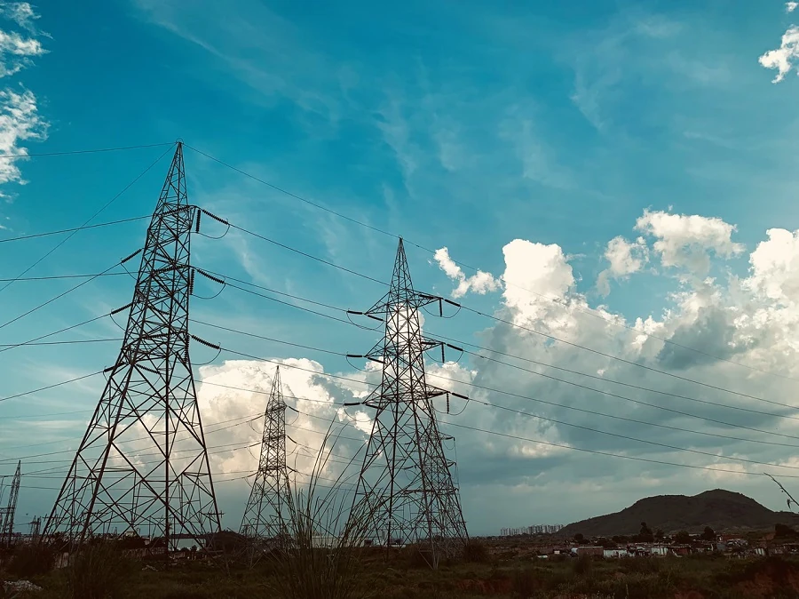

# មូលដ្ឋាននៃការព្យាករណ៍រយៈពេល

តើការព្យាករណ៍រយៈពេលជាអ្វី? វាគឺជាការព្យាករណ៍ព្រឹត្តិការណ៍អនាគតដោយវិភាគនិន្នាការរបស់អតីតកាល។

## ប្រធានបទតំបន់៖ ការប្រើប្រាស់អគ្គិសនីជាសកល ✨

នៅក្នុងមេរៀនទាំងពីរនេះ អ្នកនឹងត្រូវបានណែនាំអំពីការព្យាករណ៍រយៈពេល ដែលជាផ្នែកដែលមិនធ្លាប់បានគ្រប់គ្រាន់ក្នុងការសិក្សាគ្រឿងចក្ររស់ ដែលយ៉ាងណាមិញមានតម្លៃខ្ពស់សម្រាប់ឧស្សាហកម្ម និងអាជីវកម្ម និងដំណាក់កាលផ្សេងៗ។ ខណៈដែលបណ្ដាញប្រសាទអាចត្រូវបានប្រើដើម្បីបង្កើនប្រយោជន៍នៃគំរូទាំងនេះ យើងនឹងសិក្សាវានៅក្នុងបរិបទនៃគំរូគ្រឿងចក្រប្រពៃណី ព្រោះគំរូជួយព្យាករណ៍លទ្ធផលអនាគតជាផ្អែកលើអតីតកាល។

ការផ្តោតលើតំបន់របស់យើងគឺការប្រើប្រាស់អគ្គិសនីនៅលើពិភពលោក ដែលជាតារាងទិន្នន័យគួរឱ្យចាប់អារម្មណ៍ក្នុងការរៀនពីការព្យាករណ៍ការប្រើប្រាស់ថាមពលនៅអនាគតដោយផ្អែកលើគំរូនៃការតមLoadអតីតកាល។ អ្នកអាចមើលឃើញថាប្រភេទការព្យាករណ៍នេះអាចមានប្រយោជន៍ខ្ពស់នៅក្នុងបរិបទអាជីវកម្ម។

រូបថតដោយ [Peddi Sai hrithik](https://unsplash.com/@shutter_log?utm_source=unsplash&utm_medium=referral&utm_content=creditCopyText) នៃបណ្តោយខ្សែអគ្គិសនីនៅលើផ្លូវនៅ Rajasthan នៅលើ [Unsplash](https://unsplash.com/s/photos/electric-india?utm_source=unsplash&utm_medium=referral&utm_content=creditCopyText)

## មេរៀន

1. [មូលដ្ឋាននៃការព្យាករណ៍រយៈពេល](1-Introduction/README.md)
2. [ការកសាងគំរូរយៈពេល ARIMA](2-ARIMA/README.md)
3. [ការកសាង Support Vector Regressor សម្រាប់ការព្យាករណ៍រយៈពេល](3-SVR/README.md)

## ឥណទាន

"មូលដ្ឋាននៃការព្យាករណ៍រយៈពេល" ត្រូវបានសរសេរជាផ្លូវការ⚡️ ដោយ [Francesca Lazzeri](https://twitter.com/frlazzeri) និង [Jen Looper](https://twitter.com/jenlooper)។ សៀវភៅកំណត់ត្រានេះបានបង្ហាញលើអ៊ីនធឺណិតជាលើកដំបូងនៅក្នុង [Azure "Deep Learning For Time Series" repo](https://github.com/Azure/DeepLearningForTimeSeriesForecasting) ដែលបានសរសេរដំបូងដោយ Francesca Lazzeri។ មេរៀន SVR ត្រូវបានសរសេរដោយ [Anirban Mukherjee](https://github.com/AnirbanMukherjeeXD)។

---

<!-- CO-OP TRANSLATOR DISCLAIMER START -->
**ការបដិសេធ aansprakelijkheid**៖
ឯកសារនេះត្រូវបានបកប្រែដោយប្រើសេវាកម្មបកប្រែ AI [Co-op Translator](https://github.com/Azure/co-op-translator) ។ ខណៈពេលយើងខំប្រឹងរកភាពត្រឹមត្រូវ សូមយល់ឲ្យបានថាការបកប្រែដោយស្វ័យប្រវត្តិអាចមានកំហុសឬភាពមិនត្រឹមត្រូវខ្លះ។ ឯកសារដើមដែលសរសេរជាភាសាមនុស្សដើមគួរត្រូវបានពិចារណាថាជាហូរ​ញាតិ​ផ្លូវការ។ សម្រាប់ព័ត៍មានសំខាន់ៗ​ សូមណែនាំឲ្យបកប្រែដោយអ្នកជំនាញមនុស្ស។ យើងមិនទទួលខុសត្រូវចំពោះការយល់ច្រឡំ ឬការបកប្រែខុសពីការប្រើប្រាស់ការបកប្រែនេះឡើយ។
<!-- CO-OP TRANSLATOR DISCLAIMER END -->