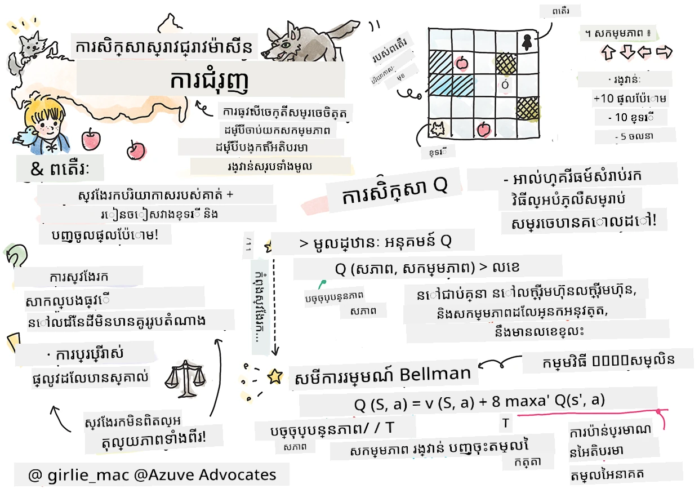
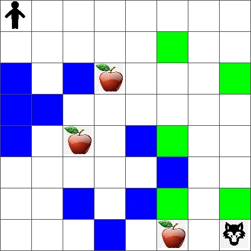
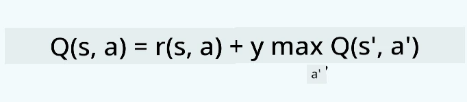
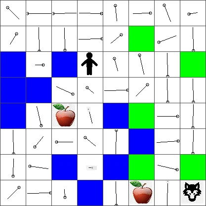
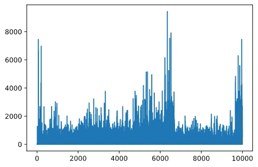

# ណែនាំអំពីការរៀន​តាម​ការ​បន្សំ​ឡើងវិញ និង Q-Learning


> រូប​រចនាសម្ព័ន្ធ​ដោយ [Tomomi Imura](https://www.twitter.com/girlie_mac)

ការ​បន្សំ​ឡើងវិញ​ (Reinforcement learning) មានទិដ្ឋភាពសំខាន់បីយ៉ាង៖ តំណាងក្រុមហ៊ុន (agent), ស្ថានភាពមួយចំនួន (states), និងសំណុំសកម្មភាពក្នុងមួយស្ថានភាព។ ដោយអនុវត្តសកម្មភាពមួយក្នុងស្ថានភាពដែលបានកំណត់ នោះតំណាងក្រុមហ៊ុននឹងទទួលបានរង្វាន់មួយ។ ម្ដងទៀតគិតពីហ្គេមកុំព្យូទ័រ Super Mario។ អ្នកគឺ Mario អ្នកកំពុងនៅក្នុងកម្រិតហ្គេមមួយ ឈរនៅជាប់ស្នាមថ្ម។ លើអ្នកមានកញ្ចប់ព្រៃ។ អ្នកជេMario នៅកម្រិតហ្គេម មួយ នៅទីតាំងជាក់លាក់... វាគឺជាស្ថានភាពរបស់អ្នក។ ជំហានមួយទៅស្ដាំ (សកម្មភាព) នឹងធ្វើឲ្យអ្នកធ្លាក់ចុះពីស្នាមថ្ម និងនឹងផ្តល់ពិន្ទុខ្មាស់ៗទាបមួយ។ ទោះជាយ៉ាងណាក៏ដោយ ការចុចប៊ូតុងលោតនឹងឲ្យអ្នកពិន្ទុ ហើយអ្នកនឹងរស់រានមានជីវិត។ វា​ជា​លទ្ធផលវិជ្ជមាន ហើយវាគួរត្រូវបានផ្តល់ពិន្ទុជាលេខវិជ្ជមាន។

ដោយប្រើកម្មវិធីបន្សំឡើងវិញ និងម៉ាស៊ីមួយ (ហ្គេម) អ្នកអាចរៀនលេងហ្គេម ដើម្បីបង្កើនរង្វាន់ដែលមានន័យថារស់រានមានជីវិត និងពិន្ទុច្រើនបំផុត។

[](https://www.youtube.com/watch?v=lDq_en8RNOo)

> 🎥 ចុចរូបភាពខាងលើដើម្បីស្តាប់ Dmitry ពិភាក្សាអំពីការរៀនតាមការបន្សំឡើងវិញ

## [សំណួរតេស្តមុនមេរៀន](https://ff-quizzes.netlify.app/en/ml/)

## ទាមទារ និងការតំឡើង

ក្នុងមេរៀននេះ យើងនឹងសាកល្បងកូដមួយចំនួននៅក្នុង Python។ អ្នកគួរតែអាចរត់កូដ Jupyter Notebook នៃមេរៀននេះបាន មើលវាណាមួយនៅលើកុំព្យូទ័រឬនៅបណ្តាញផ្សព្វផ្សាយ។

អ្នកអាចបើក [សៀវភៅមេរៀន](https://github.com/microsoft/ML-For-Beginners/blob/main/8-Reinforcement/1-QLearning/notebook.ipynb) ហើយដើរតាមមេរៀននេះដើម្បីឱ្យបានល្អ។

> **សម្គាល់៖** បើអ្នកបើកកូដនេះពីពពក អ្នកត្រូវយកផងដែរ​ឯកសារ [`rlboard.py`](https://github.com/microsoft/ML-For-Beginners/blob/main/8-Reinforcement/1-QLearning/rlboard.py) ដែលប្រើក្នុងកូដសៀវភៅមេរៀន។ ដាក់វា​ទៅក្នុងថត​ដដែលនឹង​សៀវភៅនេះ។

## ណែនាំ

ក្នុងមេរៀននេះ យើងនឹងសំដែងពីពិភពលោករបស់ **[Peter and the Wolf](https://en.wikipedia.org/wiki/Peter_and_the_Wolf)** ដែលមានការបញ្ចេញបែបបទពីរឿងនិទានតន្រ្តីដោយអ្នកតន្រ្តីរុស្ស៊ី [Sergei Prokofiev](https://en.wikipedia.org/wiki/Sergei_Prokofiev)។ យើងនឹងប្រើ **ការ​បន្សំ​ឡើងវិញ** ដើម្បីឲ្យ Peter ស្វែងរកបរិស្ថានរបស់គាត់ ប្រមូលផ្លែប៉ោមឆ្អិន ហើយចៀសវាងការជួបព្រៃ។

**ការ​បន្សំ​ឡើងវិញ** (RL) គឺជាបច្ចេកទេសសិក្សាដែលអាចឲ្យយើងរៀនបានអាកប្បកិរិយាសមរម្យរបស់ **តំណាង (agent)** ក្នុង **បរិស្ថាន** មួយដោយធ្វើតេស្តជាពេលវេលាជាច្រើន។ តំណាងក្នុងបរិស្ថាននេះគួរតែមាន**គោលដៅ**មួយ ដែលកំណត់ដោយ **មុខងាររង្វាន់**។

## បរិស្ថាន

សម្រាប់ភាពងាយស្រួល អោយយើងគិតពីពិភពលោករបស់ Peter ជាផ្ទៃតុរង្វង់ប្រភេទ​ `width` x `height`, ដូចនេះ៖



មុខងារម្ខាងនៃផ្ទៃតូនេះអាចមាន៖

* **ដី** ដែល Peter និងសត្វផ្សេងទៀតអាចដើរបាន។
* **ទឹក** ដែលអ្នកមិនអាចដើរបានច្បាស់។
* **ដើមឈើ** ឬ **ស្មៅ**, ជាទីកន្លែងដែលអ្នកអាចសម្រាកបាន។
* **ផ្លែប៉ោម** ដែលតំណាងឲ្យរឿងដែល Peter សប្បាយចិត្តក្នុងការបង្ហាត់ខ្លួន។
* **ព្រៃ** ដែលគឺគ្រោះថ្នាក់ និងគួរតែចៀសវាង។

មានម៉ូឌុល Python មួយផ្សេង [ `rlboard.py`](https://github.com/microsoft/ML-For-Beginners/blob/main/8-Reinforcement/1-QLearning/rlboard.py) ដែលមានកូដសម្រាប់ធ្វើការ​ជាមួយ​បរិស្ថាននេះ។ ដោយសារតែ​កូដនេះមិនសំខាន់សម្រាប់ការយល់ដឹងគ្រប់យ៉ាង យើងនឹងនាំចេញម៉ូឌុលហើយប្រើវាជាឧទាហរណ៍សម្រាប់បង្កើតផ្ទៃតុ (code block 1):

```python
from rlboard import *

width, height = 8,8
m = Board(width,height)
m.randomize(seed=13)
m.plot()
```

កូដនេះគួរតែបោះពុម្ពផ្សាយរូបភាពបរិស្ថានដូចខាងលើ។

## សកម្មភាព និង គោលការណ៍

ក្នុងឧទាហរណ៍របស់យើង គោលដៅរបស់ Peter គឺត្រូវ​រកផ្លែប៉ោម មិនឲ្យជួបប្រទៈព្រៃ និងឧបសគ្គផ្សេងទៀត។ ដើម្បីធ្វើបានបែបនេះ គាត់អាចដើរជុំវិញរហូតដល់ពេលរកឃើញផ្លែប៉ោម។

ដូច្នេះ នៅតំណាងតំបន់ណាមួយ គាត់អាចជ្រើសរើសមួយក្នុងចំណោមសកម្មភាពខាងក្រោម៖ ឡើងលើ ចុះក្រោម ឆ្វេង និងស្ដាំ។

យើងនឹងកំណត់សកម្មភាពទាំងនោះជាថតសន្ទស្សន៍ និងបម្រុងជាគូសមរម្យនៃបញ្ច្រាស់ទីតាំង។ ឧទាហរណ៍ ការរត់ទៅស្ដាំ (`R`) នឹងផ្គូរផ្គងជាគូ `(1,0)`។ (code block 2):

```python
actions = { "U" : (0,-1), "D" : (0,1), "L" : (-1,0), "R" : (1,0) }
action_idx = { a : i for i,a in enumerate(actions.keys()) }
```

សេចក្ដីសង្ខេប នយោបាយ និងគោលដៅរបស់ស្ថានការណ៍នេះមានដូចខាងក្រោម៖

- **នយោបាយ** របស់តំណាងយើង (Peter) ត្រូវបានកំណត់ដោយហៅថា **policy**។ គោលការណ៍គឺជាមុខងារដែលត្រឡប់តម្លៃសកម្មភាពនៅក្នុងស្ថានភាពណាមួយ។ ក្នុងរឿងរបស់យើង ស្ថានភាពមានន័យថា ផ្ទៃតុដែលមានទីតាំងបច្ចុប្បន្នរបស់អ្នកលេង។

- **គោលដៅ** របស់ការរៀនបន្សំឡើងវិញ​គឺដើម្បីរៀននយោបាយល្អ ដើម្បីអាចដោះស្រាយបញ្ហារបស់យើងបានយ៉ាងមានប្រសិទ្ធភាព។ ទោះបីជាយ៉ាងណា ជាមូលដ្ឋាន យើងនឹងគិតពីនយោបាយសាមញ្ញមួយហៅថា **random walk**។

## Random walk

មុនដំបូង ចាប់ផ្តើមដោះស្រាយបញ្ហារបស់យើងដោយអនុវត្តន៍នយោបាយ random walk។ ជាមួយ random walk យើងនឹងជ្រើសរើសសកម្មភាពបន្ទាប់ដោយចៃដន្យពីសកម្មភាពដែលមានស្រាប់ រហូតដល់យើងឈានដល់ផ្លែប៉ោម (code block 3)។

1. អនុវត្តន៍ random walk ជាមួយកូដខាងក្រោម៖

    ```python
    def random_policy(m):
        return random.choice(list(actions))
    
    def walk(m,policy,start_position=None):
        n = 0 # ចំនួនជំហាន
        # កំណត់ទីតាំងដើម
        if start_position:
            m.human = start_position 
        else:
            m.random_start()
        while True:
            if m.at() == Board.Cell.apple:
                return n # ជោគជ័យ!
            if m.at() in [Board.Cell.wolf, Board.Cell.water]:
                return -1 # ត្រូវបានខ្មៅបុក ឬ ចុះទឹក
            while True:
                a = actions[policy(m)]
                new_pos = m.move_pos(m.human,a)
                if m.is_valid(new_pos) and m.at(new_pos)!=Board.Cell.water:
                    m.move(a) # អនុវត្តចលនាក្នុងពិតប្រាកដ
                    break
            n+=1
    
    walk(m,random_policy)
    ```

    ការហៅទៅម៉ethode `walk` គួរតែបង្រួមវាយតម្លៃរយៈពេលនៃផ្លូវដែលអាចមានប្រែប្រួលពីរប្រតិបត្តិការមួយទៅមួយ។

1. រត់បទពិសោធន៍ walk ជាច្រើនដង (ប្រហែល 100 ដង) ហើយបោះពុម្ពផ្សាយព័ត៌មានស Estadística (code block 4):

    ```python
    def print_statistics(policy):
        s,w,n = 0,0,0
        for _ in range(100):
            z = walk(m,policy)
            if z<0:
                w+=1
            else:
                s += z
                n += 1
        print(f"Average path length = {s/n}, eaten by wolf: {w} times")
    
    print_statistics(random_policy)
    ```

    សូមចំណាំថា មធ្យមភាពរយៈពេលផ្លូវស្នាក់នៅប្រហែល 30-40 ជំហាន ដែលច្រើនខ្លាំង បើគិតពីចម្ងាយទៅផ្លែប៉ោមឆាប់ៗប្រហែល 5-6 ជំហានប៉ុណ្ណោះ។

    អ្នកក៏អាចមើលឃើញចលនារបស់ Peter ខណៈពេល random walk បានដូចក្នុងរូបនេះ៖

    

## មុខងាររង្វាន់

ដើម្បីធ្វើឲ្យនយោបាយយើងមានប្រាជ្ញាធំឡើង យើងត្រូវយល់ពីចលនាណាដែល "ល្អ" ជាងផ្សេងទៀត។ ដើម្បីធ្វើបាននេះ យើងត្រូវកំណត់គោលដៅរបស់យើង។

គោលដៅអាចកំណត់ជាមុខងារ **reward function** ដែលនឹងត្រឡប់តម្លៃពិន្ទុមួយសម្រាប់ស្ថានភាពនីមួយៗ។ ចំនួនដែលខ្ពស់ជាងនឹងមានមុខងាររង្វាន់ល្អប្រសើរជាង។ (code block 5)

```python
move_reward = -0.1
goal_reward = 10
end_reward = -10

def reward(m,pos=None):
    pos = pos or m.human
    if not m.is_valid(pos):
        return end_reward
    x = m.at(pos)
    if x==Board.Cell.water or x == Board.Cell.wolf:
        return end_reward
    if x==Board.Cell.apple:
        return goal_reward
    return move_reward
```

រឿងគួរឲ្យចាប់អារម្មណ៍​អំពីមុខងាររង្វាន់ គឺថា នៅភាគច្រើន *យើងត្រូវបានផ្តល់រង្វាន់ដ៏សំខាន់នៅចុងបញ្ចប់ហ្គេមប៉ុណ្ណោះ*។ នេះមានន័យថា អាល់ហ្គរីធម៍របស់យើងគួរតែចងចាំ "ជំហានល្អ" ដែលនាំឲ្យមានរង្វាន់វិជ្ជមាននៅចុងបញ្ចប់ ហើយបង្កើនសារៈសំខាន់របស់វា។ ស្រដៀងគ្នា ចលនាទាំងអស់ដែលនាំឲ្យមានលទ្ធផលអាក្រក់ គួរតែត្រូវបានទប់ស្កាត់។

## Q-Learning

អាល់ហ្គរីធម៍មួយដែលយើងនឹងពិភាក្សានៅទីនេះហៅថា **Q-Learning**។ នៅក្នុងអាល់ហ្គរីធម៍នេះ នយោបាយត្រូវបានកំណត់ដោយមុខងារ (ឬរចនាសម្ព័ន្ធទិន្នន័យ)ហៅថា **Q-Table**។ វាកត់ត្រា "ភាពល្អ" នៃសកម្មភាពនីមួយៗក្នុងស្ថានភាពណាមួយ។

វាហៅថា Q-Table ព្រោះវាមានការសម្របសម្រួលក្នុងការតំណាងជាតារាង ឬ អារ៉េពហុវិមាត្រ។ ពីព្រោះផ្ទៃតុរបស់យើងមានវិមាត្រ `width` x `height` យើងអាចតំណាង Q-Table ដោយប្រើ numpy array ដែលមានទំហំ `width` x `height` x `len(actions)`: (code block 6)

```python
Q = np.ones((width,height,len(actions)),dtype=np.float)*1.0/len(actions)
```

ចំណាំថា យើងចាប់ផ្តើមជាមួយតម្លៃស្មើគ្នា ទាំងអស់នៅក្នុង Q-Table ក្នុងករណីនេះ - 0.25។ វាសមរាប់នឹង "នយោបាយដើរចៃដន្យ" ព្រោះចលនាទាំងអស់ក្នុងស្ថានភាពនីមួយៗស្មើគ្នាទាំងមូល។ យើងអាចផ្តល់បន្ទាត់ Q ទៅម៉ethode `plot` ដើម្បីបង្ហាញតារាងលើផ្ទៃតុ `m.plot(Q)`។


នៅជិតមជ្ឈមណ្ឌលនៃកោណនីមួយៗ មាន "ប្រតិកម្ម" ដែលបង្ហាញទិសដៅចលនារបស់ក្រុមហ៊ុន។ ពីព្រោះទិសដៅទាំងអស់ស្មើគ្នា មានរង្វង់តូចបង្ហាញ។

ឥឡូវនេះ យើងត្រូវបើកចលនា ស្វែងរកបរិស្ថាន ហើយរៀនចែកចាយតម្លៃ Q-Table ឲ្យប្រសើរជាងមុន ដែលនឹងអនុញ្ញាតឲ្យរកបានផ្លូវទៅផ្លែប៉ោមយ៉ាងលឿន។

## សារសំខាន់នៃ Q-Learning៖ សមីការបែលមែន

ពេលដែលយើងចាប់ផ្តើមចលនា សកម្មភាពនីមួយៗនឹងមានរង្វាន់ផ្សេងៗគ្នា ឧ. យើងអាចជ្រើសរើសសកម្មភាពបន្ទាប់ដោយផ្អែកលើរង្វាន់ភ្លាមៗខ្ពស់បំផុត។ ទោះបីយ៉ាងណា នៅភាគច្រើនស្ថានភាព ការផ្លាស់ទីមួយនឹងមិនអាចសម្រេចបានគោលដៅបំផុតក្នុងការទៅដល់ផ្លែប៉ោម ហើយហេតុនេះយើងមិនអាចសម្រេចចិត្តភ្លាមថាទិសណាដែលល្អជាង។

> ចងចាំថា មិនមែនលទ្ធផលភ្លាមៗជារឿងសំខាន់ទេ តែជារឿងសំខាន់ជាងគេគឺលទ្ធផលចុងក្រោយ ដែលយើងនឹងទទួលក្រោយបញ្ចប់ការវាយតម្លៃ។

ដើម្បីគិតគូរប្រព័ន្ធរង្វាន់យឺតនេះ យើងត្រូវប្រើគោលការណ៍ **[កម្មវិធីដំណើរការជាថ្មី](https://en.wikipedia.org/wiki/Dynamic_programming)** ដែលអនុញ្ញាតឲ្យយើងគិតបញ្ហារបស់យើងវិញជាថ្មី (recursively)។

សន្យាថា ឥឡូវនេះយើងនៅស្ថានភាព *s* ហើយយើងចង់ចាកចេញទៅស្ថានភាពបន្ទាប់ *s'*។ ដោយធ្វើដូចនេះ យើងនឹងទទួលរង្វាន់ភ្លាមៗ *r(s,a)* ដែលកំណត់ដោយមុខងាររង្វាន់ បូកបន្ថែមរង្វាន់នៅអនាគត។ ប្រសិនបើយើងសន្យាថា Q-Table របស់យើងបង្ហាញបរិមាណល្អនៃសកម្មភាពនីមួយៗ ក្នុងស្ថានភាព *s'* យើងនឹងជ្រើសរើសសកម្មភាព *a* ដែលផ្គូរផ្គងតម្លៃអតិបរមា *Q(s',a')*។ ដូចនេះ រង្វាន់ល្អបំផុតនៅស្ថានភាព *s* នឹងកំណត់ជាទម្រង់ `max`<sub>a'</sub>*Q(s',a')* (អតិបរមានេះគិតលើសកម្មភាពទាំងអស់ *a'* ក្នុងស្ថានភាព *s'*)។

នេះផ្តល់រូបមន្ត **Bellman** សម្រាប់គណនាតម្លៃ Q-Table នៅស្ថានភាព *s*, ក្រោមសកម្មភាព *a*:



នៅទីនេះ γ គឺជាតួអក្សរ​ឈ្មោះ​ថា **discount factor** ដែលកំណត់ថា តើអ្នកគួរតែពេញចិត្តរង្វាន់ចាស់ (បច្ចុប្បន្ន) ឬរង្វាន់អនាគតច្រើនប៉ុណ្ណា។

## អាល់ហ្គរីធម៍រៀន

ដោយគោលវិធីខាងលើ យើងអាចសរសេរកូដ pseudo-code សម្រាប់អាល់ហ្គរីធម៍រៀន:

* ចាប់ផ្តើម Q-Table Q ជាមួយតម្លៃស្មើគ្នាសម្រាប់ស្ថានភាព និងសកម្មភាពទាំងអស់  
* កំណត់អត្រាសិក្សា α ← 1  
* ធ្វើការផ្តូរសម្លេងជាច្រើនដង  
   1. ចាប់ផ្តើមពីទីតាំងចៃដន្យ  
   1. អនុវត្ត  
        1. ជ្រើសសកម្មភាព *a* នៅស្ថានភាព *s*  
        2. អនុវត្តសកម្មភាព ដើម្បីចាកចេញទៅស្ថានភាពថ្មី *s'*  
        3. ប្រសិនបើយើងជួបស្ថានភាពបញ្ចប់ហ្គេម ឬ រង្វាន់សរុបតូចពេក - បញ្ឈប់ការវាយតម្លៃ  
        4. គណនារង្វាន់ *r* នៅស្ថានភាពថ្មី  
        5. បន្ទាន់សម័យមុខងារ Q តាមរូបមន្ត Bellman: *Q(s,a)* ← *(1-α)Q(s,a)+α(r+γ max<sub>a'</sub>Q(s',a'))*  
        6. *s* ← *s'*  
        7. បន្ទាន់សម័យរង្វាន់សរុប និងបន្ថយ α។

## ប្រើប្រាស់​ប្រយោជន៍ និង​ស្វែងរក

ក្នុងអាល់ហ្គរីធម៍ខាងលើ យើងមិនបានបញ្ជាក់របៀបជាក់លាក់សម្រាប់ជ្រើសរើសសកម្មភាពនៅជំហាន 2.1 ទេ។ ប្រសិនបើយើងជ្រើសរើសសកម្មភាពជាចៃដន្យ យើងនឹង **ស្វែងរក** បរិស្ថាន ដោយចៃដន្យ ហើយយើងមានហានិភ័យគេងស្លាប់ជាញឹកញាប់ និងស្វែងរកតំបន់ដែលធម្មតាមិនទៅ។ ជម្រើសមួយផ្សេងគឺ **ប្រើប្រាស់** តម្លៃ Q-Table ដែលយើងបានស្គាល់ ហើយក៏ជ្រើសរើសសកម្មភាពល្អបំផុត (ដែលមានតម្លៃ Q-High) នៅស្ថានភាព *s*។ ទោះជាយ៉ាងណា វានឹងខកខានឱ្យយើងមិនបានស្វែងរកបរិស្ថានផ្សេងទៀត ហើយវាអាចធ្វើឱ្យយើងមិនរកបានដំណោះស្រាយល្អបំផុត។

ដូច្នេះ វិធីល្អបំផុតគឺត្រូវរកតុល្យភាពចំពោះការស្វែងរក និងការប្រើប្រាស់។ វានេះអាចធ្វើបានដោយជ្រើសរើសសកម្មភាពនៅស្ថានភាព *s* ជាមួយប្រូបាបាប្រាច្រើនដែលសមាមាត្រដោយតម្លៃនៅក្នុង Q-Table។ នៅដំបូង ពេលតម្លៃ Q-Table ស្មើគ្នា វានឹងស្មើនឹងជ្រើសរើសចៃដន្យ ប៉ុន្តែពេលយើងរៀនពីបរិស្ថាន វានឹងនាំឲ្យយើងជ្រើសតាមផ្លូវល្អបំផុត ខណៈដែលអនុញ្ញាតឲ្យតំណាងបានជ្រើសផ្លូវមិនបានស្វែងរកម្តងម្ដង។

## អនុវត្តក្នុង Python

ឥឡូវនេះយើងរួចរាល់ក្នុងការអនុវត្តន៍អាល់ហ្គរីធម៍រៀន។ មុននឹងធ្វើបេះដូង យើងត្រូវការមុខងារមួយដែលកំណត់លេខចៃដន្យនៅក្នុង Q-Table ទៅជា vector នៃប្រូបាបាប្រកបដោយតម្លៃសកម្មភាព។

1. បង្កើតមុខងារ `probs()`៖

    ```python
    def probs(v,eps=1e-4):
        v = v-v.min()+eps
        v = v/v.sum()
        return v
    ```

    យើងបន្ថែម `eps` ទៅ vector ដើម ដើម្បីជៀសវាងការបែងចែកដោយ 0 ក្នុងករណីដំបូង ដែលគ្រប់ធាតុក្នុងវេកទ័រត្រូវគ្នា។

រត់អាល់ហ្គរីធម៍រៀន ៥០០០ ដង ដែលហៅថា **epochs**: (code block 8)

```python
    for epoch in range(5000):
    
        # ជ្រើសចំណុចដំបូង
        m.random_start()
        
        # ចាប់ផ្តើមធ្វើដំណើរ
        n=0
        cum_reward = 0
        while True:
            x,y = m.human
            v = probs(Q[x,y])
            a = random.choices(list(actions),weights=v)[0]
            dpos = actions[a]
            m.move(dpos,check_correctness=False) # យើងអនុញ្ញាតឲ្យអ្នកលេងចេញក្រៅផ្ទៃក្តារដែលបញ្ចប់វគ្គនេះ
            r = reward(m)
            cum_reward += r
            if r==end_reward or cum_reward < -1000:
                lpath.append(n)
                break
            alpha = np.exp(-n / 10e5)
            gamma = 0.5
            ai = action_idx[a]
            Q[x,y,ai] = (1 - alpha) * Q[x,y,ai] + alpha * (r + gamma * Q[x+dpos[0], y+dpos[1]].max())
            n+=1
```

បន្ទាប់ពីអនុវត្តអាល់ហ្គរីធម៍នេះ Q-Table គួរតែត្រូវបានបន្ទាន់សម័យដោយតម្លៃណែនាំភាពនៃសកម្មភាពនានា នៅគ្រប់ជំហាន។ យើងអាចព្យាយាមបង្ហាញ Q-Table ដោយគូរវ៉ិចទ័រមួយនៅគ្រប់កោណដែលបង្ហាញទិសដៅចលនា។ សម្រាប់ភាពងាយស្រួល យើងគូររង្វង់តូចជំនួសមួកសូមបង្ហាញសញ្ញាបារម្ភ។



## ពិនិត្យនយោបាយ

ដោយសារតែ Q-Table បង្ហាញភាពល្អនៃសកម្មភាពនីមួយៗនៅលើស្ថានភាពនីមួយៗ វាជារឿងងាយស្រួលក្នុងការប្រើវាសម្រាប់កំណត់វិធីធ្វើដំណើរដោយមានប្រសិទ្ធភាពក្នុងពិភពលោករបស់យើង។ ជាទូទៅ យើងអាចជ្រើសសកម្មភាពដែលផ្គូរភាគតូចជាមួយតម្លៃ Q-Table ខ្ពស់បំផុត៖ (code block 9)

```python
def qpolicy_strict(m):
        x,y = m.human
        v = probs(Q[x,y])
        a = list(actions)[np.argmax(v)]
        return a

walk(m,qpolicy_strict)
```

> បើអ្នកព្យាយាមកូដខាងលើជាច្រើនដង អ្នកអាចទទួលស្គាល់ថា ពេលខ្លះវា "អាប់" ហើយអ្នកត្រូវចុចប៊ូតុង STOP ក្នុងសៀវភៅកំណត់ត្រាដើម្បីរំខានវា។ វានេះកើតឡើងពីព្រោះអាចមានស្ថានភាពពេលពីរដែល "បញ្ចេញ" ទៅគ្នាជាមួយនឹងតម្លៃ Q-Value ផ្ទុះតម្លៃល្អបំផុត ដែលក្នុងករណីនេះភ្នាក់ងារនៅចុងក្រោយបានចុះចតរវាងស្ថានភាពទាំងនោះដោយមិនចប់។

## 🚀ការ​បញ្ចេញ​បញ្ហា

> **បញ្ហា 1:** ផ្លាស់ប្ដូរ​មុខងារ `walk` ដើម្បីកំណត់កម្រាស់ផ្លូវអតិបរមារពីរំលងជំហានមួយចំនួន (ឧ. 100), ហើយមើលកូដខាងលើត្រឡប់តម្លៃនេះពេលឱ្យពេល។

> **បញ្ហា 2:** ផ្លាស់ប្ដូរ​មុខងារ `walk` ដូច្នេះវាមិនត្រឡប់ទៅកន្លែងដែលវាធ្លាប់បានទៅមុនទេ។ វានឹងការពារឲ្យ​`walk` មិនស្ទឹងច្រវាក់ ប៉ុន្តែភ្នាក់ងារអាចនៅតែត្រូវចាប់ខ្ទប់នៅកន្លែងមួយដែលវាមិនអាចគេចពីបានទេ។

## ការរុករកផ្លូវ

គោលការណ៍រាវណាវល្អជាងគេសម្រាប់នាវាពីរបៀបដែលយើងបានប្រើនៅពេលហ្វឹកហាត់ ដែលបញ្ចូលទាំងការប្រើប្រាស់ និងការរុករក។ ក្នុងគោលការណ៍នេះ យើងនឹងជ្រើសរើសសកម្មភាពមួយចំនួនជាមួយនឹងប្រហាក់ប្រហែលតម្លៃ។ វីធីសាស្រ្តនេះនៅតែអាចបណ្តាលឲ្យភ្នាក់ងារត្រឡប់ទៅកន្លែងដែលវាធ្លាប់បានរុករកមកហើយទេ ប៉ុន្តែដូចដែលអ្នកអាចមើលពីកូដខាងក្រោម វាបង្វិលទៅផ្លូវមធ្យមខ្លីទៅកាន់ទីតាំងដែលចង់បាន (ចងចាំថា `print_statistics` ដំណើរការសមហèlement 100 ដង): (ប្លុកកូដ 10)

```python
def qpolicy(m):
        x,y = m.human
        v = probs(Q[x,y])
        a = random.choices(list(actions),weights=v)[0]
        return a

print_statistics(qpolicy)
```

បន្ទាប់ពីរត់កូដនេះ អ្នកគួរតែទទួលបានប្លង់មធ្យមខ្លីជាងមុន នៅក្នុងចន្លោះ 3-6។

## ការស្រាវជ្រាវដំណើរការសិក្សា

ដូចដែលយើងបានបញ្ជាក់ ដំណើរការសិក្សាគឺជាការបង្កើតតុល្យភាពចន្លោះការរុករក និងការរួមបញ្ចូលចំណេះដឹងដែលទទួលបានអំពីរចនាសម្ព័ន្ធនៃលំហប្រព័ន្ធបញ្ហា។ យើងបានឃើញថាលទ្ធផលនៃការសិក្សា (សមត្ថភាពជួយភ្នាក់ងារស្វែងរកផ្លូវខ្លីទៅគោលដៅ) បានកែលម្អឡើង ប៉ុន្តែវាក៏គួរឱ្យចាប់អារម្មណ៍ក្នុងការពិនិត្យមើលថាពេលណាគន្លងផ្លូវមធ្យមបង្ហាញភាពយ៉ាងដូចម្តេចក្នុងដំណើរការសិក្សា៖



ការសិក្សាអាចសង្ខេបបានជា៖

- **ប្រវែងផ្លូវមធ្យមកើនឡើង**។ ដែលយើងឃើញនៅទីនេះគឺ នៅដំបូងប្រវែងផ្លូវមធ្យមកើនឡើង។ អាចជាហេតុថា ពេលដែលយើងមិនបានដឹងអ្វីពីបរិស្ថាន យើងមានឱកាសចាប់ខ្ទប់ក្នុងស្ថានភាពអាក្រក់ទឹកឬខ្មោចទឹក។ ពេលដែលយើងរៀនបានច្រើន និងចាប់ផ្តើមប្រើប្រាស់ចំណេះដឹងនេះ យើងអាចរុករកបរិស្ថានរយះពេលវែងជាងមុន ប៉ុន្តែយើងមិនបានដឹងថាផ្លែប៉ោមនៅឯណាកាន់តែច្បាស់។

- **ប្រវែងផ្លូវកាត់បន្ថយ ពេលដែលយើងរៀនច្រើនឡើង**។ ពេលដែលយើងរៀនបានគ្រប់គ្រាន់ វាលែងមានភាពងាយស្រួលសម្រាប់ភ្នាក់ងារដើម្បីសម្រេចគោលដៅ ហើយប្រវែងផ្លូវចាប់ផ្តើមកាត់បន្ថយ។ ទោះជាយ៉ាងណា យើងនៅតែបើកចំហសម្រាប់ការរុករក ដូច្នេះយើងអាចបែកចេញពីផ្លូវល្អបំផុត ហើយស្វែងរកជម្រើសថ្មីដែលធ្វើឲ្យប្រវែងផ្លូវវែងជាងតម្លៃអតិបរមា។

- **ប្រវែងកើនឡើងយ៉ាងខ្លាំង**។ អ្វីដែលយើងក៏សង្កេតឃើញលើក្រាបនេះ គឺនៅពេលមួយ ប្រវែងឡើងយ៉ាងក្លាម។ វាសម្ដីថាដំណើរការនេះមានលក្ខណៈចៃដន្យ ហើយយើងអាច "បំផ្លាញ" តម្លៃក្នុងតារាង Q-Table តាមរយៈការលိုតត្រង់ពួកវាដោយតម្លៃថ្មីៗ។ លទ្ធផលនេះគួរត្រូវបានកាត់បន្ថយដោយការកាត់បន្ថយអត្រាសិក្សា (ឧ. នៅចុងការហ្វឹកហាត់ យើងកែតម្រូវតម្លៃ Q-Table ដោយតម្លៃតិចតួច)។

សរុបគឺ វាអឺសមួយយ៉ាងសំខាន់ក្នុងការចាំបាច់ថា ជោគជ័យ និងគុណភាពនៃដំណើរការសិក្សាអាស្រ័យយ៉ាងខ្លាំងលើប៉ារ៉ាម៉ែត្រ ដូចជា អត្រាសិក្សា ការបន្ដអត្រាសិក្សា និងអត្រាបញ្ចុះតម្លៃ។ ពួកវាត្រូវបានហៅថា **hyperparameters** ដើម្បីបំបែកពួកវាពី **parameters** ដែលយើងបង្កើតក្នុងដំណើរការហ្វឹកហាត់ (ឧ. តម្លៃ Q-Table)។ ដំណើរការស្វែងរកតម្លៃ hyperparameter ល្អបំផុត​ត្រូវបានហៅថា **hyperparameter optimization** ហើយវាគួរឱ្យមានប្រធានបទដាច់ដោយឡែក។

## [ការប្រលងក្រោយមេរៀន](https://ff-quizzes.netlify.app/en/ml/)

## ការចាត់ចែង  
[ពិភពលោកមានភាពជាក់ស្តែងបន្ថែម](assignment.md)

---

<!-- CO-OP TRANSLATOR DISCLAIMER START -->
**ការបដិសេធ**៖
ឯកសារនេះត្រូវបានបកប្រែដោយប្រើសេវាកម្មបកប្រែ AI [Co-op Translator](https://github.com/Azure/co-op-translator)។ ខណៈដែលយើងខិតខំរកភាពត្រឹមត្រូវ សូមយកចិត្តទុកដាក់ថាការបកប្រែដោយស្វ័យប្រវត្តិអាចមានកំហុស ឬការមិនត្រឹមត្រូវមួយចំនូន។ ឯកសារដើមជាភាសាតំបន់របស់វាគួរត្រូវបានចាត់ទុកថាជារបស់ផ្លូវការសម្រាប់ព័ត៌មាន។ សម្រាប់ព័ត៌មានសំខាន់ៗ ប្រសិនបើមានការបកប្រែដោយមនុស្សជំនាញមានកិច្ចសម្របសម្រួល។ យើងមិនទទួលខុសត្រូវចំពោះការយល់ច្រឡំ ឬការបកប្រែខុសឡើងពីការប្រើប្រាស់ការបកប្រែនេះទេ។
<!-- CO-OP TRANSLATOR DISCLAIMER END -->