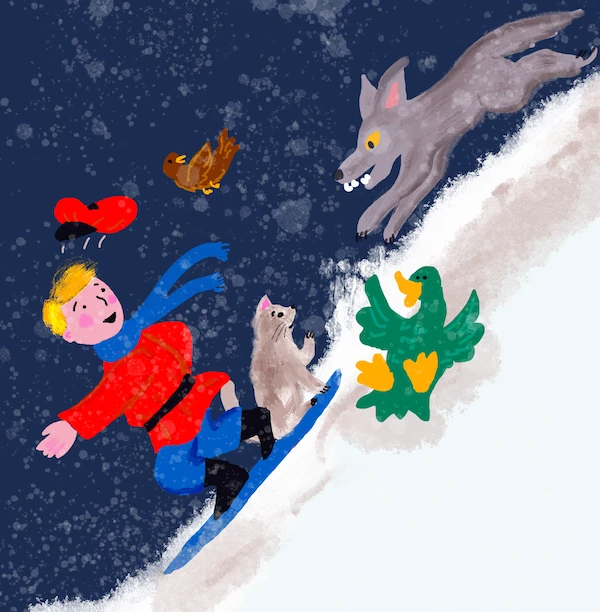
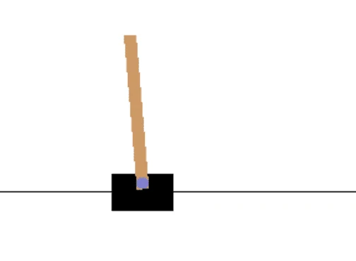
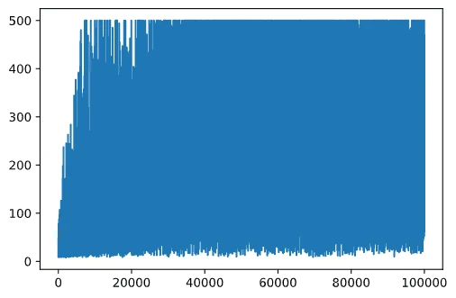
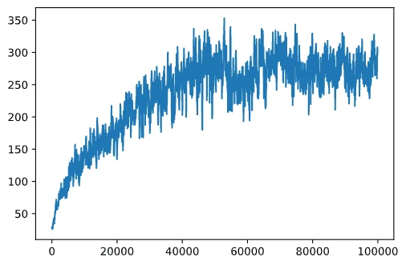

# CartPole Skating

បញ្ហាដែលយើងបានដោះស្រាយនៅមេរៀនមុនអាចនិយាយថាជាបញ្ហា​គន្លងលេង មិនពិតជាអាចប្រើប្រាស់បានសម្រាប់សេណារីយ៉ូជីវិតពិតទេ។ វាមិនមែនបែបនោះទេ ព្រោះបញ្ហាជីវិតពិតជាច្រើនក៍មានស្ថានភាពដូចគ្នានេះ សូម្បីតែការលេង Chess ឬ Go។ ពួកវាស្រដៀងគ្នា ព្រោះយើងក៏មានក្តារដូកជាមួយនឹងច្បាប់ផ្តល់ជូនហើយមាន **ស្ថានភាពប្រភេទដាច់**។

## [Pre-lecture quiz](https://ff-quizzes.netlify.app/en/ml/)

## មុខជំនួញ

នៅមេរៀននេះ យើងនឹងអនុវត្តគោលការណ៍ Q-Learning ដូចគ្នាទៅលើបញ្ហាមួយ ដែលមាន **ស្ថានភាពតាប់បន្ត** មានន័យថា ស្ថានភាពត្រូវបានផ្តល់ដោយចំនួនពិតមួយឬច្រើនជាងមួយ។ យើងនឹងដោះស្រាយបញ្ហាតទៅនេះ៖

> **បញ្ហា**៖ ប្រសិនបើ Peter ចង់គេចចេញពីខ្លា គាត់ត្រូវតែអាចចល័តបានលឿនជាងមុន។ យើងនឹងមើលថា Peter អាចរៀនលេងស្គេតបានយ៉ាងដូចម្តេច ជាពិសេស ដើម្បីរក្សាសមតុល្យ ដោយប្រើ Q-Learning។



> Peter និងមិត្តភក្តិរបស់គាត់បានប្រើិតច្នៃប្រឌិតដើម្បីគេចខ្លាចខ្លា! រូបភាពដោយ [Jen Looper](https://twitter.com/jenlooper)

យើងនឹងប្រើកំណែមួយសាមញ្ញនៃការរក្សាសមតុល្យដែលហៅថា **បញ្ហា CartPole**។ នៅក្នុងពិភព cartpole យើងមានស្លាយទ្រនិចមួយអាចផ្លាស់ទីទៅឆ្វេង ឬស្ដាំ ហើយគោលបំណងគឺរក្សាដើមដេកបញ្ឈរត្រង់លើស្លាយ។



## ការត្រៀមមុន

នៅមេរៀននេះ យើងនឹងប្រើបណ្ណាល័យមួយហៅថា **OpenAI Gym** ដើម្បីសម្រួលបរិយាកាសផ្សេងៗគ្នា។ អ្នកអាចរត់កូដមេរៀននេះនៅលើគ្រឿងរបស់អ្នក (ឧ. ពី Visual Studio Code) ដែលក្នុងករណីនេះការសម្រួលនឹងបើកក្នុងបង្អួចថ្មី។ នៅពេលរត់កូដតាមអ៊ីនធឺណិត អ្នកប្រហែលជាត្រូវតែធ្វើការកែប្រែបន្តិចទៅកូដ ដូចបានពិពណ៌នានៅ [ទីនេះ](https://towardsdatascience.com/rendering-openai-gym-envs-on-binder-and-google-colab-536f99391cc7)។

## OpenAI Gym

នៅមេរៀនមុន ច្បាប់ល្បែង និងស្ថានភាពត្រូវបានផ្តល់ដោយថ្នាក់ `Board` ដែលយើងកំណត់ដោយខ្លួនឯង។ នៅទីនេះ យើងនឹងប្រើ **បរិយាកាសសម្រួលពិសេសមួយ** ដែលនឹងសម្រួលរូបវិទ្យាលើខ្សែដេកកំពង់ផ្លាស់ទី។ មួយក្នុងចំណោមបរិយាកាសសម្រួលពេញនិយមជាងគេសម្រាប់ហ្វឹកហាត់អាល់ហ្គរីធម Q-Learning គឺហៅថា [Gym](https://gym.openai.com/) ដែលត្រូវបានគ្រប់គ្រងដោយ [OpenAI](https://openai.com/។) ដោយប្រើ យើងអាចបង្កើតបរិយាកាសផ្សេងៗចាប់ពីការសម្រួល cartpole ដល់ហ្គេម Atari។

> **Note**: អ្នកអាចមើលបរិយាកាសផ្សេងទៀតដែលអាចប្រើបានពី OpenAI Gym នៅ [ទីនេះ](https://gym.openai.com/envs/#classic_control)។

ជាដំបូង មកដំឡើង gym ហើយនាំចូលបណ្ណាល័យដែលត្រូវការ (ប្លុកកូដ ១)៖

```python
import sys
!{sys.executable} -m pip install gym 

import gym
import matplotlib.pyplot as plt
import numpy as np
import random
```

## វិចារណកម្ម - កំណត់បរិយាកាស cartpole

ដើម្បីដំណើរការជាមួយបញ្ហារក្សាសមតុល្យ cartpole យើងត្រូវតែបង្កើតបរិយាកាសឆ្លើយតប។ បរិយាកាសមួយៗភ្ជាប់នឹងៈ

- **ចន្លោះសំគាល់** សំគាល់រចនាសម្ព័ន្ធនៃព័ត៌មានដែលយើងទទួលពីបរិយាកាស។ សម្រាប់បញ្ហា cartpole យើងទទួលបានទីតាំងខ្សែដេក ល្បឿន និងតម្លៃផ្សេងៗ។

- **ចន្លោះសកម្មភាព** កំណត់សកម្មភាពដែលអាចធ្វើបាន។ នៅក្នុងករណីនេះ សកម្មភាពមានប្រភេទដាច់ ហើយមានពីរជម្រើស - **ឆ្វេង** និង **ស្ដាំ**។ (ប្លុកកូដ ២)

១. ដើម្បី initialize សូមវាយកូដដូចតទៅ៖

    ```python
    env = gym.make("CartPole-v1")
    print(env.action_space)
    print(env.observation_space)
    print(env.action_space.sample())
    ```

ដើម្បីមើលពីរបៀបដែលបរិយាកាសដំណើរការ អ្នកអាចរត់សម្រួលខ្លីមួយចំនួនសម្រាប់ជំហាន ១០០។ នៅជំហាននីមួយៗ យើងផ្តល់សកម្មភាពមួយសម្រាប់​យកអនុវត្ត - នៅក្នុងសម្រួលនេះយើងគ្រាន់តែជ្រើសសកម្មភាពដោយចៃដន្យពី `action_space`។

១. រត់កូដខាងក្រោម ហើយមើលផលប៉ះពាល់។

    ✅ ចងចាំថា ល្អជាងក្នុងការរត់កូដនេះនៅនៅលើ Python local ដើម្បីបានប្រសិទ្ធភាពល្អ! (ប្លុកកូដ ៣)

    ```python
    env.reset()
    
    for i in range(100):
       env.render()
       env.step(env.action_space.sample())
    env.close()
    ```

    អ្នកគួរតែឃើញរូបភាពដូចបង្ហាញខាងក្រោម៖

    

១. នៅពេលសម្រួល យើងត្រូវទទួលបានស្ថានភាពសម្រាប់ជ្រើសរើសសកម្មភាព។ តាមពិត មុខងារ step ធ្វើការត្រលប់នូវស្ថានភាពបច្ចុប្បន្ន មុខងារទទួលរង្ស័យមួយ និង ទង្វើតួអក្សរ done ដែលសញ្ញាថាតើត្រូវបន្តសម្រួលឬអត់៖ (ប្លុកកូដ 4)

    ```python
    env.reset()
    
    done = False
    while not done:
       env.render()
       obs, rew, done, info = env.step(env.action_space.sample())
       print(f"{obs} -> {rew}")
    env.close()
    ```

    អ្នកនឹងឃើញលទ្ធផលតែឯកទេសនៅក្នុង notebook ផ្ទៃនិចន៍៖

    ```text
    [ 0.03403272 -0.24301182  0.02669811  0.2895829 ] -> 1.0
    [ 0.02917248 -0.04828055  0.03248977  0.00543839] -> 1.0
    [ 0.02820687  0.14636075  0.03259854 -0.27681916] -> 1.0
    [ 0.03113408  0.34100283  0.02706215 -0.55904489] -> 1.0
    [ 0.03795414  0.53573468  0.01588125 -0.84308041] -> 1.0
    ...
    [ 0.17299878  0.15868546 -0.20754175 -0.55975453] -> 1.0
    [ 0.17617249  0.35602306 -0.21873684 -0.90998894] -> 1.0
    ```

    ចំណុចដែលត្រឡប់មកវិញនៅរៀងរាល់ជំហានមានតម្លៃដូចខាងក្រោម៖
    - ទីតាំងរបស់ cart
    - ល្បឿនរបស់ cart
    - មុំនៃខ្សែដេក
    - អត្រាបង្វិលនៃខ្សែដេក

១. រកតម្លៃអប្បបរមា និងអតិបរមានៃចំនួនទាំងនេះ៖ (ប្លុកកូដ ៥)

    ```python
    print(env.observation_space.low)
    print(env.observation_space.high)
    ```

    អ្នកអាចចាប់អារម្មណ៍ថាតម្លៃទទួលរង្ស័យនៅរៀងរាល់ជំហានតែងតែ ១។ នេះគឺព្រោះគោលបំណងរបស់យើងគឺរស់រានមួយរយះពេលយូរ ប&nbsp;#ប្រែទៅមុខវីជ័យដទៃមួយដែលហៅថា CartPole ដែលគេពិចារណាថាសម្រេចបាន ប្រសិនបើយើងទទួលបានផលចង់បានមធ្យម ១៩៥ នៅលើ ១០០ ជំលោះជាប់គ្នា។

## ស្ថានភាពប្រភេទដាច់

ក្នុង Q-Learning យើងត្រូវតែរៀបចំតារាង Q ដែលកំណត់តើត្រូវធ្វើអ្វីនៅក្នុងស្ថានភាពនីមួយៗ។ ដើម្បីអាចធ្វើបានអ្វីនេះ យើងត្រូវការឲ្យស្ថានភាពមានលក្ខណ: **ប្រភេទដាច់** បុណ្យទៅលម្អិតគឺ មានតម្លៃប្រភេទដាច់កំណត់ចំនួនកំណត់។ ដូច្នេះយើងត្រូវធ្វើអ្វីមួយដើម្បី **ធ្វើស្ថានភាពជាប្រភេទដាច់** ដោយផែនទីវាទៅក្បាលសំណុំស្ថានភាពកំណត់មួយ។

មានវិធីភាគច្រើនក្នុងការធ្វើនេះ៖

- **ចែកចេញទៅក្នុងកន្ត្រក**។ ប្រសិនបើយើងដឹងចន្លោះតម្លៃមួយ យើងអាចចែកចន្លោះនេះទៅជាចំនួនកន្ត្រក ហើយបន្ទាប់មកបម្លែងតម្លៃទៅជាលេខកន្ត្រកដែលវាចូលរួម។ វាអាចធ្វើបានដោយប្រើវិធី numpy [`digitize`](https://numpy.org/doc/stable/reference/generated/numpy.digitize.html)។ ក្នុងករណីនេះ យើងនឹងដឹងពីទំហំស្ថានភាពយ៉ាងច្បាស់ ពីព្រោះវាអាស្រ័យលើចំនួនកន្ត្រកដែលយើងជ្រើសរើសសម្រាប់ធ្វើ digitization។

✅ យើងអាចប្រើការប្រព្រឹត្តតាមសនិទ្ទេសផ្សេងៗដើម្បីយកតម្លៃទៅចន្លោះកំណត់ (ឧ. ពី -20 ទៅ 20) ហើយបន្ទាប់មកបម្លែងតម្លៃហ្នឹងទៅជាចំនួនគត់ដោយបូកបន្ថយ។ វាបានផ្តល់ឧបត្ថម្ភល្អវាង និង មានកំណត់តិចលើទំហំស្ថានភាព ដោយពិសេសប្រសិនបើយើងមិនដឹងពីសមាមាត្រពិតនៃតម្លៃចូល។ ឧ. ក្នុងករណីរបស់យើង ២ តម្លៃក្នុងចំនួន ៤ មិនមានព្រំដែនលើឬក្រោម ភាគច្រើននាំឲ្យមានចំនួនស្ថានភាពអនੰਤ។

ក្នុងឧទាហរណ៍របស់យើង យើងនឹងប្រើវិធីទីពីរ។ ដូចដែលអ្នកអាចមើលឃើញក្រោយនេះ ទោះបីចន្លោះលើ/ក្រោមមិនបានកំណត់ តម្លៃទាំងនេះក៍ឃើញបន្ថយក្នុងចន្លោះកំណត់មួយ ដូច្នេះស្ថានភាពដែលមានតម្លៃខ្ពស់ទាំងនេះស្ថិតនៅក្នុងករណីកាច្រើនតិច។

១. នេះជាផ្នែកមុខងារណាមួយ ដែលទទួលការសម្គាល់ពីម៉ូដែលរបស់យើង ហើយបង្កើតជាស៊ុមក្រុម ៤ ពីតម្លៃعددគត់៖ (ប្លុកកូដ ៦)

    ```python
    def discretize(x):
        return tuple((x/np.array([0.25, 0.25, 0.01, 0.1])).astype(np.int))
    ```

១. យើងមកសាកល្បងវិធីផ្សេងមួយផ្សេងទៀតសម្រាប់ការបម្លែងប្រភេទដោយប្រើ bin៖ (ប្លុកកូដ ៧)

    ```python
    def create_bins(i,num):
        return np.arange(num+1)*(i[1]-i[0])/num+i[0]
    
    print("Sample bins for interval (-5,5) with 10 bins\n",create_bins((-5,5),10))
    
    ints = [(-5,5),(-2,2),(-0.5,0.5),(-2,2)] # ប្រើរយៈពេលនៃតម្លៃសម្រាប់ប៉ារ៉ាម៉ែត្រនីមួយៗ
    nbins = [20,20,10,10] # ចំនួនប្រអប់សម្រាប់ប៉ារ៉ាម៉ែត្រនីមួយៗ
    bins = [create_bins(ints[i],nbins[i]) for i in range(4)]
    
    def discretize_bins(x):
        return tuple(np.digitize(x[i],bins[i]) for i in range(4))
    ```

១. យើងចាប់ផ្តើមរត់សម្រួលខ្លី ហើយមើលតម្លៃបរិយាកាសប្រភេទដាច់ទាំងនេះ។ អ្នកអាចសាកល្បងទាំង `discretize` និង `discretize_bins` ដើម្បីមើលថាតើមានភាពខុសគ្នាឬអត់។

    ✅ discretize_bins បង្ហាញលេខ bin ដែលគិតចាប់ពី 0 ។ ដូច្នេះចំពោះតម្លៃនៅចន្លោះនៅជុំវិញ 0 វាក៏បញ្ចេញលេខពីចន្លោះកណ្តាលនៃចន្លោះ (10)។ នៅក្នុង discretize យើងមិនគិតពីជួរតម្លៃនៃលទ្ធផល ដែលអនុញ្ញាតឲ្យវា អាចមានតម្លៃអវិជ្ជមាន ហ្នឹងស្ថានភាពមិនត្រូវបានផ្លាស់ទី ហើយ 0 ត្រូវនឹង 0។ (ប្លុកកូដ ៨)

    ```python
    env.reset()
    
    done = False
    while not done:
       #env.render()
       obs, rew, done, info = env.step(env.action_space.sample())
       #បោះពុម្ភ discretize_bins(obs)
       print(discretize(obs))
    env.close()
    ```

    ✅ អាចដកចេញបន្ទាត់ដែលចាប់ផ្តើមជាមួយ env.render បើអ្នកចង់មើលពីរបៀបដែលបរិយាកាសដំណើរការ។ បើមិនដូច្នេះ អ្នកអាចរត់វាក្រោមផ្ទាំងក្រោយបន្ទប់ ដែលរហ័សជាង។ យើងនឹងប្រើការជាអាថ៍កំបាំងនេះក្នុងដំណាក់កាល Q-Learning របស់យើង។

## រចនាសម្ព័ន្ធ Q-Table

នៅមេរៀនមុន ស្ថានភាពគឺជាគូលេខសាមញ្ញ 0 ដល់ 8 ដូច្នោះវាស្រួលក្នុងការបង្ហាញ Q-Table ជារូបភាព numpy tensor ទំហំ 8x8x2។ ប្រសិនបើយើងប្រើ bin discretization ទំហំវ៉ិចទ័រស្ថានភាពក៏ត្រូវបានកំណត់ហើយ ដូច្នេះយើងអាចប្រើវិធីដូចគ្នា ទំនាក់ទំនងស្ថានភាពជាអារេ 20x20x10x10x2 (2 គឺជាមាត្រដ្ឋានសកម្មភាព ហើយទំហំដំបូងបង្ហាញពីចំនួន bin ដែលយើងបានជ្រើស សម្រាប់ប៉ារ៉ា៉ម៉ែត្រនៅចន្លោះសំគាល់)។

ប៉ុន្ដែពេលខ្លះ បរិមាណត្រឹមត្រូវរបស់ចន្លោះសម្រួលមិនត្រូវបានស្គាល់។ ក្នុងករណីមុខងារ `discretize` យើងមិនអាចប្រាកដថាស្ថានភាពនៅក្នុងដែនកំណត់មួយ ព្រោះតម្លៃដើមខ្លះមិនមានព្រំដែន។ ដូច្នេះ យើងនឹងប្រើវិធីខុសបន្តិច ដោយបង្ហាញ Q-Table ជាថតកំនត់ឈ្មោះ (dictionary)។

១. ប្រើគូ *(state,action)* ជារឹងគន្លង key តាម(dictionary) ហើយតម្លៃនឹងត្រូវបង្ហាញ Q-Table នៅចំណុចនោះ (ប្លុកកូដ ៩)

    ```python
    Q = {}
    actions = (0,1)
    
    def qvalues(state):
        return [Q.get((state,a),0) for a in actions]
    ```

    នៅទីនេះ យើងកំណត់មុខងារ `qvalues()`, ដែលត្រឡប់បញ្ជីតម្លៃតារាង Q សម្រាប់ស្ថានភាពមួយសម្រាប់ឥរិយាបថដែលអាចកើតមាន។ បើមិនមាន ចំណុចនៅក្នុង Q-Table គឺត្រឡប់ទៅ 0 ជាមានប្រយោជន៍។

## ចាប់ផ្តើម Q-Learning

ឥឡូវនេះ យើងត្រៀមខ្លួនសម្រាប់បង្រៀន Peter រក្សាសមតុល្យ!

១. ជាមុន សូមកំណត់​ភាពផ្តោតចិត្តខ្លះៗ៖ (ប្លុកកូដ ១០)

    ```python
    # ប៉ារ៉ាម៉ែត្រខ្ពស់
    alpha = 0.3
    gamma = 0.9
    epsilon = 0.90
    ```

    នៅទីនេះ `alpha` គឺជា **អត្រានៃការរៀន** ដែលកំណត់ថាយើងត្រូវកែប្រែតម្លៃ Q-Table បច្ចុប្បន្នប៉ុន្មាន នៅរៀងរាល់ជំហាន។ នៅមេរៀនមុនយើងចាប់ផ្តើមពី 1 បន្ទាប់មកកាត់បន្ថយ `alpha` ទៅតម្លៃតិចៗក្នុងដំណាក់កាលហ្វឹកហាត់។ នៅឧទាហរណ៍នេះ យើងនឹងរក្សាវាជាពិសេស សម្រាប់ភាពសាមញ្ញ ហើយអ្នកអាចសាកល្បងកំណត់តម្លៃ alpha ពីក្រោយបាន។

    `gamma` គឺជា **តែវាដែលបញ្ចុះតម្លៃ** បង្ហាញពីការបញ្ញើសំរាប់កម្រិតការប្រមូលរង្ស័យក្នុងអនាគត ក្រែងលើរង្ស័យបច្ចុប្បន្ន។

    `epsilon` គឺជា **មូលហេតុសម្រាប់ការទេសត/ប្រើប្រាស់** ដែលកំណត់ថាតើយើងធ្វើការស្វែងរក (exploration) ឬប្រើប្រាស់តម្លៃដែលយើងបានរៀនមកហើយ (exploitation)។ ក្នុងអាល់ហ្គរីធមីរបស់យើង នៅ `epsilon` ភាគរយនៃករណី យើងជ្រើសសកម្មភាពតាមតារាង Q និងនៅករណីសល់ យើងជ្រើសសកម្មភាពដោយចៃដន្យ។ វានឹងអនុញ្ញាតឲ្យយើងស្វែងរកតំបន់នៅលើលំហរកំណត់ដែលមិនដែលបានឃើញពីមុន។

    ✅ សម្រាប់ការរក្សាសមតុល្យ - ជ្រើសសកម្មភាពចៃដន្យ (exploration) គឺអាចដូចជាការវាយចៃដន្យទៅខ្យល់ខុស គ្នា ហើយខ្សែគួរតែរៀនវិធីកំណត់សមតុល្យពីកង្វះខាតទាំងនេះ។

### ពង្រឹងអាល់ហ្គរីធមី

យើងក៏អាចធ្វើការកែលម្អពីរយ៉ាងចំរូងមកលើអាល់ហ្គរីធមីពីមេរៀនមុន៖

- **គណនាភាពមធ្យមរង្ស័យចងក្រង** អំពីរ៉ាចំនួនជាច្រើននៃការសម្រួល។ យើងនឹងបោះពុម្ពវាថា ទៅជារឿយៗរៀងរាល់ ៥០០០ ជំលោះ ហើយយើងនឹងទទួលបានរង្ស័យមធ្យមចងក្រងលើរយៈពេលនោះ។ មានន័យថាបើយើងទទួលបានជាង ១៩៥ ពិន្ទុ យើងអាចគិតថាបញ្ហាទទួលបានការដោះស្រាយ បទពិសោធអាចខ្ពស់ជាងគេដែលត្រូវបានដាក់ស្នើ។

- **គណនាពិន្ទុមធ្យមចងក្រងអតិបរមា** `Qmax`, ហើយយើងនឹងរក្សាទុក Q-Table ដែលទាក់ទងនឹងលទ្ធផលនោះ។ នៅពេលអ្នករត់ហ្វឹកហាត់ អ្នកនឹងកត់សម្គាល់ថា ពេលខ្លះលទ្ធផលមធ្យមចងក្រងចាប់ផ្តើមធ្លាក់ចុះ ហើយយើងចង់រក្សាតម្លៃ Q-Table ដែលពាក់ព័ន្ធនឹងម៉ូដែលល្អបំផុតដែលបានសង្កេតឃើញក្នុងដំណាក់កាលហ្វឹកហាត់។

១. សូមប្រមូលរង្ស័យចងក្រងទាំងអស់នៅរៀងរាល់ជំហានសម្រួលទៅក្នុងវ៉ិចទ័រ `rewards` សម្រាប់ការគូរជាបន្ទាប់។ (ប្លុកកូដ ១១)

    ```python
    def probs(v,eps=1e-4):
        v = v-v.min()+eps
        v = v/v.sum()
        return v
    
    Qmax = 0
    cum_rewards = []
    rewards = []
    for epoch in range(100000):
        obs = env.reset()
        done = False
        cum_reward=0
        # == ចាប់ផ្តើមសមួង ==
        while not done:
            s = discretize(obs)
            if random.random()<epsilon:
                # ការប្រើប្រាស់ - ជ្រើសរើសសកម្មភាពអាមឯកតាមប្រូបាប Q-តារាង
                v = probs(np.array(qvalues(s)))
                a = random.choices(actions,weights=v)[0]
            else:
                # ការស្វែងរក - ជ្រើសរើសសកម្មភាពដោយចៃដន្យ
                a = np.random.randint(env.action_space.n)
    
            obs, rew, done, info = env.step(a)
            cum_reward+=rew
            ns = discretize(obs)
            Q[(s,a)] = (1 - alpha) * Q.get((s,a),0) + alpha * (rew + gamma * max(qvalues(ns)))
        cum_rewards.append(cum_reward)
        rewards.append(cum_reward)
        # == បោះពុម្ពលទ្ធផលប្រចាំពេលហើយគណនារង្វាន់មធ្យម ==
        if epoch%5000==0:
            print(f"{epoch}: {np.average(cum_rewards)}, alpha={alpha}, epsilon={epsilon}")
            if np.average(cum_rewards) > Qmax:
                Qmax = np.average(cum_rewards)
                Qbest = Q
            cum_rewards=[]
    ```

អ្វីដែលអ្នកអាចគិតស្រមៃពីលទ្ធផលទាំងនេះ៖

- **ជិតដល់គោលបំណង**។ យើងជិតដល់គោលបំណងក្នុងការទទួលបាន ១៩៥ រង្ស័យចងក្រងលើការប្រតិបត្តិ ១០០+ ផ្តាច់មុខឬយើងប្រហែលជាទទួលបានហើយ! ទោះបីជាលទ្ធផលតិចក៏ដោយ យើងមិនដឹងទេ ពីព្រោះយើងគណនាមធ្យមលើការរត់ ៥០០០ ហើយត្រូវការប្រតិបត្តិ ១០០ ។ ។

- **រង្ស័យចាប់ផ្តើមចុះ**។ ពេលខ្លះ រង្ស័យចាប់ផ្តើមធ្លាក់ បង្ហាញថាយើងអាច "បំផ្លាញ" តម្លៃដែលបានរៀនហើយនៅក្នុង Q-Table ជាមួយតម្លៃដែលធ្វើឲ្យស្ថានភាពកាន់តែអាក្រក់។

ការសង្កេតនេះមានភាពច្បាស់ជាង នៅពេលយើងគូរអភិវឌ្ឍន៍នៃការហ្វឹកហាត់។

## រូបភាពអភិវឌ្ឍន៍ការហ្វឹកហាត់

ខណៈពេលហ្វឹកហាត់ យើងបានយកតម្លៃរង្ស័យចងក្រងនៅរៀងរាល់ជំលោះទៅក្នុងវ៉ិចទ័រ `rewards`។ នេះជារូបភាពនៃវាដែលធ្វើជាក្រាបជាមួយលេខជំលោះ៖

```python
plt.plot(rewards)
```



ពីក្រាបនេះ មិនអាចប្រាប់អ្វីបានទេ ព្រោះដោយសារតែធម្មជាតិនៃដំណើរការហ្វឹកហាត់ stochastic ប្រវែងរបស់វគ្គហ្វឹកហាត់ផ្សេងគ្នា។ ដើម្បី​ធ្វើឲ្យមាន​អារម្មណ៍ល្អជាងនេះ យើងអាចគណនាមធ្យមរត់ជាមួយនឹងករណីជាច្រើន ដូចជា១០០។ វាអាចធ្វើបានដោយងាយស្រួលជាមួយ `np.convolve`: (ប្លុកកូដ ១២)

```python
def running_average(x,window):
    return np.convolve(x,np.ones(window)/window,mode='valid')

plt.plot(running_average(rewards,100))
```



## ការផ្លាស់ប្តូរពណ៌អំបូង

ដើម្បីធ្វើឲ្យការរៀនមានស្ថេរភាព ចំនុចមួយМаЕнហចាំត្រូវបានប្តូរបន្តិចក្នុងដំណាក់កាលហ្វឹកហាត់។ ជាពិសេសៈ

- **សម្រាប់អត្រារៀន** `alpha` អាចចាប់ផ្តើមជាមួយតម្លៃជិត 1 ហើយបន្តការកាត់បន្ថយជាបន្តបន្ទាប់។ ជាមួយពេលវេលា យើងនឹងទទួលបានតម្លៃប្រតិបត្តិល្អក្នុង Q-Table ហើយគួរតែធ្វើការកែប្រែតិចតួច មិនមែនលុបទាំងស្រុងជាមួយតម្លៃថ្មីទេ។

- **បន្ថែម epsilon**។ យើងអាចចង់បន្ថែម `epsilon` យឺតៗ ដើម្បីស្វែងរកតិច និងប្រើប្រាស់ច្រើនជាងមុន។ វាហាក់ដូចជាងសមស្របចាប់ផ្តើមជាមួយតម្លៃតិចនៃ `epsilon` ហើយលេចមកដល់ប្រហែល 1។

> **Task 1**: លេងជាមួយតម្លៃ hyperparameter ហើយមើលថាតើអ្នកអាចទទួលបានរង្ស័យចងក្រងខ្ពស់ជាងមុន។ តើអ្នកទទួលបានលើស ១៩៥ ទេ?
> **Task 2**: ដើម្បីដោះស្រាយបញ្ហាផ្លូវការយ៉ាងត្រឹមត្រូវ អ្នកត្រូវការទទួលបានរង្វាន់មធ្យម ១៩៥ ក្នុងចន្លោះ ១០០ ដងរត់ជាប់គ្នា។ វាស់វែងវាក្នុងអំឡុងពេលបណ្តុះបណ្តាល ហើយធ្វើអោយប្រាកដថាអ្នកបានដោះស្រាយបញ្ហាផ្លូវការយ៉ាងត្រឹមត្រូវ!

## មើលលទ្ឋផលក្នុងសកម្មភាព

វានឹងគួរឲ្យចាប់អារម្មណ៍ក្នុងការមើលការប្រព្រឹត្តទៅរបស់គំរូដែលបានបណ្តុះបណ្តាល។ ចាប់ផ្តើមរត់សកម្មភាពពិត និងអនុវត្តយុទ្ធសាស្រ្តជ្រើសរើសសកម្មភាពដូចក្នុងអំឡុងបណ្តុះបណ្តាល ដោយសេងតាមចែកចាយប្រតិបត្តិការជាប្រាក់ប្រមាណនៅក្នុងតារាង Q: (khối mã 13)

```python
obs = env.reset()
done = False
while not done:
   s = discretize(obs)
   env.render()
   v = probs(np.array(qvalues(s)))
   a = random.choices(actions,weights=v)[0]
   obs,_,done,_ = env.step(a)
env.close()
```
  
អ្នកគួរតែឃើញអ្វីមួយដូចខាងក្រោមនេះ៖


---

## 🚀បញ្ហាប្រឈម

> **Task 3**: នៅទីនេះ យើងកំពុងប្រើច្បាប់ចុងក្រោយនៃតារាង Q ដែលប្រហែលជាមិនមែនល្អបំផុតឡើយ។ ចាំថាយើងបានរក្សាទុកតារាង Q ដែលមានប្រសិទ្ធភាពល្អបំផុតនៅក្នុងអថេរ `Qbest`! សាកល្បងឧទាហរណ៍ដដែលនេះជាមួយតារាង Q ដែលមានប្រសិទ្ធភាពល្អបំផុតដោយចម្លង `Qbest` ទៅ `Q` ហើយមើលថាអ្នកតើយល់ឃើញខុសគ្នាឬទេ។

> **Task 4**: នៅទីនេះ យើងមិនបានជ្រើសរើសសកម្មភាពល្អបំផុតក្នុងជំហាននិមួយៗទេ ប៉ុន្តែបញ្ចូលការសេងតាមចែកចាយប្រតិបត្តិការដែលបានផ្គូរផ្គង។ តើវានឹងមានហេតុផលប្រសើរជាងមុនក្នុងការជ្រើសរើសសកម្មភាពល្អបំផុតជានិច្ច ដែលមានតម្លៃ Q-Table ខ្ពស់បំផុតមែនទេ? អាចធ្វើបានដោយប្រើមុខងារ `np.argmax` ដើម្បីរកលេខសកម្មភាពដែលសមស្របនឹងតម្លៃ Q-Table ខ្ពស់បំផុត។ អនុវត្តយុទ្ធសាស្រ្តនេះ និងមើលថាវាបង្កើនលទ្ធផលការរក្សាសមតុល្យរបស់យើងទេ។

## [ប្រលងក្រោយមេរៀន](https://ff-quizzes.netlify.app/en/ml/)

## ការងារ
[បណ្តុះបណ្តាលរថយន្តភ្នំ](assignment.md)

## សេចក្ដីសន្និដ្ឋាន

ឥឡូវនេះយើងបានរៀនពីវិធីបណ្ដុះបណ្តាលភ្នាក់ងារដើម្បីទទួលបានលទ្ធផលល្អ ដោយផ្តល់មុខងាររង្វាន់ដែលកំណត់រដ្ឋភាពដែលចង់បាន សម្រាប់ហ្គេម និងផ្តល់ឱកាសឲ្យពួកគេចុះសូមតាមដានការស្រាវជ្រាវក្នុងលំហស្វែងរកយ៉ាងមានឆន្ទៈ។ យើងបានអនុវត្តអាល់ហ្គរីធម Q-Learning ដោយជោគជ័យក្នុងករណីបរិយាកាសជាបន្ត និងបញ្ឈរ ដែលមានសកម្មភាពបញ្ឈរប៉ុណ្ណោះ។

វាសំខាន់ផងដែរដើម្បីសិក្សា ស្ថានភាពដែលរដ្ឋភាពសកម្មភាពក៏ជាបន្ត និងពេលដែលលំហសំឡេងសង្កត់មានភាពស្មុគស្មាញជាងនេះ ដូចជារូបភាពពីអេក្រង់ហ្គេម Atari។ ក្នុងបញ្ហាទាំងនោះ យើងតែងតែត្រូវការប្រើបច្ចេកទេសខ្លាំងជាងក្នុងការសិក្សាគ្រឿងម៉ាស៊ីន ដូចជា បណ្តាញសារធាតុកោសិកា neural networks ដើម្បីទទួលបានលទ្ធផលល្អ។ បញ្ហាស្មុគស្មាញជាងនេះជាគោលបំណងនៃវគ្គសិក្សា AI លំដាប់ខ្ពស់ជាងមួយដែលយើងនឹងបើកសិក្សាផ្សេងទៀត។

---

<!-- CO-OP TRANSLATOR DISCLAIMER START -->
**ការព្រមាន**:  
ឯកសារនេះត្រូវបានបកប្រែដោយប្រើសេវាបកប្រែ AI [Co-op Translator](https://github.com/Azure/co-op-translator)។ ទោះយើងខំប្រឹងប្រែងរកការត្រឹមត្រូវ ប៉ុន្តែសូមយល់ថាការបកប្រែដោយម៉ាស៊ីនអាចមានកំហុស ឬការខ្វះខាតខ្លះៗ។ ឯកសារដើមដែលមានភាសាតំណើរការដើមគួរត្រូវបានទទួលស្គាល់ជាផ្នែកដើមដែលមានសុពលភាព។ សម្រាប់ព័ត៌មានសំខាន់ៗ មេរៀនបកប្រែដោយអ្នកជំនាញផ្នែកមនុស្សគឺត្រូវបានណែនាំ។ យើងមិនទទួលខុសត្រូវចំពោះការយល់ច្រឡំ ឬការបកស្រាយខុសពីការប្រើប្រាស់បកប្រែនេះឡើយ។
<!-- CO-OP TRANSLATOR DISCLAIMER END -->