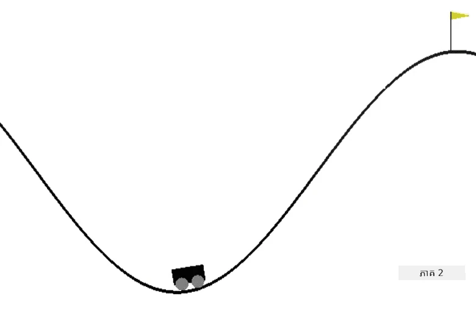

# បង្រៀន gaរថយន្តភ្នំ

[OpenAI Gym](http://gym.openai.com) ត្រូវបានបង្កើតឡើងនូវរបៀបដែលបរិយាកាសទាំងអស់ផ្តល់នូវ API ដូចគ្នា - នេះគឺមានន័យថាវិធីសាស្រ្តដូចគ្នា `reset`, `step` និង `render` និង abstractions ដូចគ្នានៃ **action space** និង **observation space** ។ ដូច្នេះគួរតែអាចធ្វើការ​កែប្រែ algorithm ការរៀនបង្រៀនជាប្រព័ន្ធ reinforcement ដើម្បីសម្របសម្រួលជាមួយបរិយាកាសផ្សេងៗបានដោយផ្លាស់ប្តូរកូដតិចតួចបំផុត។

## បរិយាកាសកាប្រាក់ភ្នំ

[បរិយាកាសកាប្រាក់ភ្នំ](https://gym.openai.com/envs/MountainCar-v0/) មានរថយន្តមួយរុះរទេះចងក្នុងទូកចុះជល់៖

គោលបំណងគឺត្រូវចេញពីទូកចុះជល់ និងចាប់ទង់ជោគ ជាមួយធ្វើសកម្មភាពមួយក្នុងចំណោមចុះនៅហើយក្នុងនីតិវិធី៖

| តម្លៃ | អត្ថន័យ |
|---|---|
| 0 | ជំរុញទៅខាងឆ្វេង |
| 1 | មិនជំរុញទេ |
| 2 | ជំរុញទៅខាងស្ដាំ |

ល្បិចសំខាន់របស់បញ្ហានេះគឺ ម៉ាស៊ីនរថយន្តមិនមានកម្លាំងគ្រប់គ្រាន់ដើម្បីឡើងភ្នំក្នុងលើកតែមួយទេ។ ដូច្នេះ វិធីតែម្ដងត្រូវបើកបរទៅមកដើម្បីបង្កើតចលនា momentum។

ផាសពិចារណា observation មានតែក្នុង 2 តម្លៃប៉ុណ្ណោះ៖

| លេខ | ការសង្កេត | ទាបបំផុត | អតិបរមា |
|-----|--------------|-----|-----|
|  0  | ទីតាំងរថយន្ត | -1.2| 0.6 |
|  1  | ល្បឿនរថយន្ត | -0.07 | 0.07 |

ប្រព័ន្ធរង្វាន់សម្រាប់រថយន្តភ្នំនេះពិបាកខ្លាំង៖

 * រង្វាន់ 0 នឹងផ្ដល់ប្រសិនបើភ្នាក់ងារមកដល់ទង់ជោគ (ទីតាំង = 0.5) នៅលើយូរភ្នំ។
 * រង្វាន់ -1 នឹងផ្ដល់ប្រសិនបើទីតាំងនៃភ្នាក់ងារតិចជាង 0.5។

ករណីចប់នៃ episode គឺប្រសិនបើទីតាំងរថយន្តលើស 0.5 ឬរយៈពេល episode ធំជាង 200។
## សេចក្តីណែនាំ

កែប្រែ algorithm ការរៀនបង្រៀនរបស់យើងដើម្បីដោះស្រាយបញ្ហារថយន្តភ្នំ។ ចាប់ផ្តើមពីកូដបច្ចុប្បន្ន [notebook.ipynb](notebook.ipynb) ប្តូរបរិយាកាសថ្មី ប្ដូរមុខងារដែលបំបែកស្ថានភាព ហើយព្យាយាមធ្វើឱ្យ algorithm មានសមត្ថភាពហ្វឹកហាត់ជាមួយកូដកែប្រែតិចតួច។ បង្កើតជាប្រសើរឡើងដោយកែប៉ារ៉ាម៉ែត្រ hyperparameters។

> **ចំណាំ**: ចំណាត់ថ្នាក់ hyperparameters គឺយ៉ាងហោចណាស់ត្រូវការដើម្បីឱ្យ algorithm ធ្វើការ convergence។ 
## ប្រភេទពិន្ទុ

| លេខសម្គាល់ | ល្អឆ្នើម | ធ្វើបាន | ត្រូវកែលម្អ |
| -------- | --------- | -------- | ----------------- |
|          | algorithm Q-Learning ត្រូវបានអនុវត្តដោយជោគជ័យពីឧទាហរណ៍ CartPole ដោយកាត់បន្ថយកូដ ត្រូវបានអាចដោះស្រាយបញ្ហាចាប់ទង់ក្រោម 200 ជំហាន។ | អនុវត្ត algorithm ថ្មី Q-Learning ពីអ៊ីនធឺណិត ដែលមានឯកសារល្អ; ឬ algorithm បច្ចុប្បន្នត្រូវបានចំណាយ ប៉ុន្តែគ្មានលទ្ធផលដែលចង់បាន | និស្សិតមិនអាចអនុវត្ត algorithm ផ្សេងទេ ប៉ុន្តែបានធ្វើជំហាន់សំខាន់ទៅកាន់ដំណោះស្រាយ (អនុវត្តបំបែកស្ថានភាព, សង់រចនាសម្ព័ន្ធទិន្នន័យ Q-Table, ល។) |

---

<!-- CO-OP TRANSLATOR DISCLAIMER START -->
**ការបោះហេតុ**៖
ឯកសារនេះត្រូវបានបកប្រែក្នុងការប្រើសេវាកម្មបកប្រែ AI [Co-op Translator](https://github.com/Azure/co-op-translator)។ ទោះយើងខ្ញុំខិតខំដើម្បីមានភាពត្រឹមត្រូវ ក៏ដោយសូមយកចិត្តទុកដាក់ថាការបកប្រែដោយស្វ័យប្រវត្តិក្នុងពេលខ្លះអាចមានកំហុស ឬភាពមិនត្រឹមត្រូវ។ ឯកសារដើមក្នុងភាសាមាតុភាគគួរត្រូវបានយល់ព្រមជាក្រុមហ៊ុនស្របច្បាប់។ សម្រាប់ព័ត៌មានសំខាន់ៗ ការបកប្រែដោយមនុស្សវិជ្ជាជីវៈត្រូវបានផ្តល់អនុសាសន៍។ យើងខ្ញុំមិនទទួលបន្ទុកចំពោះការយល់ច្រឡំនឹង ឬការបកស្រាយខុសៗអ្វីដែលកើតឡើងពីការប្រើប្រាស់ការបកប្រែនេះឡើយ។
<!-- CO-OP TRANSLATOR DISCLAIMER END -->