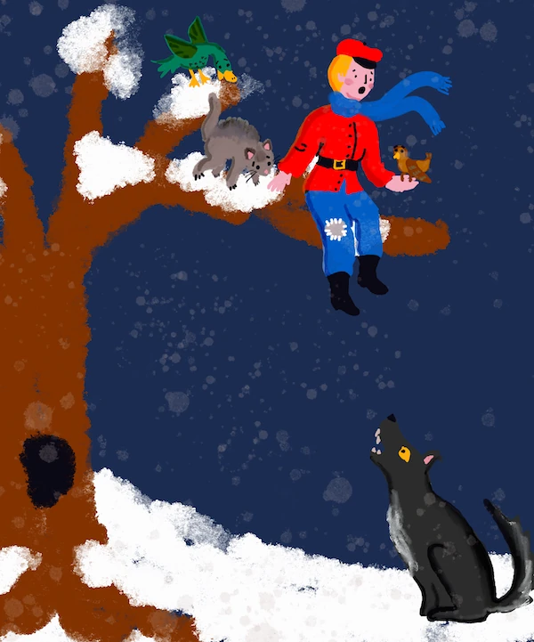

# ការណែនាំអំពីការរៀនបង្រៀនវិញ

ការរៀនបង្រៀនវិញ (Reinforcement learning, RL) ត្រូវបានគេឃើញថា ជាម៉ូដែលមួយមូលដ្ឋាននៃការសិក្សា機械មួយចំនួន ហើយវាស្ថិតនៅជាប់ជាមួយការរៀនគ្រប់គ្រង (supervised learning) និងការរៀនអតិផរណា (unsupervised learning)។ RL គឺផ្តោតលើការសម្រេចចិត្ត៖ ផ្តល់នូវការសម្រេចចិត្តត្រឹមត្រូវ ឬយ៉ាងហោចណាស់ រៀនពីការសម្រេចចិត្តទាំងនោះ។

ស្រមៃថាអ្នកមានបរិយាកាសសម្រួលមួយ ដូចជា​ទីផ្សារហ៊ុន។ តើតើមានអ្វីកើតឡើងបើអ្នកកំណត់ច្បាប់ណាមួយ? តើវាមានផលវិបាកវិជ្ជមាន ឬអវិជ្ជមាន? ប្រសិនបើមានអ្វីមិនល្អកើតឡើង អ្នកត្រូវប្រើប្រាស់ _ការចាត់វិជ្ជមានអវិជ្ជមាន_ នោះ រៀនពីវា និងផ្លាស់ប្តូរតាមស្ថានភាព។ ប្រសិនបើវាមានលទ្ធផលវិជ្ជមាន អ្នកត្រូវតែសាងសង់លើ _ការចាត់វិជ្ជមានវិជ្ជមាន_ នោះ។

> ពីតែរ និងមិត្តភក្តិរបស់គាត់ត្រូវរត់រួចពីខ្យងឃ្លាន! រូបភាពដោយ [Jen Looper](https://twitter.com/jenlooper)

## ប្រធានបទតំបន់៖ ពីតែរ និងខ្យង (រុស្ស៊ី)

[Peter and the Wolf](https://en.wikipedia.org/wiki/Peter_and_the_Wolf) គឺជាការប្រលោមលោកតន្ត្រីដែលបានសរសេរដោយអ្នកនិពន្ធតន្ត្រីរុស្ស៊ី [Sergei Prokofiev](https://en.wikipedia.org/wiki/Sergei_Prokofiev)។ វាជា​រឿងដែលពាក់ព័ន្ធនឹងពីតែរ​ចម្លាក់ម្នាក់ ដែលវាយតំ់ដង់ចេញពីផ្ទះដើម្បីចុចខ្យងនៅក្នុងព្រៃចំការ។ នៅក្នុងផ្នែកនេះ យើងនឹងបង្រៀន​អាល់ហ្គោរីធម៌​សិក្សា機械 ដែលនឹងជួយពីតែរ៖

- **ស្វែងរក** ទីតាំងជុំវិញនិងបង្កើតផែនទីផ្លូវវាលល្អបំផុត
- **រៀន** របៀបប្រើស្គេតប៊ត់ និងតម្រូវតុល្យភាពលើវា ដើម្បីអាចធ្វើចលនាបានរហ័សជាងមុន។

> 🎥 ចុចរូបភាពខាងលើដើម្បីស្តាប់ពី Peter and the Wolf ដោយ Prokofiev

## ការរៀនបង្រៀនវិញ

នៅក្នុងផ្នែកមុនៗ អ្នកបានឃើញឧទាហរណ៍ពីបញ្ហាសិក្សា機械ពីរប្រភេទ៖

- **គ្រប់គ្រង (Supervised)** ដែលយើងមានឌាតាសែតដែលផ្ដល់ដំណោះស្រាយសំណុំដែលយើងចង់​ដោះស្រាយ។ [ការ​ចែងចម្រាស់​ប្រភេទ](../4-Classification/README.md) និង [ការ​ប៉ាន់ប្រមាណ](../2-Regression/README.md) គឺជាការងារ​សិក្សាគ្រប់គ្រង។
- **អតិផរណា (Unsupervised)** ដែលយើងមិនមានទិន្នន័យបង្ហាញមុខទេ។ ឧទាហរណ៍ដ៏សំខាន់របស់ការរៀនអតិផរណាគឺ [ការច្នៃ](../5-Clustering/README.md)។

នៅក្នុងផ្នែកនេះ យើងនឹងណែនាំអ្នកអំពីបញ្ហារបៀបសិក្សា​ថ្មីមួយ ដែលមិនត្រូវការទិន្នន័យបង្ហាញមុខ។ មានបញ្ហាច្រើនប្រភេទដូចជា៖

- **[ការរៀនបង្រៀនបែកកន្លះ (Semi-supervised learning)](https://wikipedia.org/wiki/Semi-supervised_learning)** ដែលយើងមានទិន្នន័យមិនបានបង្ហាញមុខច្រើន ដែលអាចប្រើសម្រាប់បណ្តុះម៉ូដែលជាមុន។
- **[ការរៀនបង្រៀនវិញ (Reinforcement learning)](https://wikipedia.org/wiki/Reinforcement_learning)** ដែលភ្នាក់ងារសិក្សារបៀបធ្វើឱ្យបានល្អតាមរយៈការធ្វើតេស្តនៅក្នុងបរិយាកាសសម្រួលមួយ។

### ឧទាហរណ៍ - លេងហ្គេមកុំព្យូទ័រ

ស giảថាអ្នកចង់បង្រៀនកុំព្យូទ័រឱ្យលេងហ្គេមមួយ ដូចជា ឡូកហ្គេមខ្មែរ, ឬ [Super Mario](https://wikipedia.org/wiki/Super_Mario)។ ក្នុងការឲ្យកុំព្យូទ័រលេងហ្គេមមួយ អ្នកត្រូវអោយវាព្យាករណ៍ថាដំណកដើម្បីធ្វើនៅក្នុងស្ថានភាពហ្គេមមួយម្ដងៗ។ ខណៈពេលវាព្យាយាមទៅដូចជាបញ្ហាចែងចម្រាស់ ប្រសិនបើយើងមិនមានឌាតាសែតជាមួយស្ថានភាព និងសកម្មភាពផ្តល់ទេ។ ខណៈពេលយើង​ទំនងមានទិន្នន័យពីការប្រកួតហ្គេមឡាចថ្មីឬក៏វីដេអួបញ្ញើ Super Mario ក៏ប៉ុន្តែ ទិន្នន័យនោះខណៈពេលមិនគ្របដណ្តប់បានគ្រប់ស្ថានភាព។

ផ្ទុយទៅវិញក្នុងករណីនេះ **ការរៀនបង្រៀនវិញ** (RL) អាស្រ័យលើគំនិតថា *ធ្វើឱ្យកុំព្យូទ័រលេង* ជាញឹកញាប់ និងមើលលទ្ធផល។ ដូច្នេះ ដើម្បីអនុវត្តការរៀនបង្រៀនវិញ យើងត្រូវការចាំបាច់ពីររបស់៖

- **បរិយាកាសមួយ** និង **ម៉ូដែលសម្រួលមួយ** ដែលអនុញ្ញាតឱ្យយើងលេងហ្គេមបានជាច្រើនដង។ ម៉ូដែលនេះនឹងកំណត់ច្បាប់ហ្គេមទាំងអស់ ព្រមទាំងស្ថានភាព និងសកម្មភាពដែលអាចកើតមាន។

- **មុខងារប្រាក់រង្វាន់**, ដែលនឹងប្រាប់យើងថាយើងបានធ្វើបានល្អប៉ុនណាក្នុងមួយចលនា ឬមួយហ្គេម។

ភាពខុសគ្នាចម្បងរវាងប្រភេទសិក្សា機械ផ្សេងទៀត និង RL គឺថា នៅក្នុង RL យើងមិនស្គាល់ទេថាយើងឈ្នះ ឬ ខាតរហូតដល់ចប់ហ្គេម។ ដូចនេះ យើងមិនអាចពិចារណាថាចលនាមួយឯងមានលក្ខណៈល្អ ឬ មិនល្អទេ - យើងទទួលបានរង្វាន់នៅចុងហ្គេមតែប៉ុណ្ណោះ។ គោលបំណងរបស់យើងគឺបង្កើតអាល់ហ្គោរីធម៌ដែលអាចបណ្តុះម៉ូដែលជ្រាបនៅក្នុងលក្ខខណ្ឌមិនប្រាកដ។ យើងនឹងរៀនអំពី​អាល់ហ្គោរីធម៌ RL មួយហៅថា **Q-learning**។

## មេរៀន

1. [ការណែនាំអំពីការរៀនបង្រៀនវិញ និង Q-Learning](1-QLearning/README.md)
2. [ការប្រើប្រាស់បរិយាកាសម៉ូដែលសម្រួល Gym](2-Gym/README.md)

## ការ​រិទិ្ធ

"Introduction to Reinforcement Learning" ត្រូវបានសរសេរដោយ ♥️ ពី [Dmitry Soshnikov](http://soshnikov.com)

---

<!-- CO-OP TRANSLATOR DISCLAIMER START -->
**ការបដិសេធ**៖  
ឯកសារនេះត្រូវបានបកប្រែដោយប្រើសេវាកម្មបកប្រែ AI [Co-op Translator](https://github.com/Azure/co-op-translator)។ ខណៈពេលយើងខំប្រឹងប្រែងដើម្បីបានភាពត្រឹមត្រូវ សូមជ្រាបថាការបកប្រែដោយស្វ័យប្រវត្តិនេះអាចមានកំហុស ឬមិនត្រឹមត្រូវបាន។ ឯកសារដើមក្នុងភាសាតំណើររបស់ខ្លួនគួរត្រូវបានទទួលស្គាល់ថាជាឧទាហរណ៍ដ៏មានអំណាច។ សម្រាប់ព័ត៌មានសំខាន់ៗ ការ​បកប្រែ​ដោយ​អ្នកជំនាញ​មនុស្ស​ត្រូវបានណែនាំ។ យើងមិនទទួលខុសត្រូវចំពោះការយល់ច្រឡំ ឬការបកប្រែខុសពីការប្រើប្រាស់ការបកប្រែនេះឡើយ។
<!-- CO-OP TRANSLATOR DISCLAIMER END -->