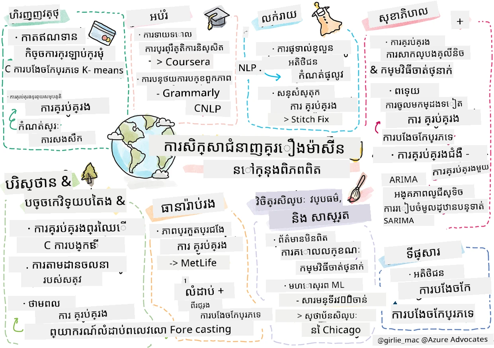

# ការបញ្ចប់៖ ការរៀនម៉ាស៊ីននៅក្នុងពិភពយ៉ាងពិតប្រាកដ

> ស្គេតណូតដោយ [Tomomi Imura](https://www.twitter.com/girlie_mac)

ក្នុងកម្មវិធីសិក្សានេះ អ្នកបានរៀនរបៀបជាច្រើនក្នុងការរៀបចំទិន្នន័យសម្រាប់ហ្វឹកហាត់ ហើយបង្កើតម៉ូដែលការរៀនម៉ាស៊ីន។ អ្នកបានបង្កើតម៉ូដែលនៃការត្រួតពិនិត្យស្រដៀងបែបបុរាណ សារ៉ែនជCluster, ការបែងចែក, ការពិចារណាភាសាប្រពៃណី និងម៉ូដែលស៊េរីពេលវេលា មួយរយៈ។ សូមអបអរសាទរ! ឥឡូវនេះ អ្នកអាចកំពុងសួរថា ទាំងអស់នេះមានប្រយោជន៍យ៉ាងដូចម្តេច... កើតហេតុអ្វីជាការប្រើប្រាស់ពិតប្រាកដសម្រាប់ម៉ូដែលទាំងនេះ?

ក្នុងពេលដែលភាពចាប់អារម្មណ៍ជាច្រើនក្នុងឧស្សាហកម្មត្រូវបានទាក់ទាញដោយ AI ដែលភាគច្រើនប្រើប្រាស់ការរៀនជ្រៅ ប៉ុន្តែនៅតែក៏មានការប្រើប្រាស់មានតម្លៃសម្រាប់ម៉ូដែលការរៀនម៉ាស៊ីនបែបបុរាណ។ អ្នកអាចត្រូវបានប្រើប្រាស់ករណីការប្រើប្រាស់មួយចំនួននៅថ្ងៃនេះផងដែរ! នៅក្នុងមេរៀននេះ អ្នកនឹងស្វែងយល់ពីរបៀបដែលឧស្សាហកម្មប្រាំបាញ់និងវិស័យជំនាញផ្សេងៗប្រើម៉ូដែលទាំងនេះដើម្បីធ្វើឱ្យកម្មវិធីរបស់ពួកគេចេញលទ្ធផលល្អប្រសើរ ប្រកបដោយទុកចិត្ត ច្បាស់លាស់ ហើយមានតម្លៃសម្រាប់អ្នកប្រើប្រាស់។

## [វីវរប្រលងមុនវីដេអូ](https://ff-quizzes.netlify.app/en/ml/)

## 💰 ហិរញ្ញវត្ថុ

វិស័យហិរញ្ញវត្ថុផ្តល់ឱកាសជាច្រើនសម្រាប់ការរៀនម៉ាស៊ីន។ បញ្ហាជាច្រើនក្នុងតំបន់នេះអាចត្រូវបានគំរូ និងដោះស្រាយដោយប្រើ ML។

### ការរកឃើញការបោសបង់កាតឥណទាន

យើងបានរៀនអំពី [ការបែងចែកក្រុម k-means](../../5-Clustering/2-K-Means/README.md) មុននេះក្នុងវគ្គបង្រៀន ប៉ុន្តែរបៀបណាដែលវាអាចត្រូវបានប្រើដើម្បីដោះស្រាយបញ្ហាអំពីការបោកប្រាស់កាតឥណទាន?

ការបែងចែកក្រុម k-means មកមានប្រយោជន៍ក្នុងបច្ចេកទេសរកឃើញការបោកប្រាស់កាតឥណទានមួយដែលហៅថា **ការរកឃើញភាគចេញក្រៅសធម្មតា (outlier detection)**។ ភាគចេញក្រៅ ឬការប្រែប្រួលក្នុងការបង្កើតទិន្នន័យអាចប្រាប់យើងថា តើកាតឥណទានកំពុងប្រើតាមរបៀបធម្មតា ឬមានអ្វីមួយមិនធម្មតាកំពុងកើតឡើង។ ដូចបានបង្ហាញក្នុងអត្ថបទភ្ជាប់ខាងក្រោម អ្នកអាចចាត់តម្រៀបទិន្នន័យកាតឥណទានដោយប្រើកាលដ្ឋានបែងចែកក្រុម k-means ហើយតែងតាមប្រតិបត្ដិការតាមក្រុមមួយផ្អែកលើភាពជាភាគចេញក្រៅរបស់វា។ បន្ទាប់មក អ្នកអាចវាយតម្លៃក្រុមដែលមានហានិភ័យបំផុតសម្រាប់ប្រតិបត្ដិការល្បែង versus ដែលត្រឹមត្រូវបាន។
[យោង](https://citeseerx.ist.psu.edu/viewdoc/download?doi=10.1.1.680.1195&rep=rep1&type=pdf)

### គ្រប់គ្រងទ្រព្យសម្បត្តិ

ក្នុងការគ្រប់គ្រងទ្រព្យសម្បត្តិ វិទ្យុបុគ្គលឬក្រុមហ៊ុនមួយទទួលខុសត្រូវក្នុងការវិនិយោគជំនួសអតិថិជនរបស់ពួកគេ។ ភារកិច្ចរបស់ពួកគឺផ្ដល់ការរឹតបន្តឹងនិងបង្កើតទ្រព្យសម្បត្តិអនាគត ដូច្នេះវាម្រើបត្រូវជ្រើសរើសវិនិយោគដែលមានលទ្ធផលល្អ។

វិធីមួយក្នុងការវាយតម្លៃភាពអនុវត្តន៍វិនិយោគជាក់លាក់គឺតាមរយៈវិធីសាស្ត្រគណិតវិទ្យាស្ថិតិ [ការ៉េស្ស៊ីយ៉ុងបន្ទាត់](../../2-Regression/1-Tools/README.md) គឺជាឧបករណ៍មានតម្លៃសម្រាប់ការយល់ដឹងមើលថាហិរញ្ញវត្ថុមួយអនុវត្តទៅប្រៀបធៀបនឹងសំរុងការណាមួយ។ យើងក៏អាចបញ្ជាក់ថា តើលទ្ធផលនៃការត្រឡប់តាមស្ថិតិមានសំខាន់ ឬប៉ុន្មានទៅលើវិនិយោគរបស់អតិថិជន។ អ្នកអាចបន្តពង្រីកការវិភាគរបស់អ្នកដោយប្រើការត្រឡប់ច្រើន ដែលមានហានិភ័យបន្ថែមអាចគិតចូលក្នុងគណនា។ សម្រាប់ឧទាហរណ៍ពីរបៀបដែលវានឹងដើរដល់មូលទុនជាក់លាក់មួយ សូមមើលសៀវភៅខាងក្រោមអំពីការវាយតម្លៃសមត្ថភាពមូលទុនដោយប្រើការត្រឡប់។
[យោង](http://www.brightwoodventures.com/evaluating-fund-performance-using-regression/)

## 🎓 ការអប់រំ

វិស័យការអប់រំក៏ជាតំបន់ចំណាប់អារម្មណ៍មួយដែលអាចប្រើប្រាស់ ML។ មានបញ្ហាវិសេសដែលត្រូវបានដោះស្រាយដូចជាការស្គាល់ការតស៊ូមតិលើសម្រង់ឬអត្ថបទ ឬការគ្រប់គ្រងការសំអាតចម្រូងចម្រាស់ អ្នកមិនបានបំណងឬមិនអាក្រក់។

### ការប៉ាន់ស្មានអាកប្បកិរិយានិស្សិត

[Coursera](https://coursera.com) អ្នកផ្គត់ផ្គង់វគ្គបណ្ដុះបណ្ដាលអនឡាញ មានប្លុកបច្ចេកទេសដ៏ល្អដែលពិភាក្សាអំពីការសម្រេចចិត្តវិស្វកម្មជាច្រើន។ នៅក្នុងករណីសិក្សានេះ ពួកគេបានគូសបន្ទាត់ត្រឡប់សម្រាប់ព្យាយាមស្វែងរកភាពទាក់ទង בין លទ្ធផល NPS ទាប និងការរក្សាថ្នាក់ ឬការដកចេញពីវគ្គសិក្សា។
[យោង](https://medium.com/coursera-engineering/controlled-regression-quantifying-the-impact-of-course-quality-on-learner-retention-31f956bd592a)

### ការជៀសវាងការបំភាន់បុគ្គលិកលក្ខណៈ

[Grammarly](https://grammarly.com), ជាជំនួយការសរសេរដែលពិនិត្យកំហុសអក្សរ និងវេយ្យាករណ៍ ប្រើប្រាស់ប្រព័ន្ធ [ពិចារណាភាសា](../../6-NLP/README.md) មួយចំនួនដ៏ស្មុគស្មាញនៅក្នុងផលិតផលរបស់ខ្លួន។ ពួកគេសម្រង់ករណីសិក្សាអំពីរបៀបពួកគេដោះស្រាយការបំពានលើជាតិស្រីប្រុសក្នុងការរៀនម៉ាស៊ីន ដែលអ្នកបានរៀនក្នុងមេរៀន [ស្តីពីភាពយុត្តិធម៌មូលដ្ឋាន](../../1-Introduction/3-fairness/README.md)។
[យោង](https://www.grammarly.com/blog/engineering/mitigating-gender-bias-in-autocorrect/)

## 👜 លក់រាយ

វិស័យលក់រាយអាចទទួលបានអត្ថប្រយោជន៍យ៉ាងច្រើនពីការប្រើប្រាស់ ML ពីការបង្កើតដំណើរការអតិថិជនល្អប្រសើរឡើង ដល់ការស្តុកឃ្លាំងយ៉ាងមានប្រសិទ្ធភាព។

### ការប្តូរតាមបំណងដំណើរអតិថិជន

នៅក្រុមហ៊ុន Wayfair ដែលជាក្រុមហ៊ុនលក់ផលិតផលផ្ទះដូចជាគ្រឿងម៉ូដ ត្រូវការជួយអតិថិជនរកផលិតផលសមស្របសម្រាប់រសជាតិ និងតម្រូវការរបស់ពួកគេគឺមានសារៈសំខាន់។ ក្នុងអត្ថបទនេះ វិស្វករពីក្រុមហ៊ុនបានពិពណ៌នាថាអ្នកប្រើប្រាស់ ML និង NLP ដើម្បី "បង្ហាញលទ្ធផលត្រឹមត្រូវសម្រាប់អតិថិជន"។ ជាពិសេសម៉ាស៊ីនចេតនា Query Intent បានត្រូវបង្កើតដើម្បីប្រើការដកស្រង់អង្គភាព, ការហ្វឹកហាត់អ្នកចាត់ថ្នាក់, ការដកស្រង់ទ្រព្យសម្បត្តិ និងមតិយោបល់, និងការបញ្ចុះសញ្ញាហានិភ័យលើការវាយតម្លៃរបស់អតិថិជន។ នេះគឺជាករណីប្រើប្រាស់ក្លាស៊ីកមួយនៃវិធីសាស្រ្ត NLP នៅក្នុងការលក់រាយអនឡាញ។
[យោង](https://www.aboutwayfair.com/tech-innovation/how-we-use-machine-learning-and-natural-language-processing-to-empower-search)

### ការគ្រប់គ្រងស្តុកឃ្លាំង

ក្រុមហ៊ុនច្នៃប្រឌិត និងបត់បែនដូចជា [StitchFix](https://stitchfix.com) ក្រុមហ៊ុនផ្តល់សេវាបញ្ចូនសម្លៀកបំពាក់ទៅអតិថិជន អាស្រ័យយ៉ាងខ្លាំងលើ ML សម្រាប់ការផ្តល់អនុសាសន៍ និងការគ្រប់គ្រងស្តុក។ ក្រុមទីមរចនាសត្វនិងក្រុមទីមពាណិជ្ជកម្មធ្វើការជារួមគ្នា ជាពិត៖ "មនុស្សវិទ្យាសាស្ត្រទិន្នន័យរបស់យើងបានសាកល្បងអាល់ហ្គորিদមជីណេទីក ហើយអនុវត្តវាលើសម្លៀកបំពាក់ដើម្បីទស្សនាវិជ្ជាជីវៈថា អ្វីទៅជាសម្លៀកបំពាក់ដែលមានជោគជ័យមិនទាន់មាននៅថ្ងៃនេះ។ យើងយកវាទៅឲ្យក្រុមទីមពាណិជ្ជកម្ម ហើយឥឡូវនេះពួកគេអាចប្រើវាជាឧបករណ៍មួយបាន។"
[យោង](https://www.zdnet.com/article/how-stitch-fix-uses-machine-learning-to-master-the-science-of-styling/)

## 🏥 សុខាភិបាល

វិស័យសុខាភិបាលអាចប្រើរបៀបរៀនម៉ាស៊ីនដើម្បីបង្កើនលទ្ធភាពស្រាវជ្រាវ និងដោះស្រាយបញ្ហាតំបន់ដូចជាការដាក់ព្យាបាលជំងឺម្ដងទៀតឬការទប់ស្កាត់ជំងឺរាតត្បាត។

### ការគ្រប់គ្រងការសាកល្បងគ្លីនិក

ភាពពុលនៅក្នុងការសាកល្បងគ្លីនិកគឺជាបញ្ហាសំខាន់សម្រាប់អ្នកផលិតថ្នាំ។ តើភាពពុលប៉ុន្មានដែលអាចទ្រាំបាន? នៅក្នុងការសិក្សានេះ ការវិភាគវិធីសាស្ត្រសាកល្បងគ្លីនិកផ្សេងៗនាំឱ្យមានការកែច្នៃវិធីសាស្ត្រថ្មីសម្រាប់ព្យាយាមទំនាក់ផ្នត់លទ្ធផលសាកល្បងគ្លីនិក។ ជាពិសេស ពួកគេបានប្រើដើមព្រៃចៃដន្យ ដើម្បីបង្កើត [អ្នកចាត់ថ្នាក់](../../4-Classification/README.md) ដែលអាចបំបែកចំណាត់ថ្នាក់ថ្នាំដោយក្រុម។
[យោង](https://www.sciencedirect.com/science/article/pii/S2451945616302914)

### ការគ្រប់គ្រងការចូលមន្ទីរពេទ្យម្ដងទៀត

ការថែទាំមន្ទីរពេទ្យមានតម្លៃខ្ពស់ ជាពិសេសពេលអ្នកជំងឺត្រូវបញ្ចូលមន្ទីរពេទ្យម្តងទៀត។ អត្ថបទនេះពិភាក្សា​អំពី​ក្រុមហ៊ុន​មួយដែលប្រើ ML ក្នុងការព្យាករណ៍ពីឱកាសចូលមន្ទីរពេទ្យម្តងទៀតដោយប្រើ[អាល់ហ្គរីធម៍ clustering](../../5-Clustering/README.md)។ ក្រុមនេះជួយអ្នកវិភាគ "រកឃើញក្រុមនៃការចូលមន្ទីរពេទ្យម្តងទៀតដែលអាចមានមូលហេតុរួម"។
[យោង](https://healthmanagement.org/c/healthmanagement/issuearticle/hospital-readmissions-and-machine-learning)

### ការគ្រប់គ្រងជំងឺ

ការរីករាលដាលនៃជំងឺកូវីដថ្មីៗបានបង្ហាញពីរបៀបដែលការរៀនម៉ាស៊ីនអាចជួយទប់ស្កាត់ការរីករាលដាលជំងឺ។ នៅក្នុងអត្ថបទនេះ អ្នកនឹងមើលឃើញការប្រើប្រាស់ ARIMA, វង់ឡូកីស្ទិច, ការត្រឡប់បន្ទាត់ និង SARIMA។ "ការងារនេះជាការព្យាយាមគណនាអត្រារីកលូតលាស់នៃវីរុសនេះ ហើយធ្វើការព្យាករណ៍ពីការស្លាប់ ការស្ដារឡើងវិញ និងករណីដែលបានបញ្ជាក់ ដើម្បីជួយយើងរៀបចំបានល្អប្រសើរ និងរស់រានមានជីវិត។"
[យោង](https://www.ncbi.nlm.nih.gov/pmc/articles/PMC7979218/)

## 🌲 បរិស្ថាន និងបច្ចេកវិទ្យាបៃតង

ធម្មជាតិនិងបរិស្ថានមានប្រព័ន្ធអារម្មណ៍យ៉ាងហោចណាស់ដែលការបង្រួមរវាងសត្វនិងធម្មជាតិនាំឲ្យកើតមានភាពសំខាន់។ វាសំខាន់ក្នុងការវាស់វែងប្រព័ន្ធទាំងនេះយ៉ាងត្រឹមត្រូវ ហើយធ្វើសកម្មភាពតាមតម្រូវការបើមានអ្វីមួយកើតឡើងដូចជាអគ្គិភ័យព្រៃឬការធ្លាក់ចុះនៃប្រជាជនសត្វ។

### ការគ្រប់គ្រងព្រៃឈើ

អ្នកបានរៀនពី [ការរៀនអនុគមន៍បន្សំ](../../8-Reinforcement/README.md) នៅមេរៀនមុន។ វា​អាចមានប្រយោជន៍ខ្លាំងពេលព្យាករណ៍លំនាំធម្មជាតិ។ ជាពិសេស វាអាចប្រើសម្រាប់តាមដានបញ្ហាបរិស្ថានដូចជាអគ្គិភ័យព្រៃឈើ និងការរាលដាលរបស់សត្វចម្លែក។ នៅប្រទេសកាណាដា ក្រុមអ្នកស្រាវជ្រាវមួយបានប្រើការរៀនអនុគមន៍បន្សំ ដើម្បីបង្កើតម៉ូដែលនៃបញ្ហាអគ្គិភ័យព្រៃឈើពីរូបភាពផ្កាយសsputnik។ ដោយប្រើ "ដំណើរការរីករាលដាលក្នុងអាកាសធាតុ (SSP)", ពួកគេបានគិតឲ្យអគ្គិភ័យព្រៃស្មើនឹង "ភ្នាក់ងារនៅក្នុងកោសិកាមួយណាមួយក្នុងផែនដី"។ "ដំណើរការដែលភ្លើងអាចធ្វើពីទីតាំងណាមួយ វា រួមមាន ការរីករាលដាលទៅខាងជើង, ត្បូង, ក្រោមទិសខាងកើត ឬខាងលិច ឬមិនរីករាលដាលឡើយ។

វិធីសាស្ត្រនេះផ្ទុយពីការរៀនអនុគមន៍បន្សំធម្មតា ព្រោះដំណើរការ Markov Decision Process (MDP) ដែលផ្តល់អនុគមន៍ការរីករាលដាលភ្លើងនៅភ្លាមៗគឺជាអនុគមន៍ដែលស្គាល់។" អានបន្ថែមអំពីអាល់ហ្គរីធម៍បែបបុរាណដែលក្រុមនេះបានប្រើនៅតំណភ្ជាប់ខាងក្រោម។
[យោង](https://www.frontiersin.org/articles/10.3389/fict.2018.00006/full)

### ការកំណត់ចលនារបស់សត្វ

នៅពេលការរៀនជ្រៅបានបង្កើតបម្លែងនៅក្នុងការតាមដានចលនារបស់សត្វតាមវិស្វកម្មគ្រប់គ្រាន់ (អ្នកអាចបង្កើត[ឧបករណ៍តាមដានខ្លាឃ្មុំកកស្មៅ](https://docs.microsoft.com/learn/modules/build-ml-model-with-azure-stream-analytics/?WT.mc_id=academic-77952-leestott) ដោយខ្លួនឯងនៅទីនេះ) ក៏ប៉ុន្តែ ML បែបបុរាណនៅតែមានការរកដំណើរនារូបការងារនេះ។

ឧបករណ៍សម្រង់ចលនាភាពសត្វកសិកម្ម និង IoT ប្រើប្រភេទនៃការពិចារណារូបភាពនេះ ប៉ុន្តែបច្ចេកទេស ML មានមូលដ្ឋានក៏មានប្រយោជន៍សម្រាប់ការដំណើរការទិន្នន័យជាប់នៅមុន។ ឧទាហរណ៍ក្នុងអត្ថបទនេះ អង្គភាពនៃការត្រួតពិនិត្យទ្រង់ទ្រាយទាំងឡាយត្រូវបានត្រួតពិនិត្យនិងវិភាគតាមរយៈអាល់ហ្គរីធម៍ចាត់ថ្នាក់ផ្សេងៗ។ អ្នកអាចស្គាល់​ការគូសបក្សសនិទាន ROC នៅទំព័រ 335។
[យោង](https://druckhaus-hofmann.de/gallery/31-wj-feb-2020.pdf)

### ⚡️ ការគ្រប់គ្រងថាមពល

នៅក្នុងមេរៀនរបស់យើងពី [ការព្យាករណ៍ស៊េរីពេលវេលា](../../7-TimeSeries/README.md) យើងបានយកឧទាហរណ៍គិតពីម៉ូដែលទីតាំងចតយានយន្តឆ្លាត ដើម្បីចំណូលសម្រាប់ទីរួមមួយផ្អែកលើការយល់ដឹងពីផ្គត់ផ្គង់និងទាមទារ។ អត្ថបទនេះពិភាក្សារយៈពេលវែងពីរបៀបដែលការបែងចែកក្រុម, ការត្រឡប់, និងស៊េរីពេលវេលាបានរួមបញ្ចូលគ្នា ដើម្បីជួយព្យាករណ៍ការប្រើថាមពលអនាគតនៅអៀរឡង់ ដោយសារតែការវាស់តម្រុយឆ្លាត។
[យោង](https://www-cdn.knime.com/sites/default/files/inline-images/knime_bigdata_energy_timeseries_whitepaper.pdf)

## 💼 ធានារ៉ាប់រស់

វិស័យធានារ៉ាប់រស់គឺជាវិស័យមួយទៀតដែលប្រើ ML ក្នុងការបង្កើត និងបង្កើនប្រសិទ្ធភាពម៉ូដែលហិរញ្ញវត្ថុ និងម៉ូដែលធានារ៉ាប់រស់។

### ការគ្រប់គ្រងអត្រារអ៊ូរ៉ា

MetLife ដែលជាអ្នកផ្គត់ផ្គង់ធានារ៉ាប់រស់មួយបានបង្ហាញរបៀបពិចារណា និងកាត់បន្ថយអត្រារអ៊ូរ៉ារនៅក្នុងម៉ូដែលហិរញ្ញវត្ថុរបស់ពួកគេ។ ក្នុងអត្ថបទនេះ អ្នកនិងឃើញការបង្ហាញការបែងចែកពីរប្រភេទ និងការបែងចែកតាមលំដាប់តូចធំ។ អ្នកនឹងជ្រាបពីការបង្ហាញព្យាករណ៍ផងដែរ។
[យោង](https://investments.metlife.com/content/dam/metlifecom/us/investments/insights/research-topics/macro-strategy/pdf/MetLifeInvestmentManagement_MachineLearnedRanking_070920.pdf)

## 🎨 សិល្បៈ, វប្បធម៌ និងអក្សរសាស្ត្រ

ក្នុងសិល្បៈ ឧទាហរណ៍ក្នុងសារព័ត៌មាន មានបញ្ហាច្រើនដែលគួរឲ្យមានចំណាប់អារម្មណ៍។ ការរកឃើញព័ត៌មានក្លែងក្លាយគឺជាបញ្ហាធំ ដែលបានបង្ហាញថាស្ថានភាពនេះមានឥទ្ធិពលលើមតិរបស់មនុស្ស និងធ្វើឱ្យប្រជាធិបតេយ្យជ្រុលរើងបាន។ សារមន្ទីរពិសេសៗក៏អាចទទួលផលបត់ពីការប្រើប្រាស់ ML ចាប់ពីការស្វែងរកចំណុចភ្ជាប់រវាងឥស្សរិយយសទៅដល់ការធ្វើផែនការប្រាក់វិភាគ។

### ការបោះពុម្ពព័ត៌មានក្លែងក្លាយ

ការរកឃើញព័ត៌មានក្លែងក្លាយបានក្លាយជាការលេងល្បែងកណ្តេញក្នុងការផ្សាយពាណិជ្ជកម្មនៅសព្វថ្ងៃ។ អត្ថបទនេះ អ្នកស្រាវជ្រាវបានណែនាំថា ប្រព័ន្ទដែលបញ្ចូលវិធីសាស្ត្ររៀនម៉ាស៊ីនជាច្រើនដែលយើងបានសិក្សា អាចត្រូវបានសាកល្បង ហើយម៉ូដែលល្អបំផុតត្រូវបានដាក់ឲ្យដំណើរការ៖ "ប្រព័ន្ធនេះផ្អែកលើការចាប់យកលក្ខណៈពិសេសពីទិន្នន័យដោយប្រព័ន្ធពិចារណាភាសាប្រពៃណី និងលក្ខណៈពិសេសទាំងនោះត្រូវបានប្រើសម្រាប់ហ្វឹកហាត់ម៉ាស៊ីនចាត់ថ្នាក់ដូចជា Naive Bayes, Support Vector Machine (SVM), Random Forest (RF), Stochastic Gradient Descent (SGD), និង Logistic Regression (LR)।"
[យោង](https://www.irjet.net/archives/V7/i6/IRJET-V7I6688.pdf)

អត្ថបទនេះបង្ហាញពីរបៀបរួមបញ្ចូលដែនការរៀនម៉ាស៊ីនផ្សេងៗគ្នាដើម្បីបង្កើតលទ្ធផលច្នៃប្រឌិត ដែលអាចជួយបញ្ឈប់ការរាលដាលព័ត៌មានក្លែងក្លាយ និងបង្កើតនូវគ្រោះថ្នាក់ចាស់ៗ; ក្នុងករណីនេះ មូលហេតុគឺការរាលដាលនូវអាថ៌កំបាំងអំពីការព្យាបាល COVID ដែលបណ្តាលឲ្យមានអំពើហិង្សាមនុស្សជាអក្សរ។

### ការបង្ហាញ ML នៅសារមន្ទីរ

សារមន្ទីរនៅកំពូលនៃអភិវឌ្ឍ AI ដែលការធ្វើបញ្ជី និងជាតុលេខផ្តល់សមត្ថភាពក្នុងការស្វែងរកចំណុចភ្ជាប់រវាងឥស្សរិយយសកាន់តែងាយស្រួលជាងមុនទៅនឹងអភិវឌ្ឍន៍បច្ចេកវិទ្យា។ គម្រោងដូចជា [In Codice Ratio](https://www.sciencedirect.com/science/article/abs/pii/S0306457321001035#:~:text=1.,studies%20over%20large%20historical%20sources.) កំពុងជួយដោះសោរការស៊ើបអង្កេតពីឯកសារសារមន្ទីរ មិនអាចចូលដំណើរការបាន ដូចជាឯកសារសារមន្ទីរវាទិកង់។ ប៉ុន្តែផ្នែកអាជីវកម្មសារមន្ទីរនៅតែទទួលបានអត្ថប្រយោជន៍ពីម៉ូដែល ML។

ឧទាហរណ៍ ស្ថាប័នសិល្បៈ Chicago បានបង្កើតម៉ូដែលដើម្បីព្យាករណ៍ថា តើមហាជនមានចំណាប់អារម្មណ៍ហើយពេលណាដែលពួកគេចូលរួមក្នុងពិព័រណ៍។ គោលបំណងគឺបង្កើតបទពិសោធន៍អតិថិជនឯកជននិងមានប្រសិទ្ធភាពរៀងរាល់ពេលអ្នកប្រើប្រាស់ធ្វើដំណើរទៅសារមន្ទីរ។ "នៅក្នុងរយៈពេលហិរញ្ញវត្ថុឆ្នាំ 2017 ម៉ូដែលនេះបានព្យាករណ៍ការចូលរួមនិងការចូលទស្សនាក្នុងកម្រិតត្រឹមត្រូវក្នុង 1 ភាគរយ និយាយដោយ Andrew Simnick, សេន្យ័រនាយកដ្ឋានក្រុមប្រឹក្សា នៅស្ថាប័នសិល្បៈ។"
[យោង](https://www.chicagobusiness.com/article/20180518/ISSUE01/180519840/art-institute-of-chicago-uses-data-to-make-exhibit-choices)

## 🏷 ទីផ្សារ

### ការបែងចែកអតិថិជន

យុទ្ធសាស្ត្រទីផ្សារដែលមានប្រសិទ្ធភាពបំផុត គឺផ្តោតទៅលើអតិថិជនម្ខាងៗ ដោយផ្អែកលើការបែងចែកក្រុមផ្សេងៗគ្នា។ នៅក្នុងអត្ថបទនេះ ការប្រើប្រាស់អាល់ហ្គរីធម៍ Clustering ត្រូវបានពិភាក្សាដើម្បីគាំទ្រយុទ្ធសាស្ត្រទីផ្សារបែងចែករបស់ក្រុមហ៊ុន។ ការបែងចែកទីផ្សារដូចនេះជួយក្រុមហ៊ុនក្នុងការកែលម្អការទទួលស្គាល់ម៉ាក ឈានដល់អតិថិជនច្រើន និងធ្វើប្រាក់ច្រើនជាងមុន។
[យោង](https://ai.inqline.com/machine-learning-for-marketing-customer-segmentation/)

## 🚀 챌린지(បច្ចួប)

សូមកំណត់វិស័យផ្សេងទៀតមួយដែលទទួលបានអត្ថប្រយោជន៍ពីបច្ចេកទេសមួយចំនួនដែលអ្នកបានរៀនក្នុងកម្មវិធីសិក្សានេះ ហើយស្វែងរកពីរបៀបដែលវាប្រើ ML។
## [ប្រកួតប្រជែងក្រោយមេរៀន](https://ff-quizzes.netlify.app/en/ml/)

## ពិនិត្យឡើងវិញ & សិក្សាឯករាជ្យ

ក្រុមវិទ្យាសាស្ត្រទិន្នន័យ Wayfair មានវីដេអូច្រើនដែលគួរឱ្យចាប់អារម្មណ៍អំពីរបៀបដែលពួកគេស្តារខ្នាតប្រើ ML នៅក្រុមហ៊ុនរបស់ពួកគេ។ វាមានតំលៃក្នុងការមើល [សូមមើល](https://www.youtube.com/channel/UCe2PjkQXqOuwkW1gw6Ameuw/videos)!

## ការបញ្ជាក់

[ការ​ស្វែងរក ML](assignment.md)

---

<!-- CO-OP TRANSLATOR DISCLAIMER START -->
**ការបដិសេធ**៖  
ឯកសារនេះត្រូវបានបកប្រែដោយប្រើសេវាកម្មបកប្រែ AI [Co-op Translator](https://github.com/Azure/co-op-translator)។ ខណៈពេលយើងខិតខំសម្រេចភាពត្រឹមត្រូវ សូមយល់ព្រមថាការបកប្រែដោយស្វ័យម៉ាស៊ីនអាចមានកំហុស ឬភាពមិនត្រឹមត្រូវ។ អ្នកគួរត្រូវយកឯកសារជនជាតិដើមជា ប្រភពត្រឹមត្រូវផ្លូវការជានិច្ច។ សម្រាប់ព័ត៌មានសំខាន់ៗ ការបកប្រែដោយមនុស្សជំនាញត្រូវបានផ្ដល់អនុសាសន៍។ យើងមិនទទួលខុសត្រូវចំពោះការយល់ច្រឡំ ឬការបកអត្ថន័យខុសបានបណ្តាលមកពីការប្រើប្រាស់ការបកប្រែនេះទេ។
<!-- CO-OP TRANSLATOR DISCLAIMER END -->