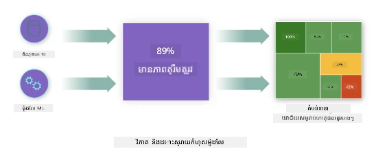
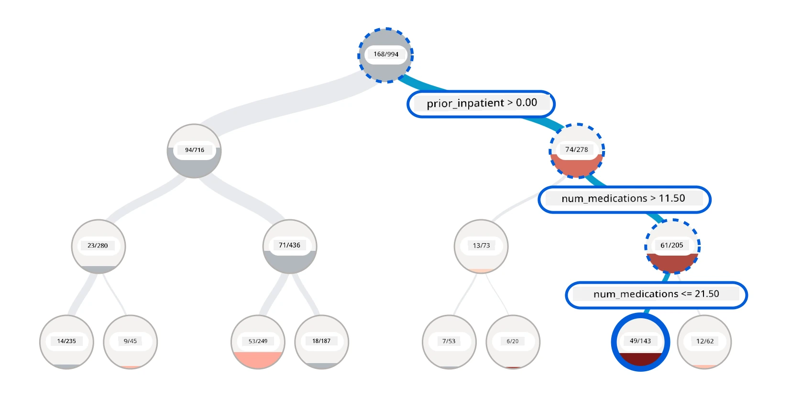
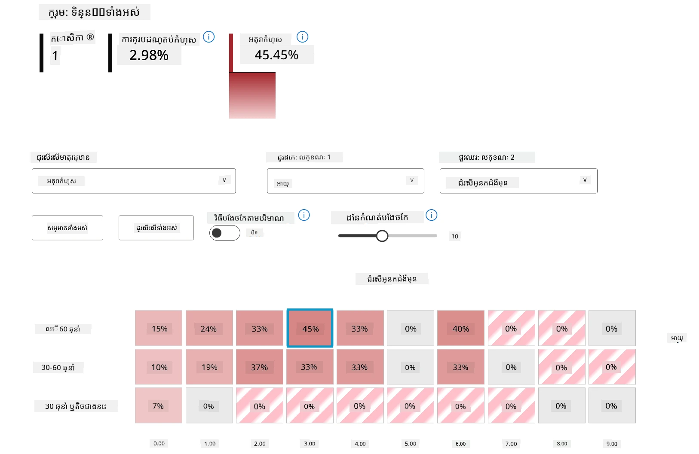
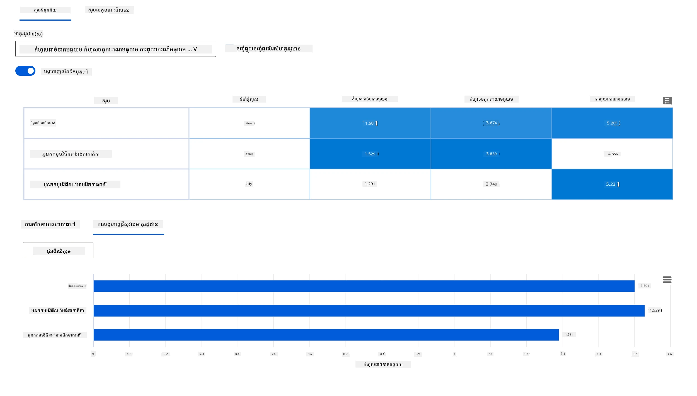
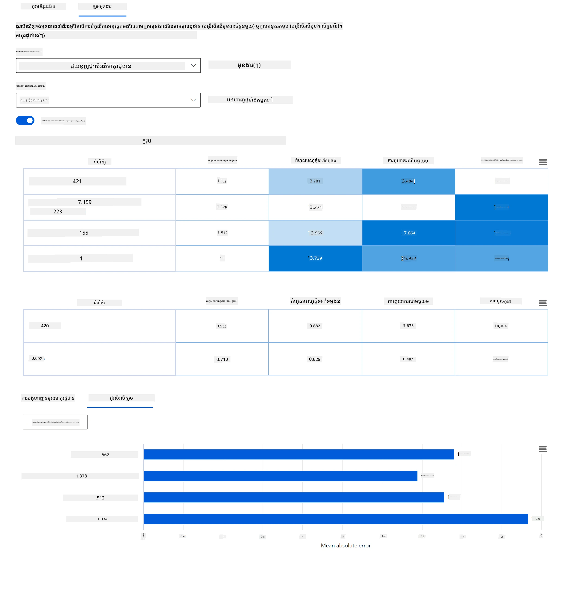
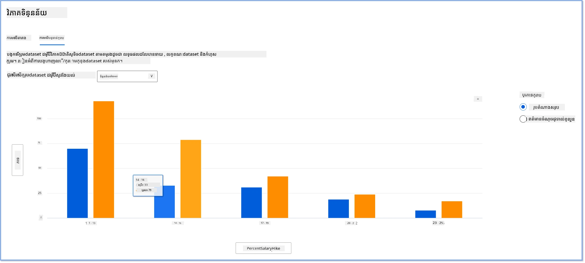
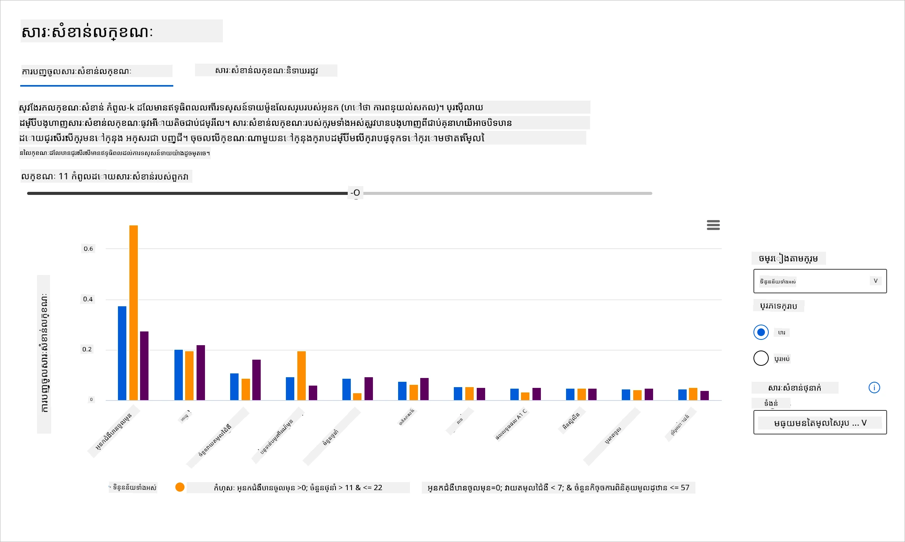
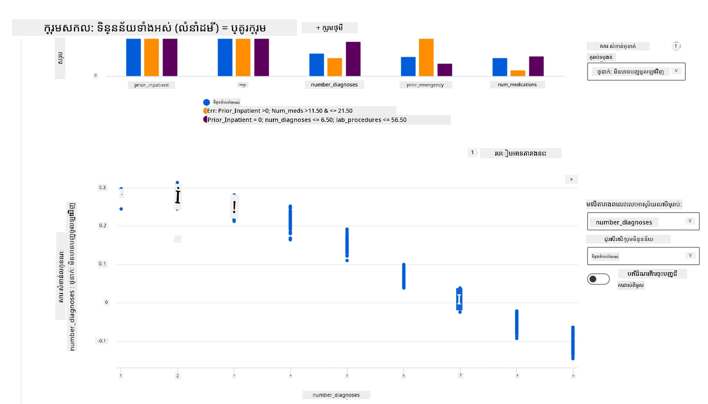

# Postscript: ការបញ្ឆែកគំរូនៅក្នុងការរៀនម៉ាស៊ីនដោយប្រើឧបករណ៍ផ្ទាំងគ្រប់គ្រង AI ទទួលខុសត្រូវ
 

## [កម្រងសំនួរមុនវគ្គសិក្សា](https://ff-quizzes.netlify.app/en/ml/)
 
## ការណែនាំ

ការរៀនម៉ាស៊ីនមានឥទ្ឋិពលលើជីវិតប្រចាំថ្ងៃរបស់យើង។ AI កំពុងបញ្ចូលទៅក្នុងប្រព័ន្ធសំខាន់ៗបំផុតដែលប៉ះពាល់ដល់យើងជាផ្ទាល់ និងសង្គមរបស់យើង ពីសុខាភិបាល សេដ្ឋកិច្ច ការអប់រំ និងការងារ។ ឧទាហរណ៍ ប្រព័ន្ធ និងគំរូរួមចំណែកក្នុងការសម្រេចចិត្តប្រចាំថ្ងៃដូចជាការធ្វើវេជ្ជបណ្ឌិតករណីជំងឺឬការចាប់ស្ដុកប្រាក់ជាប់សុហេង។ ដូច្នេះ ការវិវឌ្ឍន៍ក្នុង AI និងការទទួលយកលឿនបានជួបប្រទះការរំពឹងទុកពីសង្គមដែលកំពុងលូតលាស់ និងការគ្រប់គ្រងកាន់តែរឹងមាំ។ យើងតែងតែឃើញតំបន់ដែលប្រព័ន្ធ AI ធ្លាប់បរាជ័យក្នុងការបំពេញចំណាប់អារម្មណ៍; ពួកវាបង្កើតបញ្ហាថ្មីៗ; ហើយរដ្ឋាភិបាលកំពុងចាប់ផ្តើមគ្រប់គ្រងដំណោះស្រាយ AI។ ដូច្នេះ វាសារៈសំខាន់ដែលគំរូទាំងនេះត្រូវបានវិភាគដើម្បីផ្តល់លទ្ធផលដែលមានភាពយុត្តិធម៌ ជឿជាក់ បញ្ចូលគ្នា ស្វែងយល់បានច្បាស់ និងអាចទទួលខុសត្រូវសម្រាប់មនុស្សគ្រប់រូប។

ក្នុងមេរៀននេះ យើងនឹងមើលឧបករណ៍អ practicallyដែលអាចប្រើបានដើម្បីវាយតម្លៃថាគំរូមានបញ្ហា AI ទទួលខុសត្រូវឬដូចម្តេច។ បច្ចេកទេសបញ្ឆែកគំរូបុរាណភាគច្រើនត្រូវបានបង្កើតយោងលើគណនាប្រកួតពិន្ទុចំនួនបរិមាណដូចជាការគណនាបរិមាណភាពត្រឹមត្រូវឬកម្រិតបាត់បង់កំហុសមធ្យម។ សូមនឹកឃើញអ្វីដែលអាចកើតឡើងពេលទិន្នន័យដែលអ្នកប្រើសម្រាប់បង្កើតគំរូទាំងនេះខ្វះខាតប្រភេទប្រជាជនខ្លះ ដូចជាជាតិ ភេទ ទស្សនវិជ្ជា អំពីនយោបាយ ឬសាសនា ឬតំណាងមិនសមស្របសម្រាប់ប្រភេទប្រជាជនទាំងនេះ។ តើកើតអ្វីឡើងបើលទ្ធផលគំរូត្រូវបានបកស្រាយដើម្បីគាំទ្រក្រុមប្រជាជនមួយ? វាអាចបញ្ចូនចេញនូវការជាងលើ ឬខ្វះខាតនៃក្រុមលក្ខណៈសំខាន់ទំនងជាអំពើមិនសមស្រប ភ្ជាប់ទាក់ទិននឹងភាពយុត្តិធម៌ ការបញ្ចូលរួម ឬភាពជឿជាក់ពីគំរូ។ ម្យ៉ាងទៀត គំរូរៀនម៉ាស៊ីនត្រូវបានគេគិតថាជាប្រអប់ខ្មៅ ដែលធ្វើឱ្យពិបាកយល់នឹងពន្យល់ថាអ្វីជាគោលបំណងនៃការព្យាករណ៍ពីគំរូមួយ។ ឥឡូវនេះគឺជាបញ្ហាដែលអ្នកវិទ្យាសាស្ត្រ​ទិន្នន័យនិងអ្នកអភិវឌ្ឍ AI កំពុងប្រឈមមុខពេលពួកគេច្រើនពេលគ្មានឧបករណ៍គ្រប់គ្រាន់សម្រាប់បញ្ឆែកគំរូ និងវាយតម្លៃភាពយុត្តិធម៌ ឬភាពទុកចិត្តចំពោះគំរូមួយ។

ក្នុងមេរៀននេះ អ្នកនឹងសិក្សាអំពីការបញ្ឆែកគំរូរបស់អ្នកដោយប្រើ:

-	**វិភាគកំហុស**: កំណត់ថាតើយ៉ាងណានៅក្នុងចំណែកទិន្នន័យដែលគំរូមានអត្រាកំហុសខ្ពស់។
-	**ទិដ្ឋភាពគំរូ**: បញ្ឆែកប្រៀបធៀបទិន្នន័យក្នុងក្រុមផ្សេងៗដើម្បីស្វែងរកភាពខុសគ្នានៅលើគោលបំណងសមត្ថភាពនៃគំរូរបស់អ្នក។
-	**វិភាគទិន្នន័យ**: ស៊ើបអង្កេតថាតើមានការជាងលើឬខ្វះខាតនៃទិន្នន័យដែលអាចបំភាន់គំរូអ្នកឲ្យគាំទ្រក្រុមប្រជាជនមួយទៀតផ្សេងពីមួយ។
-	**សារសំខាន់លក្ខណៈ**: ទទួលយល់ថាលក្ខណៈណាដែលបញ្ជាបកស្រាយការព្យាករណ៍របស់គំរូនៅលើកម្រិតសាកលឬកម្រិតតំបន់។

## តម្រូវការមុន

ដើម្បីត្រៀមខ្លួន សូមពិនិត្យមើលការពិនិត្យម្តងទៀត [ឧបករណ៍ AI ទទួលខុសត្រូវសម្រាប់អ្នកអភិវឌ្ឍ](https://www.microsoft.com/ai/ai-lab-responsible-ai-dashboard)

> 

## វិភាគកំហុស

គោលវិធីវាយតម្លៃសមត្ថភាពគំរូបុរាណភាគច្រើនមានមូលដ្ឋានលើការគណនា​ពីការព្យាករណ៍ត្រឹមត្រូវប្រៀបធៀបនឹងមិនត្រឹមត្រូវ។ ឧទាហរណ៍ ការកំណត់ថាគំរូមានភាពត្រឹមត្រូវ ៨៩% ជាមួយនឹងកម្រិតបាត់បង់កំហុស ០.០០១ អាចគិតថាជាសមត្ថភាពល្អ។ កំហុសតែងលែងមិនត្រូវបានចែករំលែកស្មើគ្នានៅក្នុងទិន្នន័យមូលដ្ឋានរបស់អ្នកទេ។ អ្នកអាចមានពិន្ទុភាពត្រឹមត្រូវគំរូ ៨៩% ប៉ុន្តែរកឃើញថាមានតំបន់ទិន្នន័យខុសៗគ្នាដែលគំរូបរាជ័យ ៤២% នៃពេលវេលា។ ស្ថានការណ៍បរាជ័យនេះជាមួយក្រុមទិន្នន័យខុសៗអាចនាំឲ្យមានបញ្ហាផ្នែកភាពយុត្តិធម៌ ឬភាពជឿជាក់។ វាសមហើយត្រូវយល់ពីតំបន់ដែលគំរូមានសមត្ថភាពល្អឬមិនល្អ។ តំបន់ទិន្នន័យដែលកើតមានកំហុសច្រើនលើគំរូរបស់អ្នកអាចជាក្រុមប្រជាជនទិន្នន័យសំខាន់។

ឧបករណ៍វិភាគកំហុសនៅក្នុងផ្ទាំងគ្រប់គ្រង RAI បង្ហាញពីវិធីដែលកំហុសគំរូចែកចាយនៅលើក្រុមផ្សេងៗដោយមានការមើលទស្សនៈដូចដើមឈើ។ វាជាប្រយោជន៍ក្នុងការកំណត់លក្ខណៈឬតំបន់ដែលមានអត្រាកំហុសខ្ពស់ជាមួយទិន្នន័យរបស់អ្នក។ ដឹងពីទីតាំងដែលភាគច្រើននៃកំហុសគំរូមកពី អ្នកអាចចាប់ផ្តើមស្ទង់មូលហេតុ។ អ្នកក៏អាចបង្កើតក្រុមទិន្នន័យសម្រាប់គោលបំណងវិភាគផងដែរ។ ក្រុមទិន្នន័យទាំងនេះជួយក្នុងដំណើរការបញ្ឆែកគំរូ ដើម្បីទទួលបានមូលហេតុថាហេតុអ្វីគំរូមានសមត្ថភាពល្អនៅក្នុងក្រុមមួយ ប៉ុន្តែមិនល្អនៅក្រុមម្ខាងទៀត។

សញ្ញាផ្ទៃពណ៌លើផែនទីដើមឈើជួយសម្គាល់តំបន់បញ្ហាឲ្យឆាប់រហ័ស។ ឧទាហរណ៍ ពណ៌ក្រហមចម្ងាយជ្រៅជាងកុំផ្លែឈើ កើតមានអត្រាកំហុសខ្ពស់ជាង។

ផែនទីកម្តៅគឺជាឧបករណ៍មើលទស្សនៈមួយទៀតដែលអ្នកប្រើអាចប្រើពិនិត្យអត្រាកំហុសដោយប្រើលក្ខណៈមួយឬពីរនៅក្នុងការស្វែងរកមូលហេតុខ្លះៗនៃកំហុសនៃគំរូរបស់អ្នកក្នុងទិន្នន័យទាំងមូលឬក្រុម។

ប្រើវិភាគកំហុសនៅពេលដែលអ្នកត្រូវការក្នុងការប្រមូលចំណេះដឹងជ្រាលជ្រៅអំពីរបៀបដែលកំហុសគំរូចែកចាយទិន្នន័យ និងសម្រុងនៅលើចំនួនវិនដូតំហែនិងលក្ខណៈផ្សេងៗ។ ផ្ទុះលទ្ធផលសមត្ថភាពសរុបដើម្បីរកក្រុមដែលមានកំហុសដោយស្វ័យប្រវត្តិក្នុងគោលបំណងនាំឲ្យគ្រប់គ្រងការបញ្ច្រាសញ័រ។

## ទិដ្ឋភាពគំរូ

ការវាយតម្លៃសមត្ថភាពគំរូរៀនម៉ាស៊ីនតម្រូវឱ្យយល់ទូលំទូលាយពីការបង្ហាញលក្ខណៈរបស់វា។ វាអាចសម្រេចបានដោយពិនិត្យមើលមេត្រិកមួយចំណោមជាច្រើនដូចជា អត្រាកំហុស ភាពត្រឹមត្រូវ ការចងចាំ ការត្រឹមត្រូវនៃការជ្រើសរើស ឬ MAE (កំហុសខុសផាត់មធ្យម) ដើម្បីរកភាពខុសគ្នានៅលើមេត្រិកសមត្ថភាព។ មេត្រិកមួយអាចមើលទៅល្អ ប៉ុន្តែអាចមានកំហុសបង្ហាញនៅមេត្រិកមួយផ្សេងទៀត។ បន្ថែមពីនេះ ការប្រៀបធៀបមេត្រិកសម្រាប់ភាពខុសគ្នាទូទាំងទិន្នន័យឬក្រុម ជួយបំភ្លឺពីទីតាំងដែលគំរូមានសមត្ថភាពល្អ ឬមិនល្អ។ នេះមានសារៈសំខាន់ជាពិសេសក្នុងការមើលសមត្ថភាពគំរូក្រោមលក្ខណ: ទៅលើលក្ខណៈសំខាន់នឹងមិនសំខាន់ (ឧ. ជាតិ ប្រែប្រួលភេទ ឬអាយុ) ដើម្បីរកភាពមិនយុត្តិធម៌ប្រហែលដែលគំរូពិបាកមាន។ ឧទាហរណ៍ ការស្វែងរកថាគំរូមានកំហុសច្រើននៅក្រុម ដែលមានលក្ខណៈសំខាន់ សប្បាយបានបង្ហាញភាពមិនយុត្តិធម៌។

ឧបករណ៍ទិដ្ឋភាពគំរូក្នុងផ្ទាំងគ្រប់គ្រង RAI ជួយមិនត្រឹមតែវិភាគមេត្រិកសមត្ថភាពនៃការបង្ហាញទិន្នន័យនៅក្រុមមួយទេ ប៉ុន្តែដែលផ្តល់ភាពអាចប្រៀបធៀបទំនោរនៃសមត្តភាពគំរូក្នុងក្រុមផ្សេងៗ។

មុខងារវិភាគលក្ខណៈជាផ្លូវក្នុងឧបករណ៍នេះអនុញ្ញាតឲ្យអ្នកដាក់ខ្ជិលនៅក្នុងក្រុមតូចដើម្បីសម្គាល់លក្ខណៈកំហុសលំអិត។ ឧទាហរណ៍ ផ្ទាំងគ្រប់គ្រងមានឆន្ទៈបញ្ញាស្វ័យប្រវត្តិបង្កើតក្រុមសម្រាប់លក្ខណៈមួយដែលអ្នកជ្រើស (ឧ. *"time_in_hospital < 3"* ឬ *"time_in_hospital >= 7"*)។ វាអនុញ្ញាតអោយអ្នកដកចេញលក្ខណៈមួយចេញពីក្រុមទិន្នន័យធំដើម្បីមើលថា វាអាចជាអ្នកមានឥទ្ធិពលនាំឲ្យមានលទ្ធផលកំហុសលើគំរូ។

ឧបករណ៍ទិដ្ឋភាពគំរូគាំទ្រមេត្រិកភាពខុសគ្នាពីពីរប្រភេទ៖

**ភាពខុសគ្នានៅសមត្ថភាពគំរូ**៖ ក្រុមមេត្រិកទាំងនេះគណនាភាពខុសគ្នា (ភាពខុសប្លែក) នៃតម្លៃមេត្រិកសមត្ថភាពដែលបានជ្រើសនៅក្នុងក្រុមតូចៗនៃទិន្នន័យ។ ឧទាហរណ៍រួមមាន៖

* ភាពខុសគ្នានៅអត្រាពិតប្រាកដ
* ភាពខុសគ្នានៅអត្រាកំហុស
* ភាពខុសគ្នានៅភាពត្រឹមត្រូវនៃការជ្រើសរើស
* ភាពខុសគ្នានៅការចងចាំ
* ភាពខុសគ្នានៅកំហុសខុសផាត់មធ្យម (MAE)

**ភាពខុសគ្នានៅអត្រាជ្រើសរើស**៖ មេត្រិកនេះមានភាពខុសគ្នានៃអត្រាជ្រើស (ការព្យាករណ៍ល្អ) រវាងក្រុមតូចៗ។ ឧទាហរណ៍ម៉ឺនុយនេះគឺភាពខុសគ្នានៅអត្រាអនុម័តខ្ចីប្រាក់។ អត្រាជ្រើសមានន័យថាជាសមាគមនៃចំនួនចំណុចទិន្នន័យក្នុងម្នាក់ៗនៃលក្ខណៈត្រូវបានចាត់ថាជា ១ (នៅក្នុងការជម្រះចំណាត់ថ្នាក់ពីរប្រភេទ) ឬការចែកចាយតម្លៃព្យាករណ៍ (នៅក្នុងការស្មើបាក់លើតម្លៃ)។

## វិភាគទិន្នន័យ

> "បើអ្នកឈឺចាប់រយៈពេលយូរជាមួយទិន្នន័យ វានឹងទទួលស្គាល់អ្វីៗគ្រប់យ៉ាង" - Ronald Coase

ពាក្យនេះហាក់ដូចជាការគួរអោយភ្ញាក់ផ្អើល ប៉ុន្តែវាពិតណាស់ថាទិន្នន័យអាចត្រូវបានគេបង្ខំប្រើដើម្បីគាំទ្រសេចក្ដីសន្និដ្ឋានណាមួយ។ ការប្រើប្រាស់បែបនេះអាចកើតឡើងដោយចៃដន្យផងដែរ។ ជាមនុស្ស យើងទាំងអស់គ្នាមានការរើសអើង ហើយវាជារឿងពិបាកដើម្បីយល់បានយ៉ាងដឹងច្បាស់ពេលដែលអ្នកបញ្ចូលភាពរើសអើងក្នុងទិន្នន័យ។ ការធានាភាពយុត្តិធម៌ក្នុង AI និងការរៀនម៉ាស៊ីននៅតែជាបញ្ហាស្មុគស្មាញ។

ទិន្នន័យគឺជាចំណុចងងឹតធំមួយសម្រាប់មេត្រិកសមត្ថភាពម៉ូដែលបុរាណ។ អ្នកអាចមានពិន្ទុភាពត្រឹមត្រូវខ្ពស់ ប៉ុន្តែមិនបានបង្ហាញពីការរើសអើងទិន្នន័យដែលផ្នែកក្រោមអាចមានក្នុងទិន្នន័យរបស់អ្នក។ ឧទាហរណ៍ ប្រសិនបើទិន្នន័យនៃនិយោជក មានទំងន់ ២៧% ភេទស្រីនៅតំណែងការងារគ្រប់គ្រង ក្នុងក្រុមហ៊ុនមួយ ហើយ ៧៣% ជាបុរសនៅតំណែងដដែល គំរូ AI ផ្សព្វផ្សាយការងារដែលបានបណ្តុះបណ្តាលលើទិន្នន័យនេះអាចផ្តោតទៅលើបុរសជាភាគច្រើនសម្រាប់ការងារកម្រិតជាន់ខ្ពស់។ ការរើសអើងក្នុងទិន្នន័យនេះបានបំភាន់នូវការព្យាករណ៍របស់គំរូឲ្យគាំទ្រភេទភេទមួយ។ វាបង្ហាញបញ្ហាប្រភេទភាពយុត្តិធម៌ដែលមានជំនាន់ភេទក្នុងម៉ូដែល AI។

ឧបករណ៍វិភាគទិន្នន័យនៅក្នុងផ្ទាំងគ្រប់គ្រង RAI ជួយកំណត់តំបន់ដែលមានការជាងលើ និងខ្វះខាតតំណាងក្នុងទិន្នន័យ។ វាជួយអ្នកក្នុងការវិភាគមូលហេតុនៃកំហុស និងបញ្ហាផ្នែកភាពយុត្តិធម៌ដែលបង្កឡើងពីការប្រកួតប្រជែងក្នុងទិន្នន័យ ឬខ្វះអ្នកតំណាងក្រុមនៃទិន្នន័យជាក់លាក់។ វាផ្តល់ឱកាសឲ្យអ្នកមើលទិន្នន័យដោយផ្អែកលើលទ្ធផលព្យាករណ៍និងលទ្ធផលពិត ក្រុមកំហុស និងលក្ខណៈពិសេស។ ប៉ុន្មានពេលនៃការរកឃើញក្រុមទិន្នន័យដែលបានតំណាងខ្វះផ្សាំអាចបង្ហាញថាគំរូមិនបានរៀនល្អហើយ ដូច្នេះមានកំហុសខ្ពស់។ មានគំរូដែលមានការរើសអើងទិន្នន័យមិនមែនគ្រាន់តែជាបញ្ហាព័ត៌មានត្រង់ទេ ប៉ុន្តែការបង្ហាញថាគំរូមិនបានបញ្ចូលគ្នានឹងមិនទុកចិត្តបាន។

ប្រើវិភាគទិន្នន័យពេលដែលអ្នកត្រូវការ៖

* ស្វែងយល់ស្ថិតិទិន្នន័យដោយជ្រើសតម្រងផ្សេងៗដើម្បីបំបែកទិន្នន័យទៅកាន់វិមាត្រផ្សេងៗ (ហៅថាក្រុម)។
* យល់ផលចែកចាយទិន្នន័យរបស់អ្នកនៅលើក្រុមនិងលក្ខណៈផ្សេងៗ។
* កំណត់ថារកឃើញខាងមុខបានដែលពាក់ព័ន្ធនឹងភាពយុត្តិធម៌ វិភាគកំហុស និងសមាសធាតុហេតុផល (ទាញយកពីផ្ទាំងគ្រប់គ្រងផ្សេងៗ) គឺមានមូលហេតុពីការចែកចាយទិន្នន័យឬយ៉ាងដូចម្តេច។
* សម្រេចថាតើយ៉ាងណាត្រូវប្រមូលទិន្នន័យបន្ថែមនៅតំបន់ណា ដើម្បីកាត់បន្ថយកំហុសដែលមានបណ្តាលមកពីបញ្ហា​តំណាង ទំនូល ចាប់សំឡេងលក្ខណៈ និងការរើសអើងលើស្លាក។

## ការបកស្រាយគំរូ

គំរូរៀនម៉ាស៊ីនភាគច្រើនត្រូវបានគេគិតថាជាប្រអប់ខ្មៅ។ ការយល់ថាលក្ខណៈទិន្នន័យសំខាន់ណៃដែលបញ្ជាថាគំរូព្យាករណ៍វាទើបជាពិបាក។ វាសំខាន់ណាស់ក្នុងការផ្តល់ភាពច្បាស់ថាហេតុអ្វីបានជា គំរូបានធ្វើការព្យាករណ៍មិចមួយ។ ​ឧទាហរណ៍ ប្រសិនបើប្រព័ន្ធ AI ព្យាករថា អ្នកជម្ងឺជាតិស្ករ មានហានិភ័យនៃការត្រូវើតបញ្ចូលវិញទៅមន្ទីរពេទ្យក្នុងកំឡុងពេលតិចជាង ៣០ ថ្ងៃ វាគួរតែមានទិន្នន័យគាំទ្រដែលអាចបង្ហាញពីការព្យាករណ៍។ ការមានសញ្ញាទិន្នន័យគាំទ្រនេះយកមកភ្លឺថាជួយឲ្យគ្រូពេទ្យឬមន្ទីរពេទ្យអាចធ្វើការសម្រេចចិត្តឲ្យបានល្អបំផុត។ បន្ថែមពីនេះ ការអាចពន្យល់បានថាហេតុអ្វីបានជា គំរូបានព្យាករណ៍សម្រាប់អ្នកជម្ងឺម្នាក់នោះអាចធ្វើឲ្យមានការទទួលខុសត្រូវចំពោះបទបញ្ញត្តិសុខាភិបាល។ ពេលដែលអ្នកប្រើគំរូរៀនម៉ាស៊ីនដែលមានឥទ្ឋិពលលើជីវិតមនុស្ស វាប្រហែលជាចាំបាច់យល់និងពន្យល់អំពីអ្វីដែលជាចំណុចដឹកនាំឲ្យមានន័យក្នុងបង្កើតលទ្ធផលមួយ។ ការពន្យល់និងកំណត់អត្ថន័យគំរូជួយឆ្លើយសំណួរនៅស្ថានការណ៍ដូចជា៖

* ការបញ្ឆែកគំរូ៖ ហេតុអ្វីបានជា គំរូរបស់ខ្ញុំបានធ្វើកំហុសនេះ? តើធ្វើដូចម្តេចដើម្បីធ្វើឱ្យគំរូខ្ញុំប្រសើរឡើង?
* ការសហការមនុស្ស-AI៖ តើធ្វើដូចម្តេចដើម្បីយល់ និងទុកចិត្តចំពោះការសម្រេចចិត្តរបស់គំរូ?
* ការអនុវត្តតាមបទបញ្ជា៖ តើគំរូរបស់ខ្ញុំបានបំពេញលក្ខខណ្ឌច្បាប់ទេ?

ឧបករណ៍សារសំខាន់លក្ខណៈរបស់ផ្ទាំងគ្រប់គ្រង RAI ជួយអ្នកបញ្ឆែកនិងយល់ដឹងយ៉ាងទូលំទូលាយថាគំរូធ្វើការព្យាករណ៍យ៉ាងដូចម្តេច។ វាជាឧបករណ៍មានប្រយោជន៍សម្រាប់អ្នកជំនាញរៀនម៉ាស៊ីន និងអ្នកសម្រេចចិត្តក្នុងការពន្យល់ និងបង្ហាញភស្តុតាងអំពីលក្ខណៈដែលកំពុងបញ្ជារប្រព្រឹត្តិការការប៉ាន់ស្មាននៃគំរូ ដើម្បីអនុវត្តតាមបទបញ្ជា។ បន្ទាប់ពីនេះ អ្នកប្រើអាចស្វែងយល់ពីការពន្យល់ទាំងសកល និងតំបន់ ដើម្បីបញ្ជាក់ថាលក្ខណៈណាដែលជាអ្នកបញ្ជាព្យាករណ៍គំរូ។ ការពន្យល់សកលបញ្ជីលក្ខណៈសំខាន់ខ្ពស់ដែលមានឥទ្ឋិពលលើការព្យាករណ៍ទូទៅរបស់គំរូ។ ការពន្យល់តំបន់បង្ហាញថាលក្ខណៈណាដែលបង្កការព្យាករណ៍សម្រាប់ករណីមួយនាក់។ សមត្ថភាពក្នុងការវាយតម្លៃការពន្យល់តំបន់ក៏មានប្រយោជន៍ក្នុងការបញ្ឆែកឬត្រួតពិនិត្យករណីជាក់លាក់ ដើម្បីយល់ និងពន្យល់ថាហេតុអ្វីបានជា គំរូបានធ្វើការព្យាករណ៍ត្រឹមត្រូវឬមិនត្រឹមត្រូវ។

* ការពន្យល់សកល៖ ឧទាហរណ៍ តើលក្ខណៈណាខ្លះដែលប៉ះពាល់ដល់ការព្យាករណ៍ទូទៅនៃគំរូការត្រឡប់មន្ទីរពេទ្យនៃជម្ងឺទឹកនោមផ្អែម?
* ការពន្យល់តំបន់៖ ឧទាហរណ៍ តើហេតុអ្វីបានជាអ្នកជម្ងឺជាតិស្ករចាស់ជាង ៦០ ឆ្នាំ ដែលមានការចូលមន្ទីរពេទ្យមុននេះ បានព្យាករណ៍ថាត្រូវត្រលប់មកវិញ ឬមិនត្រលប់មកវិញក្នុងរយៈពេល ៣០ ថ្ងៃ?

ក្នុងដំណើរការបញ្ឆែកគំរូក្នុងការពិនិត្យសមត្ថភាពរបស់គំរូនៅក្រោមក្រុមផ្សេងៗ ទិដ្ឋភាពសារសំខាន់បង្ហាញថាលក្ខណៈណាដែលមានឥទ្ឋិពលក្នុងក្រុមបានយ៉ាងដូចម្តេច។ វាជួយបង្ហាញភាពខុសប្លែកនៅពេលប្រៀបធៀបកម្រិតឥទ្ធិពលដែលលក្ខណៈមានលើព្យាករណ៍កំហុសនៃគំរូ។ ឧបករណ៍សារសំខាន់អាចបង្ហាញថា តម្លៃណាខ្លះនៅក្នុងលក្ខណៈដែលមានឥទ្ឋិពលសរីរាង្គ ឬអវិជ្ជមានលើលទ្ធផលគំរូ។ ឧទាហរណ៍ ប្រសិនបើគំរូបានធ្វើការព្យាករណ៍មិនត្រឹមត្រូវ ឧបករណ៍ផ្តល់ឱកាសឲ្យអ្នករុករកកាន់តែជ្រាលជ្រៅ ទំនាក់ទំនងលក្ខណៈដែលបញ្ជាឲ្យមានការព្យាករណ៍។ កម្រិតព័ត៌មាននេះជួយមិនត្រឹមតែបញ្ឆែកគំរូ តែផ្តល់ភាពច្បាស់លាស់ និងទទួលខុសត្រូវក្នុងការត្រួតពិនិត្យ។ ចុងក្រោយ ឧបករណ៍អាចជួយរកឃើញបញ្ហាផ្នែកភាពយុត្តិធម៌។ ឧទាហរណ៍ ប្រសិនបើលក្ខណៈសំខាន់ដូចជាជាតិសាសន៍ ឬភេទមានឥទ្ធិពលខ្លាំងលើការព្យាករណ៍ គឺលក្ខណៈនេះអាចជារឿងមិនសមស្របក្នុងគំរូ។

ប្រើការបកស្រាយនៅពេលដែលអ្នកត្រូវការ៖

* កំណត់ថាតើការព្យាករណ៍នៃប្រព័ន្ធ AI របស់អ្នកអាចទុកចិត្តបានយ៉ាងណា ដោយការយល់ថាលក្ខណៈណាដែលមានសារៈសំខាន់បំផុតសម្រាប់ការព្យាករណ៍។
* បង្ហាញដំណើរការបញ្ឆែកគំរូរបស់អ្នកដោយការយល់គំរូជាលើកដំបូង ហើយកំណត់ថាគំរូកំពុងប្រើលក្ខណៈដែលមានសុខភាពល្អ ឬត្រឹមតែទំនាក់ទំនងក្លែងក្លាយប៉ុណ្ណោះ។
* រកដំណាក់កាលនៃភាពមិនយុត្តិធម៌ក្នុងការព្យាករណ៍ ដោយយល់ថាគំរូកំពុងផ្អែកលើលក្ខណៈសំខាន់ឬលក្ខណៈដែលមានទំនាក់ទំនង់ខ្លាំងជាមួយពួកវា។
* បង្កើតការជឿទុកចិត្តរបស់អ្នកប្រើលើការសម្រេចចិត្តនៃគំរូដោយបង្កើតការពន្យល់តំបន់ដើម្បីបង្ហាញលទ្ធផល។
* បញ្ចប់ការត្រួតពិនិត្យតាមបទបញ្ជានៃប្រព័ន្ធ AI ដើម្បីផ្ទៀងផ្ទាត់គំរូនិងតាមដានឥទ្ឋិពលនៃការសម្រេចចិត្តតាមគំរូលើមនុស្ស។

## សារសង្ខេប

ឧបករណ៍គ្រប់គ្រង RAI ទាំងអស់គឺជាឧបករណ៍អប្រយោជន៍ក្នុងការជួយអ្នកកសាងគំរូរៀនម៉ាស៊ីនដែលប៉ះពាល់តិច និងអាចទុកចិត្តបានចំពោះសង្គម។ វាជួយពង្រឹងការការពារជំនួសសម្រាប់សិទ្ធិមនុស្ស; ការរើសអើងឬដាក់ទណ្ឌកម្មក្រុមមួយចំនួនចំពោះឱកាសជីវិត; និងហានិភ័យនៃការ២រងគ្រោះផ្នែករាងកាយឬផ្នែកផ្លូវចិត្ត។ វាក៏ជួយកសាងការជឿទុកចិត្តលើការសម្រេចចិត្តរបស់គំរូដោយបង្កើតការពន្យល់តំបន់ដើម្បីបង្ហាញលទ្ធផល។ ខ្លះនៃបញ្ហាដែលអាចមានអំពេីលើកបានក្នុងចំណោម៖
- **ការបែងចែក** ប្រសិនបើភេទ ឬជនជាតិមួយ ត្រូវបានស្វាគមន៍ពិសេសជាងមួយផ្សេងទៀត។
- **គុណភាពសេវាកម្ម**។ ប្រសិនបើអ្នកបណ្តុះបណ្តាលទិន្នន័យសម្រាប់ស្ថានការណ៍មួយជាក់លាក់ តែលទ្ធផលជាក់ស្តែងមានភាពស្មុគស្មាញជាងនេះ បណ្ដាលឲ្យមានសេវាកម្មដែលមានប្រសិទ្ធភាពខ្សោយ។
- **ការបង្កបំភាន់ដោយស្ទេរ**។ ការតភ្ជាប់ក្រុមណាមួយជាមួយលក្ខណៈដែលបានកំណត់ជាមុន។
- **ការរិះគន់ចាញ់អំពើ**។ ការរិះគន់មិនយុត្តិធម៌ និងដាក់ស្លាកអ្វីមួយ ឬមនុស្សម្នាក់។
- **ការតំណាងលើស ឬ ខ្វះតំណាង**។ គំនិតគឺថាក្រុមជាក់លាក់មួយមិនត្រូវបានគេឃើញនៅក្នុងវិជ្ជាជីវៈណាមួយ ហើយសេវាកម្ម ឬមុខងារណាមួយដែលបន្តផ្សព្វផ្សាយនោះ កំពុងរួមចំណែកបំប៉នការខូចខាត។

### ផ្ទាំងគ្រប់គ្រង Azure RAI
 
[ផ្ទាំងគ្រប់គ្រង Azure RAI](https://learn.microsoft.com/en-us/azure/machine-learning/concept-responsible-ai-dashboard?WT.mc_id=aiml-90525-ruyakubu) ត្រូវបានកសាងលើឧបករណ៍ប្រភពបើកដែលបានអភិវឌ្ឍដោយស្ថាប័នសិក្សាថ្នាក់ខ្ពស់ និងអង្គការដឹកនាំរួមបញ្ចូល Microsoft ដែលជួយស្រាវជ្រាវទិន្នន័យ និងអ្នកអភិវឌ្ឍ AI ក្នុងការយល់ដឹងល្អប្រសើរអំពីអាកប្បកិរិយាម៉ូដែល រកឃើញ ហើយកាត់បន្ថយបញ្ហាដែលមិនចង់បានពីម៉ូដែល AI ។

- រៀនរបៀបប្រើផ្នែកផ្សេងៗដោយពិនិត្យឯកសារ [docs.](https://learn.microsoft.com/en-us/azure/machine-learning/how-to-responsible-ai-dashboard?WT.mc_id=aiml-90525-ruyakubu)

- ពិនិត្យមើលសៀវភៅកំណត់ត្រាទៅលើ [notebooks ឧទាហរណ៍](https://github.com/Azure/RAI-vNext-Preview/tree/main/examples/notebooks) សម្រាប់វាយតម្លៃស្ថានការណ៍ AI មានការទទួលខុសត្រូវច្រើនជាងមុននៅក្នុង Azure Machine Learning។

---
## 🚀 ការប្រឈម 
 
ដើម្បីទប់ស្កាត់ការរក មិនត្រឹមត្រូវឬការមិនល្មមតាមស្ថិតិ ឬទិន្នន័យពីដើម គួរតែ៖  

- មានភាពចម្រុះនៃដើមកំណើត និងទស្សនៈក្នុងមនុស្សដែលធ្វើការលើប្រព័ន្ធ  
- វិនិយោគទៅលើសំណុំទិន្នន័យដែលបញ្ចេញភាពចម្រុះនៃសង្គមយើង  
- អភិវឌ្ឍវិធីសាស្ត្រល្អប្រសើរជាងមុនសម្រាប់រកឃើញ និងកែលម្អការសំដៅមិនល្អនៅពេលវាចេញវេទិកា  

គិតពីស្ថានភាពជាច្រើនក្នុងជីវិតពិត ដែលមិនយុត្តិធម៌ច្បាស់លាស់ក្នុងការសាងសង់និងប្រើមូដែល។ តើយើងគួរកត់សម្គាល់អ្វីបន្ថែមទៀត?

## [ប្រលងបន្ទាប់បន្ទាប់ពីមេរៀន](https://ff-quizzes.netlify.app/en/ml/)
## ការត្រួតពិនិត្យ & យល់ដឹងផ្ទាល់ខ្លួន 
 
ក្នុងមេរៀននេះ អ្នកបានរៀនឧបករណ៍ជាក់ស្តែងមួយចំនួនសម្រាប់បញ្ចូលការទទួលខុសត្រូវទាក់ទង AI ក្នុងក្របខ័ណ្ឌការរៀនម៉ាស៊ីន។

មើលវគ្គសិក្សានេះដើម្បីរំលាយជ្រៅទៅលើប្រធានបទ៖

- ផ្ទាំងគ្រប់គ្រង Responsible AI: ហាងមួយនៃការប្រតិបត្តិការ RAI ពី Besmira Nushi និង Mehrnoosh Sameki

> 🎥 ចុចរូបភាពខាងលើសម្រាប់វីដេអូៈ ផ្ទាំងគ្រប់គ្រង Responsible AI: ហាងមួយនៃការប្រតិបត្តិការ RAI ពី Besmira Nushi និង Mehrnoosh Sameki
 
យោងទៅកាន់សំភារៈដូចខាងក្រោមដើម្បីរៀនបន្ថែមអំពី AI មានការទទួលខុសត្រូវ និងរបៀបសាងសង់ម៉ូដែលដែលទុកចិត្តបានច្រើនជាងមុនៈ

- ឧបករណ៍ផ្ទាំងគ្រប់គ្រង RAI របស់ Microsoft សម្រាប់វាយតម្លៃម៉ូដែល ML: [ទំនាក់ទំនងឧបករណ៍ Responsible AI](https://aka.ms/rai-dashboard)

- ស្វែងរកឧបករណ៍កញ្ចប់Responsible AI៖ [Github](https://github.com/microsoft/responsible-ai-toolbox)

- មជ្ឈមណ្ឌលធនធាន RAI របស់ Microsoft៖ [Resources Responsible AI – Microsoft AI](https://www.microsoft.com/ai/responsible-ai-resources?activetab=pivot1%3aprimaryr4)

- ក្រុមស្រាវជ្រាវ FATE របស់ Microsoft៖ [FATE: ព្រមព្រៀង ភាពទទួលខុសត្រូវ ភាពបង្ហាញបាន និងទ្រឹស្តីសីលធម៌ក្នុង AI - Microsoft Research](https://www.microsoft.com/research/theme/fate/)

## កិច្ចការ

[ស្វែងយល់ផ្ទាំងគ្រប់គ្រង RAI](assignment.md)

---

<!-- CO-OP TRANSLATOR DISCLAIMER START -->
**ការបដិសេធ**៖  
ឯកសារនេះត្រូវបានបកប្រែដោយប្រើសេវាបកប្រែ AI [Co-op Translator](https://github.com/Azure/co-op-translator)។ ខណៈពេលដែលយើងខិតខំរកភាពត្រឹមត្រូវ សូមយកចិត្តទុកដាក់ថាការបកប្រែដោយស្វ័យប្រវត្តិអាចមានកំហុស ឬភាពមិនត្រឹមត្រូវខ្លះ។ ឯកសារដើមនៅក្នុងភាសាទីខ្លួនត្រូវបានគិតថាជា​ប្រភពដែលមានអាជ្ញាធរនៃព័ត៌មាន។ សម្រាប់ព័ត៌មានសំខាន់ៗ ការបកប្រែដោយមនុស្សជាអ្នកជំនាញត្រូវបានណែនាំ។ យើងមិនទទួលខុសត្រូវចំពោះការយល់ច្រឡំ ឬការបកប្រែខុសពីការប្រើប្រាស់ការបកប្រែនេះឡើយ។
<!-- CO-OP TRANSLATOR DISCLAIMER END -->