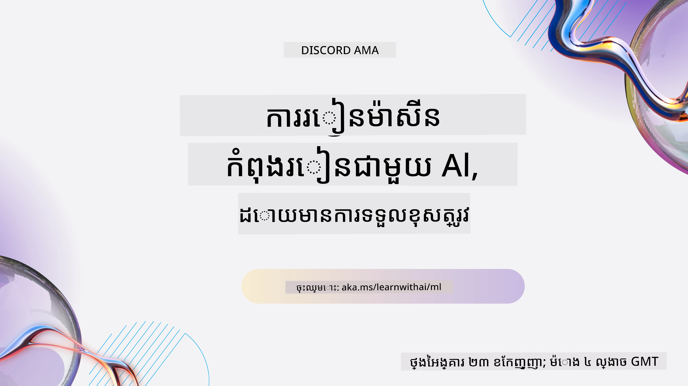
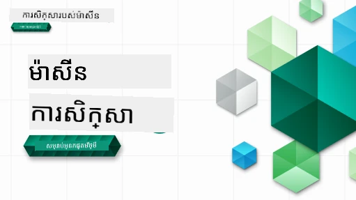

[](https://github.com/microsoft/ML-For-Beginners/blob/master/LICENSE)
[](https://GitHub.com/microsoft/ML-For-Beginners/graphs/contributors/)
[](https://GitHub.com/microsoft/ML-For-Beginners/issues/)
[](https://GitHub.com/microsoft/ML-For-Beginners/pulls/)
[](http://makeapullrequest.com)

[](https://GitHub.com/microsoft/ML-For-Beginners/watchers/)
[](https://GitHub.com/microsoft/ML-For-Beginners/network/)
[](https://GitHub.com/microsoft/ML-For-Beginners/stargazers/)

### 🌐 ការគាំទ្រភាសាច្រើន

#### គាំទ្រដោយរយៈ <i>GitHub Action</i> (ដោយស្វ័យប្រវត្តិ និងតែងតែទាន់សម័យ)

<!-- CO-OP TRANSLATOR LANGUAGES TABLE START -->
[Arabic](../ar/README.md) | [Bengali](../bn/README.md) | [Bulgarian](../bg/README.md) | [Burmese (Myanmar)](../my/README.md) | [Chinese (Simplified)](../zh-CN/README.md) | [Chinese (Traditional, Hong Kong)](../zh-HK/README.md) | [Chinese (Traditional, Macau)](../zh-MO/README.md) | [Chinese (Traditional, Taiwan)](../zh-TW/README.md) | [Croatian](../hr/README.md) | [Czech](../cs/README.md) | [Danish](../da/README.md) | [Dutch](../nl/README.md) | [Estonian](../et/README.md) | [Finnish](../fi/README.md) | [French](../fr/README.md) | [German](../de/README.md) | [Greek](../el/README.md) | [Hebrew](../he/README.md) | [Hindi](../hi/README.md) | [Hungarian](../hu/README.md) | [Indonesian](../id/README.md) | [Italian](../it/README.md) | [Japanese](../ja/README.md) | [Kannada](../kn/README.md) | [Khmer](./README.md) | [Korean](../ko/README.md) | [Lithuanian](../lt/README.md) | [Malay](../ms/README.md) | [Malayalam](../ml/README.md) | [Marathi](../mr/README.md) | [Nepali](../ne/README.md) | [Nigerian Pidgin](../pcm/README.md) | [Norwegian](../no/README.md) | [Persian (Farsi)](../fa/README.md) | [Polish](../pl/README.md) | [Portuguese (Brazil)](../pt-BR/README.md) | [Portuguese (Portugal)](../pt-PT/README.md) | [Punjabi (Gurmukhi)](../pa/README.md) | [Romanian](../ro/README.md) | [Russian](../ru/README.md) | [Serbian (Cyrillic)](../sr/README.md) | [Slovak](../sk/README.md) | [Slovenian](../sl/README.md) | [Spanish](../es/README.md) | [Swahili](../sw/README.md) | [Swedish](../sv/README.md) | [Tagalog (Filipino)](../tl/README.md) | [Tamil](../ta/README.md) | [Telugu](../te/README.md) | [Thai](../th/README.md) | [Turkish](../tr/README.md) | [Ukrainian](../uk/README.md) | [Urdu](../ur/README.md) | [Vietnamese](../vi/README.md)

> **ចូលចិត្ត Clone តាមកុំព្យូទ័រដោយផ្ទាល់?**
>
> ឃ្លាំងនេះរួមបញ្ចូលការប្រែសម្រួលជាមុខងារភាសាច្រើនជាង ៥០ ដែលបង្កើនទំហំទាញយកយ៉ាងច្រើន។ ដើម្បី clone ដោយគ្មានការប្រែសម្រួល, សូមប្រើ sparse checkout:
>
> **Bash / macOS / Linux:**
> ```bash
> git clone --filter=blob:none --sparse https://github.com/microsoft/ML-For-Beginners.git
> cd ML-For-Beginners
> git sparse-checkout set --no-cone '/*' '!translations' '!translated_images'
> ```
>
> **CMD (Windows):**
> ```cmd
> git clone --filter=blob:none --sparse https://github.com/microsoft/ML-For-Beginners.git
> cd ML-For-Beginners
> git sparse-checkout set --no-cone "/*" "!translations" "!translated_images"
> ```
>
> នេះនឹងផ្តល់អ្នកទាំងអស់ដែលអ្នកត្រូវការដើម្បីបញ្ចប់វគ្គនេះដោយមានការទាញយករហ័សជាងមុន។
<!-- CO-OP TRANSLATOR LANGUAGES TABLE END -->

#### ចូលរួមសហគមន៍របស់យើង

[](https://discord.gg/nTYy5BXMWG)

យើងមានស៊េរី Discord រៀនជាមួយ AI កំពុងបន្តនៅឡើយ, សូមរៀនបន្ថែម និងចូលរួមជាមួយយើង នៅ [Learn with AI Series](https://aka.ms/learnwithai/discord) ចាប់ពី 18 ដល់ 30 ខែកញ្ញា, 2025។ អ្នកនឹងទទួលបានក្បួននិងល្បិចក្នុងការប្រើប្រាស់ GitHub Copilot សម្រាប់វិទ្យាសាស្ត្រទិន្នន័យ។



# ម៉ាស៊ីនរៀនសម្រាប់អ្នកចាប់ផ្តើម - មេរៀនមួយសិក្ខាសាលា

> 🌍 ប្រាស្រ័យទំនាក់ទំនងជុំវិញពិភពលោក ខណៈពេលយើងស្វែងយល់អំពីម៉ាស៊ីនរៀនតាមរយៈវប្បធម៌ពិភពលោក 🌍

ក្រុម Cloud Advocates នៅ Microsoft មានសេចក្ដីរំភើបផ្តល់ជូនមេរៀន ១២ សប្តាហ៍ ២៦ ចំណងជើងទាំងអស់ស្ដីពី **ម៉ាស៊ីនរៀន**។ ក្នុងមេរៀននេះ អ្នកនឹងរៀនអំពីអ្វីដែលគេស្គាល់ថា **ម៉ាស៊ីនរៀនចាស់** បន្ទាប់ពីប្រើប្រាស់សៀករីតឡើនជាលក្ខណៈបណ្ណាល័យ និងជៀសវាងការរៀនជ្រៅ ដែលបានគ្របដណ្តប់នៅក្នុង [AI for Beginners’ curriculum](https://aka.ms/ai4beginners)។ និងភ្ជាប់មេរៀនទាំងនេះជាមួយ ['Data Science for Beginners' curriculum](https://aka.ms/ds4beginners) ផងដែរ។

ធ្វើដំណើរជាមួយយើងជុំវិញពិភពលោក ខណៈយើងអនុវត្តបច្ចេកទេសចាស់ទាំងនេះលើទិន្នន័យពីតំបន់ជាច្រើននៅពិភពលោក។ មេរៀននិមួយៗរួមបញ្ចូលការប្រលងមុននិងក្រោយម៉ោងរៀន, ការណែនាំជាឡាយខេីបសម្រាប់បញ្ចប់មេរៀន, ដំណោះស្រាយមួយ, ការងារទៅមុខ និងផ្សេងៗទៀត។ វិធីសាស្រ្តបង្រៀនផ្អែកលើគម្រោងយើងអនុញ្ញាតឲ្យអ្នករៀនពេលកំពុងសាងសង់ ដែលជាវិធីបានបញ្ជាក់ថាជួយឲ្យជំនាញថ្មីៗ "នៅច្របល់" ។

**✍️ អរគុណយ៉ាងខ្លាំងចំពោះអ្នកនិពន្ធរបស់យើង** Jen Looper, Stephen Howell, Francesca Lazzeri, Tomomi Imura, Cassie Breviu, Dmitry Soshnikov, Chris Noring, Anirban Mukherjee, Ornella Altunyan, Ruth Yakubu និង Amy Boyd

**🎨 អរគុណផងដល់អ្នកគូររូបភាព** Tomomi Imura, Dasani Madipalli, និង Jen Looper

**🙏 អរគុណពិសេស 🙏 ចំពោះ Microsoft Student Ambassador អ្នកនិពន្ធ ពិនិត្យជាតិ និងអ្នកផ្តល់មាតិកា**, មានរួមទាំង Rishit Dagli, Muhammad Sakib Khan Inan, Rohan Raj, Alexandru Petrescu, Abhishek Jaiswal, Nawrin Tabassum, Ioan Samuila, និង Snigdha Agarwal

**🤩 អរគុណបន្ថែមចំពោះ Microsoft Student Ambassadors Eric Wanjau, Jasleen Sondhi, និង Vidushi Gupta សម្រាប់មេរៀន R របស់យើង!**

# ការចាប់ផ្តើម

អនុវត្តតាមជំហានទាំងនេះ៖
1. **Fork ឃ្លាំង**: ចុចប៊ូតុង "Fork" នៅជ្រុងខាងត្បូងស្តាំនៃទំព័រនេះ។
2. **Clone ឃ្លាំង**:   `git clone https://github.com/microsoft/ML-For-Beginners.git`

> [ស្វែងរកធនធានបន្ថែមទាំងអស់សម្រាប់វគ្គនេះនៅក្នុងអង្គភាព Microsoft Learn](https://learn.microsoft.com/en-us/collections/qrqzamz1nn2wx3?WT.mc_id=academic-77952-bethanycheum)

> 🔧 **ត្រូវការជំនួយ?** ពិនិត្យមើល [មគ្គុទេសក៍ដោះស្រាយបញ្ហា](TROUBLESHOOTING.md) របស់យើងសម្រាប់ដំណោះស្រាយបញ្ហាទូទៅស្តីពីការតំឡើង ការតំរូវ និងការប្រតិបត្តិមេរៀន។

**[សិស្ស](https://aka.ms/student-page)**, ដើម្បីប្រើប្រាស់មេរៀននេះ សូម fork រួមទាំងឃ្លាំងទៅគណនេយ្យ GitHub របស់អ្នក ហើយបញ្ចប់លំហាត់ដោយផ្ទាល់ខ្លួនឬជាក្រុម៖

- ចាប់ផ្តើមជាមួយការប្រលងមុនម៉ោងរៀន។
- អានម៉ោងរៀន និងបញ្ចប់សកម្មភាពខ្លះៗ ដោយឈប់ និងពិចារណា​នៅពេលត្រួតពិនិត្យចំណេះដឹងនិមួយៗ។
- ព្យាយាមបង្កើតគម្រោងដោយឱ្យយល់ពីមេរៀន ជាជាងរត់កូដដំណោះស្រាយ។ ទោះយ៉ាងไรก็ตาม កូដនោះមាននៅក្នុងថត `/solution` នៃមេរៀនដែលផ្អែកលើគម្រោងនិមួយៗ។
- ធ្វើតេស្តក្រោយម៉ោងរៀន។
- បញ្ចប់ការប្រកួត។
- បញ្ចប់កិច្ចការងារ។
- បន្ទាប់ពីបញ្ចប់ក្រុមមេរៀនមួយ សូមចូលទៅកាន់ [ចំវេនចំរាស](https://github.com/microsoft/ML-For-Beginners/discussions) ហើយ "រៀនដោយឡើងសំឡេង" ដោយបំពេញរូបមន្ត PAT ដែលសមស្រប។ 'PAT' គឺជាឧបករណ៍វាយតម្លៃអំពីវឌ្ឍនភាព ដែលជារូបមន្តអ្នកបំពេញដើម្បីបន្តការរៀន។ អ្នកអាចផ្ទេរតបនឹង PATs របស់អ្នកដទៃ ដើម្បីឲ្យយើងរៀនរួមគ្នា។

> សម្រាប់ការសិក្សាបន្ថែម យើងផ្តល់អនុសាសន៍ឲ្យតាមដាន [Microsoft Learn](https://docs.microsoft.com/en-us/users/jenlooper-2911/collections/k7o7tg1gp306q4?WT.mc_id=academic-77952-leestott) ម៉ូឌុលនិងផ្លូវរៀន។

**គ្រូបង្រៀន**, យើងមាន [បានបញ្ចូលការណែនាំខ្លះៗ](for-teachers.md) អំពីវិធីប្រើប្រាស់មេរៀននេះ។

---

## វីដេអូដំណើរ

មេរៀនខ្លះមានភាពខ្លីជាវីដេអូ។ អ្នកអាចរកវាបាននៅក្នុងមេរៀនឬនៅលើ [ផ្ទាំងវីដេអូ ML for Beginners នៅលើចោណាល Microsoft Developer YouTube](https://aka.ms/ml-beginners-videos) ដោយចុចលើរូបភាពខាងក្រោម។

[](https://aka.ms/ml-beginners-videos)

---

## ស្គាល់ក្រុមការងារ

[](https://youtu.be/Tj1XWrDSYJU)

**រូបភាព Gif ដោយ** [Mohit Jaisal](https://linkedin.com/in/mohitjaisal)

> 🎥 ចុចលើរូបភាពខាងលើសម្រាប់វីដេអូអំពីគម្រោង និងមនុស្សដែលបានបង្កើតវា!

---

## វិធីបង្រៀន

យើងបានជ្រើសរើសទស្សនៈបង្រៀនពីរយ៉ាងនៅពេលបង្កើតមេរៀននេះ៖ ធានាថាវាជា **គម្រោងអនុវត្ត** ហើយមាន **តេស្តញឹកញាប់**។ ជាមួយគ្នា មេរៀននេះមាន **ប្រធានបទ** រួម ដើម្បីបង្កើតភាពចង៖

ដោយធានាថាមាតិការភ្ជាប់ជាមួយគម្រោង ដំណើរនេះនឹងធ្វើឲ្យសិស្សមានការចូលរួមខ្លាំងនិងជំនួយឲ្យចងចាំគំនិតបានល្អ។ លើសពីនេះទៀត តេស្តស្រោចស្រង់មុនថ្នាក់សិក្សាគឺដើម្បីបណ្តុះបណ្តាលចិត្តក្តីចង់រៀន និងតេស្តទីពីរបន្ទាប់ពីថ្នាក់ជួយការចងចាំបន្ថែមទៀត។ មេរៀននេះត្រូវបានរចនាឡើងឲ្យមានភាពបត់បែន និងរីករាយ ហើយអាចយកសព្វគ្រប់វឬខ្លះៗយ៉ាងម៉ត់ចត់។ គម្រោងនឹងចាប់ផ្តើមតូច និងកើនឡើងស្មុគស្មាញញឹកញាប់នៅចុងក្តីវគ្គ ១២ សប្តាហ៍។ មេរៀននេះមានផងដែរ អត្ថបទបន្ថែមពីការអនុវត្តនៅពិភពពិតនៃ ML ដែលអាចប្រើជាគ្រោងការសម្របសម្រួលឬជាគំហើញសម្រាប់ការពិភាក្សា។

> សូមរកមើល [កូដអាកប្បកិរិយា](CODE_OF_CONDUCT.md), [ការចូលរួម](CONTRIBUTING.md), [ការប្រែសម្រួល](..), និង [ការដោះស្រាយបញ្ហា](TROUBLESHOOTING.md) ទិដ្ឋភាព។ យើងសូមស្វាគមន៍មតិយោបល់ដែលសាងសង់របស់អ្នក!

## មេរៀននិមួយៗ រួមមាន

- សេចក្តីបញ្ជាក់ជារូបភាពស្រេច
- វីដេអូជាការផ្គុំបន្ថែម
- វីដេអូបរិច្ឆេទ (មេរៀនខ្លះៗ)
- [តេស្តអប់រំនិមួយៗមុនម៉ោងរៀន](https://ff-quizzes.netlify.app/en/ml/)
- មេរៀនសរសេរ
- សម្រាប់មេរៀនផ្អែកលើគម្រោង, មគ្គុទេសក៍ជំហានដោយជំហានក្នុងការសាងសង់គម្រោង
- ការត្រួតពិនិត្យចំណេះដឹង
- ការប្រកួត
- កំណត់អានបន្ថែម
- កិច្ចការងារ
- [តេស្តក្រោយម៉ោងរៀន](https://ff-quizzes.netlify.app/en/ml/)
> **កំណត់សម្គាល់អំពីភាសា** ៖ មេរៀនទាំងនេះភាគច្រើនត្រូវបានសរសេរជាភាសា Python ប៉ុន្តែភាគច្រើនក៏មានជាភាសា R ផងដែរ។ ដើម្បីបញ្ចប់មេរៀន R មួយ សូមទៅកាន់ថត `/solution` ហើយស្វែងរកមេរៀន R។ ពួកវារួមបញ្ចូលនូវបច្ចេកទេស .rmd ដែលតំណាងឱ្យឯកសារ **R Markdown** ដែលអាចត្រូវបានកំណត់ដូចជាការបញ្ចូល `code chunks` (នៃ R ឬភាសាផ្សេងទៀត) និង `YAML header` (ដែលណែនាំពីរបៀបរៀបចំលទ្ធផលដូចជា PDF) ក្នុង `Markdown document` មួយ។ ដូច្នេះ វាជាគ្រោងការសរសេរដ៏ល្អឥតខ្ចោះសម្រាប់វិទ្យាសាស្ត្រទិន្នន័យ ព្រោះវាអនុញ្ញាតឱ្យអ្នកបញ្ចូលកូដរបស់អ្នក លទ្ធផលរបស់វា និងគំនិតរបស់អ្នកដោយដែលអ្នកអាចសរសេរពួកវាទៅក្នុង Markdown។ លើសពីនេះទៅទៀត ឯកសារ R Markdown អាចត្រូវបានបម្លែងទៅជារូបមន្តលទ្ធផលដូចជា PDF, HTML ឬ Word បាន។

> **កំណត់សម្គាល់អំពីសំណួរតេស្ត** ៖ សំណួរតេស្តទាំងអស់មាននៅក្នុង [ថត Quiz App](../../quiz-app) សរុប 52 សំណួរតេស្ត ដែលមានសំនួរបី សម្រាប់បីសំណួរនីមួយៗ។ ពួកវាត្រូវបានភ្ជាប់ពីក្នុងមេរៀន ប៉ុន្តែកម្មវិធីសំណួរតេស្តអាចដំណើរការជាលokalបានៈ អ្នកត្រូវតែអនុវត្តតាមសេចក្ដីណែនាំនៅក្នុងថត `quiz-app` ដើម្បីផ្ទុកជាលokalឬបញ្ចេញទៅ Azure។

| លេខមេរៀន | ក្បួនសិក្សា | ក្រុមមេរៀន | គោលបំណងការសិក្សា | មេរៀនភ្ជាប់ | អ្នកនិពន្ធ |
| :--------: | :----------: | :----------: | :------------------: | :-----------: | :--------: |
| 01 | របៀបស្គាល់បណ្តាញឧបករណ៍ | [Introduction](1-Introduction/README.md) | រៀនគំនិតមូលដ្ឋាននៃការរៀនម៉ាស៊ីន | [Lesson](1-Introduction/1-intro-to-ML/README.md) | Muhammad |
| 02 | ប្រវត្តិសាស្ត្រនៃការរៀនម៉ាស៊ីន | [Introduction](1-Introduction/README.md) | រៀនអំពីប្រវត្តិដែលនៅក្រោមវិស័យនេះ | [Lesson](1-Introduction/2-history-of-ML/README.md) | Jen និង Amy |
| 03 | តុល្យភាព និងការរៀនម៉ាស៊ីន | [Introduction](1-Introduction/README.md) | តើបញ្ហាទ្រឹស្តីសាស្ត្រសំខាន់ៗអំពីតុល្យភាពដែលនិស្សិតគួរពិចារណាពេលបង្កើតនិងអនុវត្តន៍ម៉ូឌែល ML មានអ្វីខ្លះ? | [Lesson](1-Introduction/3-fairness/README.md) | Tomomi |
| 04 | បច្ចេកទេសសម្រាប់ការរៀនម៉ាស៊ីន | [Introduction](1-Introduction/README.md) | តើបច្ចេកទេសណាដែលអ្នកស្រាវជ្រាវ ML ប្រើសម្រាប់បង្កើតម៉ូឌែល ML? | [Lesson](1-Introduction/4-techniques-of-ML/README.md) | Chris និង Jen |
| 05 | របៀបស្គាល់ថ្នាក់បង្រៀន regression | [Regression](2-Regression/README.md) | ចាប់ផ្តើមជាមួយ Python និង Scikit-learn សម្រាប់ម៉ូឌែល regression | [Python](2-Regression/1-Tools/README.md) • [R](../../2-Regression/1-Tools/solution/R/lesson_1.html) | Jen • Eric Wanjau |
| 06 | តម្លៃផ្កាក្រហមនៅអាមេរិកជើងជើង 🎃 | [Regression](2-Regression/README.md) | បង្ហាញ និង បោកសំអាតទិន្នន័យក្នុងការរៀបចំសម្រាប់ ML | [Python](2-Regression/2-Data/README.md) • [R](../../2-Regression/2-Data/solution/R/lesson_2.html) | Jen • Eric Wanjau |
| 07 | តម្លៃផ្កាក្រហមនៅអាមេរិកជើងជើង 🎃 | [Regression](2-Regression/README.md) | បង្កើតម៉ូឌែល regression រូបធរណីរ និងម៉ោង polynomial | [Python](2-Regression/3-Linear/README.md) • [R](../../2-Regression/3-Linear/solution/R/lesson_3.html) | Jen និង Dmitry • Eric Wanjau |
| 08 | តម្លៃផ្កាក្រហមនៅអាមេរិកជើងជើង 🎃 | [Regression](2-Regression/README.md) | បង្កើតម៉ូឌែលRegression logistic | [Python](2-Regression/4-Logistic/README.md) • [R](../../2-Regression/4-Logistic/solution/R/lesson_4.html) | Jen • Eric Wanjau |
| 09 | កម្មវិធីវេប 🔌 | [Web App](3-Web-App/README.md) | បង្កើតកម្មវិធីវេបឲ្យប្រើម៉ូឌែលដែលបានបណ្ដុះ | [Python](3-Web-App/1-Web-App/README.md) | Jen |
| 10 | រៀបចំមុខងារ classification | [Classification](4-Classification/README.md) | បោកសំអាត, រៀបចំ, និងបង្ហាញទិន្នន័យ; រៀបចំបង់ classification | [Python](4-Classification/1-Introduction/README.md) • [R](../../4-Classification/1-Introduction/solution/R/lesson_10.html) | Jen និង Cassie • Eric Wanjau |
| 11 | ម្ហូបអាស៊ី និងឥណ្ឌា ស័ក្ដិសម 🍜 | [Classification](4-Classification/README.md) | រៀបចំអ្នកចែកថ្នាក់ | [Python](4-Classification/2-Classifiers-1/README.md) • [R](../../4-Classification/2-Classifiers-1/solution/R/lesson_11.html) | Jen និង Cassie • Eric Wanjau |
| 12 | ម្ហូបអាស៊ី និងឥណ្ឌា ស័ក្ដិសម 🍜 | [Classification](4-Classification/README.md) | មានអ្នកចែកថ្នាក់ច្រើនទៀត | [Python](4-Classification/3-Classifiers-2/README.md) • [R](../../4-Classification/3-Classifiers-2/solution/R/lesson_12.html) | Jen និង Cassie • Eric Wanjau |
| 13 | ម្ហូបអាស៊ី និងឥណ្ឌា ស័ក្ដិសម 🍜 | [Classification](4-Classification/README.md) | បង្កើតកម្មវិធីវេបណែនាំដោយប្រើម៉ូឌែលរបស់អ្នក | [Python](4-Classification/4-Applied/README.md) | Jen |
| 14 | ការណែនាំ clustering | [Clustering](5-Clustering/README.md) | បោកសំអាត, រៀបចំ, និងបង្ហាញទិន្នន័យ; ការណែនាំប្រព័ន្ធ clustering | [Python](5-Clustering/1-Visualize/README.md) • [R](../../5-Clustering/1-Visualize/solution/R/lesson_14.html) | Jen • Eric Wanjau |
| 15 | ការរុករករសជាតិតន្ត្រីនៃប្រទេសនីហ្សេរី 🎧 | [Clustering](5-Clustering/README.md) | រុករកវិធី K-Means clustering | [Python](5-Clustering/2-K-Means/README.md) • [R](../../5-Clustering/2-K-Means/solution/R/lesson_15.html) | Jen • Eric Wanjau |
| 16 | ការណែនាំអំពីការប្រើប្រាស់ភាសាបរិស្ថានធម្មជាតិ ☕️ | [Natural language processing](6-NLP/README.md) | រៀនមូលដ្ឋានអំពី NLP ដោយបង្កើត bot ងាយៗ | [Python](6-NLP/1-Introduction-to-NLP/README.md) | Stephen |
| 17 | ការងារសម្រាប់ NLP ទូទៅ ☕️ | [Natural language processing](6-NLP/README.md) | ជ្រាបចំរូងនៅលើភាសាតាមរយៈការយល់ដឹងពីភារកិច្ចទូទៅដែលសំខាន់ | [Python](6-NLP/2-Tasks/README.md) | Stephen |
| 18 | ការបកប្រែ និងវិភាគអារម្មណ៍ ♥️ | [Natural language processing](6-NLP/README.md) | ការបកប្រែ និងវិភាគអារម្មណ៍ជាមួយ Jane Austen | [Python](6-NLP/3-Translation-Sentiment/README.md) | Stephen |
| 19 | សណ្ឋាគារស្នេហ៍នៅអឺរ៉ុប ♥️ | [Natural language processing](6-NLP/README.md) | វិភាគអារម្មណ៍ជាមួយការពិនិត្យសណ្ឋាគារ ១ | [Python](6-NLP/4-Hotel-Reviews-1/README.md) | Stephen |
| 20 | សណ្ឋាគារស្នេហ៍នៅអឺរ៉ុប ♥️ | [Natural language processing](6-NLP/README.md) | វិភាគអារម្មណ៍ជាមួយការពិនិត្យសណ្ឋាគារ ២ | [Python](6-NLP/5-Hotel-Reviews-2/README.md) | Stephen |
| 21 | ការណែនាំប៉ុន្តែពេលវេលាស៊េរី | [Time series](7-TimeSeries/README.md) | ការណែនាំការព្យាករណ៍ពេលវេលាស៊េរី | [Python](7-TimeSeries/1-Introduction/README.md) | Francesca |
| 22 | ⚡️ ការប្រើប្រាស់ថាមពលពិភពលោក ⚡️ - ការព្យាករណ៍ពេលវេលាស៊េរីជាមួយ ARIMA | [Time series](7-TimeSeries/README.md) | ការព្យាករណ៍ពេលវេលាស៊េរីជាមួយ ARIMA | [Python](7-TimeSeries/2-ARIMA/README.md) | Francesca |
| 23 | ⚡️ ការប្រើប្រាស់ថាមពលពិភពលោក ⚡️ - ការព្យាករណ៍ពេលវេលាស៊េរីជាមួយ SVR | [Time series](7-TimeSeries/README.md) | ការព្យាករណ៍ពេលវេលាស៊េរីជាមួយ Support Vector Regressor | [Python](7-TimeSeries/3-SVR/README.md) | Anirban |
| 24 | ការណែនាំដល់ការរៀនបង្រៀនបន្ថែម | [Reinforcement learning](8-Reinforcement/README.md) | ការណែនាំការរៀនបង្រៀនបន្ថែមជាមួយ Q-Learning | [Python](8-Reinforcement/1-QLearning/README.md) | Dmitry |
| 25 | ជួយ Peter ជៀសវាងខ្លាឆ្នោត! 🐺 | [Reinforcement learning](8-Reinforcement/README.md) | ការរៀនបង្រៀនបន្ថែម Gym | [Python](8-Reinforcement/2-Gym/README.md) | Dmitry |
| Postscript | ស្ថានភាពពិតនៃ ML និងការអនុវត្ត | [ML in the Wild](9-Real-World/README.md) | ករណីនិងការអនុវត្តពិតនៃ ML រចនាបថបុរាណ | [Lesson](9-Real-World/1-Applications/README.md) | ក្រុម |
| Postscript | ការប្តូរគំរូក្នុង ML ប្រើបញ្ជីគ្រប់គ្រង RAI | [ML in the Wild](9-Real-World/README.md) | ការប្តូរគំរូក្នុងម៉ាស៊ីនរៀនប្រើបញ្ជីគ្រប់គ្រង Responsible AI | [Lesson](9-Real-World/2-Debugging-ML-Models/README.md) | Ruth Yakubu |

> [ស្វែងរកធនធានបន្ថែមទាំងអស់សម្រាប់វគ្គនេះនៅក្នុងបណ្ណសាររបស់ Microsoft Learn](https://learn.microsoft.com/en-us/collections/qrqzamz1nn2wx3?WT.mc_id=academic-77952-bethanycheum)

## ការចូលដំណើរការផ្ទាល់ខ្លួន

អ្នកអាចដំណើរការ​ឯកសារ​សម្រម់នេះក្រៅអ៊ីនធឺណិតដោយប្រើ [Docsify](https://docsify.js.org/#/). ចម្លង repo នេះ, [ដំឡើង Docsify](https://docsify.js.org/#/quickstart) លើម៉ាស៊ីន​ផ្ទាល់ខ្លួនរបស់អ្នក, បន្ទាប់មកនៅក្នុងថតមូលដ្ឋានរបស់ repo នេះ ចុច `docsify serve`។ វេបសាយនឹងត្រូវបម្រើនៅច្រក 3000 នៅលើ localhost របស់អ្នក៖ `localhost:3000`។

## PDF

ស្វែងរក pdf នៃមេរៀននៅ [ទីនេះ](https://microsoft.github.io/ML-For-Beginners/pdf/readme.pdf)។

## 🎒 វគ្គផ្សេងទៀត

ក្រុមរបស់យើងផលិតវគ្គផ្សេងទៀតផង! សូមមើល៖

### LangChain
[](https://aka.ms/langchain4j-for-beginners)
[](https://aka.ms/langchainjs-for-beginners?WT.mc_id=m365-94501-dwahlin)
[](https://github.com/microsoft/langchain-for-beginners?WT.mc_id=m365-94501-dwahlin)
---

### Azure / Edge / MCP / Agents
[](https://github.com/microsoft/AZD-for-beginners?WT.mc_id=academic-105485-koreyst)
[](https://github.com/microsoft/edgeai-for-beginners?WT.mc_id=academic-105485-koreyst)
[](https://github.com/microsoft/mcp-for-beginners?WT.mc_id=academic-105485-koreyst)
[](https://github.com/microsoft/ai-agents-for-beginners?WT.mc_id=academic-105485-koreyst)

---
 
### ស៊េរី AI បង្កើត
[](https://github.com/microsoft/generative-ai-for-beginners?WT.mc_id=academic-105485-koreyst)
[-9333EA?style=for-the-badge&labelColor=E5E7EB&color=9333EA)](https://github.com/microsoft/Generative-AI-for-beginners-dotnet?WT.mc_id=academic-105485-koreyst)
[-C084FC?style=for-the-badge&labelColor=E5E7EB&color=C084FC)](https://github.com/microsoft/generative-ai-for-beginners-java?WT.mc_id=academic-105485-koreyst)
[-E879F9?style=for-the-badge&labelColor=E5E7EB&color=E879F9)](https://github.com/microsoft/generative-ai-with-javascript?WT.mc_id=academic-105485-koreyst)

---
 
### ការសិក្សាមូលដ្ឋាន
[](https://aka.ms/ml-beginners?WT.mc_id=academic-105485-koreyst)
[](https://aka.ms/datascience-beginners?WT.mc_id=academic-105485-koreyst)
[](https://aka.ms/ai-beginners?WT.mc_id=academic-105485-koreyst)
[](https://github.com/microsoft/Security-101?WT.mc_id=academic-96948-sayoung)
[](https://aka.ms/webdev-beginners?WT.mc_id=academic-105485-koreyst)
[](https://aka.ms/iot-beginners?WT.mc_id=academic-105485-koreyst)
[](https://github.com/microsoft/xr-development-for-beginners?WT.mc_id=academic-105485-koreyst)

---
 
### ស៊េរី Copilot
[](https://aka.ms/GitHubCopilotAI?WT.mc_id=academic-105485-koreyst)
[](https://github.com/microsoft/mastering-github-copilot-for-dotnet-csharp-developers?WT.mc_id=academic-105485-koreyst)
[](https://github.com/microsoft/CopilotAdventures?WT.mc_id=academic-105485-koreyst)
<!-- CO-OP TRANSLATOR OTHER COURSES END -->

## ការទទួលបានជំនួយ

បើអ្នកជាប់ឬមានសំណួរពេលរៀនម៉ាស៊ីនរៀន ឬកំពុងបង្កើតកម្មវិធី AI កុំបារម្ភ — មានជំនួយសម្រាប់អ្នក។

អ្នកអាចចូលរួមពិភាក្សាជាមួយអ្នករៀន និងអ្នកអភិវឌ្ឍន៍ផ្សេងទៀត សួរសំណួរ និងចែករំបែកគំនិតរបស់អ្នកជាមួយសហគមន៍។

- ចូលរួមសហគមន៍ដើម្បីសួរសំណួរ និងរៀនជាមួយគ្នា
- ពិភាក្សាអំពីគំនិតម៉ាស៊ីនរៀន និងគម្រោង
- ទទួលបានការណែនាំពីអ្នកអភិវឌ្ឍន៍មានបទពិសោធន៍

សហគមន៍គាំទ្រជួយធ្វើឲ្យអ្នកអាចពង្រីកជំនាញ និងដោះស្រាយបញ្ហាបានលឿន។

[Microsoft Foundry Discord Community](https://discord.gg/nTYy5BXMWG)

បើអ្នកជួបប្រទះបញ្ហាកំហុស កំហុសប្រតិបត្តិការ ឬមានសំណើសុំធ្វើឲ្យប្រសើរឡើង អ្នកអាចបើក **Issue** ក្នុងឃ្លាំងនេះដើម្បីរាយការណ៍បញ្ហា។

សម្រាប់ប្រតិកម្មផលិតផល ឬស្វែងរកបញ្ហានៅក្នុងសំណុំបែបបទសហគមន៍ សូមចូលទៅកាន់វេទិកាអ្នកអភិវឌ្ឍន៍៖

[](https://aka.ms/foundry/forum)

## ដំបូន្មានបន្ថែមសម្រាប់ការរៀន

- ទស្សនាសៀវភៅកំណត់ត្រាបន្ទាប់ពីមេរៀនរៀងរាល់ម្តងដើម្បីយល់ដឹងល្អប្រសើរ។
- ធ្វើការអនុវត្តអាល់ហ្គរីធម៍ដោយខ្លួនឯង។
- ស្វែងរកឯកសារពិតប្រាកដដោយប្រើគំនិតដែលបានរៀន។

---

<!-- CO-OP TRANSLATOR DISCLAIMER START -->
**ការបដិសេធកាតព្វកិច្ច**៖  
ឯកសារនេះត្រូវបានបកប្រែប្រើសេវាបកប្រែ AI [Co-op Translator](https://github.com/Azure/co-op-translator)។ ខណៈពេលដែលយើងខំប្រឹងប្រែងដើម្បីច្បាស់លាស់ សូមយល់ឱ្យបានថានៃការបកប្រែដោយស្វ័យប្រវត្តិអាចមានកំហុសឬភាពមិនត្រឹមត្រូវ។ ឯកសារដើមជាភាសាដើមគួរត្រូវបានគេចាត់ទុកជាធនធានដែលមានសុពលភាពខ្ពស់។ សម្រាប់ព័ត៌មានសំខាន់ សូមផ្តល់អនុសាសន៍អោយប្រើការបកប្រែដោយមនុស្សវិជ្ជាជីវៈ។ យើងមិនទទួលខុសត្រូវចំពោះការយល់ច្រឡំ ឬការបកប្រែច្រឡំណាមួយដែលកើតឡើងពីការប្រើប្រាស់ការបកប្រែនេះឡើយ។
<!-- CO-OP TRANSLATOR DISCLAIMER END -->